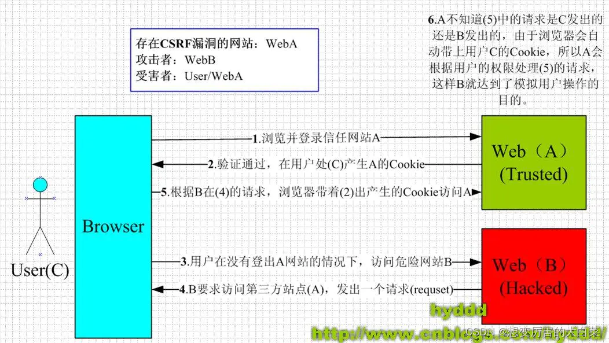
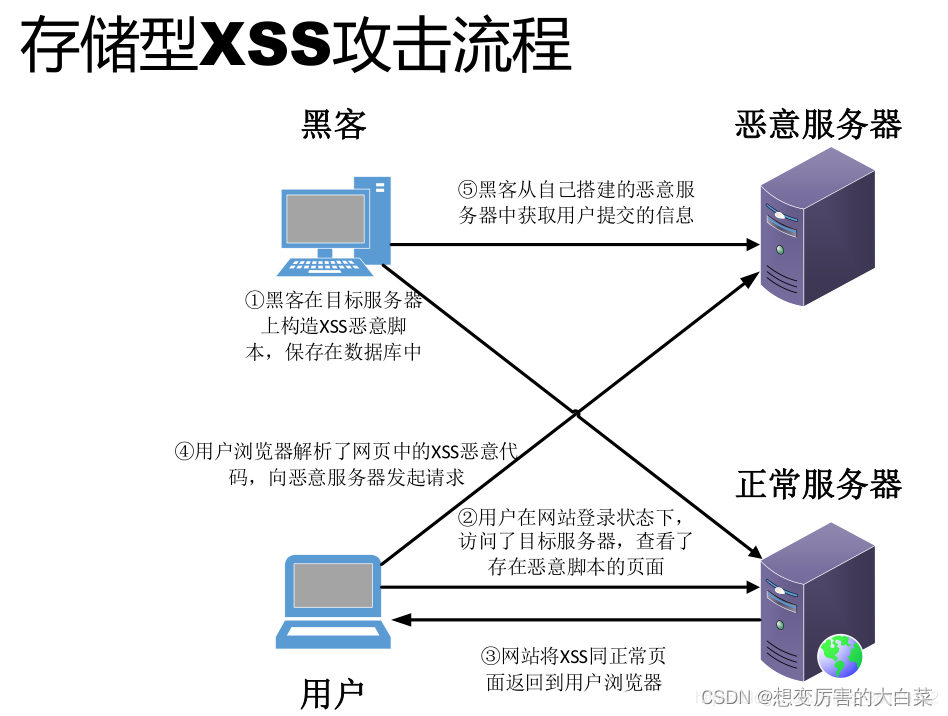
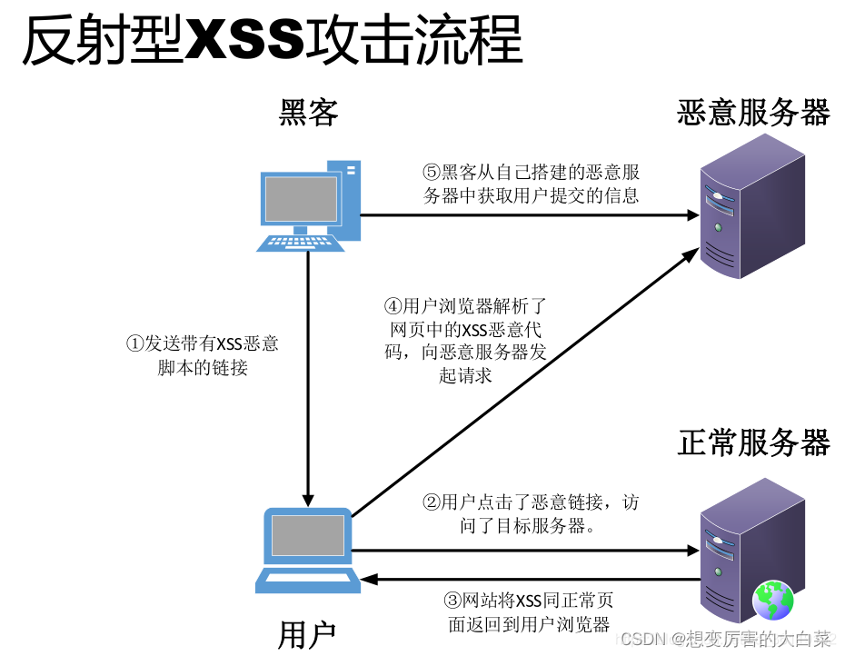

---

title: "后端的安全和加密"
date: 2023-01-15T22:00:38+08:00
draft: false
image: 1.png
categories:
   - computer
---

## 后端的安全

   - 在后端的应用程序中的安全问题都是亲信了第三方提供的数据造成的，例如：对于用户输入的数据。在对其进行验证之前都应该视为不安全的数据，把不安全的数据用于数据库的查询就可能会造成sql注入的问题

   ### 预防CSRF攻击

   CSRF(跨站请求伪造)：攻击者可以盗用你的登录信息，以你的身份模拟发送各种请求，所以遇到CSRF攻击时，将对终端用户数据和操作指令构成严重的威胁，当受攻击的终端具备管理账号时，CSRF攻击都会危及整个后端的应用

​	

   #### CSRF的工作原理：

   - CSRF攻击主要是因为web的隐式身份验证机制，web的身份验证机制可以保证一个请求是来自某一个服务器。但却无法保证该请求是用户批准发送的 

  - CSRF的攻击过程可分为：
    - 登录受信任的网站A,并在本地生成cookie
    - 在不退出A的情况下，访问了危险的网站B

  #### CSRF的预防	

- 可以从服务端和客户端两个方向入手
    - 服务端的预防：
        1. 正确的使用GET,POST,和COOKie
        2. 在非GET请求中增加伪随机数
        在非GET方式的请求中增加伪随机数有三种方式：
        1. 为每一个用户生成唯一的cookie token，所有的表单都包含同一个伪随机数
        2. 每一个请求使用的验证码
        3. 在不同表单包含一个不同的伪随机数
    - 确保输入的过滤：过滤用户数据是后后端的基础，它是验证数据的合法性的过程：
        1. 识别数据，即确定数据的来源
        2. 过滤数据，即确保需要的数据入库
        3. 确定数据，即确定数据的安全

### 避免XSS的攻击

​	xss(跨站脚本攻击)：是一种常见的web安全漏洞，它允许攻击者将恶意代码植入到提供给其他用户使用的页面中，不同于大多数攻击一般只涉及攻击者和受害者，xss涉及到三方，即攻击者，客户端和后端服务器，xss攻击目标为盗取存储在客户端的cookie或者其他网站用户识别客户端身份的敏感信息，一旦获取到合法的用户信息后，攻击者甚至可以假冒合法于网站进行交互

#### xss 分类

1. 存储型xss:主要是出现让用户输入数据，应用程序从数据库查数据，在页面中显示，攻击者在相关页面中输入恶意的脚本数据后，用户浏览时，就可能会受到攻击

   

2. 反射性xss:主要做法是将脚本代码加入url地址的请求参数中，请求参数进入程序后在页面直接输出，用户点击类似链接可能会受到攻击

   

#### xss原理

- 后端应用在未对用户提交请求的数据做充分的检查过滤，允许用户在提交数据中参入html代码，并将未经过转义的恶意的代码输出到第三方的应用的浏览器解释执行，是导致xss漏洞的主要产生原因

#### 预防xss

- 坚决不要相信用户的任何输入并过滤输入中的所有特殊字符，目前有两种方法：
  - 过滤特殊字符
  - 使用http头指定类型

### 避免sql注入

- sql注入是后端开发中最常见的一种安全漏洞，可以使用它获取数据库中的获取敏感的信息，或者利用数据库的热特性执行添加用户，导出文件等一系列恶意，操作甚至可能获取数据库或者系统的用户的最高权限
- 造成sql注入的原因是因为程序没有有效的过滤，用户输入时攻击者成功向服务器提交恶意代码的sql查询代码，程序在接收到错误后的将攻击者的输入作为查询语句的一部分，导致原始查询逻辑被迫改变。额外执行供攻击者精心构造的恶意代码
- sql查询是可以被修改，sql查询是可以绕开访问的控制，从而绕过身份验证和权限检查，有可能sql查询去与运行主机系统级别的命令

#### 预防sql

1. 严格限制后端应用的数据库的权限，给用户提供满足功能即可
1. 检查输入的数据是否具有所有的期望格式。严格控制变量类型
1. 对数据库的特殊字符进行转义处理，或者编码转换
1. 所有的查询语句，建议使用数据库提供哦那个的参数化的接口。而不是将输入的变量嵌入到sql语句中，即不要拼接sql语句
1.  在应用发布前，建议使用专业的sql注入检查工具进行检测以及时修补并发现sql注入的漏洞
1. 避免前端打印sql错误，比如类型错误，子段不匹配等暴露sql语句

## 存储密码

- 普通方案：常用的密码存储方案是将明文密码做单向的哈希后存错，单向哈希算法有一特征：无法通过哈希后的摘要恢复出原始数据，常用的额单向哈希算法包括：SHA-256,SHA-1
  - 单向哈希的两大特性：
    - 同一密码进行哈希后，得到的唯一确定的摘要
    - 计算速度快
  - 结合单向哈希的两大特性：攻击者可以将所有的密码常见的组合进行单向哈希，得到一个摘要组合(rainbow table), 然后于数据库中的进行对比即可得到密码
- 进阶方案：先将用户输入的密码进行单向哈希加密，在将获取的摘要的前后加上只有管理员知道的随机数，在进行单向哈希
- 专家方案：故意增加密码计算所消耗的资源和时间，使得任何人都不可能获取到相同的资源，建立所需要的(rainbow table)