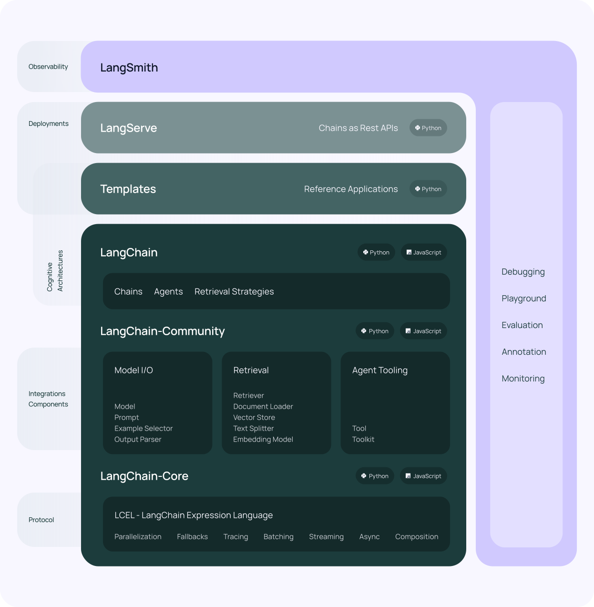

# LangChain 框架解析

## 一、简介

- **定义**：开源Python AI应用开发框架
- **核心价值**：降低基于LLM的AI应用开发门槛
- **核心功能**：
  - LLM集成（文本生成/问答/翻译/对话）
  - 创意应用构建
  - 标准化AI工作流

## 二、核心特性

| 特性               | 功能描述                 | 应用场景         |
| ------------------ | ------------------------ | ---------------- |
| **LLM & 提示管理** | 统一API抽象层 + 提示模板 | 标准化模型调用   |
| **链(Chain)**      | 预封装任务工作流         | 问答系统/SQL生成 |
| **LCEL**           | 表达式语言编排任务流     | 自定义AI流程     |
| **RAG**            | 外部数据增强生成         | 知识库问答       |
| **Agents**         | LLM决策+外部系统调用     | 自动化任务执行   |
| **模型记忆**       | 对话历史记忆             | 多轮对话系统     |

LangChain 特性：

● LLM 和提示（Prompt）：LangChain 对所有 LLM 大模型进行了 API 抽象，统一了大模型访问 API，同时提供了 Prompt 提示模板管理机制。

● 链 (Chain)：Langchain 对一些常见的场景封装了一些现成的模块，例如：基于上下文信息的问答系统，自然语言生成 SQL 查询等等，因为实现这些任务的过程就像工作流一样，一步一步的执行，所以叫链 (chain)。

● LCEL：LangChain Expression Language (LCEL)， langchain 新版本的核心特性，用于解决工作流编排问题，通过 LCEL 表达式，我们可以灵活的自定义 AI 任务处理流程，也就是灵活自定义链 (Chain)。

● 数据增强生成 (RAG)：因为大模型 (LLM) 不了解新的信息，无法回答新的问题，所以我们可以将新的信息导入到 LLM，用于增强 LLM 生成内容的质量，这种模式叫做 RAG 模式(Retrieval Augmented Generation)。

● Agents：是一种基于大模型（LLM）的应用设计模式，利用 LLM 的自然语言理解和推理能力（LLM 作为大脑)），根据用户的需求自动调用外部系统、设备共同去完成任务，例如：用户输入 “明天请假一天”， 大模型（LLM）自动调用请假系统，发起一个请假申请。

● 模型记忆（memory）：让大模型 (llm) 记住之前的对话内容，这种能力成为模型记忆（memory）。

## 三、框架组成

### 1. 核心组件




### 2. 库结构

- **langchain-core**：基础抽象/表达式语言
- **langchain-community**：第三方集成
- **langchain**：链/代理/检索实现

### 3. 支持工具

- **LangServe**：将链发布为REST API
- **LangSmith**：云平台(调试/监控)

## 四、任务处理流程


### 模型封装类型

| 类型           | 输入     | 输出 | 典型场景 |
| :------------- | :------- | :--- | :------- |
| **LLM**        | 文本     | 文本 | 基础问答 |
| **Chat Model** | 消息列表 | 消息 | 对话系统 |

## 五、核心概念

### 1. LLMs (大语言模型)

- **定义**：LangChain封装的基础文本处理模型
- **输入/输出**：接收文本输入 → 返回文本结果
- **特点**：通用问答模型，适合基础文本生成任务

### 2. Chat Models (对话模型)

- **定义**：专为对话场景设计的模型
- **输入/输出**：接收消息列表 → 返回对话消息
- **特点**：支持多轮对话上下文理解

### 3. 消息 (Message)

- **定义**：对话模型的消息内容载体
- **消息类型**：
  - `HumanMessage`：用户输入消息
  - `AIMessage`：AI生成的回复消息
  - `SystemMessage`：系统级指令消息
  - `FunctionMessage`：函数调用消息
  - `ToolMessage`：工具调用消息

### 4. 提示 (Prompts)

- **功能**：提示词管理工具
- **核心能力**：
  - 提示模板创建与管理
  - 动态内容格式化
  - 多变量插值支持

### 5. 输出解析器 (Output Parsers)

- **作用**：处理LLM返回的文本内容
- **转换能力**：
  - 文本 → JSON格式
  - 文本 → Python对象
  - 结构化数据提取

### 6. Retrievers (检索器)

- **目的**：增强LLM私有数据处理能力
- **功能**：
  - 文档数据加载
  - 文本切割分块
  - 数据存储与检索
- **应用场景**：RAG(检索增强生成)架构核心组件

### 7. 向量存储 (Vector Stores)

- **作用**：支持语义相似搜索
- **特点**：
  - 多种向量数据库集成
  - 高维向量空间数据管理
  - 相似内容检索优化

### 8. Agents (智能体)

- **定义**：LLM驱动的应用设计模式
- **核心架构**：
  - **决策引擎**：LLM作为"大脑"
  - **执行系统**：自动调用外部设备/API
- **工作流程**：
  1. 接收用户任务
  2. LLM分析决策
  3. 调用外部系统执行
  4. 返回综合结果

## 六、应用场景

- **对话机器人**：客服/聊天助手
- **知识库问答**：开放域问题解答
- **智能写作**：
  - 创意写作
  - 文本摘要
  - 内容生成

## 七、快速入门

### 安装步骤

```
# Pip安装
pip install langchain-openai

# 设置API密钥
export OPENAI_API_KEY="sk-..."
```

### 基础使用

```
from langchain_openai import OpenAI

# 初始化模型
llm = OpenAI()

# 直接调用
response = llm.invoke("解释量子力学")

# 链式调用
from langchain.prompts import PromptTemplate
prompt = PromptTemplate.from_template("{topic}是什么？")
chain = prompt | llm 
result = chain.invoke({"topic": "RAG"})

# 输出处理
str(response)  # 消息转字符串
```

## LangChain 思维导图


