## Linux常用的性能查看命令
### CPU
#### CPU的性能指标
* cup的使用率分为：
 > 1. 用户CPU使用率，主要包括用户态和低优先级用户态，反应的是应用程序的cpu的使用情况
 >  2. 系统CPU使用率，cpu在内核态运行的时间百分比,不包含中断。反应的是内核的使用情况
> 3. 等待IO的CPU使用率，反应的是系统与硬件IO的交互的情况
> 4. 软/硬中断CPU的使用率，反应的中断的发生的情况
> 5. steal CPU / guest CPU, 表示虚拟机占用的CPU百分比.

- 在理想情况下，平均负载等于逻辑CPU个数(几核的CPU),表示每个CUP都被充分使用。大于这个逻辑CPU个数表示负载较大
- CUP缓存率指的是CPU缓存的复用情况。命中率越高表示性能越好，其中L1/L2常用在单核,L3则用在多核中
#### CPU的优化
1. 用户态的优化，即应用程序的的优化，尽可能的减少cpu的上下文的切换
2. 内核态的优化，即内核的优化，可以CPU绑定，调整有优先级，中断的负载均衡等

#### 性能工具
* 根据不同的性能指标来找合适的工具  
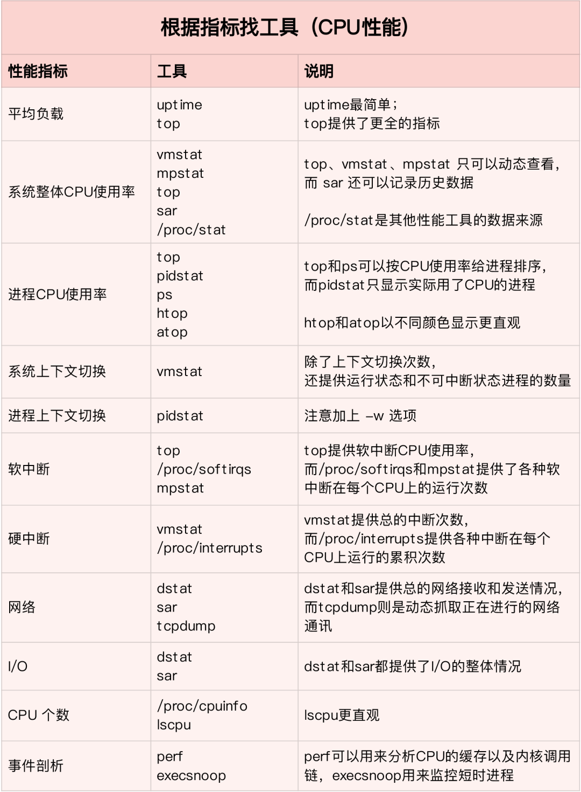
* 根据指标查找
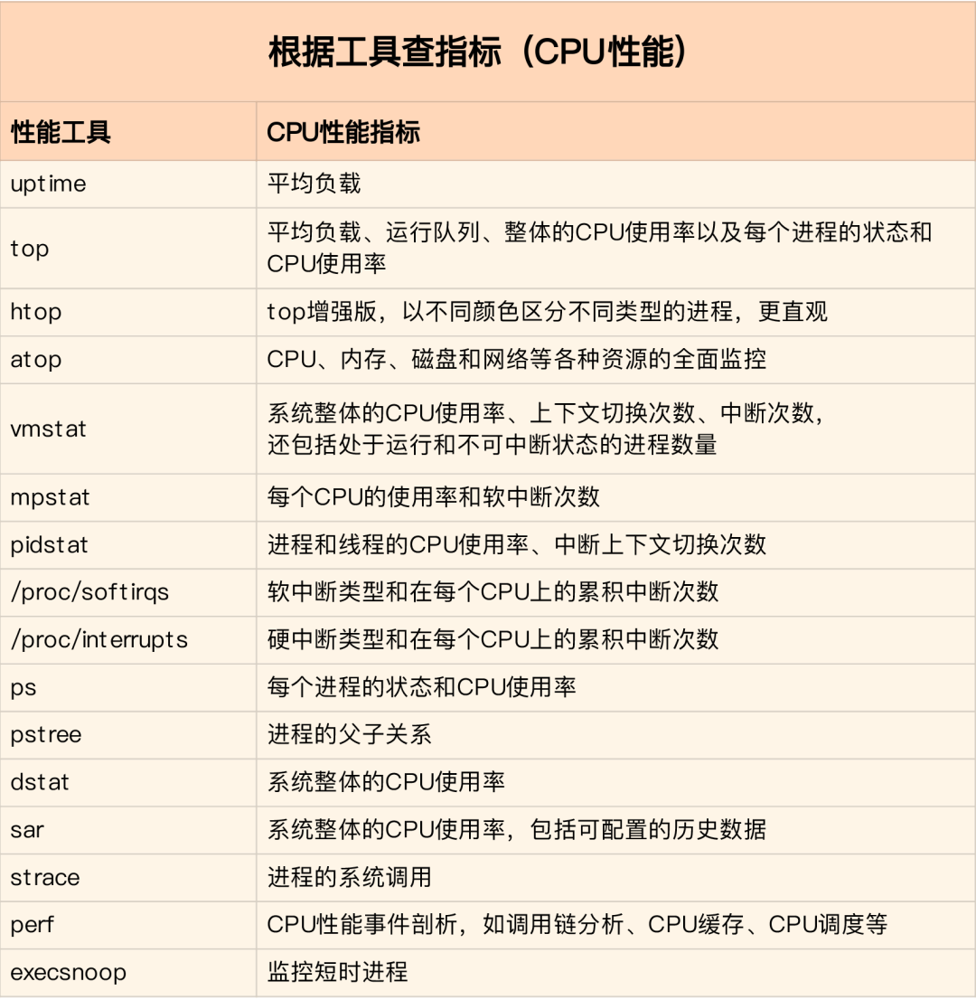
#### CPU性能查看
1. 使用ps查看正在运行的进程
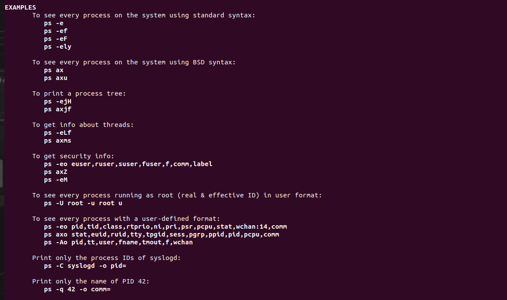
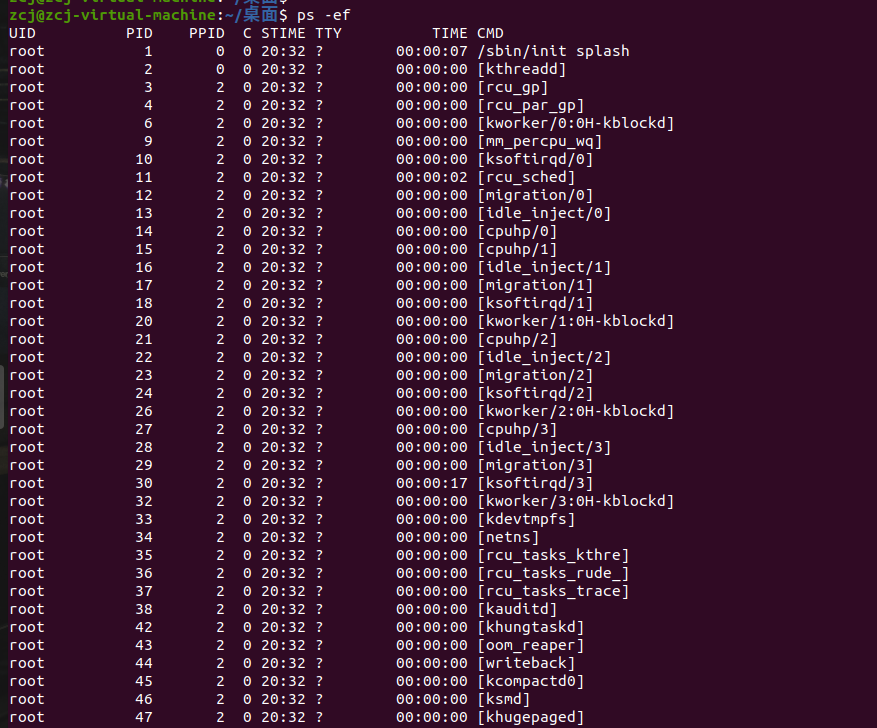
2. 使用top查看各cup的使用情况、对应内存以及个进程占cpu和使用内存的情况
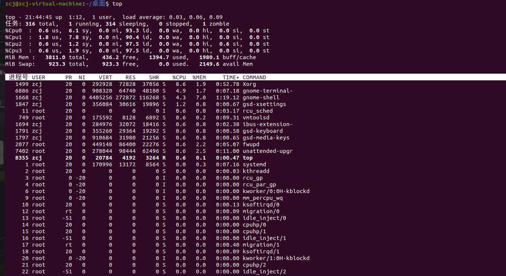
3. vmstat命令：查看CPU负载
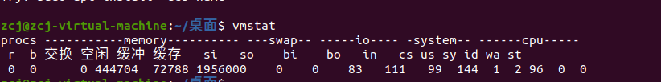
### 内存使用情况查看
* 除了使用top可以查看内存使用情况外，还可以使用free命令进行查看
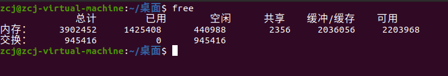

### 磁盘I/O性能查看
1. 可以使用df 或者 df -h 查看磁盘占用用情况
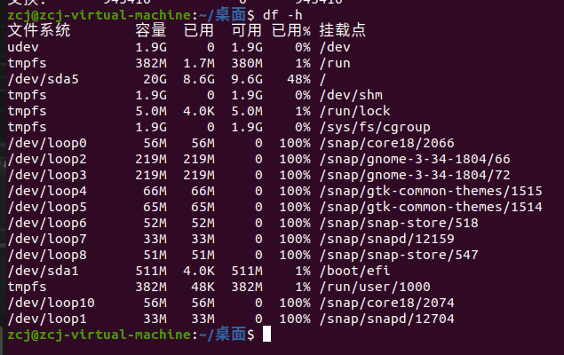
2. iostat -d 进行查看
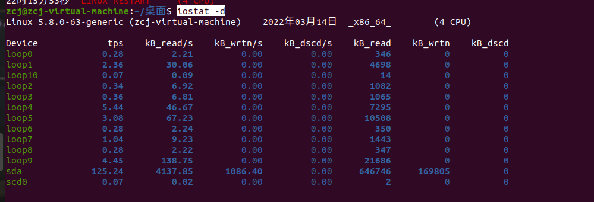

### 查看网络情况
1. 使用ifconfig查看或者修改网络
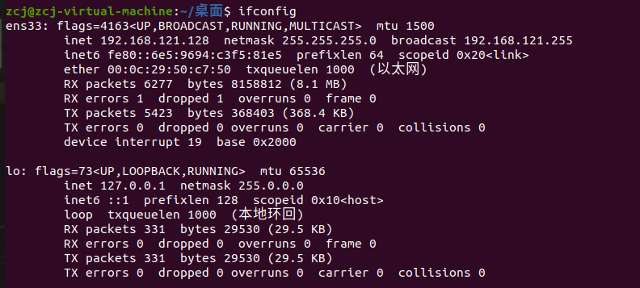
2. netstat命令：-i 查看网络接口信息，-r 检测系统路由表信息
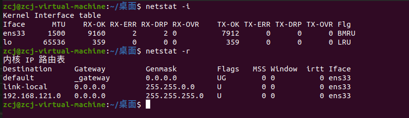

### 动态监控性能
* 使用watch命令：动态监控，默认2秒钟执行一次，执行结果更新在屏幕上
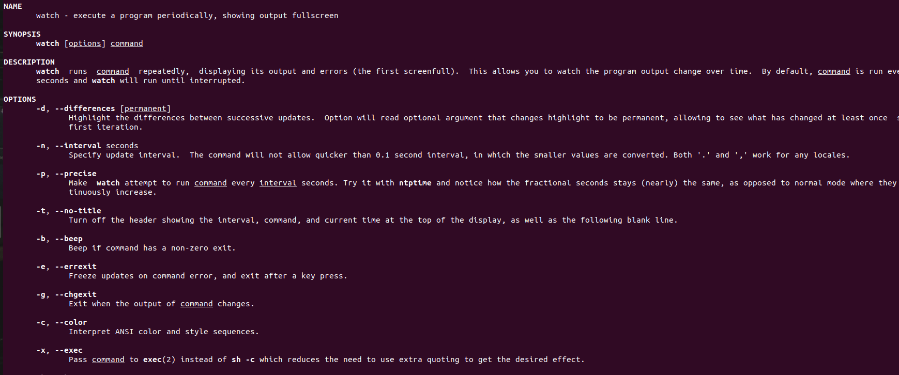
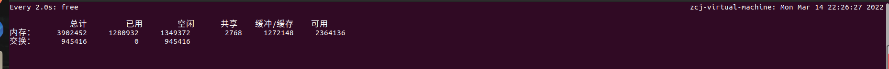

