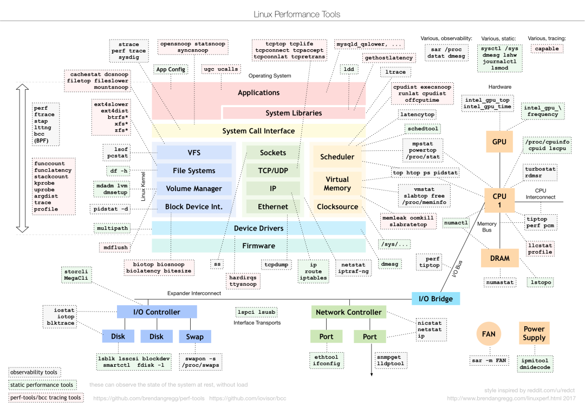
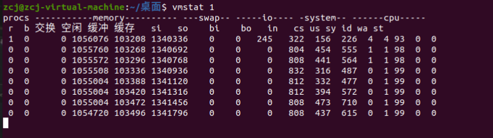

### 性能
* 高并发和快响应的性能指标是指：吞吐和延时
* 性能的本质：系统资源已经到达瓶颈时，处理请求不够快，不足以处理更多的请求。
* 性能分析：找到系统或者应用的瓶颈，尽最大的可能避免或者缓解这样的瓶颈。
* 常用的性能分析工具：

### cup上下文切换
* cup上下文切换：将上一个任务cup的上下文保存系统的内核中休眠，然后将新任务的cup上下文进行加载，然后执行这个新任务。
cup的上下文切换可分为：线程上下文切换、进程上下文切换和中断上下文切换。在内核中中断的等级与进程和线程的等级高，所以保证了中断上下文
切换与进程和线程上下文切换不同时发生。
* 通过vmstat可以查看系统总体的上下文切换情况

#### 进程上下切换
* linux进程按照等级权限将进程的运行空间分为内核空间和用户态空间。其中用户态向内核态转换需要进行系统调用。执行一次系统调用
需要进行两次cpu的上下文切换分别为：
* > CPU寄存器中用户态的指令位置先保存起来，CPU寄存器更新为内核态指令的位置，跳转到内核态运行内核任务；  
  > 系统调用结束后，CPU寄存器恢复原来保存的用户态数据，再切换到用户空间继续运行。

* 进程是由内核管理和调度的，进程上下文切换只能发生在内核态。因此相比系统调用来说，在保存当前进程的内核状态和CPU寄存器之前，需要先把该进程的虚拟内存，栈保存下来。再加载新进程的内核态后，还要刷新进程的虚拟内存和用户栈。

* 进程只有在调度到CPU上运行时才需要切换上下文，有以下几种场景：CPU时间片轮流分配，系统资源不足导致进程挂起，进程通过sleep函数主动挂起，高优先级进程抢占时间片，硬件中断时CPU上的进程被挂起转而执行内核中的中断服务。
 #### 线程上下文切换
 * 在同一进程中的线程进行上下文切换，切换时，只需要切换线程的私有数据、寄存器等，消耗资源少。
 * 在不同进程的中的线程进行上下文切换，切换与进程的上下文切换一致。
 #### 中断上下文切换
 * 中断上下文切换只包括内核态中断服务程序执行所需要的状态（CPU寄存器，内核堆栈，硬件中断参数等）（CPU寄存器，内核堆栈，硬件中断参数等）
 ## 参考文献：
 [极限好文！Linux 性能优化全景指南](https://mp.weixin.qq.com/s/6_utyj1kCyC5ZWpveDZQIQ)
 