## linux 常用查看可执行工具
- readelf：可以查看可执行文件相关信息
    - readif -h 查看头信息
   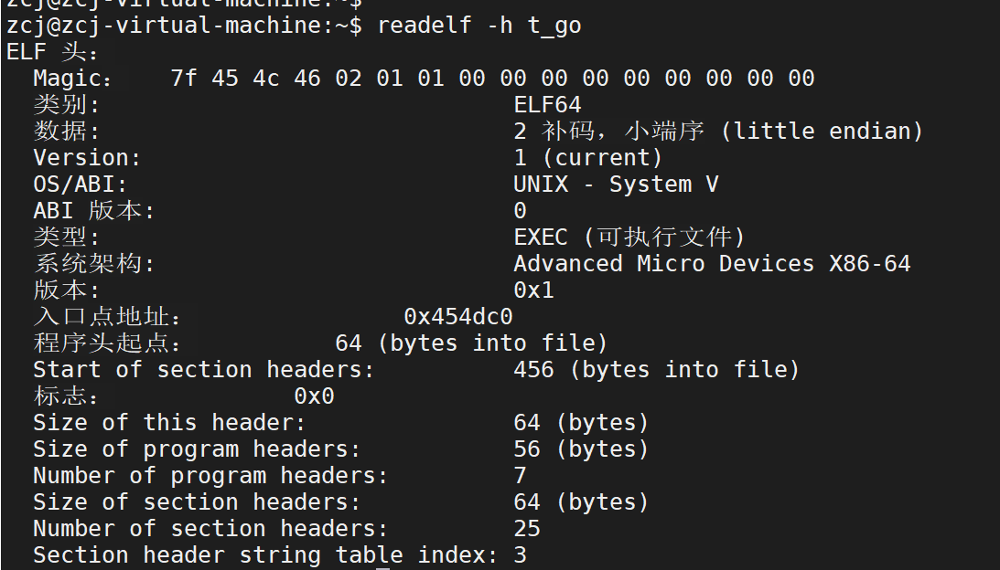
   - readelf –d 查看动态库依赖
    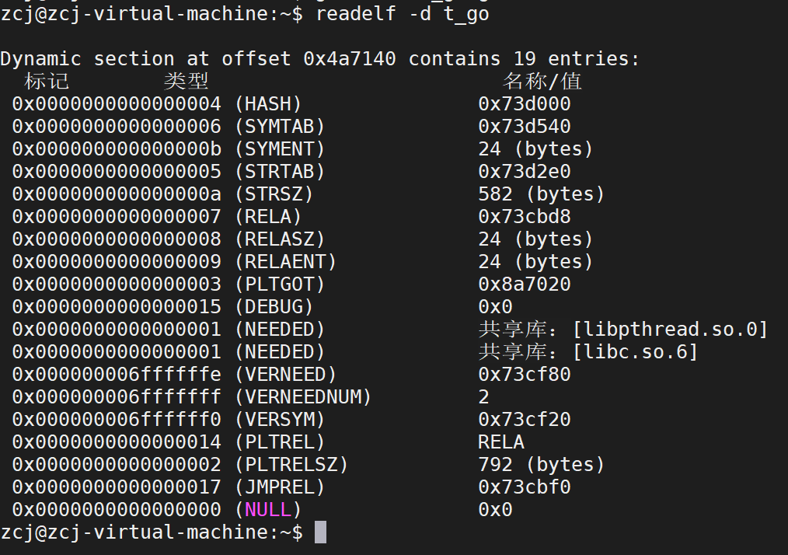
    
- File: 
    - file [可行政文件] 执行文件架构信息、动态、静态
    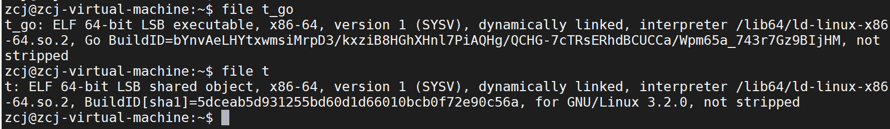
    - ldd 查看动态库
    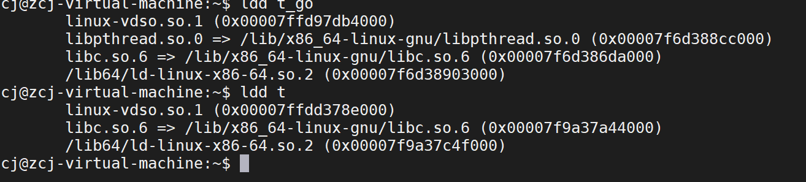
- Strip
   1. -I --input-target= 假定输入文件的格式为
   2. -O --output-target= 以格式创建输出文件
   3.  -F --target= 设置输入、输出的文件格式为
   4. -p --preserve-dates 复制上次修改或者操作的时间到输出文件中
   5. -R --remove-section= 删除输出文件中段信息
   6. -s --strip-all 删除所有符号信息和重定位信息
   7. -g -S -d --strip-debug 删除所有调试信息和段信息
   8. --strip-unneeded 删除所有重定位中不需要的符号信息
   9. --only-keep-debug 删除调试信息以外的其他所有信息
   10. -N --strip-symbol= 不拷贝符号信息
   11. -K --keep-symbol= 不去除符号信息
   12. -w --wildcard 在符号中使用通配符
   13. -x --discard-all 去除所有非全局符号
   
## Linux 进程调试工具
- pidof 查命令对应的进程编号  (pidof bash)
   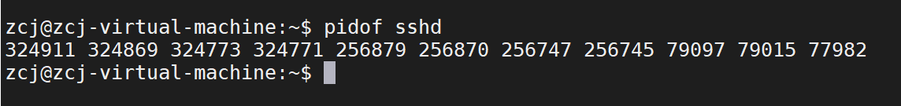
- Ps
    - 基础参数
        - -A, -e     选择所有进程
        -  -a           选择除了会话领导和与终端无关的进程以外的所有进程。
        - a            BSD格式，通常与x同时出现，显示所有进程
    - 选择性参数
      - -C <command>      根据cmdlist中的命令 输出
       - -p, --pid <pid>      根据进程id进行选择输出
  	    - --ppid <pid>     根据父进程ID选择输出
        - -U, --User <uid>    根据真实用户ID(RUID)或用户名选择
    - 显示线程
        - -L                   显示线程相关信息
    - 杂项
        - L                   列出所以支持的格式（应用与-o中的输出格式）
        - e                    输出环境变量（在指令后面）
    - 得到线程信息
        - ps -eLf
        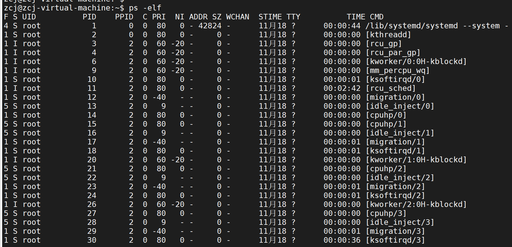
- Pstree
    - 查看进程之间的父子关系
    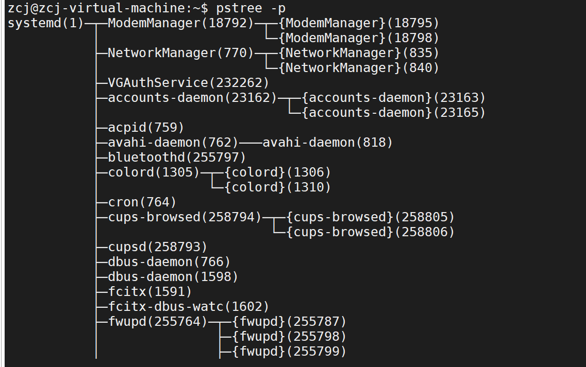
- top
    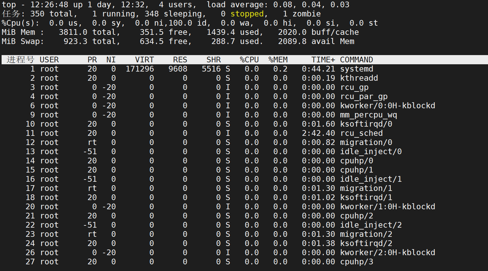
    - 第一行显示的是系统的概况：
        - 当前时间、系统的运行时间、登录的用户数以及系统的平均负载。
        - 平均负载有3个值：最近1分钟的，最近5分钟的，最近15分钟的平均负载。
         - load average 数据每隔5秒钟检查一次活跃的进程数，可以看出点问题。
      太高肯定不行了。
      
     - 第二行显示了进程:
        - top命令的输出中将进程叫作任务（task）：
            总进程，运行、休眠、停止或是僵化状态（僵化状态是指进程完成了，但父进程没有响应）。
      
     - 第三行显示CPU信息:
        - top根据进程的属主（用户还是系统）和进程的状态（运行、 空闲还是等待）将CPU利用率分成几类输出。
        - 0.0%us【user space】— 用户空间占用CPU的百分比。
        - 1.5%sy【sysctl】— 内核空间占用CPU的百分比。
        - 0.0%ni【】— 改变过优先级的进程占用CPU的百分比
        - 98.5%id【idolt】— 空闲CPU百分比
        - 0.0%wa【wait】— IO等待占用CPU的百分比
        - 0.0%hi【Hardware IRQ】— 硬中断占用CPU的百分比
        - 0.0%si【Software Interrupts】— 软中断占用CPU的百分比
    
     - 第四行显示内存信息：
        - total 总内存
        - free 空闲内存
        - used 已使用
        - buff/cache 缓存的内存量
    
    - 第五行显示swap交换分区信息：
        - total总大小
        - free空闲
        -  used 已使用
        - avail Mem 缓冲的交换区总量
        - 可用内存=free + buffer + cached
        - PID：进程的ID。
        - USER：进程属主的名字。
        - PR：进程的优先级。
        - NI：进程的谦让度值。
        - VIRT：进程占用的虚拟内存总量。
        - RES：进程占用的物理内存总量。
        - SHR：进程和其他进程共享的内存总量。
        - S：进程的状态（D代表可中断的休眠状态，R代表在运行状态，S代表休眠状态，T代表跟踪状态或停止状态，Z代表僵化状态）。
        - %CPU：进程使用的CPU时间比例。
        - %MEM：进程使用的内存占可用内存的比例。
        - TIME+：自进程启动到目前为止的CPU时间总量。
        - COMMAND：进程所对应的命令行名称，也就是启动的程序名。
      
        - m：显示内存
        - H: 显示线程
    - 其他 
        - M 根据驻留内存大小进行排序
        - P 根据CPU使用百分比大小进行排序
        - T 根据时间/累计时间进行排序
        - q:退出
        
 ## linux进程proc详解
- 进程的完整命令行
  * /proc/[pid]/cmdline
- 进程名
  * /proc/[pid]/comm
- 进程环境变量
    * /proc/[pid]/environ
- 进程可执行文件
    * /proc/[pid]/exe
- 打开文件描述符
    * /proc/[pid]/fd
- 打开文件信息
    * /proc/pid/fdinfo
- 内存映射文件
    * /proc/[pid]/map_files/
- IO文件
    * /proc/[pid]/io
- 易于阅读的进程状态信息    
    * /proc/[pid]/status
- 进程状态信息，用于ps指令    
    * /proc/[pid]/stat
- 进程内存使用信息    
    * /proc/pid/statm
    
 ## linux 内存检测工具
- Memwatch
    - 双重释放
    - 错误释放
    - 没有释放的内存
    - 溢出和下溢
- Yamd
    - 内存泄漏
    - 双重释放
    - 错误释放
    - 越界访问

 
 
 ## linux 性能检测工具
 ### 进程相关优化工具
- ltrace 
    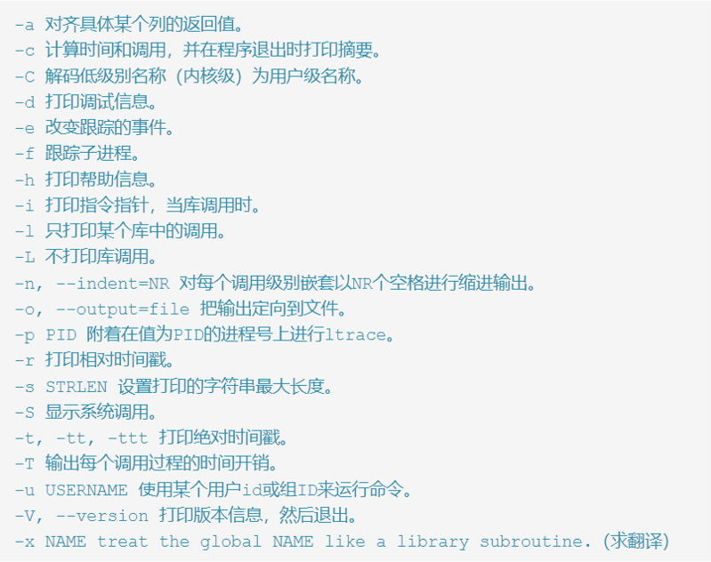
### 虚拟文件系统相关优化工具
 - lsof
    - -a 列出打开文件存在的进程
    - -c<进程名> 列出指定进程所打开的文件
    - -g 列出GID号进程详情
    - -d<文件号> 列出占用该文件号的进程
    - +d<目录> 列出目录下被打开的文件
    - +D<目录> 递归列出目录下被打开的文件
    - -n<目录> 列出使用NFS的文件
    - -i<条件> 列出符合条件的进程。（4、6、协议、:端口、 @ip ）
    - -p<进程号> 列出指定进程号所打开的文件
    - -u 列出UID号进程详情
    - -h 显示帮助信息
    - -v 显示版本信息
    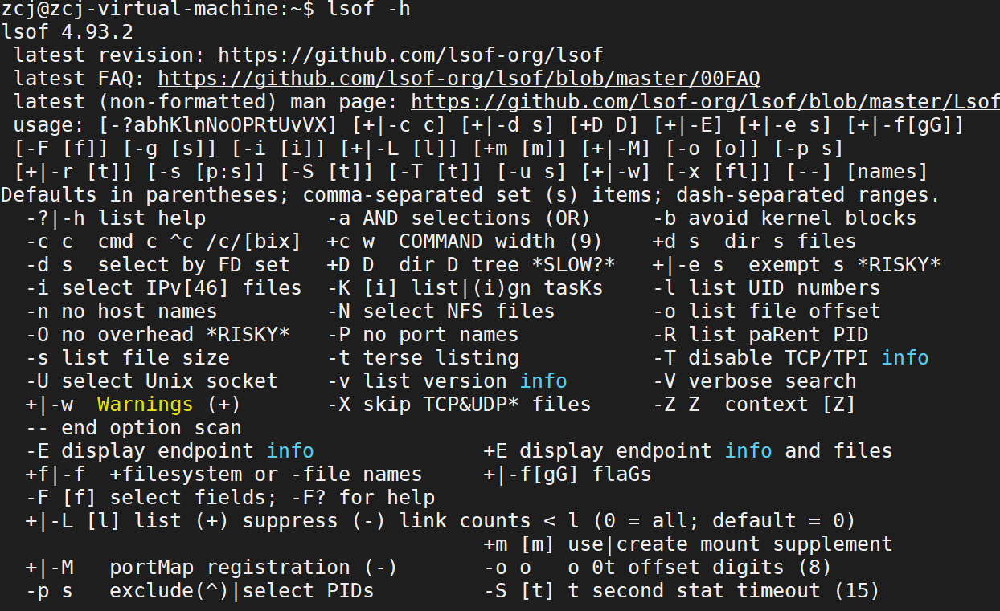
### 网络相关优化工具
- netstat
  -  -a 显示所有活动的连接以及本机侦听的TCP、UDP端口
  -  -l 显示监听的server port
  -  -n 直接使用IP地址，不通过域名服务器
  -  -p 正在使用Socket的程序PID和程序名称
  -  -r 显示路由表
  -  -t 显示TCP传输协议的连线状况
  -  -u 显示UDP传输协议的连线状况
  -  -w 显示RAW传输协议的连线状况
  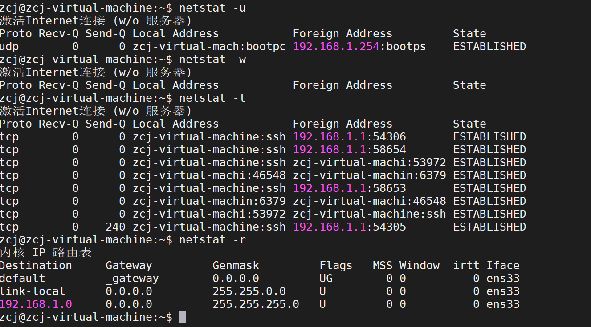
- ss
   - -a显示所有的sockets-l显示正在监听的
   - -n显示数字IP和端口，不通过域名服务器
   - -p显示使用socket的对应的程序
   - -t只显示TCP sockets-u只显示UDP sockets
   - -4 -6 只显示v4或v6V版本的sockets
   - -s打印出统计信息。
   - -0 显示PACKET sockets
   - -w 只显示RAW sockets
   - -x只显示UNIX域sockets
   - -r尝试进行域名解析，地址/端口
   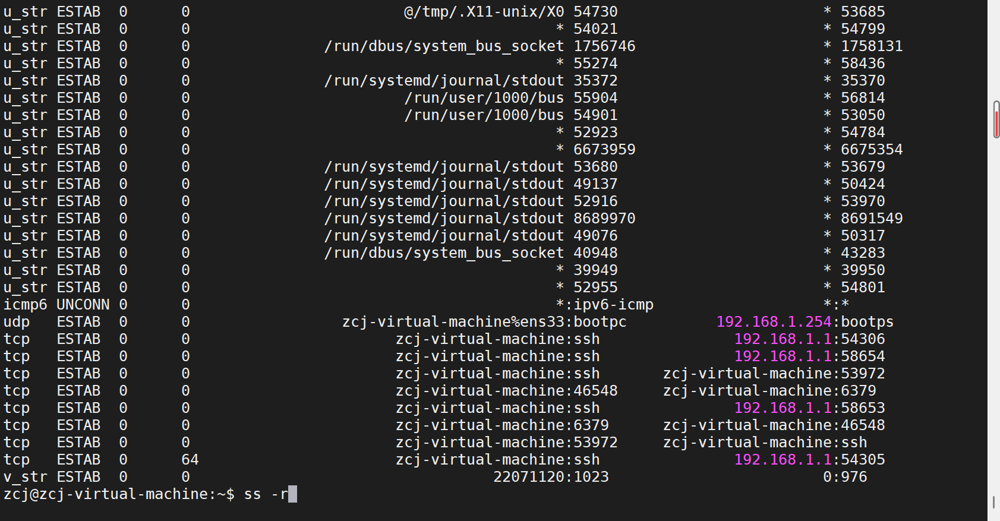

