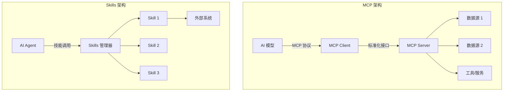
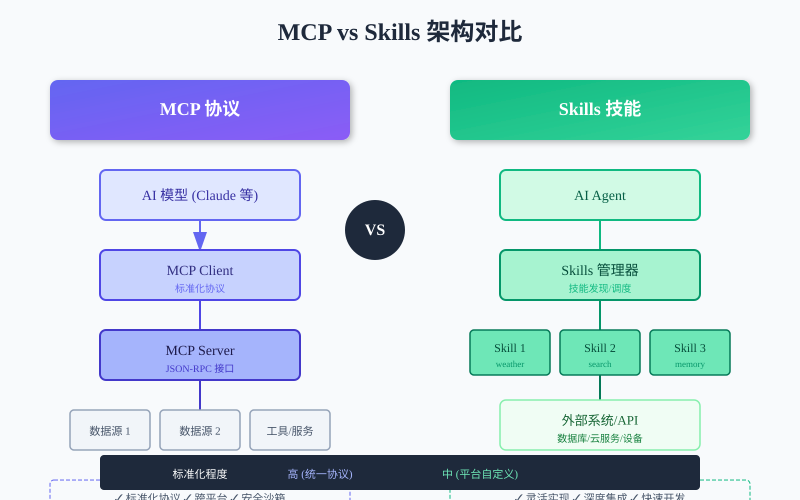
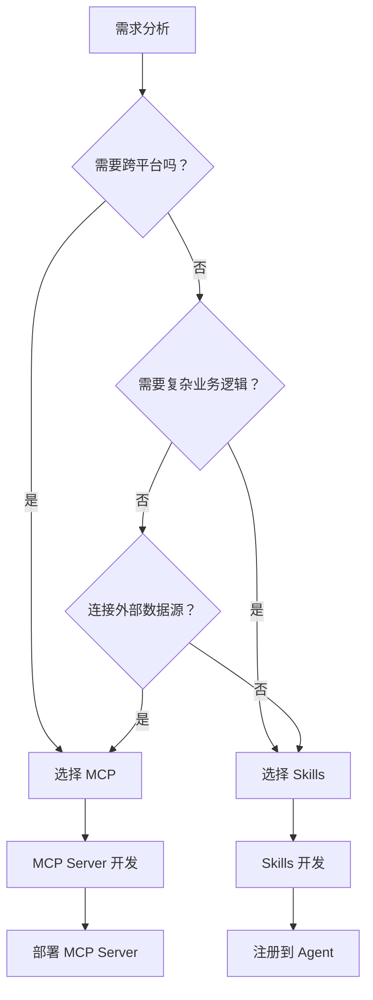

# MCP 与 Skills 有什么区别

## 一、背景介绍

随着 AI Agent（智能体）技术的快速发展，**如何让大模型与外部系统交互**成为了核心问题。目前业界主要有两种方案：

- **MCP (Model Context Protocol)** - 由 Anthropic 提出的模型上下文协议
- **Skills (技能系统)** - OpenClaw 等平台的技能扩展机制

本文将从多个维度对比这两种方案，帮助开发者理解它们的区别和适用场景。

## 二、核心概念对比

### 1. MCP (Model Context Protocol)

| 属性 | 描述 |
|------|------|
| **定义** | 模型上下文协议，标准化的 AI 模型与外部数据源连接协议 |
| **提出者** | Anthropic (Claude 团队) |
| **核心思想** | 统一接口规范，让 AI 模型能够安全地访问外部数据 |
| **架构模式** | 客户端 - 服务器模式 |

### 2. Skills (技能系统)

| 属性 | 描述 |
|------|------|
| **定义** | AI Agent 的功能扩展单元，封装特定能力的代码模块 |
| **代表平台** | OpenClaw、AutoGen 等 |
| **核心思想** | 将功能模块化，Agent 按需调用技能完成任务 |
| **架构模式** | 插件化/模块化架构 |

## 三、架构对比





## 四、核心差异分析

### 1. 设计目标

| 维度 | MCP | Skills |
|------|-----|--------|
| **标准化** | 高 - 统一协议规范 | 中 - 平台自定义 |
| **通用性** | 高 - 跨平台兼容 | 中 - 平台特定 |
| **灵活性** | 中 - 遵循协议约束 | 高 - 自由实现 |
| **生态建设** | 新兴生态 | 成熟生态 |

### 2. 技术实现

```
┌─────────────────────────────────────────────────────────────────┐
│                        MCP 实现方式                              │
├─────────────────────────────────────────────────────────────────┤
│  1. 定义标准 JSON-RPC 接口                                      │
│  2. Server 暴露资源 (Resources)、工具 (Tools)、提示 (Prompts)   │
│  3. Client 发现并调用 Server 能力                               │
│  4. 支持 SSE、stdio 等传输层                                    │
└─────────────────────────────────────────────────────────────────┘

┌─────────────────────────────────────────────────────────────────┐
│                       Skills 实现方式                            │
├─────────────────────────────────────────────────────────────────┤
│  1. 定义 Skill 接口规范 (SKILL.md)                              │
│  2. 实现工具函数 (Tools)                                        │
│  3. 注册到 Agent 技能系统                                       │
│  4. Agent 根据任务自动选择技能                                  │
└─────────────────────────────────────────────────────────────────┘
```

### 3. 使用场景对比

| 场景 | MCP | Skills | 推荐方案 |
|------|:---:|:------:|:--------:|
| **连接外部数据源** | ✅ | ⚠️ | MCP |
| **跨平台集成** | ✅ | ❌ | MCP |
| **复杂业务逻辑** | ⚠️ | ✅ | Skills |
| **平台特定功能** | ❌ | ✅ | Skills |
| **快速原型开发** | ⚠️ | ✅ | Skills |
| **企业级部署** | ✅ | ✅ | 均可 |

## 五、代码示例对比

### MCP Server 示例

```python
# MCP Server 实现
from mcp.server import Server
from mcp.server.stdio import stdio_server

server = Server("example-server")

@server.list_tools()
async def list_tools():
    return [
        Tool(
            name="get_weather",
            description="获取天气信息",
            inputSchema={
                "type": "object",
                "properties": {
                    "city": {"type": "string"}
                }
            }
        )
    ]

@server.call_tool()
async def call_tool(name: str, args: dict):
    if name == "get_weather":
        return get_weather(args["city"])
```

### Skills 示例

```python
# OpenClaw Skill 实现
# skills/weather/SKILL.md
"""
name: weather
description: 获取天气信息
tools:
  - get_weather
"""

# skills/weather/tools.py
def get_weather(city: str) -> str:
    """获取指定城市的天气"""
    import requests
    response = requests.get(f"https://wttr.in/{city}?format=3")
    return response.text

# 注册到 Agent
# agent 自动发现并调用该技能
```

## 六、优劣势分析

### MCP 优势

| 优势 | 说明 |
|------|------|
| **标准化** | 统一协议，降低集成成本 |
| **安全性** | 内置权限控制和沙箱机制 |
| **可发现性** | 自动发现 Server 能力 |
| **生态兼容** | 支持 Claude 及其他兼容模型 |

### MCP 劣势

| 劣势 | 说明 |
|------|------|
| **学习曲线** | 需要理解协议规范 |
| **灵活性受限** | 必须遵循协议约束 |
| **生态较新** | 工具和资源相对较少 |

### Skills 优势

| 优势 | 说明 |
|------|------|
| **灵活性高** | 自由实现业务逻辑 |
| **开发简单** | 直接编写 Python/Go 代码 |
| **平台集成** | 深度集成平台能力 |
| **生态成熟** | 丰富的技能库 |

### Skills 劣势

| 劣势 | 说明 |
|------|------|
| **平台绑定** | 技能通常绑定特定平台 |
| **标准化低** | 不同平台技能不兼容 |
| **安全风险** | 需要自行处理安全 |

## 七、选择建议



### 决策树说明

1. **优先选择 MCP 的场景**：
   - 需要连接多个数据源
   - 要求跨平台兼容
   - 重视安全性和标准化

2. **优先选择 Skills 的场景**：
   - 平台特定功能开发
   - 复杂业务逻辑实现
   - 快速原型验证

## 八、未来趋势

### 融合趋势

```
┌─────────────────────────────────────────────────────────────────┐
│                    未来发展方向                                  │
├─────────────────────────────────────────────────────────────────┤
│  1. MCP + Skills 混合架构                                       │
│     - 用 MCP 连接外部数据                                        │
│     - 用 Skills 实现业务逻辑                                     │
│                                                                 │
│  2. 标准化技能接口                                              │
│     - Skills 采用 MCP 协议暴露能力                               │
│     - 实现跨平台技能共享                                         │
│                                                                 │
│  3. 安全增强                                                    │
│     - 统一的权限模型                                             │
│     - 沙箱执行环境                                               │
└─────────────────────────────────────────────────────────────────┘
```

## 九、实践建议

### 对于开发者

1. **学习 MCP 协议** - 理解标准化接口设计
2. **掌握 Skills 开发** - 熟悉平台技能系统
3. **根据场景选择** - 不盲目追新，适合最重要

### 对于企业

1. **评估现有系统** - 确定集成需求
2. **制定技术路线** - MCP 和 Skills 可并存
3. **关注安全合规** - 建立权限审计机制

## 十、总结

| 对比维度 | MCP | Skills |
|----------|-----|--------|
| **定位** | 协议标准 | 功能模块 |
| **适用场景** | 数据连接/跨平台 | 业务逻辑/平台功能 |
| **学习成本** | 中 | 低 |
| **灵活性** | 中 | 高 |
| **标准化** | 高 | 中 |
| **推荐指数** | ⭐⭐⭐⭐ | ⭐⭐⭐⭐ |

**核心结论**：

- **MCP 和 Skills 不是对立关系，而是互补关系**
- **MCP 解决"如何连接"的问题** - 标准化接口
- **Skills 解决"做什么"的问题** - 功能实现
- **最佳实践是结合使用** - MCP 连接 + Skills 处理

---

## 参考资源

- [MCP 官方文档](https://modelcontextprotocol.io/)
- [OpenClaw 文档](https://docs.openclaw.ai)
- [Anthropic MCP 介绍](https://www.anthropic.com/news/model-context-protocol)
- [GitHub - modelcontextprotocol](https://github.com/modelcontextprotocol)

---

*作者：AI Assistant*  
*更新时间：2026-03-22*  
*分类：AI Agent / MCP / Skills*
