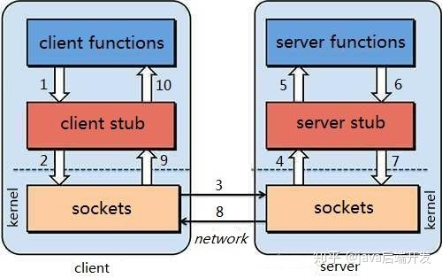

## RPC
* RPC(Remote Procedure Call Protocol)——远程过程调用协议，它是一种通过网络从远程计算机程序上请求服务，
而不需要了解底层网络技术的协议。RPC协议假定某些传输协议的存在，如TCP/IP或UDP，为通信程序之间携带信息数据。
RPC将原来的本地调用转变为调用远端的服务器上的方法，给系统的处理能力和吞吐量带来了近似于无限制提升的可能。
在OSI网络通信模型中，RPC跨域了传输层和应用层。RPC使得开发包括网络分布式多程序在内的应用程序更加容易
* RPC采用客户机/服务器(client-server)模式,也是一种请求/响应(request-response)模式，可以通过TCP/UDP以及HTTP
协议进行传输

## RPC 架构
* CAll ID 映射：客户端通过ID传输给服务器，服务器通过ID调用相应的函数返回
* 序列化与烦序列化：客户端与服务器通过序列化与反序列化进行传参
* 一个完整的RPC架构里面包含了四个核心的组件，分别是Client，Client Stub，Server以及Server Stub，这个Stub可以理解为存根。

1. 客户端(Client)，服务的调用方。
2. 客户端存根(Client Stub)，存放服务端的地址消息，再将客户端的请求参数打包成网络消息，然后通过网络远程发送给服务方。
3. 服务端(Server)，真正的服务提供者。
4. 服务端存根(Server Stub)，接收客户端发送过来的消息，将消息解包，并调用本地的方法。
###  RPC调用过程
1. 客户端（client）以本地调用方式（即以接口的方式）调用服务；
2. 客户端存根（client stub）接收到调用后，负责将方法、参数等组装成能够进行网络传输的消息体（将消息体对象序列化为二进制）；
3. 客户端通过sockets将消息发送到服务端；
4.  服务端存根( server stub）收到消息后进行解码（将消息对象反序列化）；
5.  服务端存根( server stub）根据解码结果调用本地的服务；
6.  本地服务执行并将结果返回给服务端存根( server stub）；
7. 服务端存根( server stub）将返回结果打包成消息（将结果消息对象序列化）；
8.  服务端（server）通过sockets将消息发送到客户端；
9.  客户端存根（client stub）接收到结果消息，并进行解码（将结果消息发序列化）；
10.  客户端（client）得到最终结果。  
RPC的目标是要把2、3、4、7、8、9这些步骤都封装起来。
* 注意：无论是何种类型的数据，最终都需要转换成二进制流在网络上进行传输，数据的发送方需要将对象转换为二进制流，而数据的接收方则需要把二进制流再恢复为对象。

## gPRC 
* gRPC 是一种现代开源高性能远程过程调用 (RPC) 框架，可以在任何环境中运行。它可以通过对负载平衡、跟踪、健康检查和身份验证的可插拔支持，有效地连接数据中心内和数据中心之间的服务。它还适用于分布式计算的最后一英里，将设备、移动应用程序和浏览器连接到后端服务。
* gRPC 是基于HTTP2.0(多路复用,消除了线头阻塞)标准协议色设计的基于ProtoBuf序列化的高性能框架。
[《gRPC 官方文档中文版》](http://doc.oschina.net/grpc)
### Protocol Buffers
* Protocol Buffers 是一种轻便高效的结构化数据存储格式，可以用于结构化数据序列化，很适合做数据存储或 RPC 数据交换格式。它可用于通讯协议、数据存储等领域的语言无关、平台无关、可扩展的序列化结构数据格式
* 序列化：将数据结构或对象转换成能被传输或者存储（如二进制格式）的过程。
* 反序列化：将在序列化过程中所生成的(格式)转换成数据结构或者对象的过程。

## 参考文献：
[RPC原理解析](https://zhuanlan.zhihu.com/p/94983974)
