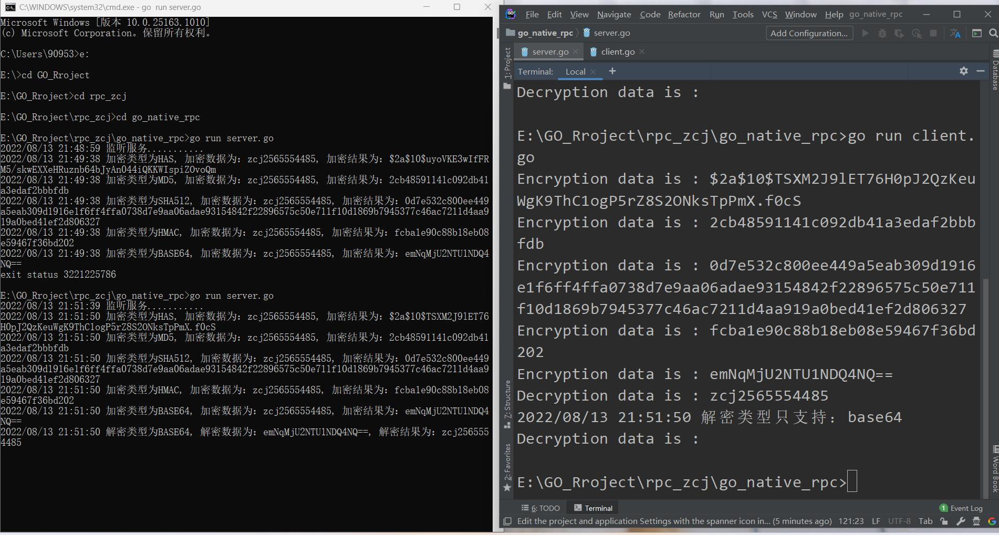

## go 语言原生的rpc的实践
- go 原生的rpc是使用的net/rpc库，使用encoding/gob进行编解码，支持tcp和http数据传输方式
- 提供了net/rpc/jsonrpc库实现RPC方法，jsonrpc采用JSON进行数据编解码，因而支持跨语言调用，
- 目前jsonrpc库是基于tcp协议实现的，暂不支持http传输方式
### 服务器端 必须符合4个基本条件
1. 结构体字段首字母要大写，可以别人调用
2. 函数名必须首字母大写
3. 函数第一参数是接收参数，第二个参数是返回给客户端的参数，必须是指针类型
4. 函数还必须有一个返回值error

### 服务器代码如下：
通过加密来实践rpc
```go
package main

import (
	"crypto/hmac"
	"crypto/md5"
	"crypto/sha512"
	"encoding/base64"
	"encoding/hex"
	"fmt"
	"golang.org/x/crypto/bcrypt"
	"io"
	"log"
	"net/http"
	"net/rpc"
)

// 实例 字符串加密
// 采用哈希/md5/base64/sha512/hmac
const HMACKEY = "ZCJ"

type  DeEncryptionPram struct {
	CodeStr     string    // 待加密/解密的字符串
	CodeType    string    // 加解码的类型
}

type Encryption struct {

}

// 哈希加密
func hasEncryption(codeStr string)string{
	bytes, err := bcrypt.GenerateFromPassword([]byte(codeStr), bcrypt.DefaultCost)
	if err != nil {
		log.Println("has 加密失败")
		return ""
	}
	return string(bytes)
}

// MD5加密
func md5Encryption(codeStr string) string  {
	data := md5.Sum([]byte(codeStr))
	hexStr := fmt.Sprintf("%x", data)
	return hexStr
}

// base64加密
func base64Encryption(codeStr string) string  {
	return  base64.StdEncoding.EncodeToString([]byte(codeStr))
}

// base64 解密
func base64Decryption(codeStr string)(string, error){
	by, err := base64.StdEncoding.DecodeString(codeStr)
	if err != nil {
		return "", err
	}
	return string(by), nil
}

// sha512加密
func sha512Encryption(codeStr string)string {
	w := sha512.New()
	io.WriteString(w, codeStr)
	bw := w.Sum(nil)
	return hex.EncodeToString(bw)
}

// 使用hmac 进行加密
func hmacEncryption(codeStr string)string {
	hw := hmac.New(md5.New, []byte(HMACKEY))
	hw.Write([]byte(codeStr))
	return hex.EncodeToString(hw.Sum([]byte("")))
}

func (e *Encryption)OptEncryption(pram *DeEncryptionPram, returnData *string) error {
	if pram.CodeStr == ""{
		returnData = nil
		return fmt.Errorf("加密字符串为空")
	}
	switch pram.CodeType {
	case "HAS":
		*returnData = hasEncryption(pram.CodeStr)
	case "MD5":
		*returnData = md5Encryption(pram.CodeStr)
	case "BASE64":
		*returnData = base64Encryption(pram.CodeStr)
	case "SHA512":
		*returnData = sha512Encryption(pram.CodeStr)
	case "HMAC":
		*returnData = hmacEncryption(pram.CodeStr)
	default:
		*returnData = hasEncryption(pram.CodeStr)
	}
	log.Printf("加密类型为%v, 加密数据为：%v, 加密结果为：%v", pram.CodeType, pram.CodeStr, *returnData)
	return nil
}

func (e *Encryption)OptDecryption(pram *DeEncryptionPram, returnData *string) error {
	if pram.CodeStr == ""{
		returnData = nil
		return fmt.Errorf("解密字符串为空")
	}
	if pram.CodeType == "BASE64"{
		str, err := base64Decryption(pram.CodeStr)
		if err != nil {
			*returnData = ""
			return err
		}
		*returnData = str
		log.Printf("解密类型为%v, 解密数据为：%v, 解密结果为：%v", pram.CodeType, pram.CodeStr, *returnData)
		return nil
	}
	*returnData = ""
	return fmt.Errorf("解密类型只支持：base64")
}

func main() {
	enc := new(Encryption)
	// 注册服务
	err := rpc.Register(enc)
	if err != nil {
		log.Fatal("服务注册失败")
	}
	// 使用http
	rpc.HandleHTTP()
	// 监听服务
	log.Println("监听服务...........")
	err = http.ListenAndServe(":8000", nil)
	if err != nil {
		log.Panicln(err)
	}
}
```

### 客户端代码如下：
```go
package main

import (
	"fmt"
	"log"
	"net/rpc"
)

// 客户端开始请求

type DeEncryptionPram struct {
	CodeStr     string    // 待加密/解密的字符串
	CodeType    string    // 加解码的类型
}

func main() {
	// 连接http
	conn, err := rpc.DialHTTP("tcp", ":8000")
	if err != nil {

		log.Panic(err)
	}
	pram := &DeEncryptionPram{
		CodeStr:  "zcj2565554485",
		CodeType: "HAS",
	}
	var HASData string
	err = conn.Call("Encryption.OptEncryption", pram, &HASData)
	if err != nil {
		log.Println(err)
	}
	fmt.Println("Encryption data is :", HASData)

	pram = &DeEncryptionPram{
		CodeStr:  "zcj2565554485",
		CodeType: "MD5",
	}
	var MD5Data string
	err = conn.Call("Encryption.OptEncryption", pram, &MD5Data)
	if err != nil {
		log.Println(err)
	}
	fmt.Println("Encryption data is :", MD5Data)

	pram = &DeEncryptionPram{
		CodeStr:  "zcj2565554485",
		CodeType: "SHA512",
	}
	var SHA512Data string
	err = conn.Call("Encryption.OptEncryption", pram, &SHA512Data)
	if err != nil {
		log.Println(err)
	}
	fmt.Println("Encryption data is :", SHA512Data)

	pram = &DeEncryptionPram{
		CodeStr:  "zcj2565554485",
		CodeType: "HMAC",
	}
	var HMACData string
	err = conn.Call("Encryption.OptEncryption", pram, &HMACData)
	if err != nil {
		log.Println(err)
	}
	fmt.Println("Encryption data is :", HMACData)

	pram = &DeEncryptionPram{
		CodeStr:  "zcj2565554485",
		CodeType: "BASE64",
	}
	var returnData string
	err = conn.Call("Encryption.OptEncryption", pram, &returnData)
	if err != nil {
		log.Println(err)
	}
	fmt.Println("Encryption data is :", returnData)
	pram = &DeEncryptionPram{
		CodeStr:  returnData,
		CodeType: "BASE64",
	}
	returnData = ""
	err = conn.Call("Encryption.OptDecryption", pram, &returnData)
	if err != nil {
		log.Println(err)
	}
	fmt.Println("Decryption data is :", returnData)

	pram = &DeEncryptionPram{
		CodeStr:  returnData,
		CodeType: "HMAC",
	}
	returnData = ""
	err = conn.Call("Encryption.OptDecryption", pram, &returnData)
	if err != nil {
		log.Println(err)
	}
	fmt.Println("Decryption data is :", returnData)
}
```

### 测试结果
```
E:\GO_Rroject\rpc_zcj\go_native_rpc>go run client.go
Encryption data is : $2a$10$IaSoHv0OpVBZNk3zfx1Ct.dKLZJwU5of6qoKf2bABA7aKEQvObYLm
Encryption data is : 2cb48591141c092db41a3edaf2bbbfdb
Encryption data is : 0d7e532c800ee449a5eab309d1916e1f6ff4ffa0738d7e9aa06adae93154842f22896575c50e711f10d1
869b7945377c46ac7211d4aa919a0bed41ef2d806327
Encryption data is : fcba1e90c88b18eb08e59467f36bd202
Encryption data is : emNqMjU2NTU1NDQ4NQ==
Decryption data is : zcj2565554485
2022/08/13 21:58:23 解密类型只支持：base64
Decryption data is :
```

