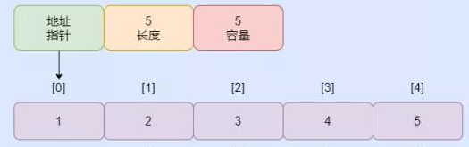
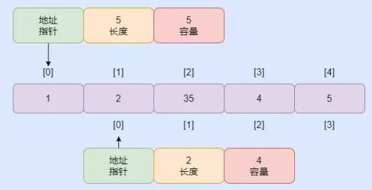

## 切片的内部结构

* 切片的结构可分为：数组，数据（元素）的地址&data、也存元素个数len、可以存储多少元素cap
* 源码如下

> 

```
定义切片的结构：
type slice struct {
	array unsafe.Pointer   
	len   int
	cap   int
}
```

*  如图所示


* var data [] int 声明一个切片，相当于生成切片的结构，data地址指针为nil, len和cap都为0。这就很清楚为什么，nil切片不可以直接使用了😄 结构如图


* 使用切片时需要make([]type,len,cap)或者初始化[]type{}才能使用，这是因为在在生成切片的结构时，同时也开辟了一段新的内存，类型为type, 结构长度为cap,同时值进行初始化。
* make 源码如下：

> 

```
func makeslice(et *_type, len, cap int) unsafe.Pointer {
	mem, overflow := math.MulUintptr(et.size, uintptr(cap))    // 判断是否越界
	if overflow || mem > maxAlloc || len < 0 || len > cap {
		// NOTE: Produce a 'len out of range' error instead of a
		// 'cap out of range' error when someone does make([]T, bignumber).
		// 'cap out of range' is true too, but since the cap is only being
		// supplied implicitly, saying len is clearer.
		// See golang.org/issue/4085.
		mem, overflow := math.MulUintptr(et.size, uintptr(len))
		if overflow || mem > maxAlloc || len < 0 {
			panicmakeslicelen()       // 越界直接 panic
		}
		panicmakeslicecap()    // 越界直接 panic
	}

	return mallocgc(mem, et, true)  //开辟内存
}
```

> 
* 也可以通过底层数组初始化，切片的data指针指向就是相同类型的底层数组；通过slince := array[n:m],表示定义了一个类型和array相同，len为m-n,cap默认为array的长度的切片。切片和数组都指向了相同的地址。多个切片可以共用同一个底层数组。
  
* 通过append 函数向切片增加切片的元素，增加了len, cap 不变。
  
  ## 切片扩容
* 在资源充裕的条件下，切片是可以通过append不断增加元素，当len个数增加到cap一样时，在增加元素时，就需要增加切片的容量cap，那问题来了，切片是怎么扩容的呢？
  
  ### 扩容规则（预估规则）

1. 当需要扩容的数量比之前cap的两倍都大，则扩容为需要扩容的数量
2. 当需要扩容的数量比之前cap的两倍都大小，之前的cap小于1024 直接扩大之前的2倍
3. 当需要扩容的数量比之前cap的两倍都大小，之前的cap大于1024 直接扩大之前的1.25倍
4. 伪代码如下
   
   > if oldcap*2  < newcap 时， 扩容为newcap
else{ if oldcap < 1024     newcap = 2*oldcap     ;  else           newcap = 1.25*oldcap }
5. 源代码如下：
   
   > 

```
newcap := old.cap
	doublecap := newcap + newcap     //两倍的oldcap
	if cap > doublecap {
//当需要扩容的数量比之前cap的两倍都大，则扩容为需要扩容的数量
		newcap = cap   
	} else {
//当需要扩容的数量比之前cap的两倍都大小，之前的cap小于1024 直接扩大之前的2倍
		if old.cap < 1024 {   
			newcap = doublecap
		} else {
			// Check 0 < newcap to detect overflow
			// and prevent an infinite loop.
当需要扩容的数量比之前cap的两倍都大小，之前的cap大于1024 直接扩大之前的1.25倍
			for 0 < newcap && newcap < cap {
				newcap += newcap / 4
			}
			// Set newcap to the requested cap when
			// the newcap calculation overflowed.
			if newcap <= 0 {
				newcap = cap
			}
		}
	}
```
 ### 扩容调整
 * 在预估扩容后，会根据内存对齐（减少内存浪费）在进行调整，代码：capmem := roundupsize(uintptr(newcap) * uintptr(et.size))newcap就是前文中计算出的newcap，et.size代表slice中一个元素的大小，capmem计算出来的就是此次扩容需要申请的内存大小。roundupsize函数就是处理内存对齐的函数
 * 源码如下
```
 var overflow bool
 	var lenmem, newlenmem, capmem uintptr
 	switch {
 	case et.size == 1:    //例如byte 大小为1， 扩容的大小为向上取整的数值
 		lenmem = uintptr(old.len)
 		newlenmem = uintptr(cap)
 		capmem = roundupsize(uintptr(newcap)) 
 		overflow = uintptr(newcap) > maxAlloc
 		newcap = int(capmem)
 	case et.size == sys.PtrSize:
 		lenmem = uintptr(old.len) * sys.PtrSize
 		newlenmem = uintptr(cap) * sys.PtrSize
 		capmem = roundupsize(uintptr(newcap) * sys.PtrSize)
 		overflow = uintptr(newcap) > maxAlloc/sys.PtrSize
 		newcap = int(capmem / sys.PtrSize)
 	case isPowerOfTwo(et.size):  //处理2的倍数
 		var shift uintptr
 		if sys.PtrSize == 8 {
 			// Mask shift for better code generation.
 			shift = uintptr(sys.Ctz64(uint64(et.size))) & 63
 		} else {
 			shift = uintptr(sys.Ctz32(uint32(et.size))) & 31
 		}
 		lenmem = uintptr(old.len) << shift
 		newlenmem = uintptr(cap) << shift
 		capmem = roundupsize(uintptr(newcap) << shift)
 		overflow = uintptr(newcap) > (maxAlloc >> shift)
 		newcap = int(capmem >> shift)
 	default:
 		lenmem = uintptr(old.len) * et.size
 		newlenmem = uintptr(cap) * et.size
 		capmem, overflow = math.MulUintptr(et.size, uintptr(newcap))
 		capmem = roundupsize(capmem)
 		newcap = int(capmem / et.size)
 	}
 
 	// The check of overflow in addition to capmem > maxAlloc is needed
 	// to prevent an overflow which can be used to trigger a segfault
 	// on 32bit architectures with this example program:
 	//
 	// type T [1<<27 + 1]int64
 	//
 	// var d T
 	// var s []T
 	//
 	// func main() {
 	//   s = append(s, d, d, d, d)
 	//   print(len(s), "\n")
 	// }
 	if overflow || capmem > maxAlloc {
 		panic(errorString("growslice: cap out of range"))
 	}

### 扩容后内存分配

* 分配 大于cap的内存，没有数据指针，memclrNoHeapPointers创建
* 源码如下：
  > 
	var p unsafe.Pointer
	if et.ptrdata == 0 {
		p = mallocgc(capmem, nil, false)
		// The append() that calls growslice is going to overwrite from old.len to cap (which will be the new length).
		// Only clear the part that will not be overwritten.
		memclrNoHeapPointers(add(p, newlenmem), capmem-newlenmem)
	} else {
		// Note: can't use rawmem (which avoids zeroing of memory), because then GC can scan uninitialized memory.
		p = mallocgc(capmem, et, true)  //分配内存地址
		if lenmem > 0 && writeBarrier.enabled {
			// Only shade the pointers in old.array since we know the destination slice p
			// only contains nil pointers because it has been cleared during alloc.
			bulkBarrierPreWriteSrcOnly(uintptr(p), uintptr(old.array), lenmem-et.size+et.ptrdata)
		}
	}
	memmove(p, old.array, lenmem)  //数据迁移

	return slice{p, old.len, newcap}  
}
```

