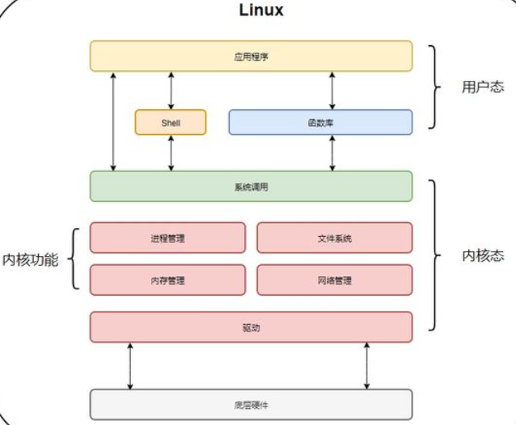
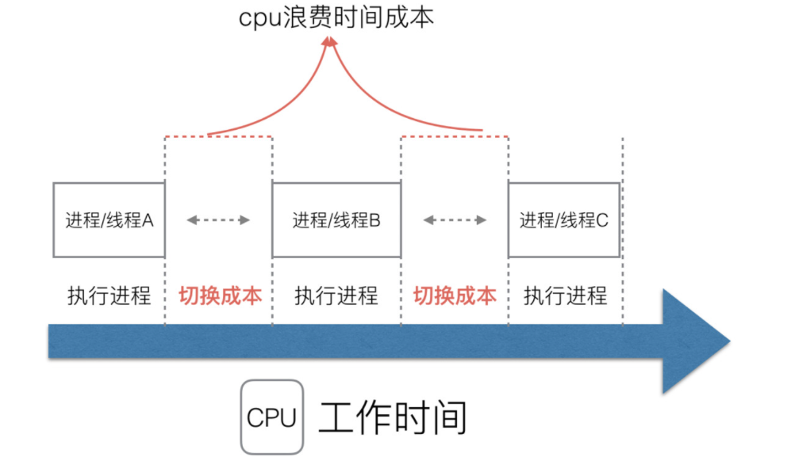
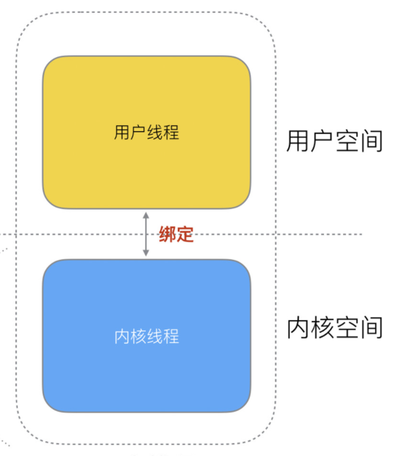
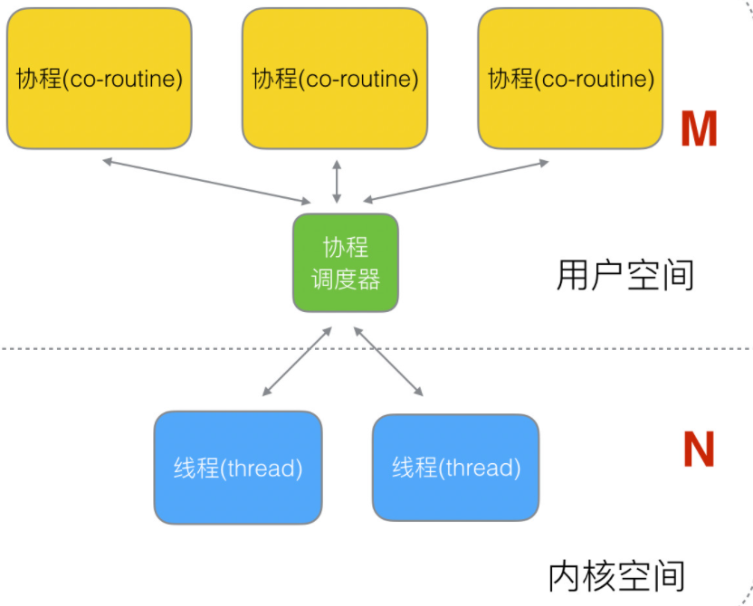

## 理解进程与线程
### 进程
* 进程是程序一次动态执行过程、进程是操作系统分配资源(内存、io资源、cpu等)和资源调度的基本单位。程序是指令、数据及其组织形式的描述，进程是程序的实体。
* 进程是由 进程控制块PCB、相关程序段和该程序段进行操作的数据结构集三个部分组成。
* 进程的五中状态：创建、就绪、运行、阻塞、终止
* 五种状态转换如图所示：

### 线程
* 线程是cup调度和分配的基本单位也是cup执行的最小单位, 有独立的栈空间，共享堆空间。

### 进程与线程的关系
* 一个进程可以创建和撤销多个线程， 一个进程必须有一个线程(主线程), 线程共享进程所有资源，进程是线程的容器，关系如图所示：  

## 并发与并行
### 并发
* 并发：多进程(线程)程序在一个核cup串行运行，当一个进程(线程)阻塞的时候，切换到另外等待执行的进程(线程) 如图  

### 并行
* 并行：多线程程序在多核cup并行运行，如图  

## 用户态和内核态(用户空间和内核空间)
### 特权级划分
* cpu一共有0～4四个特权级，R0级最高，R3级最低。用户态指的是：程序运行在R3级以上，通常在应用程序中运行，内核态是指：程序运行在R0级以上，通常在内核中运行。一般来说，我们写的应用程序就是运行在R3级衣以上。
### 3中种用户态与内核态的切换
* 系统调用：用户态进程通过系统调用申请使用操作系统提供的服务程序完成工作，比如前例中fork()实际上就是执行了一个创建新进程的系统调用。而系统调用的机制其核心还是使用了操作系统为用户特别开放的一个中断来实现，例如Linux的int 80h中断。
* 异常：当CPU在执行运行在用户态下的程序时，发生了某些事先不可知的异常，这时会触发由当前运行进程切换到处理此异常的内核相关程序中，也就转到了内核态，比如缺页异常。
* 外围设备的中断： 当外围设备完成用户请求的操作后，会向CPU发出相应的中断信号，这时CPU会暂停执行下一条即将要执行的指令转而去执行与中断信号对应的处理程序，如果先前执行的指令是用户态下的程序，那么这个转换的过程自然也就发生了由用户态到内核态的切换。比如硬盘读写操作的完成，系统会切换到硬盘读写的中断处理程序中执行后续操作等。
* 用户态与内核态结构如图：  

* 用户态与内核态的切换是需要开销
* 来源：linux用户态和内核态理解(https://www.cnblogs.com/weifeng1463/p/11660260.html)
### 进程与线程用户态到内核态的开销
* 多进程(线程)可以提高cpu的利用率，减少程序阻塞带来cpu闲置的情况，也就是提升cpu的运行时间片，但是过多的创建进程(线程)也会花费额外的cpu时间片进行进程(线程)的花销。进程的创建、就绪、运行、阻塞、终止，这些都会带来cup花销。例如在32位的操作系统中创建一个进程需要开辟4GB的虚拟内存空间，创建一个线程需要占用约4MB的内存。  

* 进程(线程)的调度也会带来cup的花销。cup进程(线程)的调度就是进程(线程)切换，进程(线程)的切换就会进行线程在内核态的调度。cup切换的内核态的线程，不操作用户态的线程，用户态线程通过系统调用触发内核线程。
* 为减少cpu内核态线程之间的切换，操作系统中使用(用户态进程(线程):内核态进程(线程))1:1，用户态直接通过系统，直接与内核态的线程一一对应。如图  

* 用户态一个进程(线程)对应一个内核态的进程(线程)是减少了内核态中进程(线程)切换的花销，但是也增加了内核态中进程(线程)创建的开销。减少内核态中进程(线程)切换与创建带来的开销，操作系统中使用(用户态进程(线程):内核态进程(线程))N:1，减少内核态中进程(线程)的创建，同时在用户态进行线程的之间的切换，不牵连内核态线程的切换，减少cup的花销。

* 虽然N:1减少内核态中进程(线程)切换与创建带来的开销，但是当用户态的进程(线程)阻塞时，其他进程(线程)就只能等待，这造成与单线程一样的问题。操作系统结合1:1和n:1模型的有点形成n:m模型，内核态中进程(线程)进入阻塞状态时， 用户态的进程(线程)切换另一个内核态中的线程。  

### 协程
* 协程和线程一样有独立的栈空间，共享堆空间，是用户级的线程，是有用户自己调度。一个线程可以创建多个协程，协程是轻量级的线程。创建一个协程只需要占用4~5kB的虚拟内存，创建协程的开销相比进程与线程低太多了。  

## 参考文献
1、[https://zhuanlan.zhihu.com/p/337978321](https://zhuanlan.zhihu.com/p/337978321) 
2、[https://www.jianshu.com/p/fa696563c38a](https://www.jianshu.com/p/fa696563c38a)