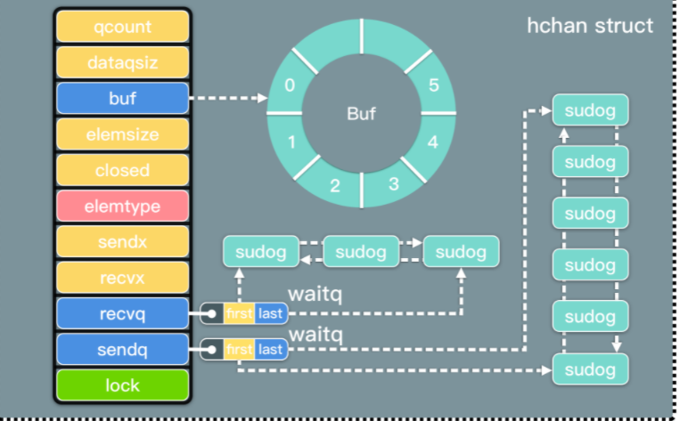

# go Channel

* （**Do not communicate by sharing memory; instead, share memory by communicating**）

## CSP并发模型

* **CSP** 即**通信顺序进程**、**交谈循序程序**，又被译为**交换消息的循序程序**(communicating sequential processes)，它是一种用来描述并发性系统之间进行交互的模型。
* go  Channe是一种特殊的类型，是有特定类型的队列。是链接goroutine(协程)的通信机制，通过通信共享内存而不是通过共享内存而实现通信.
* Channel 收发操作均遵循了先进先出的设计，具体规则如下：
  1. 先从 Channel 读取数据的 Goroutine 会先接收到数据；
  2. 先向 Channel 发送数据的 Goroutine 会得到先发送数据的权利；


## channel 数据结构定义：

```
type hchan struct {
	// 队列中数据的总数量
	qcount   uint           // total data in the queue
	//环形队列的大小
	dataqsiz uint           // size of the circular queue
	// 存放环形队列的数据
	buf      unsafe.Pointer // points to an array of dataqsiz elements
	// 元素的大小
	elemsize uint16
	// 是否关闭的标识
	closed   uint32
	// 元素的类型
	elemtype *_type // element type
	// 当前发送数据在环形队列的索引
	sendx    uint   // send index
	// 当前接受数据在环形队列的索引 
	recvx    uint   // receive index
	// 接收者等待队列（<-ch）阻塞在channel的协程队列
	recvq    waitq  // list of recv waiters
	// 发送者等待队列（ch<- data）阻塞在channel的协程队列
	sendq    waitq  // list of send waiters
	//锁保护hchan中的所有字段，以及几个
	//在这个通道上阻塞sudogs中的字段
	//保持这个锁时不要改变另一个G的状态
	//(特别是，不要准备一个G)，因为这可能会死锁
	//栈收缩。
	lock mutex  // 保护hchan中的所有字段，保持协程的状态不被更改，避免造成栈收缩引起的死锁，使用互斥锁解决程序中可能存在的线程竞争问题是很常见的
}
```

```
发送者/接收者等待队列的结构：一个双向链表
type waitq struct {
	first *sudog
	last  *sudog
}
```

```
channel  sudog结构如下
type sudog struct {
	// The following fields are protected by the hchan.lock of the
	// channel this sudog is blocking on. shrinkstack depends on
	// this for sudogs involved in channel ops.
	//以下字段受hchan保护。锁的
  	//这个sudog正在阻塞。shrinkstack取决于
	//这是为涉及通道操作的sudogs。

	g *g  // 协程
	next *sudog
	prev *sudog
	// 数据元素(可以指向堆栈)
	elem unsafe.Pointer // data element (may point to stack)

	// The following fields are never accessed concurrently.
	// For channels, waitlink is only accessed by g.
	// For semaphores, all fields (including the ones above)
	// are only accessed when holding a semaRoot lock.
	//下面的字段永远不会并发访问。
   	//对于通道，waitlink只被g访问。
	//对于信号量，所有的字段(包括上面的字段)
	//只在持有semaRoot锁时访问。
	acquiretime int64
	releasetime int64
	ticket      uint32

	// isSelect indicates g is participating in a select, so
	// g.selectDone must be CAS'd to win the wake-up race.
	// 表示g被选择
	isSelect bool

	// success indicates whether communication over channel c
	// succeeded. It is true if the goroutine was awoken because a
	// value was delivered over channel c, and false if awoken
	// because c was closed.
	//成功表示是否通过通道c通信
	// 成功了。 如果 goroutine 被唤醒是因为一个
	// 值通过通道 c 传递，如果被唤醒则返回 false
	// 因为 c 被关闭了
	success bool  // c 因关闭而唤醒

	parent   *sudog // semaRoot binary tree
	waitlink *sudog // g.waiting list or semaRoot
	waittail *sudog // semaRoot
	c        *hchan // channel
}
```

* 结构如图所示
  
  
  
  
## channel 创建
  
  * channel 和 切片、map一样，需要使用make(chan type, int )才能使用,应为make()会调用makeChan()初始化

```
makech函数源码如下:
// 参数类型：创建chan的类型和环型缓冲区的数量
func makechan(t *chantype, size int) *hchan {
	elem := t.elem

	// compiler checks this but be safe.
	if elem.size >= 1<<16 {
		throw("makechan: invalid channel element type")
	}
	if hchanSize%maxAlign != 0 || elem.align > maxAlign {
		throw("makechan: bad alignment")
	}
	//判断环型缓冲区是否溢出
	mem, overflow := math.MulUintptr(elem.size, uintptr(size))
	if overflow || mem > maxAlloc-hchanSize || size < 0 {
		panic(plainError("makechan: size out of range"))
	}

	// Hchan does not contain pointers interesting for GC when elements stored in buf do not contain pointers.
	// buf points into the same allocation, elemtype is persistent.
	// SudoG's are referenced from their owning thread so they can't be collected.
	// TODO(dvyukov,rlh): Rethink when collector can move allocated objects.
	var c *hchan
	switch {
	case mem == 0:
		// Queue or element size is zero.
		// 当队列或者元素大小为0时，定义无缓冲chan（同步chan）
		c = (*hchan)(mallocgc(hchanSize, nil, true))
		// Race detector uses this location for synchronization.
        // Race 竞争检查利用这个地址来进行同步操作
		c.buf = c.raceaddr()
	case elem.ptrdata == 0:
		// Elements do not contain pointers.
		// Allocate hchan and buf in one call.
        // 元素不包含指针时。一次分配 hchan 和 buf 的内存。
		c = (*hchan)(mallocgc(hchanSize+mem, nil, true))
		c.buf = add(unsafe.Pointer(c), hchanSize)
	default:
		// Elements contain pointers.
        // 定义带缓存的chan或者异步的chan
		c = new(hchan)
		c.buf = mallocgc(mem, elem, true)
	}

	c.elemsize = uint16(elem.size)  // chan元素的大小
	c.elemtype = elem               // chan元素的类型
	c.dataqsiz = uint(size)        //  chan缓存区大小
	lockInit(&c.lock, lockRankHchan)  //初始化互斥锁

	if debugChan {
		print("makechan: chan=", c, "; elemsize=", elem.size, "; dataqsiz=", size, "\n")
	}
	return c
}
```
* channel创建过程：
1. 编译检查、缓冲区大小检查，判断是否溢出
2. 判断chan的类型  
1、当创建无缓冲chan时,调用mallocgc()在堆上为chan开辟hchanSize的buf缓存内存空间  
2、创建带缓冲的chan时,判断元素的类型是否为指针类型，若不是，则mallocgc()在堆上为chan和buf缓冲区数组开辟一段大小为 hchanSize+mem连续的内存空间。若是则调用mallocgc()在堆上分别为chan和buf缓冲区分配连续内存空间。

## channel 发送数据与接收数据
### channel 发送数据
* chan <- data
```
chan发送数据源码图下:
func chansend(c *hchan, ep unsafe.Pointer, block bool, callerpc uintptr) bool {
    // 判断chan是否被初始化，向chan为nil的chan发送数据将会永久阻塞
	if c == nil {
		if !block {
			return false
		}
        // 使当前的groutine休眠
		gopark(nil, nil, waitReasonChanSendNilChan, traceEvGoStop, 2)
		throw("unreachable")
	}

	if debugChan {
		print("chansend: chan=", c, "\n")
	}
     // 检查在没有获取锁的情况下会导致发送失败的非阻塞操作
	if raceenabled {
		racereadpc(c.raceaddr(), callerpc, funcPC(chansend))
	}

	// Fast path: check for failed non-blocking operation without acquiring the lock.
	//
	// After observing that the channel is not closed, we observe that the channel is
	// not ready for sending. Each of these observations is a single word-sized read
	// (first c.closed and second full()).
	// Because a closed channel cannot transition from 'ready for sending' to
	// 'not ready for sending', even if the channel is closed between the two observations,
	// they imply a moment between the two when the channel was both not yet closed
	// and not ready for sending. We behave as if we observed the channel at that moment,
	// and report that the send cannot proceed.
	//
	// It is okay if the reads are reordered here: if we observe that the channel is not
	// ready for sending and then observe that it is not closed, that implies that the
	// channel wasn't closed during the first observation. However, nothing here
	// guarantees forward progress. We rely on the side effects of lock release in
	// chanrecv() and closechan() to update this thread's view of c.closed and full().
	if !block && c.closed == 0 && full(c) {
		return false
	}

	var t0 int64
	if blockprofilerate > 0 {
		t0 = cputicks()
	}
    // 获得同步锁
	lock(&c.lock)
    // 当chan关闭时,释放锁，并panic
    // 向也关闭的chan发送消息,会引发panic
	if c.closed != 0 {
		unlock(&c.lock)
		panic(plainError("send on closed channel"))
	}
    // 如果接收队列中有等待的接收者，直接发送给接收者（有缓存区时，会绕过缓存区）
	if sg := c.recvq.dequeue(); sg != nil {
		// Found a waiting receiver. We pass the value we want to send
		// directly to the receiver, bypassing the channel buffer (if any).
		send(c, sg, ep, func() { unlock(&c.lock) }, 3)
		return true
	}

	if c.qcount < c.dataqsiz {
		// Space is available in the channel buffer. Enqueue the element to send.
		qp := chanbuf(c, c.sendx)
		if raceenabled {
			racenotify(c, c.sendx, nil)
		}
		typedmemmove(c.elemtype, qp, ep)
		c.sendx++
		if c.sendx == c.dataqsiz {
			c.sendx = 0
		}
		c.qcount++
		unlock(&c.lock)
		return true
	}

	if !block {
		unlock(&c.lock)
		return false
	}

	// Block on the channel. Some receiver will complete our operation for us.
	gp := getg()
	mysg := acquireSudog()
	mysg.releasetime = 0
	if t0 != 0 {
		mysg.releasetime = -1
	}
	// No stack splits between assigning elem and enqueuing mysg
	// on gp.waiting where copystack can find it.
	mysg.elem = ep
	mysg.waitlink = nil
	mysg.g = gp
	mysg.isSelect = false
	mysg.c = c
	gp.waiting = mysg
	gp.param = nil
	c.sendq.enqueue(mysg)
	// Signal to anyone trying to shrink our stack that we're about
	// to park on a channel. The window between when this G's status
	// changes and when we set gp.activeStackChans is not safe for
	// stack shrinking.
	atomic.Store8(&gp.parkingOnChan, 1)
	gopark(chanparkcommit, unsafe.Pointer(&c.lock), waitReasonChanSend, traceEvGoBlockSend, 2)
	// Ensure the value being sent is kept alive until the
	// receiver copies it out. The sudog has a pointer to the
	// stack object, but sudogs aren't considered as roots of the
	// stack tracer.
	KeepAlive(ep)

	// someone woke us up.
	if mysg != gp.waiting {
		throw("G waiting list is corrupted")
	}
	gp.waiting = nil
	gp.activeStackChans = false
	closed := !mysg.success
	gp.param = nil
	if mysg.releasetime > 0 {
		blockevent(mysg.releasetime-t0, 2)
	}
	mysg.c = nil
	releaseSudog(mysg)
	if closed {
		if c.closed == 0 {
			throw("chansend: spurious wakeup")
		}
		panic(plainError("send on closed channel"))
	}
	return true
}
```

