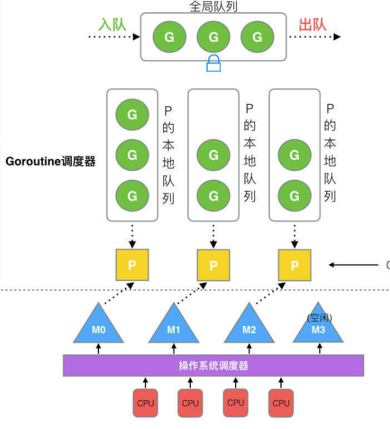
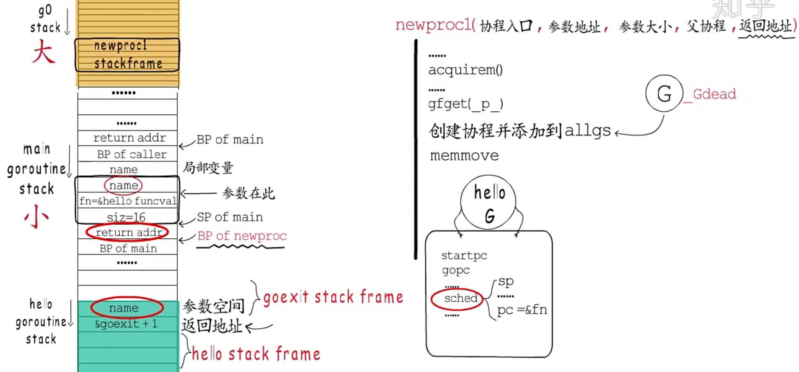
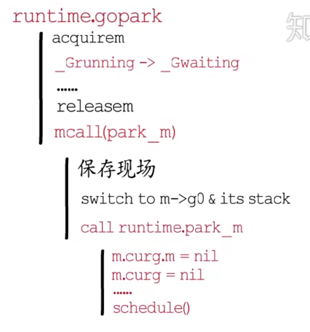
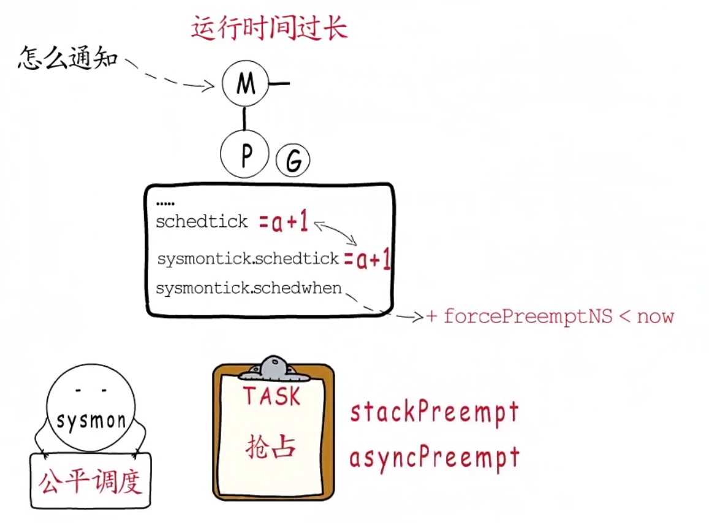
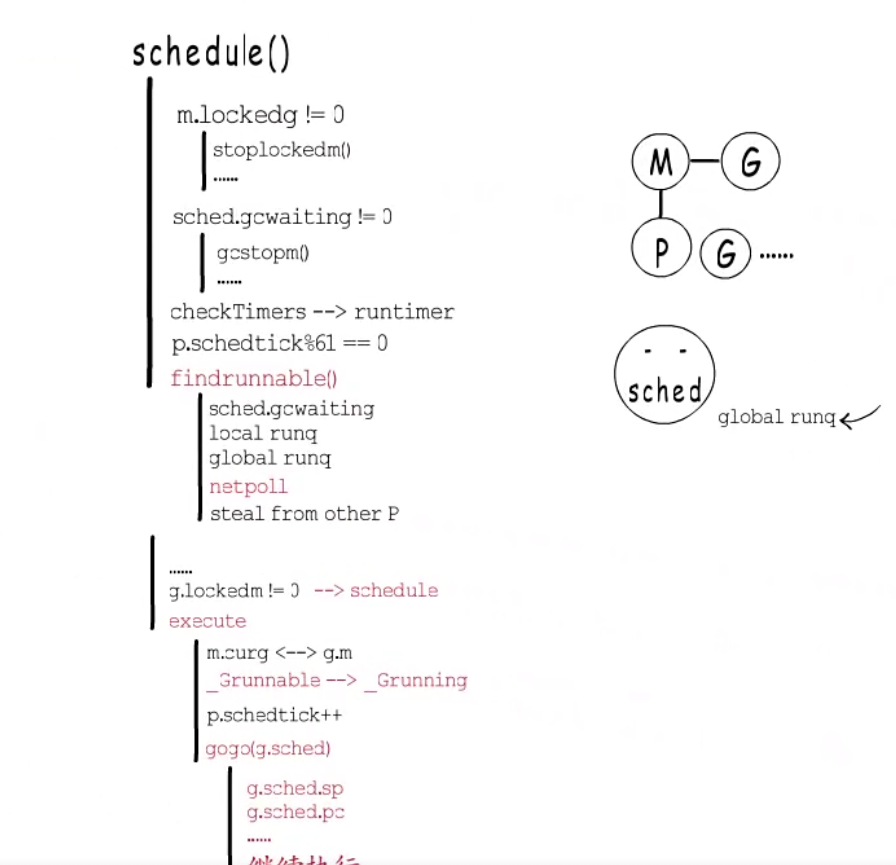
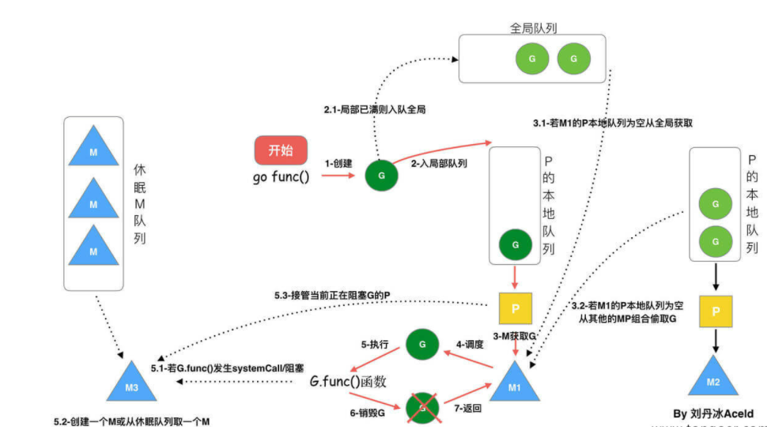

## go 协程goroutine
* 协程是用户级的线程，有用户自己调度，使用协程使得程序调度更加灵活。同时比线程更轻量，占用的栈内存更少。go语言天生支持高并发，go使用协程goroutine的调度器。goroutine 的栈内存最小值为2kb(_StackMin = 2048),它不是固定不变的，可以随需求增大和缩小。goroutine 维护着很大的内存，无需频繁开辟内存，goroutine是使用M:n模型，在用户态切换协程，加上创建协程代价低，使得cpu的利用率大大提升，cup的性能大幅度的被利用。
## goroutine 调度器GPM模型
### G
* G 就是goroutine协程    
```
type g struct {
	// Stack parameters.
	// stack describes the actual stack memory: [stack.lo, stack.hi).
	// stackguard0 is the stack pointer compared in the Go stack growth prologue.
	// It is stack.lo+StackGuard normally, but can be StackPreempt to trigger a preemption.
	// stackguard1 is the stack pointer compared in the C stack growth prologue.
	// It is stack.lo+StackGuard on g0 and gsignal stacks.
	// It is ~0 on other goroutine stacks, to trigger a call to morestackc (and crash).
	// 记录该goroutine使用的栈
    stack       stack   // offset known to runtime/cgo
    
	//下面两个成员用于栈溢出检查，实现栈的自动伸缩，抢占调度也会用到stackguard0
    stackguard0 uintptr // offset known to liblink
	stackguard1 uintptr // offset known to liblink

	_panic         *_panic // innermost panic - offset known to liblink
	_defer         *_defer // innermost defer
    
    // 此goroutine正在被哪个工作线程执行
	m              *m      // current m; offset known to arm liblink
    //这个字段跟调度切换有关，G切换时用来保存上下文，保存什么，看下面gobuf结构体
	sched          gobuf
	syscallsp      uintptr        // if status==Gsyscall, syscallsp = sched.sp to use during gc
	syscallpc      uintptr        // if status==Gsyscall, syscallpc = sched.pc to use during gc
	stktopsp       uintptr        // expected sp at top of stack, to check in traceback
	param          unsafe.Pointer // passed parameter on wakeup，wakeup唤醒时传递的参数
	// 状态Gidle,Grunnable,Grunning,Gsyscall,Gwaiting,Gdead
    atomicstatus   uint32
	stackLock      uint32 // sigprof/scang lock; TODO: fold in to atomicstatus
	goid           int64
    
    //schedlink字段指向全局运行队列中的下一个g，
    //所有位于全局运行队列中的g形成一个链表
	schedlink      guintptr
	waitsince      int64      // approx time when the g become blocked
	waitreason     waitReason // if status==Gwaiting，g被阻塞的原因
    //抢占信号，stackguard0 = stackpreempt，如果需要抢占调度，设置preempt为true
	preempt        bool       // preemption signal, duplicates stackguard0 = stackpreempt
	paniconfault   bool       // panic (instead of crash) on unexpected fault address
	preemptscan    bool       // preempted g does scan for gc
	gcscandone     bool       // g has scanned stack; protected by _Gscan bit in status
	gcscanvalid    bool       // false at start of gc cycle, true if G has not run since last scan; TODO: remove?
	throwsplit     bool       // must not split stack
	raceignore     int8       // ignore race detection events
	sysblocktraced bool       // StartTrace has emitted EvGoInSyscall about this goroutine
	sysexitticks   int64      // cputicks when syscall has returned (for tracing)
	traceseq       uint64     // trace event sequencer
	tracelastp     puintptr   // last P emitted an event for this goroutine
	// 如果调用了 LockOsThread，那么这个 g 会绑定到某个 m 上
    lockedm        muintptr
	sig            uint32
	writebuf       []byte
	sigcode0       uintptr
	sigcode1       uintptr
	sigpc          uintptr
    // 创建这个goroutine的go表达式的pc
	gopc           uintptr         // pc of go statement that created this goroutine
	ancestors      *[]ancestorInfo // ancestor information goroutine(s) that created this goroutine (only used if debug.tracebackancestors)
	startpc        uintptr         // pc of goroutine function
	racectx        uintptr
	waiting        *sudog         // sudog structures this g is waiting on (that have a valid elem ptr); in lock order
	cgoCtxt        []uintptr      // cgo traceback context
	labels         unsafe.Pointer // profiler labels
	timer          *timer         // cached timer for time.Sleep,为 time.Sleep 缓存的计时器
	selectDone     uint32         // are we participating in a select and did someone win the race?

	// Per-G GC state

	// gcAssistBytes is this G's GC assist credit in terms of
	// bytes allocated. If this is positive, then the G has credit
	// to allocate gcAssistBytes bytes without assisting. If this
	// is negative, then the G must correct this by performing
	// scan work. We track this in bytes to make it fast to update
	// and check for debt in the malloc hot path. The assist ratio
	// determines how this corresponds to scan work debt.
	gcAssistBytes int64
}
```
* 保存着goroutine所有信息以及栈信息，gobuf结构体：cpu里的寄存器信息

### P processor处理器 
* 调度协程G和线程M的关联  
```
P 的结构体如下：
type p struct {
    //allp中的索引
	id          int32
    //p的状态
	status      uint32 // one of pidle/prunning/...
	link        puintptr
	schedtick   uint32     // incremented on every scheduler call->每次scheduler调用+1
	syscalltick uint32     // incremented on every system call->每次系统调用+1
	sysmontick  sysmontick // last tick observed by sysmon
    //指向绑定的 m，如果 p 是 idle 的话，那这个指针是 nil
	m           muintptr   // back-link to associated m (nil if idle)
	mcache      *mcache
	raceprocctx uintptr

    //不同大小可用defer结构池
	deferpool    [5][]*_defer // pool of available defer structs of different sizes (see panic.go)
	deferpoolbuf [5][32]*_defer

	// Cache of goroutine ids, amortizes accesses to runtime·sched.goidgen.
	goidcache    uint64
	goidcacheend uint64

    //本地运行队列，可以无锁访问
	// Queue of runnable goroutines. Accessed without lock.
	runqhead uint32  //队列头
	runqtail uint32   //队列尾
    //数组实现的循环队列
	runq     [256]guintptr
    
	// runnext, if non-nil, is a runnable G that was ready'd by
	// the current G and should be run next instead of what's in
	// runq if there's time remaining in the running G's time
	// slice. It will inherit the time left in the current time
	// slice. If a set of goroutines is locked in a
	// communicate-and-wait pattern, this schedules that set as a
	// unit and eliminates the (potentially large) scheduling
	// latency that otherwise arises from adding the ready'd
	// goroutines to the end of the run queue.
    // runnext 非空时，代表的是一个 runnable 状态的 G，
    //这个 G 被 当前 G 修改为 ready 状态，相比 runq 中的 G 有更高的优先级。
    //如果当前 G 还有剩余的可用时间，那么就应该运行这个 G
    //运行之后，该 G 会继承当前 G 的剩余时间
	runnext guintptr

	// Available G's (status == Gdead)
    //空闲的g
	gFree struct {
		gList
		n int32
	}

	sudogcache []*sudog
	sudogbuf   [128]*sudog

	tracebuf traceBufPtr

	// traceSweep indicates the sweep events should be traced.
	// This is used to defer the sweep start event until a span
	// has actually been swept.
	traceSweep bool
	// traceSwept and traceReclaimed track the number of bytes
	// swept and reclaimed by sweeping in the current sweep loop.
	traceSwept, traceReclaimed uintptr

	palloc persistentAlloc // per-P to avoid mutex

	_ uint32 // Alignment for atomic fields below

	// Per-P GC state
	gcAssistTime         int64    // Nanoseconds in assistAlloc
	gcFractionalMarkTime int64    // Nanoseconds in fractional mark worker (atomic)
	gcBgMarkWorker       guintptr // (atomic)
	gcMarkWorkerMode     gcMarkWorkerMode

	// gcMarkWorkerStartTime is the nanotime() at which this mark
	// worker started.
	gcMarkWorkerStartTime int64

	// gcw is this P's GC work buffer cache. The work buffer is
	// filled by write barriers, drained by mutator assists, and
	// disposed on certain GC state transitions.
	gcw gcWork

	// wbBuf is this P's GC write barrier buffer.
	//
	// TODO: Consider caching this in the running G.
	wbBuf wbBuf

	runSafePointFn uint32 // if 1, run sched.safePointFn at next safe point

	pad cpu.CacheLinePad
}
```
* 记录着P的信息，以及G的状态等。同时P是有着本地队列，存放着带待运行的G,本地队列不能超过256个。
* P的数量：是由环境变量 $GOMAXPROCS 或者是由 runtime 的方法 GOMAXPROCS() 决定。在程序启动式创建，并保存在数组中，最多有 GOMAXPROCS(可配置) 个

### M 是内核态线程的抽象
* 主要的工作执行协程G或者在调度G到P中
```
M的结构体如下：
type m struct {
    // 系统管理的一个g，执行调度代码时使用的。比如执行用户的goroutine时，就需要把把用户
    // 的栈信息换到内核线程的栈，以便能够执行用户goroutine
	g0      *g     // goroutine with scheduling stack
	morebuf gobuf  // gobuf arg to morestack
	divmod  uint32 // div/mod denominator for arm - known to liblink

	// Fields not known to debuggers.
	procid        uint64       // for debuggers, but offset not hard-coded
    //处理signal的 g
	gsignal       *g           // signal-handling g
	goSigStack    gsignalStack // Go-allocated signal handling stack
	sigmask       sigset       // storage for saved signal mask
    //线程的本地存储TLS，这里就是为什么OS线程能运行M关键地方
	tls           [6]uintptr   // thread-local storage (for x86 extern register)
	//go 关键字运行的函数
    mstartfn      func()
    //当前运行的用户goroutine的g结构体对象
	curg          *g       // current running goroutine
	caughtsig     guintptr // goroutine running during fatal signal
    
    //当前工作线程绑定的P，如果没有就为nil
	p             puintptr // attached p for executing go code (nil if not executing go code)
	//暂存与当前M潜在关联的P
    nextp         puintptr
    //M之前调用的P
	oldp          puintptr // the p that was attached before executing a syscall
	id            int64
	mallocing     int32
	throwing      int32
    //当前M是否关闭抢占式调度
	preemptoff    string // if != "", keep curg running on this m
	locks         int32
	dying         int32
	profilehz     int32
    //M的自旋状态，为true时M处于自旋状态，正在从其他线程偷G; 为false，休眠状态
	spinning      bool // m is out of work and is actively looking for work
	blocked       bool // m is blocked on a note
	newSigstack   bool // minit on C thread called sigaltstack
	printlock     int8
	incgo         bool   // m is executing a cgo call
	freeWait      uint32 // if == 0, safe to free g0 and delete m (atomic)
	fastrand      [2]uint32
	needextram    bool
	traceback     uint8
	ncgocall      uint64      // number of cgo calls in total
	ncgo          int32       // number of cgo calls currently in progress
	cgoCallersUse uint32      // if non-zero, cgoCallers in use temporarily
	cgoCallers    *cgoCallers // cgo traceback if crashing in cgo call
	//没有goroutine运行时，工作线程睡眠
    //通过这个来唤醒工作线程
    park          note // 休眠锁
    //记录所有工作线程的链表
	alllink       *m // on allm
	schedlink     muintptr
    //当前线程内存分配的本地缓存
	mcache        *mcache
    //当前M锁定的G，
	lockedg       guintptr
	createstack   [32]uintptr // stack that created this thread.
	lockedExt     uint32      // tracking for external LockOSThread
	lockedInt     uint32      // tracking for internal lockOSThread
	nextwaitm     muintptr    // next m waiting for lock
	waitunlockf   func(*g, unsafe.Pointer) bool
	waitlock      unsafe.Pointer
	waittraceev   byte
	waittraceskip int
	startingtrace bool
	syscalltick   uint32
    //操作系统线程id
	thread        uintptr // thread handle
	freelink      *m      // on sched.freem

	// these are here because they are too large to be on the stack
	// of low-level NOSPLIT functions.
	libcall   libcall
	libcallpc uintptr // for cpu profiler
	libcallsp uintptr
	libcallg  guintptr
	syscall   libcall // stores syscall parameters on windows

	vdsoSP uintptr // SP for traceback while in VDSO call (0 if not in call)
	vdsoPC uintptr // PC for traceback while in VDSO call

	dlogPerM

	mOS
}
```
* 记录着M的线程的信息，包括一些P,G以及信号和自旋锁等信息
* m 数量：可以通过SetMaxThreads函数，设置 M 的最大数量，默认为10000(sched.maxmcount = 10000)，和P一样在程序启动时创建。

### 全局队列（gQueue）
* P的本地队列可以存放着不超过256个待执行的G,P是有限的，当G过多时，即当P本地队列存放不下时，就需要将G存放在全局队列中。
```
全局队列结构如下：
type gQueue struct {
	head guintptr //队列头
	tail guintptr //队列尾
}
```

### G、P、M、gQueue关系
* P与M没有数量关系，当一个M处于阻塞时，P先找空闲M,没有空闲的M就创建新的M
* G优先存放在P本地队列中，当P中G满时，会将P中前一半G存放在全局中。当P空闲时时，会从全局中拿取G放在本地队列。全局没有G时，会从其P的本地队列中拿取一半到本地队列。  
* 关系如图所示：  


## 创建goroutine
### newproc()函数
* goroutine 是由函数newproc函数进行创建的，newproc源码如下  
```
// 参数：协程函数的参数占的字节数和协程入口函数的funcval指针
func newproc(siz int32, fn *funcval) {
    // 获得协程参数的地址= fn函数地址+偏移值
	argp := add(unsafe.Pointer(&fn), sys.PtrSize)
	gp := getg() // 获得当前G的指针
    //调用者的pc，也就是执行完此函数返回调用者时的下一条指令地址
	pc := getcallerpc() 
    // 切换到（系统栈）g0栈中
	systemstack(func() {
    //执行调用newproc1()函数执行创建协程
		newg := newproc1(fn, argp, siz, gp, pc)
		_p_ := getg().m.p.ptr()
        // 把当前的G存放在runq队列中
		runqput(_p_, newg, true) 
        // 如果当前由空闲的P,没有睡眠的M,主协程开始运行时
		if mainStarted {
			wakep() // 创建m,并设置为活跃状态
		}
	})
}
```
* 在newproc函数中为什么要切换在g0栈中执行呢？是因为newproc1()函数不支持栈增长，协程的栈空间小(几KB)，为了防止运行协程函数时栈溢出，需要在g0的栈上运行，g0是分配在线程的栈空间(4MB)上。g0的栈空间很大，运行协程函数时栈不溢出。
### newproc1()函数
* newproc1()是创建协程 源码如下：  
```
参数：协程入口、参数首地址、参数大小、父协程指针、返回地址
func newproc1(fn *funcval, argp unsafe.Pointer, narg int32, callergp *g, callerpc uintptr) *g {
	_g_ := getg()  // 获得当前的G

	if fn == nil {
		_g_.m.throwing = -1 // do not dump full stacks
		throw("go of nil func value")
	}
     // 为了保证数据一致性会禁止当前m被抢占
	acquirem() // disable preemption because it can be holding p in a local var
	siz := narg
	siz = (siz + 7) &^ 7

	// We could allocate a larger initial stack if necessary.
	// Not worth it: this is almost always an error.
	// 4*sizeof(uintreg): extra space added below
	// sizeof(uintreg): caller's LR (arm) or return address (x86, in gostartcall).
	if siz >= _StackMin-4*sys.RegSize-sys.RegSize {
		throw("newproc: function arguments too large for new goroutine")
	}

	_p_ := _g_.m.p.ptr()
    // 尝试获取一个空闲的G,如果没有空闲的G,就会创建新的G,分配栈空间,并添加到全局allgs中
	newg := gfget(_p_)
    // 如果没有空闲的G
	if newg == nil {
    // 就会创建新的G,分配栈空间大小为最小的2KB
		newg = malg(_StackMin)
        // 设置状态为等待
		casgstatus(newg, _Gidle, _Gdead)
        //并添加到全局allgs中
		allgadd(newg) // publishes with a g->status of Gdead so GC scanner doesn't look at uninitialized stack.
	}
	if newg.stack.hi == 0 {
		throw("newproc1: newg missing stack")
	}

	if readgstatus(newg) != _Gdead {
		throw("newproc1: new g is not Gdead")
	}

	totalSize := 4*sys.RegSize + uintptr(siz) + sys.MinFrameSize // extra space in case of reads slightly beyond frame
	totalSize += -totalSize & (sys.SpAlign - 1)                  // align to spAlign
	sp := newg.stack.hi - totalSize
	spArg := sp
	if usesLR {
		// caller's LR
		*(*uintptr)(unsafe.Pointer(sp)) = 0
		prepGoExitFrame(sp)
		spArg += sys.MinFrameSize
	}
	if narg > 0 {
        // 如果协程入口函数由参数，会将参数移动在协程栈中 
		memmove(unsafe.Pointer(spArg), argp, uintptr(narg))
		// This is a stack-to-stack copy. If write barriers
		// are enabled and the source stack is grey (the
		// destination is always black), then perform a
		// barrier copy. We do this *after* the memmove
		// because the destination stack may have garbage on
		// it.
		if writeBarrier.needed && !_g_.m.curg.gcscandone {
			f := findfunc(fn.fn)
			stkmap := (*stackmap)(funcdata(f, _FUNCDATA_ArgsPointerMaps))
			if stkmap.nbit > 0 {
				// We're in the prologue, so it's always stack map index 0.
				bv := stackmapdata(stkmap, 0)
				bulkBarrierBitmap(spArg, spArg, uintptr(bv.n)*sys.PtrSize, 0, bv.bytedata)
			}
		}
	}
    // 初始化newg.sched调度相关的信息
	memclrNoHeapPointers(unsafe.Pointer(&newg.sched), unsafe.Sizeof(newg.sched))
	newg.sched.sp = sp //设置为协程栈指针
	newg.stktopsp = sp
    // 设置为指向协程入口函数的入口，当协程调度执行时，运行协程函数
	newg.sched.pc = funcPC(goexit) + sys.PCQuantum // +PCQuantum so that previous instruction is in same function
	newg.sched.g = guintptr(unsafe.Pointer(newg))
	gostartcallfn(&newg.sched, fn)
    // 设置为父协程调用newproc函数结束后的返回地址
	newg.gopc = callerpc
	newg.ancestors = saveAncestors(callergp)
    // 设置startpc为协程入孔函数的起始地址
	newg.startpc = fn.fn 
	if _g_.m.curg != nil {
		newg.labels = _g_.m.curg.labels
	}
	if isSystemGoroutine(newg, false) {
		atomic.Xadd(&sched.ngsys, +1)
	}
    // 设置协程为运行状态
	casgstatus(newg, _Gdead, _Grunnable)

	if _p_.goidcache == _p_.goidcacheend {
		// Sched.goidgen is the last allocated id,
		// this batch must be [sched.goidgen+1, sched.goidgen+GoidCacheBatch].
		// At startup sched.goidgen=0, so main goroutine receives goid=1.
		_p_.goidcache = atomic.Xadd64(&sched.goidgen, _GoidCacheBatch)
		_p_.goidcache -= _GoidCacheBatch - 1
		_p_.goidcacheend = _p_.goidcache + _GoidCacheBatch
	}
    // 给协程赋予一个唯一的goid
	newg.goid = int64(_p_.goidcache)
	_p_.goidcache++
	if raceenabled {
		newg.racectx = racegostart(callerpc)
	}
	if trace.enabled {
		traceGoCreate(newg, newg.startpc)
	}
    // 允许当前m被抢占
	releasem(_g_.m)

	return newg
}
```   
图示如下   

* 总结goroutine创建过程  
1. 为了保证数据一致性会禁止当前m被抢占
2. 尝试获取一个空闲的G,如果没有空闲的G,就会创建新的G,分配栈空间,状态为等待并添加到全局allgs中
3. 如果协程入口函数由参数，会将参数移动在协程栈中  
4. 初始化newg.sched调度相关的信息，设置状态运行
5. 得到唯一的goid, 并添加到runq队列中
6. 如果当前有空闲的P,没有睡眠的M,并且主协程开始运行时，就会创建新的活跃的M
7. 当g运行结束后，设置允许当前m被抢占

## goroutine的让出与恢复、调度、抢占、监控
### goroutine 让出与恢复
* 协程的让出是由函数gopark()执行的
```
源码如下：
func gopark(unlockf func(*g, unsafe.Pointer) bool, lock unsafe.Pointer, reason waitReason, traceEv byte, traceskip int) {
	if reason != waitReasonSleep {
		checkTimeouts() // timeouts may expire while two goroutines keep the scheduler busy
	}
    // 禁止当前m被抢占
	mp := acquirem()
	gp := mp.curg
	status := readgstatus(gp)
    // 判断协程的是否在运行状态
	if status != _Grunning && status != _Gscanrunning {
		throw("gopark: bad g status")
	}
	mp.waitlock = lock
	mp.waitunlockf = unlockf
	gp.waitreason = reason
	mp.waittraceev = traceEv
	mp.waittraceskip = traceskip
    // 解除对m的抢占
	releasem(mp)
	// can't do anything that might move the G between Ms here.
    // 不能做任何可能在 Ms 之间移动 G 的事情。
    // 保存协程，切换在go
	mcall(park_m)
}
func park_m(gp *g) {
	_g_ := getg()

	if trace.enabled {
		traceGoPark(_g_.m.waittraceev, _g_.m.waittraceskip)
	}
    //更改协程由运行状态到等待状态
	casgstatus(gp, _Grunning, _Gwaiting)
	dropg()
    """
    func dropg() {
    	_g_ := getg()
        // 把m当前执行的置为nil(m不在运行这个当前写协程，协程就挂起了)
    	setMNoWB(&_g_.m.curg.m, nil)
    	setGNoWB(&_g_.m.curg, nil)
    }
    """

	if fn := _g_.m.waitunlockf; fn != nil {
		ok := fn(gp, _g_.m.waitlock)
		_g_.m.waitunlockf = nil
		_g_.m.waitlock = nil
		if !ok {
			if trace.enabled {
				traceGoUnpark(gp, 2)
			}
			casgstatus(gp, _Gwaiting, _Grunnable)
			execute(gp, true) // Schedule it back, never returns.
		}
	}
	schedule() // 寻找下一个G
}
//在G中由定时调用回调函数f 
type timer struct {
	// If this timer is on a heap, which P's heap it is on.
	// puintptr rather than *p to match uintptr in the versions
	// of this struct defined in other packages.
	pp puintptr

	// Timer wakes up at when, and then at when+period, ... (period > 0 only)
	// each time calling f(arg, now) in the timer goroutine, so f must be
	// a well-behaved function and not block.
	//
	// when must be positive on an active timer.
	when   int64
	period int64
	f      func(interface{}, uintptr)
	arg    interface{}
	seq    uintptr

	// What to set the when field to in timerModifiedXX status.
	nextwhen int64

	// The status field holds one of the values below.
	status uint32
}
// Mark gp ready to run.
// 将等待协程状态置为运行的状态
func ready(gp *g, traceskip int, next bool) {
	if trace.enabled {
		traceGoUnpark(gp, traceskip)
	}

	status := readgstatus(gp)

	// Mark runnable.
	_g_ := getg()
    //// 禁止当前m被抢占
	mp := acquirem() // disable preemption because it can be holding p in a local var
	if status&^_Gscan != _Gwaiting {
		dumpgstatus(gp)
		throw("bad g->status in ready")
	}

	// status is Gwaiting or Gscanwaiting, make Grunnable and put on runq
	casgstatus(gp, _Gwaiting, _Grunnable) // 把协程等待的转态置为可运行状态
	runqput(_g_.m.p.ptr(), gp, next)  // 添加在运行队列中
	wakep()// 如果没有可执行的M,就创建新的m
	releasem(mp)  // 释放当前的m
}
```  
如图所示  
* 总结
1.  gopark()是让出函数，禁止当前m被抢占，判断当前的协程状态是否为运行状态。
2. dropg()让当前的m不在执行当前的G,修改当前g的状态为等待(协程挂起)，调用schedule() 寻找下一个可执行G
3. timers 等待的g中数据结构，定时调用回调函数f，将g置为了运行状态
3. ready()函数是将唤醒等待G,将G的状态更改为可运行状态，并添加在运行的队列中m，如果没有可执行的M,就创建新的m
### goroutine 监控
* 使用checkTimers()检查到时间运行的唤醒g
```
源码如下
checkTimers(pp *p, now int64) (rnow, pollUntil int64, ran bool) {
  	// If it's not yet time for the first timer, or the first adjusted
  	// timer, then there is nothing to do.
  	next := int64(atomic.Load64(&pp.timer0When))
  	nextAdj := int64(atomic.Load64(&pp.timerModifiedEarliest))
  	if next == 0 || (nextAdj != 0 && nextAdj < next) {
  		next = nextAdj
  	}
  
  	if next == 0 {
  		// No timers to run or adjust.
  		return now, 0, false
  	}
  
  	if now == 0 {
  		now = nanotime()
  	}
  	if now < next {
  		// Next timer is not ready to run, but keep going
  		// if we would clear deleted timers.
  		// This corresponds to the condition below where
  		// we decide whether to call clearDeletedTimers.
  		if pp != getg().m.p.ptr() || int(atomic.Load(&pp.deletedTimers)) <= int(atomic.Load(&pp.numTimers)/4) {
  			return now, next, false
  		}
  	}
  
  	lock(&pp.timersLock)
  
  	if len(pp.timers) > 0 {
  		adjusttimers(pp, now)
  		for len(pp.timers) > 0 {
  			// Note that runtimer may temporarily unlock
  			// pp.timersLock.
  			if tw := runtimer(pp, now); tw != 0 {
  				if tw > 0 {
  					pollUntil = tw
  				}
  				break
  			}
  			ran = true
  		}
  	}
  
  	// If this is the local P, and there are a lot of deleted timers,
  	// clear them out. We only do this for the local P to reduce
  	// lock contention on timersLock.
  	if pp == getg().m.p.ptr() && int(atomic.Load(&pp.deletedTimers)) > len(pp.timers)/4 {
  		clearDeletedTimers(pp)
  	}
  
  	unlock(&pp.timersLock)
  
  	return now, pollUntil, ran
  }
```
* 协程的监控是由专门的监控协程程来运行，监控协程是由主协程创建而来
，监控协程与gpm中的协程不一样，它不是由gpm进行调度，当然了也不需要P,
监控timer，并按需调整g的休眠时间，如果没有可执行的M,就创建新的m执行被唤醒的G,
确保被唤醒g被执行。
如图  

### goroutine 抢占
* 对运行过长的g进行抢占，即当g运行时间超过运行阈值的g强制让出m
运行时间是由P的结构syscalltick、schedtick、timer0When等记录。
* 通过栈增长时：当stackguard = stackPreempt,不执行栈增长，而是执行协程调度,
这样就让协程让出栈。
* 这种抢占依赖栈增长，有缺陷。所以有asyncPreempt通过信号方式进行异步抢占  
如图所示  

### goroutine 调度
* 调用schedule()函数进行协程的调度
```
源码如下：
func schedule() {
	_g_ := getg() // 获得当前的G

	if _g_.m.locks != 0 {
		throw("schedule: holding locks")
	}
    // 判断当前的M和当前的G是否绑定
	if _g_.m.lockedg != 0 {
        // 如果当前的M绑定G,就阻塞m(休眠M)
		stoplockedm()
		execute(_g_.m.lockedg.ptr(), false) // Never returns.
	}

	// We should not schedule away from a g that is executing a cgo call,
	// since the cgo call is using the m's g0 stack.
	if _g_.m.incgo {
		throw("schedule: in cgo")
	}

top:
	pp := _g_.m.p.ptr()
	pp.preempt = false
    // 判断Gc是否在等待执行
	if sched.gcwaiting != 0 {
        //是在等待执行，先执行gc，执行完在执行后续操作
		gcstopm() 
		goto top
	}
	if pp.runSafePointFn != 0 {
		runSafePointFn()
	}

	// Sanity check: if we are spinning, the run queue should be empty.
	// Check this before calling checkTimers, as that might call
	// goready to put a ready goroutine on the local run queue.
	if _g_.m.spinning && (pp.runnext != 0 || pp.runqhead != pp.runqtail) {
		throw("schedule: spinning with local work")
	}
    //检查是否有要被执行的Timer
	checkTimers(pp, 0)

	var gp *g
	var inheritTime bool

	// Normal goroutines will check for need to wakeP in ready,
	// but GCworkers and tracereaders will not, so the check must
	// be done here instead.
    // 普通的 goroutine 会检查是否需要在准备好时唤醒， 
    // 但 GCworkers 和跟踪读取器不会，所以检查必须 
    // 在这里完成。
	tryWakeP := false
	if trace.enabled || trace.shutdown {
		gp = traceReader()
		if gp != nil {
			casgstatus(gp, _Gwaiting, _Grunnable)
			traceGoUnpark(gp, 0)
			tryWakeP = true
		}
	}
	if gp == nil && gcBlackenEnabled != 0 {
		gp = gcController.findRunnableGCWorker(_g_.m.p.ptr())
		tryWakeP = tryWakeP || gp != nil
	}
	if gp == nil {
		// Check the global runnable queue once in a while to ensure fairness.
		// Otherwise two goroutines can completely occupy the local runqueue
		// by constantly respawning each other.
        / 每隔一段时间检查一下全局可运行队列以确保公平。 
        // 否则两个 goroutine 可以完全占用本地运行队列
        // 通过不断相互重生。
        // 有%61的概率把G从全局运行队列中搬移到本地可运行队列，保障本地可运行队列
            有G运行，全局队列也能放在本都队列中
		if _g_.m.p.ptr().schedtick%61 == 0 && sched.runqsize > 0 {
			lock(&sched.lock)
			gp = globrunqget(_g_.m.p.ptr(), 1)
			unlock(&sched.lock)
		}
	}
	if gp == nil {
        // 没有待运行的G 就现在本地可运行队列查找
		gp, inheritTime = runqget(_g_.m.p.ptr())
		// We can see gp != nil here even if the M is spinning,
		// if checkTimers added a local goroutine via goready.
	}
	if gp == nil {
        // 本地队列没有，就调用findrunnable()，直到有待执行的g才返回(先在本地
            运行队列，全局队列、等待的io, 其他的P)
		gp, inheritTime = findrunnable() // blocks until work is available
	}

	// This thread is going to run a goroutine and is not spinning anymore,
	// so if it was marked as spinning we need to reset it now and potentially
	// start a new spinning M.
	if _g_.m.spinning {
		resetspinning()
	}

	if sched.disable.user && !schedEnabled(gp) {
		// Scheduling of this goroutine is disabled. Put it on
		// the list of pending runnable goroutines for when we
		// re-enable user scheduling and look again.
		lock(&sched.lock)
		if schedEnabled(gp) {
			// Something re-enabled scheduling while we
			// were acquiring the lock.
			unlock(&sched.lock)
		} else {
			sched.disable.runnable.pushBack(gp)
			sched.disable.n++
			unlock(&sched.lock)
			goto top
		}
	}

	// If about to schedule a not-normal goroutine (a GCworker or tracereader),
	// wake a P if there is one.
	if tryWakeP {
		wakep()
	}
    // 判断获得的G有没有绑定的M,有就阻塞g, 再次进行调度
	if gp.lockedm != 0 {
		// Hands off own p to the locked m,
		// then blocks waiting for a new p.
		startlockedm(gp)
		goto top
	}
    // 使用execute函数让m执行g
	execute(gp, inheritTime)
}
```  
如图所示  
* 总结
1. 判断当前的M和当前的G是否绑定，如果当前的M绑定G,就阻塞m(休眠M)
2. 判断Gc是否在等待执行，是在等待执行，先执行gc，执行完在执行后续操作
3. 检查是否有要被执行的Timer
4. 普通的 goroutine 会检查是否需要在准备好时唤醒，但 GCworkers 和跟踪读取器不会，所以检查必须 
5. 有%61的概率把G从全局运行队列中搬移到本地可运行队列，保障本地可运行队列有G运行，全局队列也能放在本都队列中
6. 没有待运行的G就现在本地可运行队列查找，本地队列没有，就调用findrunnable()，直到有待执行的g才返回(先在本地
 运行队列，全局队列、等待的io, 其他的P中分配G)  
7. 判断获得的G有没有绑定的M,有就阻塞g, 再次进行调度
8. 使用execute函数让m执行g,待运行g绑定m,调用gogo(&gp.sched)协程的现场恢复等
## 调度器的设计策略
* 减少线程的创建与销毁cup的开销，GPM是线程的复用。即当没有 可运行的G时，将M休眠,P空闲。当有可执行G是找空闲的P，在将M唤醒，执行G，直到 main.main 退出，runtime.main 执行 Defer 和 Panic 处理，或调用 runtime.exit 退出程序
* work stealing 机制：当本线程无可运行的 G 时，尝试从其他线程绑定的 P 偷取 G，而不是销毁线程。
* hand off 机制：  
 1.当本线程因为 G 进行系统调用阻塞时，线程释放绑定的 P，把 P 转移给其他空闲的线程执行。  
 2.利用并行：GOMAXPROCS 设置 P 的数量，最多有 GOMAXPROCS 个线程分布在多个 CPU 上同时运行。GOMAXPROCS 也限制了并发的程度，比如 GOMAXPROCS = 核数/2，则最多利用了一半的 CPU 核进行并行。    
 3.抢占：在 coroutine 中要等待一个协程主动让出 CPU 才执行下一个协程，在 Go 中，一个 goroutine 最多占用 CPU 10ms，防止其他 goroutine 被饿死，这就是 goroutine 不同于 coroutine 的一个地方。  
  4.全局 G 队列：在新的调度器中依然有全局 G 队列，但功能已经被弱化了，当 M 执行 work stealing 从其他 P 偷不到 G 时，它可以从全局 G 队列获取 G。 
* 调度如图所示   

 
## 参考文献
1、[https://www.jianshu.com/p/fa696563c38a](https://www.jianshu.com/p/fa696563c38a)
2.[https://www.zhihu.com/people/kylin-lab](https://www.zhihu.com/people/kylin-lab)