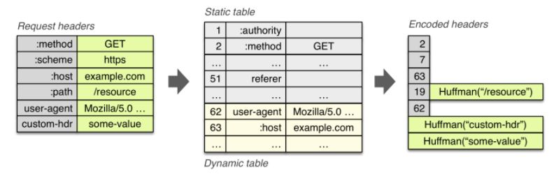
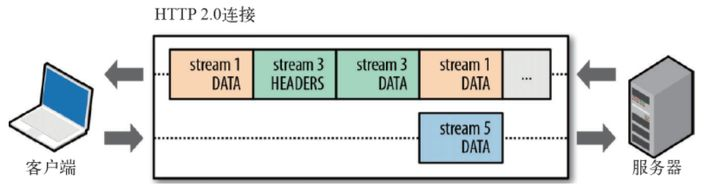
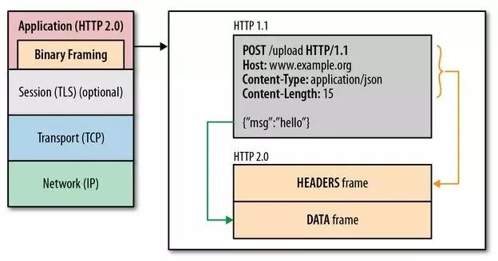
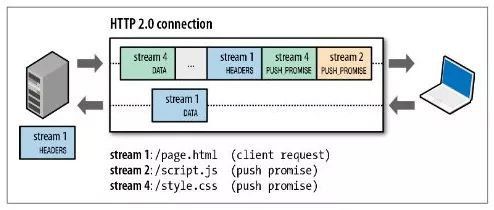

##  HTTP
* HTTP是(Hyper Text Transfer Protocol)超文本传输协议, 基于tcp的应用层传输协议（请求-响应）协议
* 影响HTTP网络请求的主要因素带宽和延迟
### 延迟的种类: 
1. 浏览器阻塞(超过浏览器连接数限制的后续请求都会被阻塞)  
2. DNS查询 (将域名解析造成的延迟，可以通过缓存DNS进行解决)  
3. 建立链接 (因HTTP是基于TCP的应用层协议，在建立连接时需要进行)
## HTTP1.0 
### http1.0存在的问题：  
1. 短连接：规定客户端与服务器只保持短暂连接，客户端每次请求都需要建立连接，服务器完成请求后
断开连接，服务器不跟踪客户端，不保存客户端的请求记录。
2. 没有host头域：每台服务器都绑定一个唯一的IP地址，请求消息中的URL并没有传递主机名（hostname）
3. 不允许短点续传
## HTTP1.1
### 根据http1.0暴露的问题，http1.1增加优化方案
1. 缓存处理：http1.1增加更多的缓存控制策略
2. 带宽优化及网络连接的使用：http1.1中请求头引入了range头域和支持断点续传的功能
3. Host头处理：http1.1的请求消息和相应消息虚拟主机技术的发展，在一台物理服务器上可以存在多个虚拟主机(Multi-homed Web Servers),并且它们共享一个IP地址,HTTP1.1的请求消息和响应消息都应支持Host头域，且请求消息中如果没有Host头域会报告一个错误（400 Bad Request）
4. 长连接： 支持长连接和流水线处理，默认开始是长连接：keep-alive

### http1.1 也带来新的问题：HTTP 队头阻塞(head of line blocking)
* 因http1.1支持了长连接和使用了管道机制，客户端与服务器建立一次连接，客户端不用等待服务器响应就能发送下一个请求，支持了并行发送多个请求，
 但服务器必须按照请求的顺序来相应请求，也就是通过串行响应请求，这就造成了HTTP的队头阻塞。
### 解决Http 队头阻塞方法
1. 并发连接：一个域名允许分配多个长连接，增加处理请求任务
2. 域名分片：将一个域名分解为多个域名，在进行并发连接
## HTTP2.0
* HTTP2.0主要是基于SPDY协议。实现了低延时高吞吐量
### SPDY协议
* 是基于TCP协议的应用层协议，其目标是通过头部压缩、多路复用、优先级等作用缩短网页放入加载时间和
优化http的性能，其核心是尽量减少TCP连接数
### HTTP 2.0的特性
### 头部压缩
头部存在大量的信息，而且每次在发送都会降低http的性能，在用HPACK算法对头部进行压缩：
1.在客户端和服务器维持一个头部表来跟踪和存储客户端发来的键值对
2.客户端在请求的时候便只需要发送在表里的索引位置即可
3.HPACK 不仅仅通过索引键值对来降低数据量，同时还会将字符串进行霍夫曼编码来压缩字符串大小

### 多路复用
* 基于二进制分帧，在共享的Tcp连接的基础上同时发送请求和响应。http的消息被分解成独立的帧层，交错发出
通过流标识符和首部将他们重新组装起来，避免了队头阻塞和提高了传输的性能

#### 二进制分帧
1.  经http报文格式转换成二进制格式，全部的io串。将原来的header的报文分成二进制帧沉在的头部字段，
body被拆分成二进制帧存放在请求体数据段。服务器接收的不是http报文，而是二进制帧。
2. 帧(frame)包含部分：类型Type, 长度Length, 标记Flags, 流标识Stream和frame payload有效载荷。
3. 消息(message)：一个完整的请求或者响应，比如请求、响应等，由一个或多个 Frame 组成。
4. 流是连接中的一个虚拟信道，可以承载双向消息传输。每个流有唯一整数标识符。为了防止两端流ID冲突，客户端发起的流具有奇数ID，服务器端发起的流具有偶数ID。
5. 流标识是描述二进制frame的格式，使得每个frame能够基于http2发送，与流标识联系的是一个流，每个流是一个逻辑联系，一个独立的双向的frame存在于客户端和服务器端之间的http2连接中。一个http2连接上可包含多个并发打开的流，这个并发流的数量能够由客户端设置。

#### 二进制分帧的特性
1. 并发性：同时可发多个帧
2. 自增性：流的id不可重用，按顺序递增，到阈值后置零
3. 双向性：客户端与服务端都可到流，互不干扰，都可收发
4. 可设优先级：设置帧的优先级，服务器优先处理
### 服务器推送
1. 服务器不在是完全被动的接收和响应请求，也能创建新的资源(流)发送给客户端。
2. 服务器可以对一个客户端请求发送多个响应，服务器向客户端推送资源无需客户端明确地请求。
并且，服务端推送能把客户端所需要的资源伴随着index.html一起发送到客户端，省去了客户端重复请求的步骤。
3. 当服务端需要主动推送某个资源时，便会发送一个 Frame Type 为 PUSH_PROMISE 的 Frame，里面带了 PUSH 需要新建的 Stream ID。
意思是告诉客户端：接下来我要用这个 ID 向你发送东西，客户端准备好接着。客户端解析 Frame 时，发现它是一个 PUSH_PROMISE 类型，
便会准备接收服务端要推送的流。

### 请求优先级
1. 通过设置帧的优先级，优化帧的传输顺序
2. 把http消息分为很多独立帧之后，就可以通过优化这些帧的交错和传输顺序进一步优化性能。每个流都可以带有一个31比特的优先值：0 表示最高优先级；2的31次方-1 表示最低优先级。
3. 服务器可以根据流的优先级，控制资源分配（CPU、内存、带宽），而在响应数据准备好之后，优先将最高优先级的帧发送给客户端。高优先级的流都应该优先发送，但又不会绝对的。绝对地准守，可能又会引入首队阻塞的问题：高优先级的请求慢导致阻塞其他资源交付。
4.分配处理资源和客户端与服务器间的带宽，不同优先级的混合也是必须的。客户端会指定哪个流是最重要的，有一些依赖参数，这样一个流可以依赖另外一个流。优先级别可以在运行时动态改变，当用户滚动页面时，可以告诉浏览器哪个图像是最重要的，你也可以在一组流中进行优先筛选，能够突然抓住重点流。
#### 优先级等级：
1. 优先级最高：主要的html
2. 优先级高：CSS文件
3. 优先级中：js文件
4. 优先级低：图片
## 参考文献：

