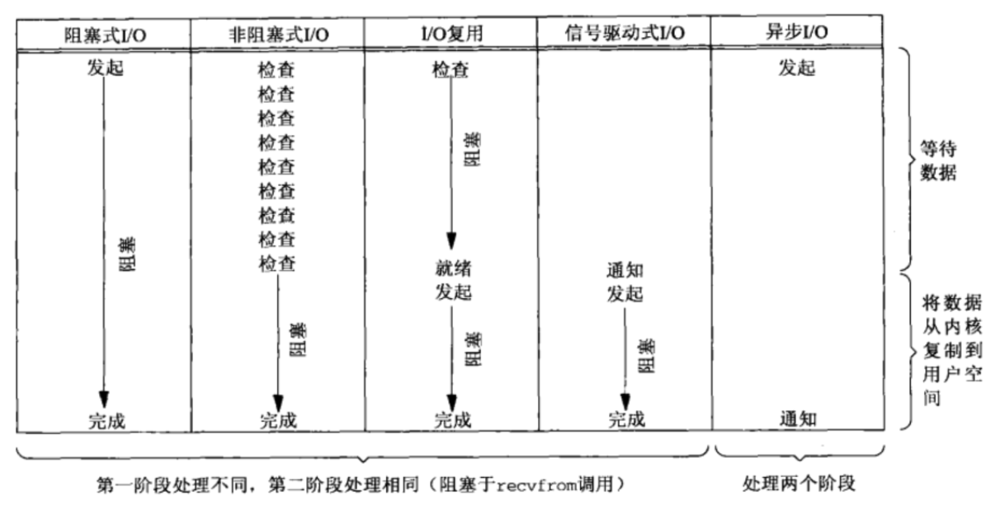
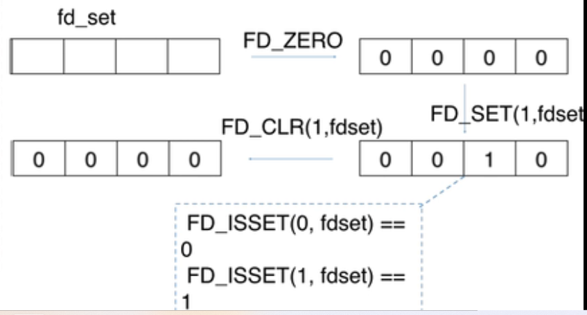
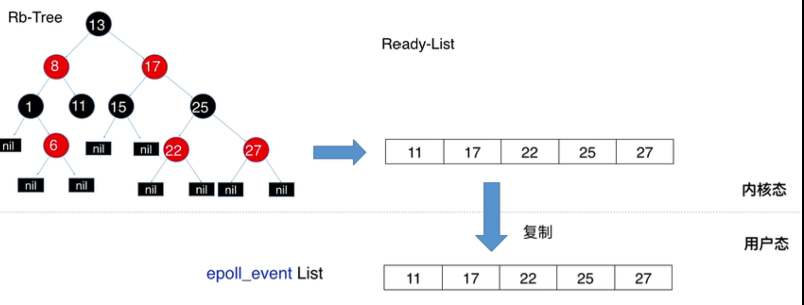
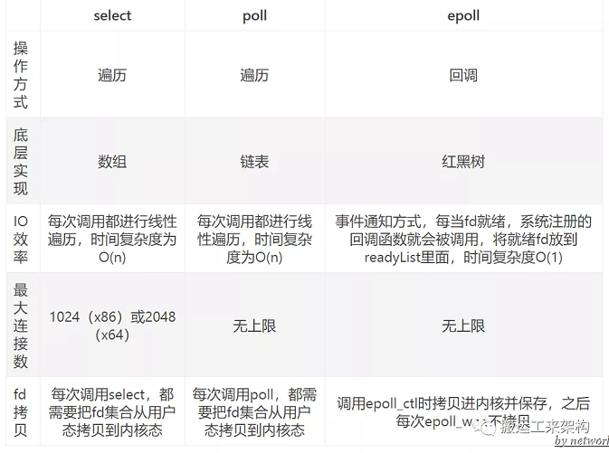

## 常见的IO类型
### 同步阻塞IO
* 用户线程通过调用系统命令发起io操作，由用户态复制到内核态空间，内核态一直在等待，
直到获取到数据时，将接收到的数据拷贝到用户态空间，用户线程在获取数据。整个过程用户线程
处于阻塞的状态，直到有数据为止。
### 同步非阻塞IO
* 在同步阻塞io的基础上，用户线程发起io操作后，就立刻返回。由于是非阻塞的方式，就存在返回时
没有数据，就需要不断的轮询发起io请求，直到接收到数据为止。
### IO多路复用
* io多路复用是一种同步的io模型。实现在内核态中一个线程监视多个io(文件句柄)，一旦某个io就绪后，
就通知用户线程进行相关的操作。没有io就绪时就阻塞用户线程，将交出cpu。多路是指网络连接，复用是指
用一个线程。
### 信号驱动IO
* 用户线程发起一个io操作后，会向内核注册一个信号处理函数，然后返回，当内核中有数据时，就会发送一个
信号给用户线程，用户态的线程在调用io请求，获取到数据。
### 异步IO
* 用户线程发起io操作后就返回。由内核态的线程处理，当内核线程获取到数据后，主动将数据拷贝到用户态，
并告知用户线程io操作也完成。

## io多路复用的三种实现方式
### select
* select是采用数组的存储的结构存储io(fd文件句柄)，默认的最大的fd为32位系统1024，64位系统是2048(可设置),用户线程将fd集合拷贝到
内核态并开始监控，当有fd就绪或者过了设置超时时间，就将fd集合中所有未就绪的fd清空(将bitmap置为0)，将就id集合返回到用户态，
用户态的线程通过轮询返回的fd集合找到就绪的fd,进行相关的io操作获取数据。再一次监控时，需要将之前清空的fd
添加到fd集合中进行新一轮的监控。
``` 
#include <sys/select.h>
#include <sys/time.h>

#define FD_SETSIZE 1024
#define NFDBITS (8 * sizeof(unsigned long))
#define __FDSET_LONGS (FD_SETSIZE/NFDBITS)

// 数据结构 (bitmap)
typedef struct {
    unsigned long fds_bits[__FDSET_LONGS];
} fd_set;

// API
int select(
    int max_fd,               // 最大的文件文件描述符fd 
    fd_set *readset,          // 读文件描述符集合
    fd_set *writeset,         // 写文件描述符集合
    fd_set *exceptset,        // 异常的文件描述符集合
    struct timeval *timeout   // 超时时间
)                              // 返回值就绪描述符的数目
FD_ZERO(int fd, fd_set* fds)   // 清空集合
FD_SET(int fd, fd_set* fds)    // 将给定的描述符加入集合
FD_ISSET(int fd, fd_set* fds)  // 判断指定描述符是否在集合中 
FD_CLR(int fd, fd_set* fds)    // 将给定的描述符从文件中删除 
//select使用示例
int main() {
  /*
   * 这里进行一些初始化的设置，
   * 包括socket建立，地址的设置等,
   */

  fd_set read_fs, write_fs;
  struct timeval timeout;
  int max = 0;  // 用于记录最大的fd，在轮询中时刻更新即可

  // 初始化比特位
  FD_ZERO(&read_fs);
  FD_ZERO(&write_fs);

  int nfds = 0; // 记录就绪的事件，可以减少遍历的次数
  while (1) {
    // 阻塞获取
    // 每次需要把fd从用户态拷贝到内核态
    nfds = select(max + 1, &read_fd, &write_fd, NULL, &timeout);
    // 每次需要遍历所有fd，判断有无读写事件发生
    for (int i = 0; i <= max && nfds; ++i) {
      if (i == listenfd) {
         --nfds;
         // 这里处理accept事件
         FD_SET(i, &read_fd);//将客户端socket加入到集合中
      }
      if (FD_ISSET(i, &read_fd)) {
        --nfds;
        // 这里处理read事件
      }
      if (FD_ISSET(i, &write_fd)) {
         --nfds;
        // 这里处理write事件
      }
    }
  }
 

```

#### select存在的问题
1. 监控的文件描述符集合是有上线的，即存储的fd有最大值，默认的最大的fd为32位系统1024，64位系统2048(可设置)
2. 每一次都是需要将文件描述符集合从用户态拷贝到内核态，且内核态是通过轮询的方式判断fd是否就绪，当文件描述符增多时
会造成整体的性能的下降。
3. 文件描述符集合返回时，会将没有就绪的fd删除(将bitmap置为0)，当继续监控时，会将删除的fd添加到集合中
4. 返回到用户态的集合，并未明确就绪的文件描述符，仍然需要轮询判断

### poll
* poll 是采用链表来存储fd,没有了最大连接数的限制。用户未每一个fd定义一个事件结构体，然后将事件结构体的链表拷贝到内核中，
内核线程进行轮询遍历进行判断fd是否就绪。当有fd就绪就将就绪事件放入revents中，然后返回，用户态遍历事件链表对事件结构体的revents
进行判断就绪的fd，进行相关的io操作获取数据。
```
#include <poll.h>
// 数据结构
struct pollfd {
    int fd;                         // 需要监视的文件描述符
    short events;                   // 需要内核监视的事件（读写）
    short revents;                  // 实际发生的事件
};
//
// API
int poll(struct pollfd fds[], nfds_t nfds, int timeout); // fd的集合， 个数，超时时间
// 
// 先宏定义长度
#define MAX_POLLFD_LEN 4096  

int main() {
  /*
   * 在这里进行一些初始化的操作，
   * 比如初始化数据和socket等。
   */

  int nfds = 0;
  pollfd fds[MAX_POLLFD_LEN];
  memset(fds, 0, sizeof(fds));
  fds[0].fd = listenfd;
  fds[0].events = POLLRDNORM;
  int max  = 0;  // 队列的实际长度，是一个随时更新的，也可以自定义其他的
  int timeout = 0;

  int current_size = max;
  while (1) {
    // 阻塞获取
    // 每次需要把fd从用户态拷贝到内核态
    nfds = poll(fds, max+1, timeout);
    if (fds[0].revents & POLLRDNORM) {
        // 这里处理accept事件
        connfd = accept(listenfd);
        //将新的描述符添加到读描述符集合中
    }
    // 每次需要遍历所有fd，判断有无读写事件发生
    for (int i = 1; i < max; ++i) {     
      if (fds[i].revents & POLLRDNORM) { 
         sockfd = fds[i].fd
         if ((n = read(sockfd, buf, MAXLINE)) <= 0) {
            // 这里处理read事件
            if (n == 0) {
                close(sockfd);
                fds[i].fd = -1;
            }
         } else {
             // 这里处理write事件     
         }
         if (--nfds <= 0) {
            break;       
         }   
      }
    }
  }

```
#### poll存在的问题
1. poll解决了select的最大连接数的问题，但是还是存在：每次调用poll都需要将fd文件描述符集合拷贝到内核态
2. 对fd是线性扫描，即还是采用了轮询遍历的方法,内核态中监控是否有就绪的fd,用户态中判断就绪的fd

### epoll
* epoll是采用红黑树存储fd,采用rdlist存储就绪的fd, 通过epoll_creat()方法来创建eventPoll结构体(红黑树+relist)。
通过epoll_ctl()方法将fd存入到红黑树中，若有就绪的fd,就调用ep_poll_callback()回调函数将就绪的fd添加到relist中。
调用event_wait()检查是否有就绪的fd,即检测relist是否为空。若不为空，将将就绪的fd的数量返回。用户态遍历relist+返回的就绪的fd
的数量即可获得数据。
```

#include <sys/epoll.h>

// 数据结构
// 每一个epoll对象都有一个独立的eventpoll结构体
// 用于存放通过epoll_ctl方法向epoll对象中添加进来的事件
// epoll_wait检查是否有事件发生时，只需要检查eventpoll对象中的rdlist双链表中是否有epitem元素即可
struct eventpoll {
    /*红黑树的根节点，这颗树中存储着所有添加到epoll中的需要监控的事件*/
    struct rb_root  rbr;
    /*双链表中则存放着将要通过epoll_wait返回给用户的满足条件的事件*/
    struct list_head rdlist;
};
// 对于每一个事件，都会建立一个epitem结构体
struct epitem{
    struct rb_node  rbn;//红黑树节点
    struct list_head    rdllink;//双向链表节点
    struct epoll_filefd  ffd;  //事件句柄信息
    struct eventpoll *ep;    //指向其所属的eventpoll对象
    struct epoll_event event; //期待发生的事件类型
}

// API
int epoll_create(int size); // 内核中间加一个 ep 对象，把所有需要监听的 socket 都放到 ep 对象中
int epoll_ctl(int epfd, int op, int fd, struct epoll_event *event); // epoll_ctl 负责把 socket 增加、删除到内核红黑树
int epoll_wait(int epfd, struct epoll_event * events, int maxevents, int timeout);// epoll_wait 负责检测可读队列，没有可读 socket 则阻塞进程
//epoll使用示例
int main(int argc, char* argv[])
{
   /*
   * 在这里进行一些初始化的操作，
   * 比如初始化数据和socket等。
   */

    // 内核中创建ep对象
    epfd=epoll_create(256);
    // 需要监听的socket放到ep中
    epoll_ctl(epfd,EPOLL_CTL_ADD,listenfd,&ev);
 
    while(1) {
      // 阻塞获取
      nfds = epoll_wait(epfd,events,20,0);
      for(i=0;i<nfds;++i) {
          if(events[i].data.fd==listenfd) {
              // 这里处理accept事件
              connfd = accept(listenfd);
              // 接收新连接写到内核对象中
              epoll_ctl(epfd,EPOLL_CTL_ADD,connfd,&ev);
          } else if (events[i].events&EPOLLIN) {
              // 这里处理read事件
              read(sockfd, BUF, MAXLINE);
              //读完后准备写
              epoll_ctl(epfd,EPOLL_CTL_MOD,sockfd,&ev);
          } else if(events[i].events&EPOLLOUT) {
              // 这里处理write事件
              write(sockfd, BUF, n);
              //写完后准备读
              epoll_ctl(epfd,EPOLL_CTL_MOD,sockfd,&ev);
          }
      }
    }
    return 0;
}
```
* 
#### epoll 优点
1. 采用了红黑树进行存储fd, 没有fd的最大连接数限制
2. 采用了事件回调的方式，即有就绪的fd时，就会将fd通过回调函数添加到relist表中，并不是采用轮询+遍历的方式
3. 利用mmap()文件映射内存加速与内核态空间的信息传递(用户态与内核态共享内存)，减少了fd集合从用户态拷贝
(用户空间和内核空间的只拷贝一次)到内核态的开销
#### epoll的触发
* 水平触发LT:只有要就绪的fd,epoll_wait()就会返回，并提醒用户态进行相关的操作。即只有缓冲区有变化就会触发
* 边缘触发ET:当文件描述符关联的缓冲区有空转为非空时，或者是缓冲区由满到不满就会触发。即只有缓冲区有空转为非空或者是由满转为非满的
情况才会触发。
### 三者总结


## 参考文献
[彻底理解 IO 多路复用实现机制](https://juejin.cn/post/6882984260672847879#heading-13)
