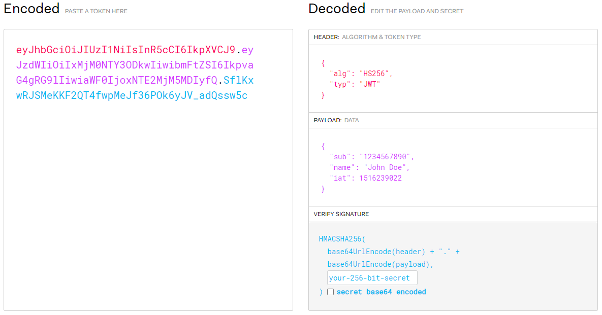

## jwt
* jwt 它定义了一种紧凑的、自包含的方式，用于作为JSON对象在各方之间安全地传输信息，是最流行的跨域认证的解决方案
## 传统跨域认证
* 客服端向服务器发送用用户名和密码，服务器验证通过后，把当前对话的session里保存
相关数据，并写在客户端的cookie, 向客户端返回一个session id。客户端再次通过cookie,
经session id 传回服务器，服务器通过session id得知访问客户端的身份。
* 存在的问题：扩展性不佳，服务器集群或者跨域的服务导向架构，就需要共享session共享数据
解决方案：1. 将session 数据保存在数据库中或者其他的持久层，服务器访问持久层的session数据    2. 服务器不保存session数据，所有的数据保存在客户端，每次请求都发回服务器

## jwt的原理
* 服务器认证以后，生成一个json对象，返回给客户端之后，客户端与服务器靠这个json对象认证，会会
加上签名来防止客户端修该json 对象
## jwt的数据结构
* jwt的数据结构为：Header(头部)、payload(负载)、signature(签名)  

### Header(头部)
* Header部分是一个json对象，描述jwt的元素据。声明类型，这里是jwt声明加密的算法 通常直接使用 HMAC SHA256，结构如下：
``` 
{
  'typ': 'JWT',
  'alg': 'HS256'
} 
``` 
###  payload(负载)
* payload 也是一个json对象，用来存放实际需要的传递的数据，iss：发行人，exp：到期时间，sub：主题，aud：用户，
nbf：在此之前不可用，iat：发布时间，jti：JWT ID用于标识该JWT
``` 
{
  "sub": "1234567890",
  "name": "John Doe",
  "admin": true
}
``` 
### signature(签名) 
* 是对前两部分进行签名，防止篡改。在服务器上指明一个密钥，在根据header中指定的算法，
按照格式产生签名，header (base64后的)、payload (base64后的)、secret。其格式如下：
``` 
// javascript
var encodedString = base64UrlEncode(header) + '.' + base64UrlEncode(payload);

var signature = HMACSHA256(encodedString, 'secret'); // TJVA95OrM7E2cBab30RMHrHDcEfxjoYZgeFONFh7HgQ
``` 
### jwt的特点
1. jwt默认不加密，但是可以对原生的Token加密或者使用https加密传输
2. jwt在不加密的情况下，不能加秘密数据写入jwt
3. jwt不仅可以使用与认证，也能用于信息的交换
4. jwt不能在使用过程中清除莫一个token和更改该token的权限，一旦签发一直到到期都是有效的，应该jwt
的有效期
### 认证
* 认证就是根据声明者所持有的识别信息，确认声明者的身份
### 授权
* 一般是指获取用户的委派的权限
### 鉴权
* 指对一个声明者所声明的身份的权限的真实性进行鉴别和确认的过程
### 权限控制
* 是指可执行和操作的组合配置的权限列表，然后根据执行者的权限，若其操作在权限范围内，则允许执行，否则禁止

## 参考文献：
[什么是 JWT -- JSON WEB TOKEN](https://www.jianshu.com/p/576dbf44b2ae)
