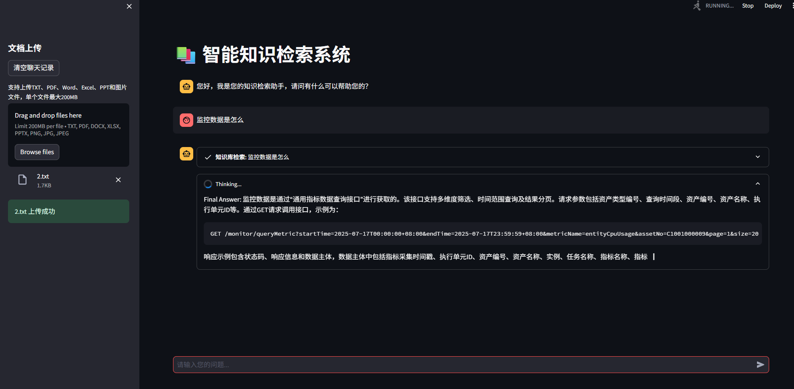
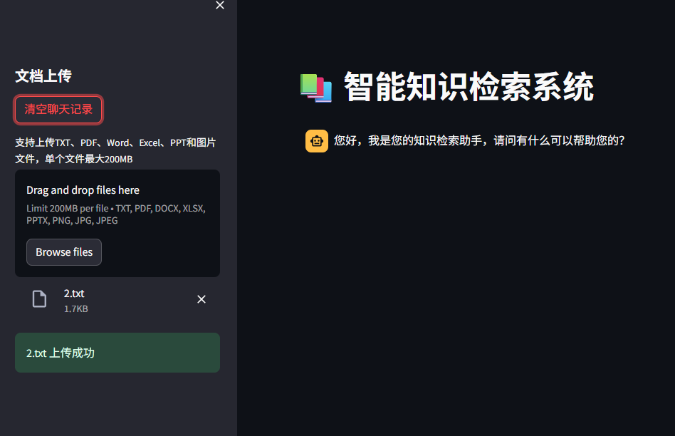
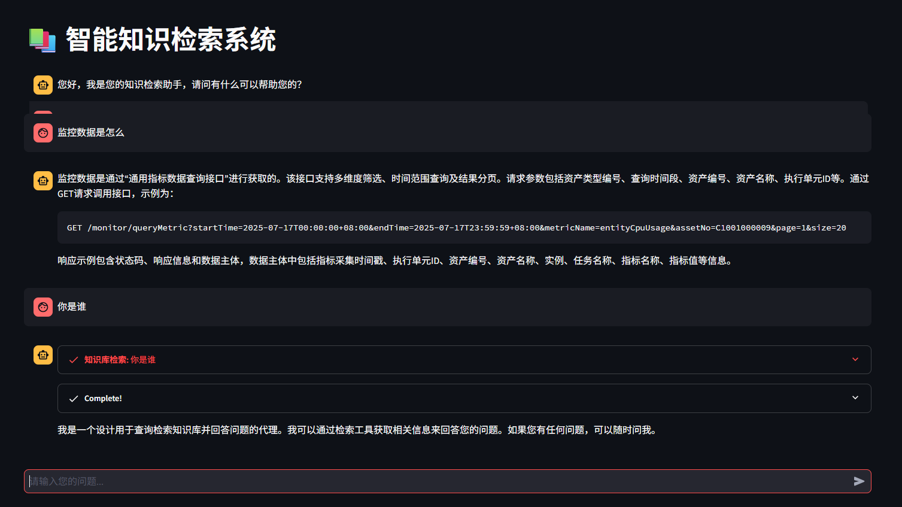

# 构建智能知识检索系统：基于 Streamlit 与 LangChain 的实现方案

在信息爆炸的时代，如何高效管理和检索文档中的知识成为一项重要需求。本文将介绍一个基于 Streamlit 和 LangChain 构建的智能知识检索系统，该系统支持多种格式文档的上传、解析与检索，能够通过自然语言交互为用户提供精准的知识问答服务。

## 系统架构概览

该智能知识检索系统主要由以下几个核心模块构成：

- **用户界面层**：基于 Streamlit 构建的 Web 交互界面
- **文档处理层**：负责解析多种格式的文档内容
- **向量数据库层**：使用 ChromaDB 存储文档向量，支持高效检索
- **智能问答层**：基于 LangChain 的 Agent 机制实现问答逻辑

系统的核心流程是：用户上传文档 → 系统解析并存储文档向量 → 用户提问 → 系统检索相关文档 → 生成回答。



## 核心代码解析

### 类结构设计

系统的核心功能封装在`KnowledgeBaseSystem`类中，该类通过组合模式整合了模型、数据库和文档处理器：

```python
class KnowledgeBaseSystem:
    def __init__(self, model, chromadb: ChromaDB, document_processor: Knowledge):
        self.chromadb = chromadb
        self.model = model
        self.document_processor = document_processor
```

### 页面配置与初始化

`setup_page_config`方法负责初始化 Streamlit 页面配置和会话状态：

```python
def setup_page_config(self):
    """设置页面配置"""
    st.set_page_config(
        page_title="智能知识检索系统",
        layout="wide",
        page_icon="📚"
    )
    st.title("📚 智能知识检索系统")
    st.sidebar.header("文档上传")
    # 初始化或重置聊天记录
    if "messages" not in st.session_state or st.sidebar.button("清空聊天记录"):
        st.session_state["messages"] = [
            {
                "role": "assistant",
                "content": "您好，我是您的知识检索助手，请问有什么可以帮助您的？"
            }
        ]
```

### 文档上传与处理

`handle_file_upload`方法实现了多格式文档的上传与处理功能，支持 TXT、PDF、Word、Excel、PPT 和图片等多种格式：

```python
def handle_file_upload(self):
    """处理文件上传"""
    files = st.sidebar.file_uploader(
        label="支持上传TXT、PDF、Word、Excel、PPT和图片文件，单个文件最大200MB",
        type=["txt", "pdf", "docx", "xlsx", "pptx", "png", "jpg", "jpeg"],
        accept_multiple_files=True
    )

    if not files:
        return

    for file in files:
        try:
            # 处理文件并存储到向量数据库
            file_type = file.name.split(".")[-1].lower()
            with tempfile.NamedTemporaryFile(delete=False, suffix=f'.{file_type}') as tmp_file:
                tmp_file.write(file.getvalue())
                tmp_file_path = tmp_file.name

            with st.spinner(f"正在处理 {file.name}..."):
                documents = self.document_processor.load_files([tmp_file_path], file_type)
                self.chromadb.add(documents)
                st.sidebar.success(f"{file.name} 上传成功")
        except Exception as e:
            st.sidebar.error(f"处理 {file.name} 时出错: {str(e)}")
        finally:
            # 清理临时文件
            if os.path.exists(tmp_file_path):
                os.remove(tmp_file_path)
```

这段代码的关键在于：

- 使用临时文件处理上传的文档
- 通过文档处理器解析不同格式的文件
- 将解析后的文档内容添加到向量数据库
- 完善的异常处理和资源清理



### 智能问答代理的创建

系统的核心智能问答功能通过`create_agent`方法实现，该方法利用 LangChain 构建了一个具有检索能力的智能代理：

```python
def create_agent(self) -> AgentExecutor:
    """创建代理执行器"""
    # 创建检索器，设置返回3个最相关的结果
    retriever = self.chromadb.as_retriever(search_kwargs={"k": 3})

    # 创建检索工具
    tool = create_retriever_tool(
        retriever,
        name="知识库检索",
        description="从知识库中检索相关信息来回答问题"
    )

    # 设置聊天历史存储
    msgs = StreamlitChatMessageHistory()
    memory = ConversationBufferMemory(
        chat_memory=msgs,
        return_messages=True,
        memory_key="chat_history",
        output_key="output"
    )

    # 定义代理的指令和提示模板
    instructions = """
       您是一个设计用于查询检索知识库并回答问题的代理;
       您可以使用检索工具，并基于检索内容来回答问题;
       您可以通过不查询文档就知道答案，但您仍然需要通过查询文档来获取答案;
       如果您从文档中找不到任何信息用于回答问题，则只需返回“抱歉，这个问题我还不知道”作为答案。
       """
    
    # 创建提示模板
    base_prompt_template = """
       {instructions}

       TOOLS:
       ------
       You have access to the following tools:
       {tools}

       To use a tool,please use the following format:

       Thought: Do I need to use a tool? Yes
       Action: the action to take,should be one of [{tool_names}]
       Action Input: {input}
       Observations: the result of the action

       When you have a response to say to the Human,or if you do not need to use a tool,you MUST use the format:
       Thought: Do I need to use a tool: No
       Final Answer:[your response here]

       Begin!

       Previous conversation history:
       {chat_history}

       New input:{input}
       {agent_scratchpad}
       """
    
    base_prompt = PromptTemplate.from_template(template=base_prompt_template)
    prompt = base_prompt.partial(instructions=instructions)
    
    # 创建REACT代理
    agent = create_react_agent(
        self.model,
        [tool],
        prompt
    )

    # 返回代理执行器
    return AgentExecutor(
        agent=agent,
        tools=[tool],
        memory=memory,
        verbose=True,
        handle_parsing_errors=True,
        max_iterations=5
    )
```

这段代码的核心是构建了一个基于 REACT 思维链的智能代理，它能够：

- 使用检索工具从知识库获取相关信息
- 维护对话历史，支持上下文感知
- 遵循特定的思考和行动格式
- 处理解析错误并限制最大迭代次数

### 聊天交互处理

`handle_user_query`方法实现了用户输入的处理和回答的生成：

```python
def handle_user_query(self, agent_executor: AgentExecutor):
    """处理用户查询"""
    user_query = st.chat_input(placeholder="请输入您的问题...")

    if not user_query:
        return

    # 添加用户消息到会话状态并显示
    st.session_state.messages.append({"role": "user", "content": user_query})
    st.chat_message("user").write(user_query)

    # 生成并显示回答
    with st.chat_message("assistant"):
        st_cb = StreamlitCallbackHandler(st.container())
        response = agent_executor.invoke(
            {"input": user_query},
            {"callbacks": [st_cb]}
        )

        answer = response.get("output", "抱歉，我无法回答这个问题。")
        st.session_state.messages.append({"role": "assistant", "content": answer})
        st.write(answer)
```



### 系统运行入口

`run`方法作为系统的入口点，协调各个模块的执行：

```python
def run(self):
    """运行知识检索系统"""
    self.setup_page_config()
    self.display_chat_history()
    self.handle_file_upload()

    try:
        agent_executor = self.create_agent()
        self.handle_user_query(agent_executor)
    except Exception as e:
        st.error(f"系统错误: {str(e)}")
        st.session_state.messages.append({
            "role": "assistant",
            "content": "抱歉，系统出现错误，请稍后再试。"
        })
```

### 系统启动与配置

主程序通过以下代码启动系统：

```python
if __name__ == '__main__':
    model_type = ModelType.QWEN
    config = Config("conf/config.yml")
    model = Model(config)
    chromadb = ChromaDB(config, model_type)
    document_processor = Knowledge()
    system = KnowledgeBaseSystem(model.qwen_llm(), chromadb, document_processor)
    system.run()
```

这里使用了 Qwen 模型作为基础大语言模型，通过配置文件进行系统参数的管理，并初始化了向量数据库和文档处理器。

## 代码示例

```python
import os
import tempfile

import streamlit as st
from langchain.agents import AgentExecutor, create_react_agent
from langchain.memory import ConversationBufferMemory
from langchain_community.callbacks import StreamlitCallbackHandler
from langchain_community.chat_message_histories import StreamlitChatMessageHistory
from langchain_core.prompts import PromptTemplate
from langchain_core.tools import create_retriever_tool

from DB.chroma import ChromaDB
from common.modeCommon import Model
from config.config import Config
from enums.model_enums import ModelType
from knowledge import Knowledge


class KnowledgeBaseSystem:
    def __init__(self, model, chromadb: ChromaDB, document_processor: Knowledge):
        self.chromadb = chromadb
        self.model = model
        self.document_processor = document_processor

    def setup_page_config(self):
        """设置页面配置"""
        st.set_page_config(
            page_title="智能知识检索系统",
            layout="wide",
            page_icon="📚"
        )
        st.title("📚 智能知识检索系统")
        st.sidebar.header("文档上传")
        if "messages" not in st.session_state or st.sidebar.button("清空聊天记录"):
            st.session_state["messages"] = [
                {
                    "role": "assistant",
                    "content": "您好，我是您的知识检索助手，请问有什么可以帮助您的？"
                }
            ]


    def display_chat_history(self):
        """显示聊天历史"""
        # 显示聊天历史
        for msg in st.session_state.messages:
            st.chat_message(msg["role"]).write(msg["content"])


    def handle_file_upload(self):
        """处理文件上传"""
        files = st.sidebar.file_uploader(
            label="支持上传TXT、PDF、Word、Excel、PPT和图片文件，单个文件最大200MB",  # 主标签改为中文
            type=["txt", "pdf", "docx", "xlsx", "pptx", "png", "jpg", "jpeg"],  # 支持的文件类型
            accept_multiple_files=True,  # 允许上传多个文件
            # help="支持上传TXT、PDF、Word、Excel、PPT和图片文件，单个文件最大200MB"  # 帮助文本改为中文
        )

        if not files:
            return

        for file in files:
            try:
                file_type = file.name.split(".")[-1].lower()
                with tempfile.NamedTemporaryFile(delete=False, suffix=f'.{file_type}') as tmp_file:
                    tmp_file.write(file.getvalue())
                    tmp_file_path = tmp_file.name

                with st.spinner(f"正在处理 {file.name}..."):
                    documents = self.document_processor.load_files([tmp_file_path], file_type)
                    self.chromadb.add(documents)
                    st.sidebar.success(f"{file.name} 上传成功")
            except Exception as e:
                st.sidebar.error(f"处理 {file.name} 时出错: {str(e)}")
            finally:
                if os.path.exists(tmp_file_path):
                    os.remove(tmp_file_path)

    def create_agent(self) -> AgentExecutor:
        """创建代理执行器"""
        retriever = self.chromadb.as_retriever(search_kwargs={"k": 3})

        tool = create_retriever_tool(
            retriever,
            name="知识库检索",
            description="从知识库中检索相关信息来回答问题"
        )

        msgs = StreamlitChatMessageHistory()
        memory = ConversationBufferMemory(
            chat_memory=msgs,
            return_messages=True,
            memory_key="chat_history",
            output_key="output"
        )

        instructions = """
           您是一个设计用于查询检索知识库并回答问题的代理;
           您可以使用检索工具，并基于检索内容来回答问题;
           您可以通过不查询文档就知道答案，但您仍然需要通过查询文档来获取答案;
           如果您从文档中找不到任何信息用于回答问题，则只需返回“抱歉，这个问题我还不知道”作为答案。
           """
        # 基础提示模板
        base_prompt_template = """
           {instructions}

           TOOLS:
           ------
           You have access to the following tools:
           {tools}

           To use a tool,please use the following format:

           Thought: Do I need to use a tool? Yes
           Action: the action to take,should be one of [{tool_names}]
           Action Input: {input}
           Observations: the result of the action

           When you have a response to say to the Human,or if you do not need to use a tool,you MUST use the format:
           Thought: Do I need to use a tool: No
           Final Answer:[your response here]

           Begin!

           Previous conversation history:
           {chat_history}

           New input:{input}
           {agent_scratchpad}
           """
        # 创建基础提示词模板
        base_prompt = PromptTemplate.from_template(
            template=base_prompt_template
        )
        # 创建部分填充的提示词模板
        prompt = base_prompt.partial(
            instructions=instructions
        )
        agent = create_react_agent(
            self.model,
            [tool],
            prompt
        )

        return AgentExecutor(
            agent=agent,
            tools=[tool],
            memory=memory,
            verbose=True,
            handle_parsing_errors=True,
            max_iterations=5
        )

    def handle_user_query(self, agent_executor: AgentExecutor):
        """处理用户查询"""
        user_query = st.chat_input(placeholder="请输入您的问题...")

        if not user_query:
            return

        st.session_state.messages.append({"role": "user", "content": user_query})
        st.chat_message("user").write(user_query)


        with st.chat_message("assistant"):
            st_cb = StreamlitCallbackHandler(st.container())
            response = agent_executor.invoke(
                {"input": user_query},
                {"callbacks": [st_cb]}
            )

            answer = response.get("output", "抱歉，我无法回答这个问题。")
            st.session_state.messages.append({"role": "assistant", "content": answer})
            st.write(answer)

    def run(self):
        """运行知识检索系统"""
        self.setup_page_config()
        self.display_chat_history()
        self.handle_file_upload()

        try:
            agent_executor = self.create_agent()
            self.handle_user_query(agent_executor)
        except Exception as e:
            st.error(f"系统错误: {str(e)}")
            st.session_state.messages.append({
                "role": "assistant",
                "content": "抱歉，系统出现错误，请稍后再试。"
            })


if __name__ == '__main__':
    model_type = ModelType.QWEN
    config = Config("conf/config.yml")
    model = Model(config)
    chromadb = ChromaDB(config, model_type)
    document_processor = Knowledge()
    system = KnowledgeBaseSystem(model.qwen_llm(), chromadb, document_processor)
    system.run()

```

## 代码仓库路径

[zcj-git520/AiLargeModel: 大模型应用开发学习](https://github.com/zcj-git520/AiLargeModel)
