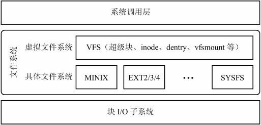
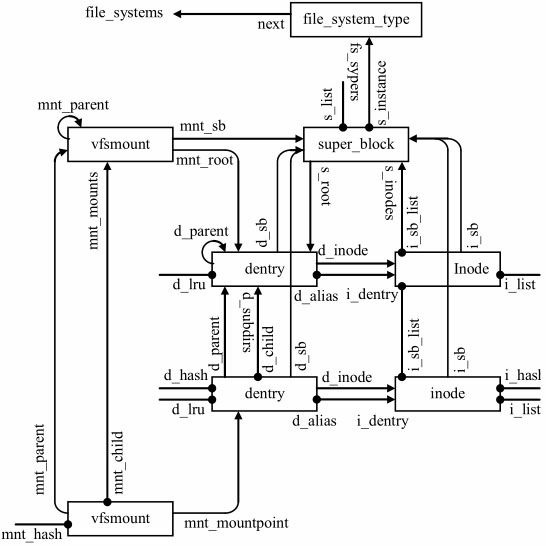
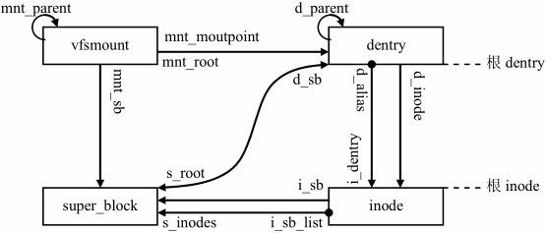

#### 概述

文件系统是存储和组织文件，以便可以访问和查找的一种机制；不同的文件系统有不同的存储和组织方式；基于磁盘的有一下几种存储方式：

- 连续存储：把数据作为连续的数据块存储到磁盘上；这一方案简单、容易实现，记录文件用到的磁盘块仅需记住第一块的地址，并且性能较好，一次操作就可读出整个文件。但是，它有一个致命的缺陷。在创建文件时，必须知道文件的最大长度，否则无法确定需要为它保留多少磁盘空间。因此，连续存储主要适合于文件数据一次性写入的系统（例如romfs）
- 连接表存储：将每个文件用磁盘块顺序连接起来；虽然用于链接磁盘块的指针可以使用磁盘块本身的空间，但这将使得每个磁盘块实际存储的数据字节数不再是2的幂，给上层应用程序带来不便。文件系统从磁盘块中取出一些指针，作为索引存放在文件分配表FAT。只需要记录文件的起始磁盘块编号，顺着文件分配表中索引指针组织成的链表，就可以找到文件的所有磁盘块。
- inode存储：每个文件都有一个称为node的表；通过它获取所有磁盘的编号；小文件的所有磁盘块编号都直接存放在inode内。稍大的一些文件，inode记录了一个称为一次间接块的磁盘块编号，这个磁盘块存放着文件的其他磁
  盘块编号。如果文件再扩大，可以在inode中记录二次间接块编号，二次间接块存放着多个一次间接块的编号，而每个一次间接块又存放着文件的其他磁盘块编号。如果这也不够的话，还可以使用三次间接块。本章要讨论的Minix文件系统，就使用的这种分配方案

Linux将文件系统分为两层：

1. 上层为虚拟文件系统开关层，简称为虚拟文件系统：它是具体文件系统和上层应用之间的接口层，将各种不同文件系统的操作和管理纳入一个统一的框架，使得用户不需要关心各种不同文件系统的实现细节。VFS由超级块、inode、dentry、vfsmount等信息组成

2. 下层为具体文件系统实现，如Minix、EXT2/3/4、sysfs等。具体文件系统实现代码组织成模块形式，向Linux VFS注册回调函数，处理和具体文件系统密切相关的细节操作

   

#### 文件系统对象

Linux文件系统对象之间的关系可以概括为文件系统类型、超级块、inode、dentry和vfsmount之间的关系；

Linux有一颗全局文件系统树，反映了Linux VFS对象之间的关系；

每个文件系统装载实例有四个必备元素：vfsmount、超级块、根inode和根dentry。

#### 装载文件系统

文件系统要被使用就应该被装载。体现一个文件系统装载实例要素是：vfsmount、super_block、根dentry和根inode；

在内核角度，装载过程中，文件系统类型中的get_sb将被调用，它将生成一个新的文件系统装载对象vfsmount，并和该文件系统类型的一个超级块实例关联起来；