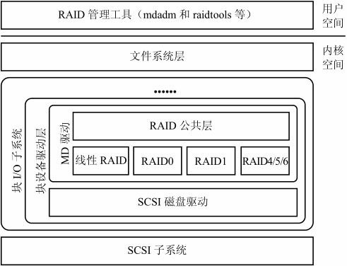
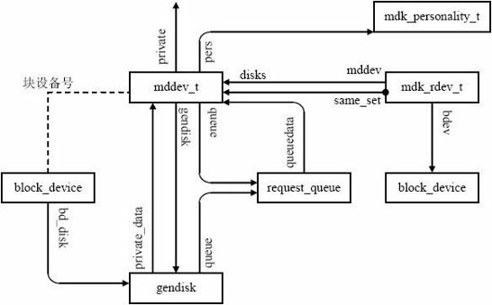

#### 概述

Linux内核在多块设备的基础上，注册了一块特殊的设备，称为为MD设备。这个MD设备形成一个逻辑层，支持不同的RAID技术



MD模块是一个虚拟块设备，它属于块i/o子系统中的块设备驱动层，架构于物理块设备层；其有两层：RAID共性层和RAID个性层

- RAID共性层：它提取出各种级别的RAID的公共特性，依照块设备的实现模板向上层注册，同时向RAID个性层提供公共函数，以及接口注册函数
- RAID个性层：是各种级别RAID的个性体现，它向RAID公共层注册个性接口，利用RAID公共层提供的公共函数，基于低层实现个性化功能

#### RAID模块对象

1. 核心MD设备结构mddev及其成员磁盘设备结构mdk_rdev_t是系统中的两个关键结构。核心MD设备结构mddev_t是内核中RAID设备保存自身信息的结构体，它包括了完整的RAID设备的信息。成员磁盘设备结构mdk_rdev_t反映了组成MD设备的底层块设备的信息；

2. MD设备处理可以有不同的特性，它指向一个MD个性结构体，有个性ND设备的操作表和操作的最终数据

3. MD设备通过块设备号和块设备描述符（block_device）关联起来，低层成员磁盘也指向和它相对应的块设备描述符正是以块设备描述符为“纽带”，使得MD可以构建在其他的物理或虚拟磁盘设备之上，成为一个“栈式”块设备；

   

   

#### MD模块初始化

- MD模块加载时，它的初始化函数md_init将被执行;

- __register_blkdev函数:是维护主设备号和块设备名之间的关联,所有块设备模块初始化时，都应该调用这个函数

  ```
  static void md_geninit(void)
  {
  	pr_debug("md: sizeof(mdp_super_t) = %d\n", (int)sizeof(mdp_super_t));
  
  	proc_create("mdstat", S_IRUGO, NULL, &mdstat_proc_ops);
  }
  
  static int __init md_init(void)
  {
  	int ret = -ENOMEM;
  
  	md_wq = alloc_workqueue("md", WQ_MEM_RECLAIM, 0);
  	if (!md_wq)
  		goto err_wq;
  
  	md_misc_wq = alloc_workqueue("md_misc", 0, 0);
  	if (!md_misc_wq)
  		goto err_misc_wq;
  
  	md_rdev_misc_wq = alloc_workqueue("md_rdev_misc", 0, 0);
  	if (!md_rdev_misc_wq)
  		goto err_rdev_misc_wq;
  
  	ret = __register_blkdev(MD_MAJOR, "md", md_probe);
  	if (ret < 0)
  		goto err_md;
  
  	ret = __register_blkdev(0, "mdp", md_probe);
  	if (ret < 0)
  		goto err_mdp;
  	mdp_major = ret;
  
  	register_reboot_notifier(&md_notifier);
  	raid_table_header = register_sysctl_table(raid_root_table);
  
  	md_geninit();
  	return 0;
  
  err_mdp:
  	unregister_blkdev(MD_MAJOR, "md");
  err_md:
  	destroy_workqueue(md_rdev_misc_wq);
  err_rdev_misc_wq:
  	destroy_workqueue(md_misc_wq);
  err_misc_wq:
  	destroy_workqueue(md_wq);
  err_wq:
  	return ret;
  }
  ```

  

#### MD设备创建

- md_probe()函数负责创建MD对象,直接调用md_alloc函数；

  ```
  static void md_probe(dev_t dev)
  {
  	if (MAJOR(dev) == MD_MAJOR && MINOR(dev) >= 512)
  		return;
  	if (create_on_open)
  		md_alloc(dev, NULL);
  }
  ```

- md_open():是系统调用open的实现代码继续执行，调用块设备操作表的open回调函数的实例化

#### 用户态发送ioctl创建MD

使用管理工具创建MD是通过ioctl来实现的。在打开MD设备文件（如/dev/md0）情况下，文件操作表被设置为def_blk_fops，其unlocked_ioctl回调函数的实现为block_ioctl，而后者经调用blkdev_ioctl，再调用__blkdev_driver_ioctl，最后调用的是通用磁盘的块设备操作表中的ioctl回调函数

函数md_iocal()可对设备驱动、磁盘、设备进行查询、控制和配置:

1. 针对于RAID驱动程序，而非特定的阵列；例如获取RAID驱动程序版本号以及打印所有RAID阵列信息等
2. 针对于特定阵列，主要命令如下：如SET_ARRAY_INFO设置MD设备信息；ADD_NEW_DISK在MD设备中添加一个磁盘设备；RUN_ARRAY运行MD设备等
3. SET_ARRAY_INFO：在md_ioctl，处理SET_ARRAY_INFO控制码的代码首先从用户空间复制参数，然后根据MD设备是否已经存在分别调用update_array_info和md_set_array_info函数；
4. ADD_NEW_DISK:在md_ioctl，处理ADD_NEW_DISK控制码的代码首先从用户空间复制参数，然后调md_add_new_disk函数;
5. RUN_ARRAY:处理RUN_ARRAY控制码的代码直接调用do_md_run函数;

#### MD设备请求执行

MD模块中提供了一个通用的接口函数md_make_request作为各种级别RAID设备的读／写请求的入口;

加载MD模块时，调用blk_queue_make_request函数将所有对主设备号为MD_MAJOR的读／写请求都转发到这个函数。但这个函数并不执行真正处理，只是通过映射找到块设备次设备号对应MD设备结构，进而获得其个性化结构指针，调用个性化结构的make_request，即通过和该RAID级别对应的请求处理函数来处理这个请求;

