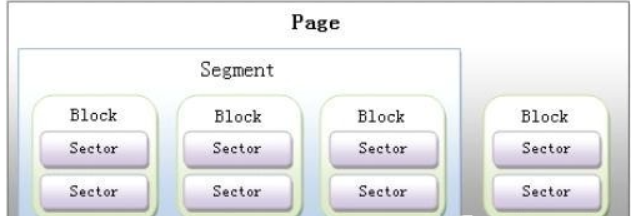
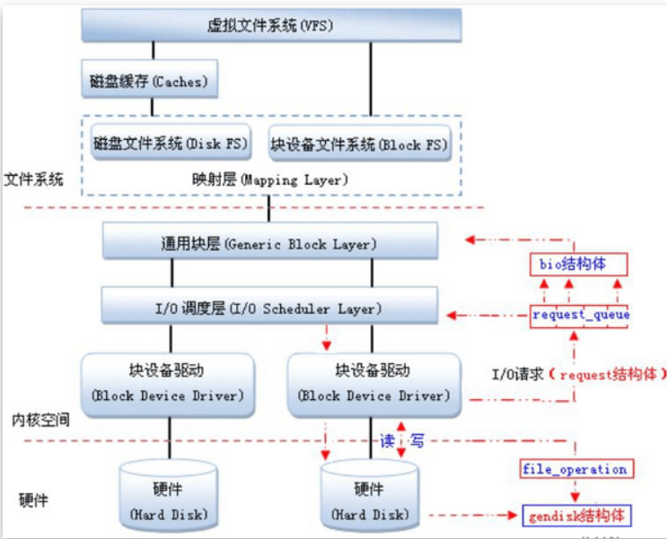
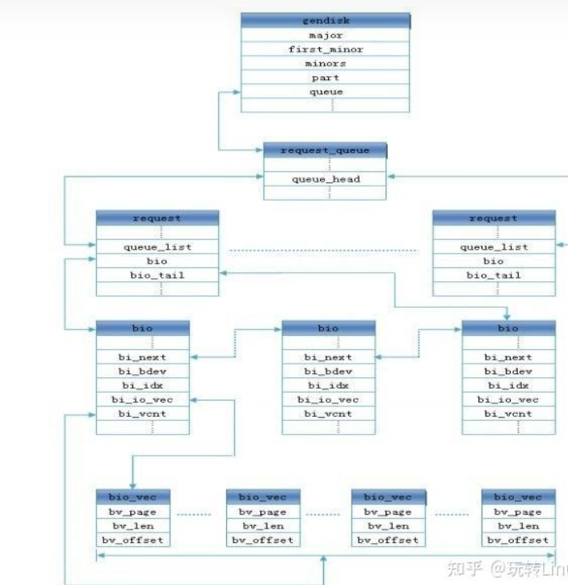

#### 基本概念

##### 块设备（block device）

是一种有一定结构的随机存取的设备，对于这种设备的读写是按块进行的，他使用的缓冲区来存放暂时的数据，达到一定条件后。从缓存一次性写入设备或者从设备一次性读到缓冲区

##### 字符设备（character device）

是一种顺序的数据设备，对于这种设备的读写是按字符进行的，连续的字符组成数据流，是没有缓冲区，是只用实时的读写设备；

##### 块设备与字符设备之间的区别

1. 读写数据的单元不同：块设备是以块为读写单元，而字符设备是以字符为读写单元
2. 块设备是可以随机访问，而字符设备只能顺序访问

##### 扇区（sectors）

是块设备硬件对数据处理的基本单位，通常1扇区=512byte

##### 块（blocks）

是Linux种制定对内核或文件系统等数据处理的基本单位，通常1块=1个或多个扇区

##### 段（segments）

是由若干个相邻的块组成。是linux内存管理机制中一个内存页或者内存页中的一部分

##### 页、段、块、扇区之间的关系如图



#### 块设备的层次



- Linux是支持多种不同存储介质，在内核中间都要适配有块设备驱动程序来读写块设备。

- 往上是io调度层，将文件系统的读写请求进行编排，合并用以提高磁盘的读写效率。

- 通用块层，对应与bio结构。是将io请求的抽象，描述对应的io操作涉及到多个页

  ##### 块设备的应用在linux中是一个完整的子系统

  在linux中，驱动对块设备的中输入或者输出（io）操作都会向块设备发出请求，在驱动中使用request结构体描述。

  对于一些磁盘设备请求的速度很慢，内核提供一种队列的机制，将这些io请求添加到队列中（即：请求队列），在驱动中使用request_queue结构体进行描述。在向块设备提交这些请求前内核会先执行请求合并和排序的预操作，以提高访问的效率，然后在由内核中的io调度程序子系统来负责提交io请求，调度程序将磁盘分配给系统中所有挂起的块io请求，其工作是管理块设备的请求队列。

  在由通用层（generic block layer）负责维持一个io请求在上层文件系统与底层物理磁盘之间的关系，在通用层中，通常用一个bio结构体来对应一个io请求。

  linux提供一个gendisk数据结构体，用来表示一个独立的磁盘设备或者是分区，用来对底层物理磁盘的访问。在gendisk中有一个类似于字符设备中的file_operations的硬件操作结构指针，是block_device_operations结构体。

  当多个请求在提交块设备时。执行的效率依赖于请求的顺序。如果请求的速度是同一方向，执行效率最大。内核在调用块设备驱动程序请求之前，先收集io请求并将请求进行排序，然后将连续扇区操作的请求进行合并以提高执行效率。

  ##### 块设备的缓冲区和缓冲区头

  缓冲区对应一个磁盘块，当磁盘块被调入内存时，就存储在缓冲区；块包含一个或多个扇区，且不大于一个页，所以一个页可以容纳一个或者多个块，并存储一些控制信息。控制信息一般是使用结构体buff-head来表示，结构体如下：

```c
struct buffer_head{
  unsigned long b_state; /* 标志位 */
  struct buffer_head *b_this_page; /* 页面中的缓冲区 */
  struct page *b_page; /* 当前页面 */
  sector_t b_blocknr; /* 起始块号 */
  size_t size; /* 映像的大小 */
  char *b_data;  /* 数据指针 */
  struct block_device *b_bdev; /* 关联的块设备 */
  atomic_t b_count;  /* 使用计数 */
  ...
};
```


#### 	请求结构request

结构request代表了挂起的io请求，每一个请求用同一个结构request实例进行描述，存放在请求队列链表中，由电梯算法进行排序，每一个请求包含1个或多个结构体bio实例，其结构体如下：

```c
struct request {
    //用于挂在请求队列链表的节点，使用函数blkdev_dequeue_request访问它，而不能直接访
问
    struct list_head queuelist; 
    struct list_head donelist;  /*用于挂在已完成请求链表的节点*/
    struct request_queue *q;   /*指向请求队列*/
    unsigned int cmd_flags;    /*命令标识*/
    enum rq_cmd_type_bits cmd_type;  /*命令类型*/
    /*各种各样的扇区计数*/
   /*为提交i/o维护bio横断面的状态信息，hard_*成员是块层内部使用的，驱动程序不应该改变
它们*/
    sector_t sector;     /*将提交的下一个扇区*/
    sector_t hard_sector;        /* 将完成的下一个扇区*/
    unsigned long nr_sectors;  /* 整个请求还需要传送的扇区数*/
    unsigned long hard_nr_sectors; /* 将完成的扇区数*/
 /*在当前bio中还需要传送的扇区数 */
    unsigned int current_nr_sectors;
    /*在当前段中将完成的扇区数*/
    unsigned int hard_cur_sectors;
    struct bio *bio;     /*请求中第一个未完成操作的bio*、
    struct bio *biotail; /*请求链表中末尾的bio*、
    struct hlist_node hash;  /*融合 hash */
    /* rb_node仅用在I/O调度器中，当请求被移到分发队列中时，
请求将被删除。因此，让completion_data与rb_node分享空间*/    
    union {
        struct rb_node rb_node;   /* 排序/查找*/
        void *completion_data;
    };
```

#### bio结构体

通常1个bio对应1个io请求，io调度算法可将连续的bio合并成1个请求。所以一个请求可以包含多个bio。

bio为通用层的主要数据结构，即描述了磁盘的位置，又描述了内存的位置，是上层内核vfs与下层驱动的连接纽带，其结构体如下：

```c
struct bio {
sector_t        bi_sector;//该bio结构所要传输的第一个（512字节）扇区：磁盘的位置
struct bio        *bi_next;    //请求链表
struct block_device    *bi_bdev;//相关的块设备
unsigned long        bi_flags//状态和命令标志
unsigned long        bi_rw; //读写
unsigned short        bi_vcnt;//bio_vesc偏移的个数
unsigned short        bi_idx;    //bi_io_vec的当前索引
unsigned short        bi_phys_segments;//结合后的片段数目
unsigned short        bi_hw_segments;//重映射后的片段数目
unsigned int        bi_size;    //I/O计数
unsigned int        bi_hw_front_size;//第一个可合并的段大小;
unsigned int        bi_hw_back_size;//最后一个可合并的段大小
unsigned int        bi_max_vecs;    //bio_vecs数目上限
struct bio_vec        *bi_io_vec;    //bio_vec链表：内存的位置
bio_end_io_t        *bi_end_io;//I/O完成方法
atomic_t        bi_cnt; //使用计数
void            *bi_private; //拥有者的私有方法
bio_destructor_t    *bi_destructor;    //销毁方法
};
 
内存数据段结构bio_vec
       结构bio_vec代表了内存中的一个数据段，数据段用页、偏移和长度描
述。I/O需要执行的内存位置用段表示，结构bio指向了一个段的数组。
结构bio_vec列出如下（在include/linux/bio.h中）：
struct bio_vec {
       struct page     *bv_page;   /*数据段所在的页*/
       unsigned short  bv_len;     /*数据段的长度*/
       unsigned short  bv_offset;  /*数据段页内偏移*/
};
```

#### 块设备结构体 block_device

内核用结构体block_device实例代表一个块设备对象，块设备的结构体为block_device如下

```c
struct block_device {
 dev_t bd_dev;  /* not a kdev_t - it's a search key */
 struct inode * bd_inode; /* 分区节点 */
 struct super_block * bd_super;
 int bd_openers;
 struct mutex bd_mutex;/* open/close mutex 打开与关闭的互斥量*/
 struct semaphore bd_mount_sem;    /*挂载操作信号量*/ 
 struct list_head bd_inodes;
 void * bd_holder;
 int bd_holders;
 #ifdef CONFIG_SYSFS
 struct list_head bd_holder_list;
 #endif
 struct block_device * bd_contains;
 unsigned bd_block_size;     /*分区块大小*/
 struct hd_struct * bd_part;
 unsigned bd_part_count;   /*打开次数*/
 int bd_invalidated;
 struct gendisk * bd_disk; /*设备为硬盘时，指向通用硬盘结构*/
 struct list_head bd_list;
 struct backing_dev_info *bd_inode_backing_dev_info;
 unsigned long bd_private;
 /* The counter of freeze processes */
 int bd_fsfreeze_count;
 /* Mutex for freeze */
 struct mutex bd_fsfreeze_mutex;
 };
```

#### 通用硬盘结构 gendisk

结构gendisk代表了一个通用硬盘（genreic hard disk）对象，它存储了一个硬盘的信息，包括请求队列，分区链表和块设备操作函数集等。块设备驱动程序分配结构gendisk实例，装载分区表，分配请求队列并填充结构的其他域。其结构体如下：

```c
struct gendisk {
    int major;            /* 驱动程序的主设备号 */
    int first_minor;       /*第一个次设备号*/
    int minors;          /*次设备号的最大数量，没有分区的设备，此值为1 */
    char disk_name[32];  /* 主设备号驱动程序的名字*/
    struct hd_struct **part;   /* 分区列表，由次设备号排序 */
    struct block_device_operations *fops;  /*块设备操作函数集*/
    struct request_queue *queue;         /*请求队列*/
    struct blk_scsi_cmd_filter cmd_filter;
    void *private_data;                 /*私有数据*/
    sector_t capacity;     /* 函数set_capacity设置的容量，以扇区为单位*/
    int flags;                 /*设置驱动器状态的标志，如：可移动介质为
GENHD_FL_REMOVABLE*/
    struct device dev;                 /*从设备驱动模型基类结构device继承*/
    struct kobject *holder_dir;
    struct kobject *slave_dir;
 struct timer_rand_state *random;
    int policy; 
    atomic_t sync_io;        /* RAID */
    unsigned long stamp;
    int in_flight;
#ifdef  CONFIG_SMP
    struct disk_stats *dkstats;  
#else
/*硬盘统计信息，如：读或写的扇区数、融合的扇区数、在请求队列的时间等*/
    struct disk_stats dkstats;
#endif
    struct work_struct async_notify;
#ifdef  CONFIG_BLK_DEV_INTEGRITY
    struct blk_integrity *integrity;   /*用于数据完整性扩展*/
#endif
};
```

##### 块设备各个结构体间的关系



