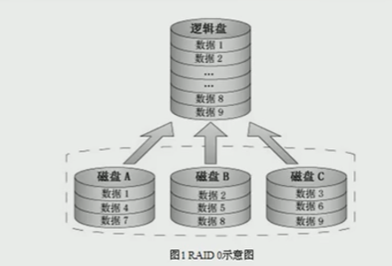
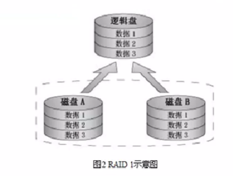
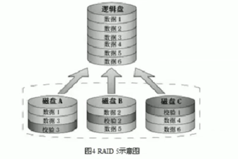
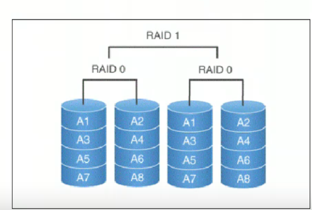
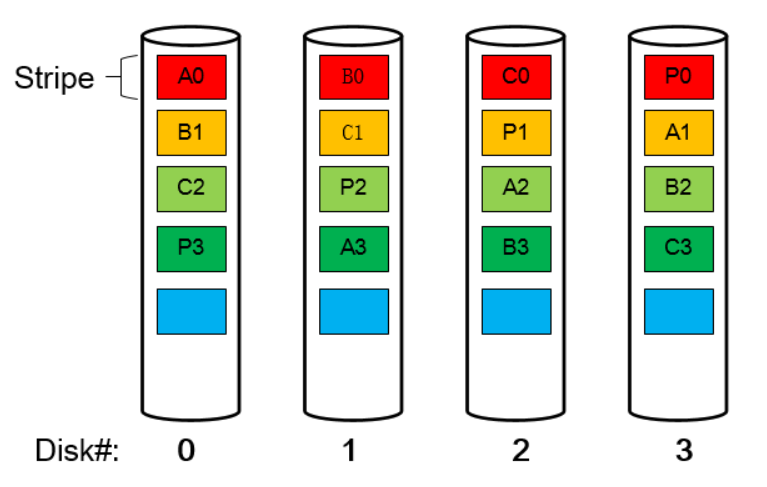

#### raid是什么

raid是廉价冗余磁盘阵列，简称磁盘阵列。

raid:是一种把多块独立的物理磁盘按不同的技术组合起来的形成的一个磁盘组，在逻辑上看起来是一块大的磁盘，可以提供比较单个的物理磁盘更大的存储容量或更高的存储性能，同时有能提供不同级别数据的冗余备份的一种技术

#### raid的级别

把多个物理磁盘通过不同的技术方式组成的磁盘阵列，不同的技术称为raid级别。

级别一般有：raid0,raid1,raid0+1(raid10),raid2,raid3,raid4,raid5,raid6,raid7,raid53

生产环境常用的级别为：raid0,raid1,raid10,raid5

#### raid级别的比较

| raid级别 | 优点                                           | 缺点                 | 实际使用场景                                 |
| -------- | ---------------------------------------------- | -------------------- | -------------------------------------------- |
| raid0    | 读写速度快                                     | 没有冗余             | mysql slave,集群的节点rs                     |
| raid1    | 100%冗余，镜像                                 | 读写性能一般，成本高 | 单独的，数据重要，且宕机的业务，监控，系统盘 |
| raid5    | 具备一定的性能和冗余，可坏一块盘，读写性能不错 | 写入性能不高         | 用于一般的业务                               |
| raid10   | 读写速度快，100%冗余                           | 成本高               | 性能和冗余的业务要求高的业务                 |

#### raid技术分类

##### 软raid技术

在linux中，通过自带软件就能实现软raid功能，它的配置高，管理方便，可以是实现将将几个物理盘合成一个更大的虚拟设备，从而到达性能的改进合数据的冗余的目的

##### 硬raid技术

基于硬件的raid解决方案比基于软件的raid技术在使用的性能合服务器上更好，具体表现在检测和修复多位错误的能力，错误的磁盘自动检测和阵列重建等方面，从安全性上考虑，基于硬件的raid的解决方案更加的安全

#### raid0原理及特点

##### 特点：

1. 读写性能高
2. 没有冗余
3. 可用空间N*min（s1,S2...）
4. 最少磁盘数为，2，2+

#### raid1特点

##### 特点

1. 读性能提升，写性能降低
2. 可用空间为：min（s1,S2...）
3. 可冗余
4. 最少磁盘数为：2，2+

#### raid5特点

##### 特点：

1. 读性能有提升，写性能有所欠缺
2. 可用空间为：（n-1）*min(s1,s2,...)
3. 有冗余，有一块磁盘
4. 最少磁盘数：3，3+

#### raid10特点

##### 特点：

1.   读写性能有提升
2. 可用空间：N*min（s1,s2...）/2
3. 有冗余，每组最多坏一块
4. 最少磁盘数为：4，4+

#### RAID5的基本架构

RAID5的读写操作采用的是stripe的基本结构，即以stripe为读写的基本单位，假设一个3+1的RAID5，即3个数据盘+1个校验盘，那么一个stripe就包含3个数据块和一个校验块；

如图所示，这是一个3+1的RAID5，图中的每一个方块表示一个stripe的一个基本单元，又称为chunk；相同颜色的方块组成一个stripe，即每个stripe由3个数据chunk(A,B,C)+1个校验chunk(P)组成。关于校验块的生成方法以及数据恢复原理如下：

- 校验块P的生成方法为`P=A⊕B⊕C` 。(⊕表示异或运算)

- 加入1号盘坏了，此时有读请求读B0块的数据，那么可以通过`B0=A0⊕C0⊕P0` 的方法 来进行恢复
