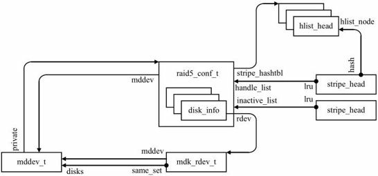
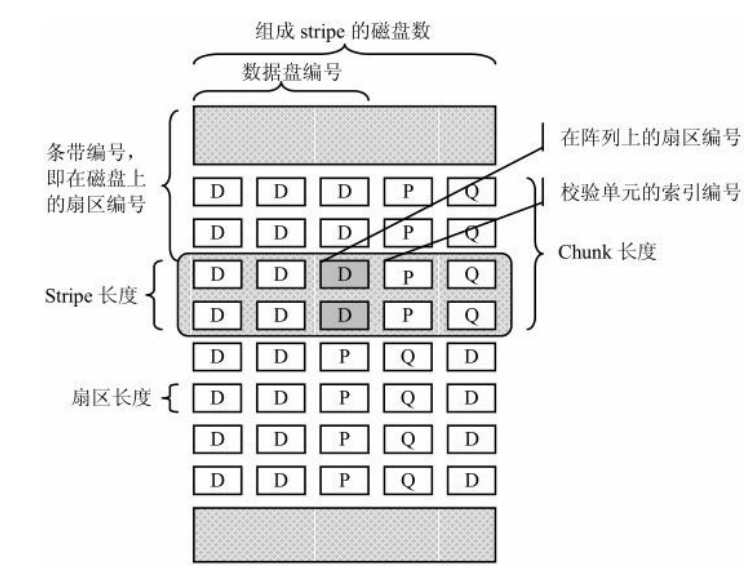
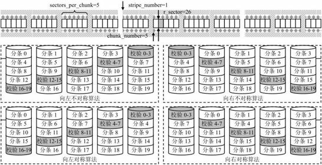

### RAID5模块

RAID5模块的对象，模块的执行过程及其同步和恢复过程

#### RAID5模块对象

对于RAID5，MD设备描述符（mddev）的private域指向RAID5私有配置结构r5conf。后者包含一个成员磁盘
数组，每一项都指向对应的成员磁盘描述符（mdk_rdev_t），而这些成员磁盘描述符被链入MD设备描述符的成员磁盘链表，并且有指针指向MD设备；

RAID5支持冗余，在条带中采用了校验和技术。对RAID5设备的正常读／写和同步／恢复／扩展等操作都是以条带为基本单位处理的，条带管理结构为“条带头”（stripe_head）。每个RAID5设备分配有固定数目的条带头，随着系统运行，这些条带头可能被挂载到RAID5设备的不同链表，被条带使用中的条带头结构还会链入RAID5的哈希表以便于查找

每个RAID5设备被分配一定数目的条带用于处理提交给它的请求，最大条带数目由max_nr_stripes域给出。这些条带根据其状态被链入到不同的链表。RAID5设备有以下五个不同的链表

- inactive_list为空闲的条带列表：在RAID5开始运行之初，所有的条带都在inactive_list中。在有请求到达时，为它分配并关联一个条带。条带处理完成，又被释放回到这个链表；
- handle_list为需要处理的条带列表：要处理的条带都会被添加到handle_list链表，RAID5守护线程就是根据这个链表进行处理的。条带被处理时，会被从链表中删除，暂时处于“游离”状态。一个条带需要多轮处理，每一轮处理完成之后，都被重新加入某个链表，最终又会被重新加入handle_list链表，开始新一轮处理。
- bitmap_list为因等待位图更新而延迟的条带链表：如果在对RAID5设备进行写操作时突然掉电，就可能造成某些条带的不同步，有可能数据已经被写入成员磁盘，而校验和还没有被写入，又或者校验和已经被写入，而某些数据还没有被写入成员磁盘。当RAID5再次被重组以后，就需要进行同步处478理，而这需要我们知道哪些条带需要被同步，否则只能进行全面的同步，这样做显然开销非常大。位图就是为此目的而引入的。如果RAID5支持位图，每一个块会对应一个位图位，在进行写操作的时候，会先将对应的位图位置成1，这时写请求也被放入bitmap_list链表，只有在该位图位被成功冲刷到磁盘之后，才能处理这个写请求。当进行同步操作的时候，根据位图位，只同步那些被置为1的条带。采用位图策略最大的优点是减少了无谓的同步操作，提高了同步操作效率。
- delayed_list为被延迟处理的条带链表：在有写请求到达条带的某个成员磁盘时，并不是立即将请求放handle_list准备处理，而是先放入delayed_list链表延迟一段时间，延迟的目的是为了等待“可能有”更多针对这个条带的其他成员磁盘的写请求到来，这样做可以从整体上减少“预读”（无论是重构写还是读改写）的次数。只有当条带被“激活读”后，才开始将delayed_list链表中的条带转移到其他链表进行处理。
- hold_list为准备好预读的条带链表：当前的Linux内核版本为了防止delayed_list一股脑儿将所有的条带转移到handle_list，在其中引入hold_list链表，延迟的条带先被保存到hold_list链表以进一步延迟，根据特定的算法，hold_list被绕过，也有可能被转移到handle_list而得到处理。事实证明，这样做可以改进写性能

#### 请求执行过程

RAID5作为一个独立的模块，在初始化时调用raid5_init，在卸载时调用raid5_exit。而raid5_init则是通过调用register_md_personality注册RAID5个性化，包括模块名和一些个性化方法信息。在raid5_exit中则调用unregister_md_personality注销RAID5个性化；

1. 接收上层提交请求：上层提交给MD设备的请求，会被传递给raid5_make_request函数；
2. md_write_start函数，它和后面的md_write_end互为对应，都是MD模块提供的公共函数，供RAID5等支持冗余的个性模块调用;
3. chunk_aligned_read函数处理对齐读。所谓对齐读（AlignedRead），是指要读的数据在一个Chunk边界内，因此只需要从某个成员磁盘读取即可，不涉及整个条带的配合;函数根据请求是否在一个Chunk边界内，以及目标成员磁盘是否处在同步状态等，判断是否可以按对齐读处理
4. raid5_compute_sector:函数输入一个相对RAID5设备的“大的”扇区编号，输出数据磁盘和校验磁盘的编号，以及其上的扇区编号，即条带编号，根据扇区编号计算数据磁盘和校验磁盘的编号及在其上的扇区编号
5. raids_compute_sector函数有五个参数：第一个为指向r5conf描述符的指针；第二个为目标扇区编号（相对于RAID5设备）；第三个为1表示根据变更前的参数进行计算，为0表示根据变更后的参数进行计算；第四个为输出参数，通过它返回数据单元在条带中的编号；第五个为指向对应stripe_head描述符的指针，这时计算好的P校验单元编号、Q校验单元编号、ddf_layout标志将被保存在它的对应域，或为NULL。函数返回对应扇区在成员磁盘上的扇区编号，即条带编号

##### RAID5校验盘和数据盘编号与算法

假设数据单元标号为chunk_number，RAID磁盘数为raid_disks，数据盘数为data_disks，所在条带编号为stripe=chunk_number/data_disks。然后计算在条带内的数据磁盘和校验磁盘编号

RAID5的算法如下：

1. 向左不对称算法：校验盘编号为data_disks-stripe%raid_disks。数据盘编号为chunk_number%data_disks，如果该值大于或等于校验盘编号，则还需要加1；

2. 向右不对称算法：校验盘编号为stripe%raid_disks。数据盘编号为chunk_number%data_disks，如果该值大于或等于校验盘编号，则还需要加1；

3. 向左对称算法：校验盘编号为data_disks-stripe%raid_disks，而数据盘编号为（校验盘编号＋1＋chunk_number%data_disks）%raid_disks；

4. 向右对称算法：校验盘编号为stripe%raid_disks，而数据盘编号为（校验盘编号＋1＋chunk_number%data_disks）%raid_disks。

5. 最后，目标扇区在数据盘和校验盘上的扇区编号为stripe*sectors_per_chunk＋
   chunk_offset。

   

#### 管理RAID5条带资源

条带头是在RAID5开始运行的时候开辟的缓冲区，这是一个有限的资源，除了在数据处理过程中需要调度以外，还需要一套完整的机制去使得这些有限的资源能够满足数据请求处理所需

1. raid5_get_active_stripe：函数有五个参数：第一个为指向RAID5私有数据描述符的指针；第二个为条带编号；第三个为1表示根据变更前的参数进行计算，为0表示根据变更后的参数进行计算；第四个为1表示不要阻塞，为0表示阻塞，直到获得一个活动条带；第五个为noquiesce。函数返回指向条带头描述符的指针，或者在失败时返回NULL
2. __find_stripe：在哈希表中找看指定扇区的条带是否已经存在。如果不存在，函数会返回NULL
3. get_free_stripe从inactive_list链表尝试获得一个条带；
4. 当条带使用完毕后，也就是没有条带的时候，会先将inactive_blocked域置1，然后调用wait_event_lock_irq开始等待；
5. wait_event_lock_irq：四个参数：第一个为等待队列；第二个为条件；第三个为锁；第四个为命令。它的解释为：如果条件不满足，就将当前线程加入到等待队列，当时在放弃执行之前，还会执行一个命令，这通常就是督促其他部分去赶紧处理，使得等待的条件尽早满足；等待条件是：1.RAID5的inactive_list链表不为空；2.RAID5的活动条带数域小于其最大条带数目的3/4，或者RAID5的inactive_blocked为0

#### RAID5守护线程处理

每个RAID4/5/6设备可以同时存在两个MD线程：一个名字为md#_raid5，称为RAID5守护线程，它执行的处理函数为raid5d；另一个名字为resync或reshape，笼统地称为RAID5同步线程，它执行的处理函数为md_do_sync

RAID5守护线程，它负责条带各个轮次的处理，从接受上层请求时开始，处理过程中不断推进条带状态的变化，直至最终完成
