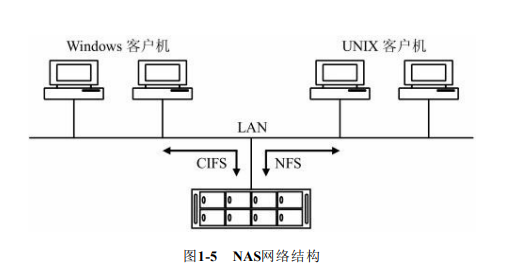
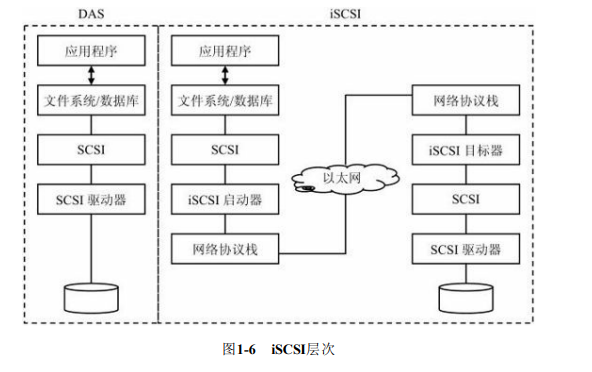
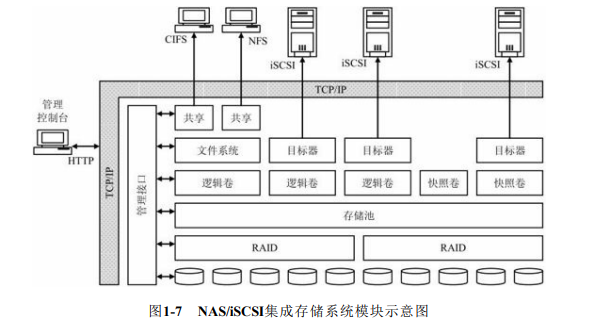
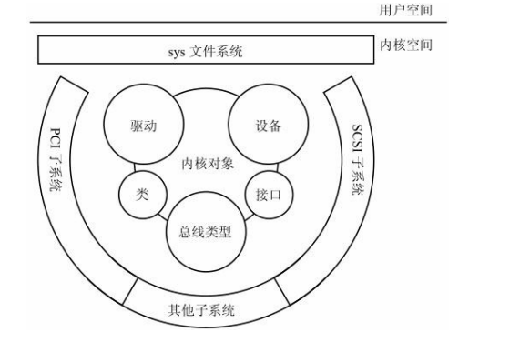
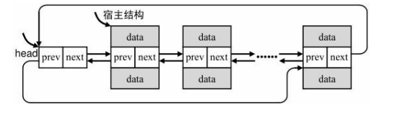
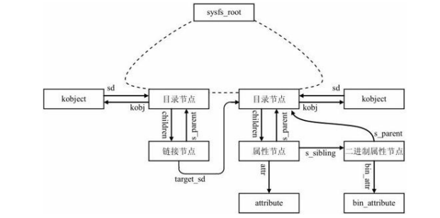
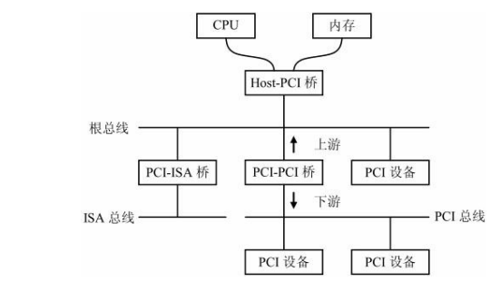
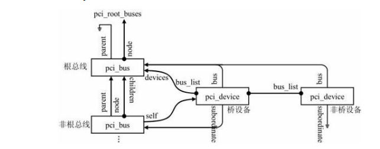
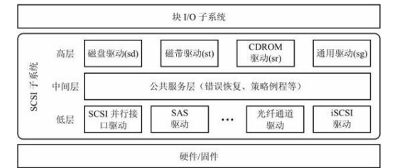
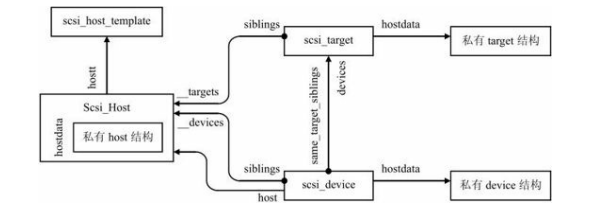

#### 存储设备

##### 磁盘柜

磁盘柜一般分为磁盘阵列（disk array）和磁盘族（jbod）两种；

RAID（Redundant Array of Independent Disks），即“独立磁盘冗余阵列”或者简称
为“磁盘阵列”，基本思想就是把多个独立的磁盘组合起来，成为一个磁盘阵列组，以
获得一个或多个方面的好处：增加容量（Capacity）、提升性能（Performance）、增强
容错性（Redundancy）和降低成本（Cost）。
JBOD（Just a Bundle Of Disks）译成中文可以是“简单磁盘捆绑”或者“磁盘簇”。在
Linux中，它相当于Linear RAID模式，但这不是标准的RAID级别，JBOD在逻辑上把几
个物理磁盘一个接一个串联到一起，从而提供一个大的逻辑磁盘。

##### NAS存储设备

NAS是一种将存储设备和应用服务器分开的机制，它使用CIFS和NFS向客服端提供文件级服务。

##### iSCSI存储设备

isCSI存储设备既以硬件方式或者软件方式实现IsCSI协议目标端的存储设备。

iSCSI，即Internet SCSI或SCSI over TCP/IP，是IETF制定的一项基于IP的存储网络标
准，用于连接数据存储设备。透过在IP网络上传输SCSI命令，iSCSI可以摆脱SCSI总线
的距离限制。iSCSI被用于在局域网（LAN）、广域网（WAN）或者Internet上传输数
据，实现位置无关的数据存储及检索。iSCSI是一个广为流行的存储区域网络协议，允
许企业将存储归并到数据中心，同时向应用服务器提供无区别于本地磁盘的幻想。和
传统的Fibre Channel不同，iSCSI不需要专用的线缆，可以在现有的网络基础设施上长
距离传输。

##### NAS/iSCSI集成存储设备

NAS/iSCSI集成存储设备结合了NAS存储设备和iSCSI存储
设备的优势，同时支持iSCSI磁盘和本地磁盘，对外支持CIFS协议和iSCSI协议，即支
持块数据和文件数据，理论上可以整合无限的存储容量，构建RAID和LVM，灵活配置
成纯文件服务器、纯iSCSI目标器，或者将存储空间分别用于文件服务和块服务。

#### Linux 驱动模型

Linux内核基于kobject内核对象机制将系统中的总线、设备和驱动设备分别用bus_type、device和device_driver等对象描述将其组织成一个层次结构的系统，统一管理各种内别的设备以其接口，同时借助sysdfs文件系统将其内核所见的设备展给用户空间，提供一个完全层次结构的用户视图。

Linux驱动模型的核心内容综合如下：

1. 以内核对象为基础
2. 用sysfs文件系统导出到用户空间
3. 将Linux子系统表达为总线类型/驱动/设备/类/接口的关系，分别用bus_type、device、device_driver、class和class_interface结构表示

##### 引用计数

引用计数的主要功能为：

1.  防止内存泄漏：确保已分配的对象最终会被释放；
2. 防止访问已释放的内存：确保不会使用已经被释放的对象

Linux内核提供了相关函数进行操作：

1. void kref_init (struct kref *kref);初始化对象，将对象引用次数设置为1，而不是0；这是因为生成该对象的代码也需要最初的引用，以防止其他部分在调用kref_put时释放该对象
2. void kref_get (struct kref *kref); 递增对象的引用计数。在这之前，确保引用次数不为0，否则答应一条警告信息。这可以防止常见的错误：不先调用kref_init，而直接调用kref_get。
3. int kref_put (struct kref *kref, void (*release) (struct kref *kref));递减对象的引用计数。如果该计数减为0，则表明是该对象的最后一个引用，因此传入的release函数被调用，以回收这个对象用到的内存。

##### 内核对象及集合

Linux驱动模型的基础是内核对象。它将总线类型、设备、驱动等都看作是内核对
象。表示内核对象的结构是kobject，相当于Linux驱动模型的“基类”

在Linux内核中的双循环链表实现方式下：
● 链表结构作为一个成员嵌入到宿主数据结构内；
● 可以将链表结构放在宿主结构内的任何地方；
● 可以为链表结构取任何名字；
● 宿主结构可以有多个链表结构。

##### sysfs文件系统

sysfs核心负责为内核中的内部表示和用户空间的外部呈现之间建立对应关系，也称为sysfs映射：

- 内核对象被映射为用户空间的目录
- 对象属性被映射为用户空间的常规文件
- 对象关系被映射为用户空间的符号链接

sysfs核心确实将内核对象、对象属性以及对象关系也组织成树的结构。sysfs内部树中有四种类型的节点：目录节点、链接节点、属性节点和二进制属性节点，分别和内核对象、对象关系、对象属性相对应。

##### 驱动模型对象

Linux驱动模型适用于linux各种子系统，它描述了总线类型、设备、驱动以及类和接口之间的关系。每一个子系统都有属于自己的唯一的总线类型。它上面链接了注册了这一总线类型的多个设备。另外它还注册了到这个总线类型的多个驱动链接在一起。

总线类型：Linux驱动模型中的总线类型结构使用bus_type和bus_type_private两个结构体来表
示

设备：Linux驱动模型中的设备，我们有时简称为驱动模型设备，使用device和device_private两个结构体来表示

驱动：同总线类型和设备一样，在Linux驱动模型中表示一个驱动也需要两个结构体：device_driver和driver_private。这两个结构体同时存在，并且一一对应。

#### PCI子系统

PCI是外围设备互联的简称，是一种通用总线的接口标准。PCI总线是一种常见的主机I/O总线，用于链接高速的外部设备。

PCI总线体系是结构是一种层次式的体系结构。

● PCI设备：遵循PCI规范，工作在PCI局部总线环境下的设备。典型的PCI设备
是封装在集成线路板（IC Package）中，或者集成到PCI扩展卡上的完整的外围元件适
配器。通常见到的有网络、显示或者SCSI适配器。PCI局部总线规范指出，每个PCI设
备可以包含最多8个PCI功能，每个功能是一个逻辑设备。
● PCI桥设备：由于电子负载限制，每条PCI总线上可以挂载的设备数目是有限
的，因此使用了一种特殊的设备，即PCI-PCI桥设备。PCI-PCI桥为两条独立的PCI总线
提供连接。PCI-PCI桥设备也是一种广义上的PCI设备。在本文中，PCI-PCI桥设备简称
PCI桥。
● 主桥设备：PCI桥设备和PCI设备最终通过Host-PCI桥设备连接到CPU，使整个
系统看起来像一颗倒置的树状结构，树的顶端是CPU和内存。由Host-PCI桥设备引出的
PCI总线也称为PCI根总线。在本文中，Host-PCI桥设备简称为主桥。

##### PCI子系统对象

在PIC子系统中有PCI总线和PCI设备，基于这两个核心的x抽象，linux PCI子系统定义了两个关键的数据结构：pci_bus和pci_dev,以此来描述PCI总线和PCI设备

pci_bus：PCI总线：pci_bus是描述PCI总线的结构。无论是根PCI总线，还是非根PCI总线，都对应一个pci_bus描述符

pci_dev：PCI设备：由于每条PCI总线上可以挂载的物理设备数目是有限的，因此作为扩展，每个物理设备可以包含多个功能，即逻辑设备。从物理硬件的角度，PCI设备实际上指的是包含从一个到八个“功能”的某个PCI硬件，它被集成到系统主板上，或者安装在插槽中，这是PCI物理硬件的概念

#### SCSI子系统

Linux SCSI子系统是一种分层的架构，共三层。

- 低层：最低一层代表是适用于SCSI的物理接口的实际驱动器。

- 中间层，也称公共层或统一层，在这一层包含SCSI堆栈的高层和底层的公共服务函数。

- 高层：高层代表着各种SCSI设备类型的驱动。

  

##### SCSI子系统对象

Scsi_Host、scsi_target和scsi_device分别描述的是Linux SCSI模型中的主机适配器、目标节点和逻辑单元。

