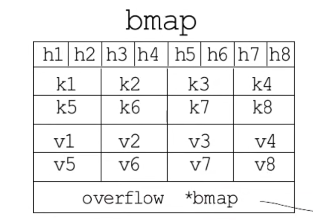
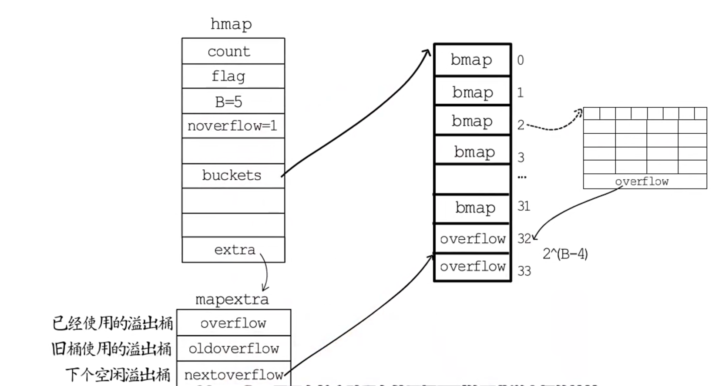
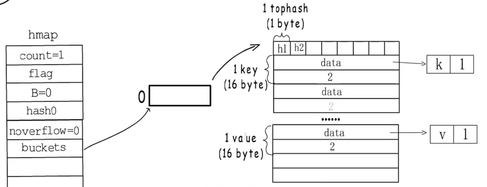

# goland 基础之map

## map的内部结构
* go map是使用的哈希表构建的
* map的结构可分为：hmap的结构体和bmap(桶)，hmap结构体记录这map的基础信息(包括map存储个数，
桶的个数，hash种子，桶的数据，扩容时旧桶的数据以及迁移个数（map扩容不是一次性迁移完）)
* 源码如下

> 

```
定义hmap的结构：
type hmap struct {
	// Note: the format of the hmap is also encoded in cmd/compile/internal/gc/reflect.go.
	// Make sure this stays in sync with the compiler's definition.
    // map 存储元素的计数
	count     int // # live cells == size of map.  Must be first (used by len() builtin)
    flags     uint8 // map的状态标识，桶是否在增改，扩容或者缩容
    //桶的个数/采用的与运算法计算桶的个数，桶的个数为2的整数次幂
	B         uint8  // log_2 of # of buckets (can hold up to loadFactor * 2^B items)
	//溢出的桶的数量的近似值
    noverflow uint16 // approximate number of overflow buckets; see incrnoverflow for details
	hash0     uint32 // hash seed
    //指向桶数据的指针
	buckets    unsafe.Pointer // array of 2^B Buckets. may be nil if count==0.
	// 指向旧桶数据的指针
    oldbuckets unsafe.Pointer // previous bucket array of half the size, non-nil only when growing
	//扩容计数
    nevacuate  uintptr        // progress counter for evacuation (buckets less than this have been evacuated)
    // 保存溢出桶的链表和未使用的溢出桶数组的首地址
	extra *mapextra // optional fields
}
// 桶的实现结构
type bmap struct {
	// 当前版本bucketCnt的值是8，一个桶最多存储8个key-value对
	tophash [bucketCnt]uint8
}

```

* bmap存储结构如图所示  

* 前8个是hash值，8个key和8个value、后面是溢出桶的指针
* 溢出桶是减少map扩容次数，溢出桶的结构与bmap桶的结构一样的
* 溢出桶的基础结构：
> 
```// mapextra holds fields that are not present on all maps.
  type mapextra struct {
  	// If both key and elem do not contain pointers and are inline, then we mark bucket
  	// type as containing no pointers. This avoids scanning such maps.
  	// However, bmap.overflow is a pointer. In order to keep overflow buckets
  	// alive, we store pointers to all overflow buckets in hmap.extra.overflow and hmap.extra.oldoverflow.
  	// overflow and oldoverflow are only used if key and elem do not contain pointers.
  	// overflow contains overflow buckets for hmap.buckets.
  	// oldoverflow contains overflow buckets for hmap.oldbuckets.
  	// The indirection allows to store a pointer to the slice in hiter.
  	overflow    *[]*bmap  //记录已经被使用的溢出桶
  	oldoverflow *[]*bmap  // 扩容阶段旧的溢出桶
  
  	// nextOverflow holds a pointer to a free overflow bucket.
  	nextOverflow *bmap   //指向下一个空闲的溢出桶
  }
```
* 当桶的个数大于2的4次方时就会使用溢出桶源码如下
```
func makeBucketArray(t *maptype, b uint8, dirtyalloc unsafe.Pointer) (buckets unsafe.Pointer, nextOverflow *bmap) {
	// 桶的个数
    base := bucketShift(b)
	nbuckets := base
	// For small b, overflow buckets are unlikely.
	// Avoid the overhead of the calculation.
	if b >= 4 {
        // 使用溢出桶
		// Add on the estimated number of overflow buckets
		// required to insert the median number of elements
		// used with this value of b.
		nbuckets += bucketShift(b - 4)//计算溢出桶的数量和不是溢出桶的数量的和
		sz := t.bucket.size * nbuckets
		up := roundupsize(sz)
		if up != sz {
			nbuckets = up / t.bucket.size //得出桶的数量
		}
	}

	if dirtyalloc == nil {
        // 没有被创建桶，申请创建桶的，返回桶的首地址
		buckets = newarray(t.bucket, int(nbuckets))
	} else {
		// dirtyalloc was previously generated by
		// the above newarray(t.bucket, int(nbuckets))
		// but may not be empty.
		buckets = dirtyalloc
		size := t.bucket.size * nbuckets
		if t.bucket.ptrdata != 0 {
			memclrHasPointers(buckets, size)
		} else {
			memclrNoHeapPointers(buckets, size)
		}
	}

	if base != nbuckets {
		// We preallocated some overflow buckets.
		// To keep the overhead of tracking these overflow buckets to a minimum,
		// we use the convention that if a preallocated overflow bucket's overflow
		// pointer is nil, then there are more available by bumping the pointer.
		// We need a safe non-nil pointer for the last overflow bucket; just use buckets.
		//空闲桶的地址
        nextOverflow = (*bmap)(add(buckets, base*uintptr(t.bucketsize)))
		last := (*bmap)(add(buckets, (nbuckets-1)*uintptr(t.bucketsize)))
		last.setoverflow(t, (*bmap)(buckets))
	}
	return buckets, nextOverflow
}
```
* 如图所示  

* 使用map时需要make(map[type]type,len,cap)才能使用。
* make 源码如下：

> 

```
func makemap(t *maptype, hint int, h *hmap) *hmap {
    // 判断是否超过内存的限制
	mem, overflow := math.MulUintptr(uintptr(hint), t.bucket.size)
	if overflow || mem > maxAlloc {
		hint = 0
	}

	// initialize Hmap
	if h == nil {
		h = new(hmap)
	}
	h.hash0 = fastrand()// 获取随机的hash值

	// Find the size parameter B which will hold the requested # of elements.
	// For hint < 0 overLoadFactor returns false since hint < bucketCnt.
	B := uint8(0)
	for overLoadFactor(hint, B) {
		B++
	}
	h.B = B

	// allocate initial hash table
	// if B == 0, the buckets field is allocated lazily later (in mapassign)
	// If hint is large zeroing this memory could take a while.
	if h.B != 0 {
		var nextOverflow *bmap
        // 创建map的存储数据，返回的桶的数据的地址，下一个溢出桶的地址
		h.buckets, nextOverflow = makeBucketArray(t, h.B, nil)
		if nextOverflow != nil {
			h.extra = new(mapextra)
			h.extra.nextOverflow = nextOverflow
		}
	}

	return h
}
```

* map的完整结构如图：

  
  ## map扩容

  ### 扩容条件

1. 当负载因子(loadFactorNum*(bucketShift(B)/loadFactorDen>6.5  -> 翻倍扩容
2. 当负载因子小于6.5，但是溢出桶的数量大于2的15次方  -> 等量扩容
3. 源代码如下：
   
   > 

```
// overLoadFactor reports whether count items placed in 1<<B buckets is over loadFactor.
// 负载因子大于6.5
func overLoadFactor(count int, B uint8) bool {
	return count > bucketCnt && uintptr(count) > loadFactorNum*(bucketShift(B)/loadFactorDen)
}
// 溢出桶过多时
func tooManyOverflowBuckets(noverflow uint16, B uint8) bool {
	// If the threshold is too low, we do extraneous work.
	// If the threshold is too high, maps that grow and shrink can hold on to lots of unused memory.
	// "too many" means (approximately) as many overflow buckets as regular buckets.
	// See incrnoverflow for more details.
	if B > 15 {
		B = 15
	}
	// The compiler doesn't see here that B < 16; mask B to generate shorter shift code.
	return noverflow >= uint16(1)<<(B&15)
}
// 扩容源码

func hashGrow(t *maptype, h *hmap) {
	// If we've hit the load factor, get bigger.
	// Otherwise, there are too many overflow buckets,
	// so keep the same number of buckets and "grow" laterally.
	bigger := uint8(1)
	if !overLoadFactor(h.count+1, h.B) {
        //等量扩容
		bigger = 0
		h.flags |= sameSizeGrow
	}
	oldbuckets := h.buckets
	newbuckets, nextOverflow := makeBucketArray(t, h.B+bigger, nil)// 从新分配数据地址

	flags := h.flags &^ (iterator | oldIterator)
	if h.flags&iterator != 0 {
        // 迭代的时候搬迁旧桶
		flags |= oldIterator
	}
	// commit the grow (atomic wrt gc)
	h.B += bigger  // 桶的个数
	h.flags = flags
	h.oldbuckets = oldbuckets
	h.buckets = newbuckets
	h.nevacuate = 0
	h.noverflow = 0
    // 溢出桶钻便为旧溢出桶
	if h.extra != nil && h.extra.overflow != nil {
		// Promote current overflow buckets to the old generation.
		if h.extra.oldoverflow != nil {
			throw("oldoverflow is not nil")
		}
		h.extra.oldoverflow = h.extra.overflow
		h.extra.overflow = nil
	}
	if nextOverflow != nil {
		if h.extra == nil {
			h.extra = new(mapextra)
		}
		h.extra.nextOverflow = nextOverflow
	}

	// the actual copying of the hash table data is done incrementally
	// by growWork() and evacuate().
}
```
## 参考文献

1.[https://www.zhihu.com/people/kylin-lab](https://www.zhihu.com/people/kylin-lab) 