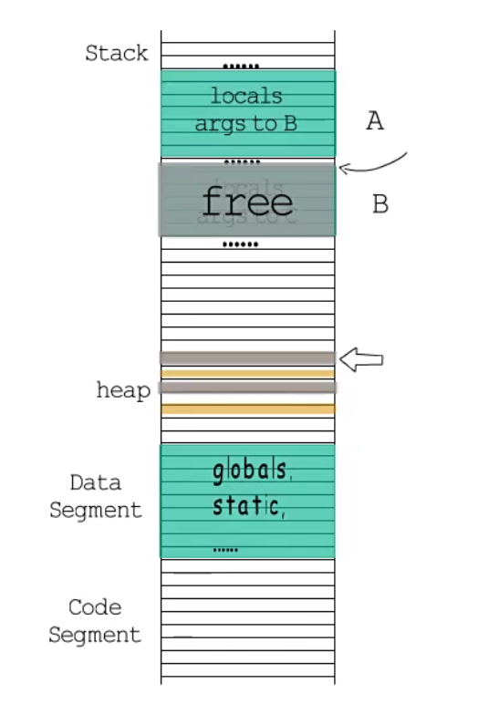
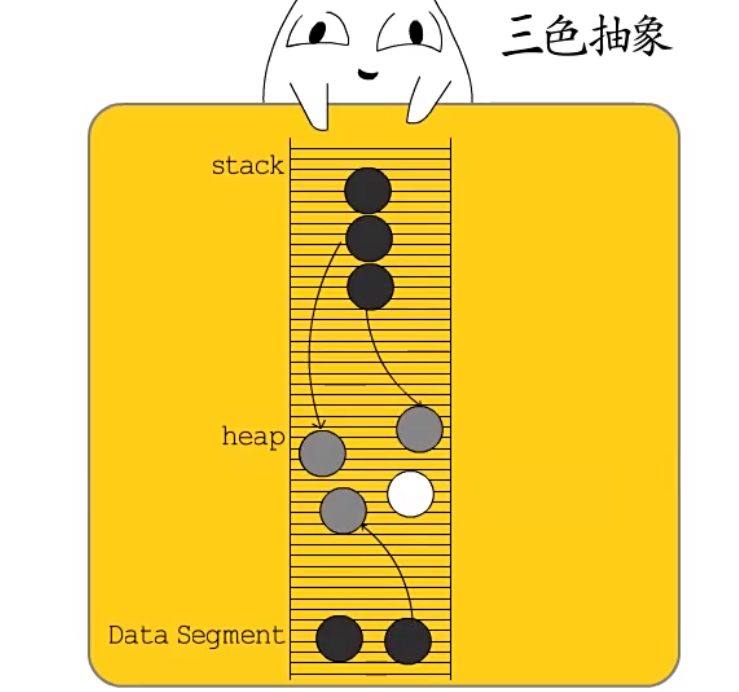
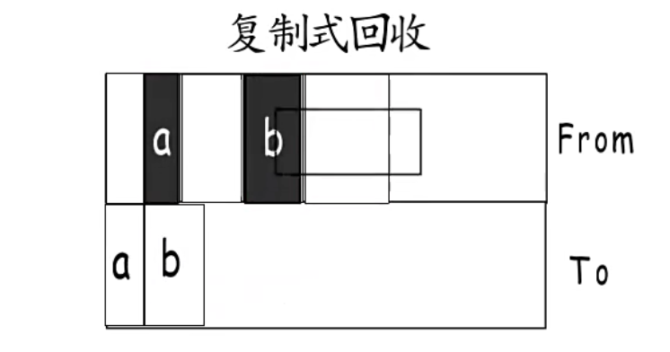
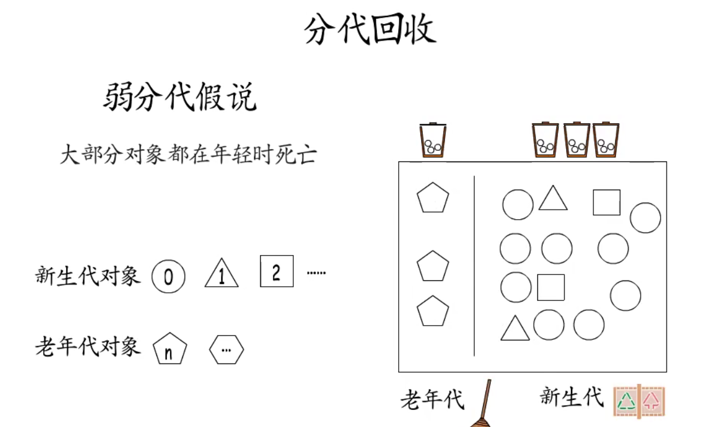
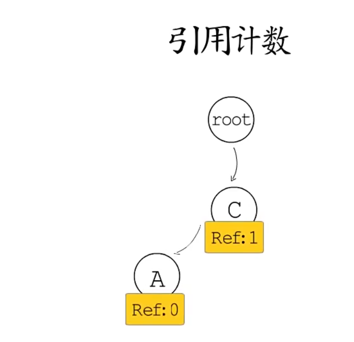
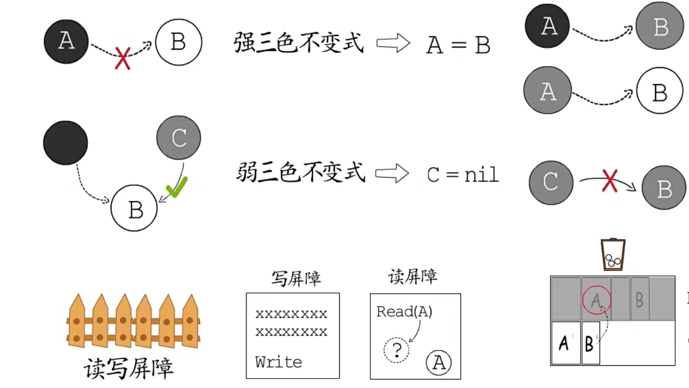
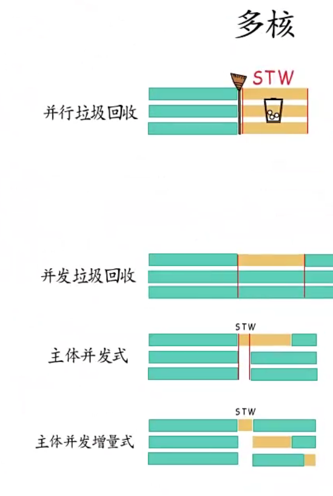

## 虚拟地址空间布局 
* 程序通过编译成为一堆的机器指令写入可执行文件，程序在运行是会将可执行文件加载在计算机的内存中
在虚拟地址空间分布中处于代码段。
* 程序中的局部变量、函数的参数、函数的返回值等数据会保存在虚拟地址的栈中(栈是先进后出的数据结构)
栈空间的编译器分配和释放。
* 程序的全局变量和静态变量会保存在虚拟地址的数据段
* 动态分配内存的地址会保存在虚拟地址空间的堆上。堆空间是动态开辟的内存空间，需要主动开辟和释放。或者
调用GC释放  

### 堆内存管理
* 堆内存空间不是编译器分配，而是有程序动态分配的内存空间。
#### 手动垃圾回收 
* 需要程序主动释放没有用的数据所在的堆空间。如：c++中调用new()函数向计算机申请开辟内存空间后，使用delete或delete[]释放不需要的
堆内存空间。这一类是手动内存分配和释放。手动内存分配使用不恰当也会造成：内存泄露
悬挂指针的问题
1. 过早释放会造成悬挂指针（野指针）：提前释放了动态的堆内存的空间，当程序访问这段地址时会报错。因为这段提前释放的内存空间被清空、
重新分配或者被操作系统回收。释放指针时将指针赋值为NULL，在访问时对指针进行判断是否为NULL
2. 不释放内存会造成内存泄漏：堆内存需要手动释放，当程序运行结束不释放，这段内存就会被一直占用。如果
一直在分配不释放会一直占用计算机的内存，直到内存被占完。将new与delete配套使用，使用工具检测或者打印出堆信息
### 自动垃圾回收（GC）
* 在程序运行过程中自动释放没有用的数据所在的堆空间（垃圾回收).在虚拟内存空间中能从栈或者数据段的根节点追踪不到的数据为没用的数据
（内存垃圾），常用的算法：标记法, 计数法
#### 标记法回收
* 标记法：将栈或者数据段作为根（root）进行追踪,将能追踪得的数据（堆空间）进行标记。没有被标记的数据
（堆空间）就是垃圾，将这部分垃圾进行回收。三色抽象：
1. 垃圾回收开始时，将所有数据为白色
2. 垃圾回收开始时，将所有的栈或者数据段的根节点设置为灰色
3. 在根据根节点进行追踪，直到所有的数据节点追踪结束后将根节点置为黑色，在将根节点的下一节点作为根节点进行追踪
4. 所有的数据节点都追踪完后，会剩下黑色和白色的数据节点。黑色表示有用的数据。白色为无用的数据。将白色的数据进行回收（堆空间的释放）
   
* 标记法实现简单，但是会造成内存的碎片化(内存块中是可使用小内存块，造成大内存块不能使用这块内存，这些小小内存块也不能使用)
* 因为内存碎片化的问题诞生了
1. 标记整理法，就是标记法之后，将有用的数据堆内存空间移动在一起，释放更多连续的堆空间,但是这种做法带来
很大的开销，因为需要不断的扫描内存和移动内存
2. 复制回收法。将堆内存分为from和To两个相同的堆内存空间。程序执行时，使用from的堆空间。垃圾回收时会扫描from
的堆内存空间，将有用的数据复制到To的堆空间上。垃圾回收结束时，将To堆空间设置为From堆空间。将原来的from
堆空间全部回收后置为Ton堆空间。但是复制回收法只会使用一般的堆内存空间，造成堆内存空间利用率不高  
3. 分代法回收：大部分对象都会在年轻时候死亡（弱分代假说）把新建的对象称之为新生代对象。经过特定次数的GC(垃圾回收)数据依然有用的对象称为
老年代对象。而大部分会在新生代对象就会垃圾回收了，在结合复制回收法使用  
#### 计数法回收
* 引用计数指的是对象被引用的次数，程序在运行过程中会更新引用次数。对象引用越多，计数越大，当计数为0时，回收该对象（堆内存空间）
引用计数法可以在运行中更新对象的计数，可以及时判断计数为 0的对象，然后对其及时回收， 但是频繁的更新引用计数也会带来资源消耗  
#### 垃圾回收模式
* 增量式的垃圾回收模式：SWT是用户承程序停下工作处理垃圾回收，但是为了提高cpu执行效率，会减少SWT的时间，经垃圾回收工作分多次进行（用户程序与垃圾回收交替执行）
* 三色不变式：在增量式垃圾回收模式在进行垃圾回收时，会造成用户程序对标色的数据进行更改，当在次执行垃圾回收时，可能会将有用的数据当作垃圾回收了，在标色法中，当黑色数据节点可以引用白色的数据节点，但是没有灰色节点能引用这个白色节点，白色数据节点就被当作垃圾被回收
避免这样的发生，在垃圾回收时建立读写屏障。在三色中确保黑色的数据节点不引用白色的数据节点，就不会误判有用的数据当作垃圾回收了，这种叫做：强三色不变式
如果当黑色的数据节点能引用白色数据节点，同时确保回收节点也能引用白色节点，也能避免有用的数据被当作垃圾回收，这叫：弱三色不变式  
* 并行垃圾回收：在多核下，使用多线程对垃圾回收，需要做好的负载均衡和规避数重复处理带来的问题，如在复制回收中，可能将同样的数据从from复制到to
* 并发垃圾回收：垃圾回收与用户程序并发执行，可能会造成垃圾回收与用户程序的资源竞争等问题等 
* 主体并发回收：在时刻使用swt回收，在莫时刻又使用并发垃圾回收
* 主体并发增量式回收: 是融合了增量式的垃圾回收模式和主体并发回收模式  
#### 内存逃逸
- 悬挂指针：因内存回收错误导致
    - 例如：int *suspend_pointer{int i= 2; return &i;}
- 内存逃逸分析：程序在编译阶段根据代码中的数据流，对代码中的那些变量需要在栈中分配
那些在堆上分配进行静态分配的方法
- 逃逸分析的两个原则：
    - 指向栈对象的指针不能存活在堆中
    - 指向栈对象的指针不能在栈对象回收后存活

## 参考文献
1.[https://www.zhihu.com/people/kylin-lab](https://www.zhihu.com/people/kylin-lab)