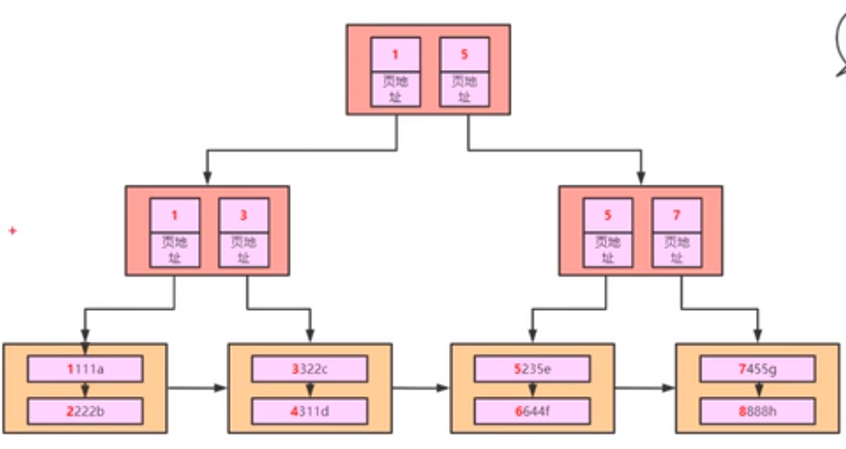

## 索引
- 索引是帮助数据库获取有序数据的数据结构，实现快速检索
### 数据库索引的数据结构
#### 哈希表(hash)
* 通过哈希函数，实现key-value的存储，同时可以使用开放地址法和拉链法解决哈希冲突，对查询单个值的
时间复杂度为O(1)，例如查找id=1：select * from user where id=1
,但对范围查询十分的不友好,例如查找范围id>100的值：select * from user where id >100;
#### 二叉树
* 二叉树的数据结构左小右大，可以通过中序遍历直接获取所有升序的数据，二叉树的查询的时间复杂度为
O(lgn),缺点是二叉树容易退化链表，增加数据的查找的时间。在最坏的情况下的时间复杂度为O(n)
#### 平衡二叉树(AVL)和红黑树
* 通过左旋和右旋以及节点颜色的改变等方式调整树避免退化为链表，使二叉树保持平衡转态，保证树的查找性能
即时间复杂度在O(lgn)。但是二叉树不适合用做数据的底层数据结构原因如下：
> 1.数据库的查询的瓶颈在于对磁盘io的操作，当存储大量数据的情况下，要保证树的平衡的时候，树的高度
>是在不断的增加，在对每一个节点的操作时，就是对磁盘io的操作，即对磁盘io的操作过于的频繁，增加了对数据库
>查询等时间。
> 2 每个节点的分配的内存是16kb的数据量，对于二叉树的节点保持的数据是下于16KB,当数据过低时，也会造成内存的浪费
#### B树
* B树是一种平衡多分树，节点最多含有N颗子树(指针)，N-1个关键字(数据存储空间) (N>=2);除了根节点和叶子节点外，其它每个节点至少有M=N/2个子节点，M向上取整，即分裂的时候从中间分开，分成M棵子树；
 若根节点不是叶子结点，则至少有两颗子树。B树解决了二叉树的高度问题，即减少了对磁盘io的操作，减少了数据库的时间,查询的时间复杂度为
 h*O(lgn),h为树的高度。但是也存在一下问题
 > 1.不太适合范围的查询，存在索引的失效
 > 2.稳定性较弱，节点存储的数据较大，占用的内存空间较大
#### B+树
* B+树和B树类似,B+树的非叶子节点不会存储数据，只存储索引值(指针地址)，所有的数据都是存储在叶子节点，其目的是为了增加系统的稳定性。
应为节点存储的索引，叶子节点存储数据，叶子节点用了链表连接起来，这个链表本身就是有序的，在数据范围查找时，更具备效率
，保证了存储空间的使用。高度不高，减少了对磁盘的io的操作，保证了查询的效率。

### 存储引擎
#### InnoDB引擎
##### 引擎特点
1.将数据存储在表空间中，表空间由一系列的数据文件组成，由InnoDB管理；

2.支持每个表的数据和索引存放在单独文件中(innodb_file_per_table)；

3.支持事务，采用MVCC来控制并发，并实现标准的4个事务隔离级别，支持外键；

4.索引基于聚簇索引建立，对于主键查询有较高性能；

5.数据文件的平台无关性，支持数据在不同的架构平台移植；

6.能够通过一些工具支持真正的热备。如XtraBackup等；

7.内部进行自身优化如采取可预测性预读，能够自动在内存中创建hash索引等。
##### 引擎实现
* InnoDB是采用的是B+树作为索引的结构，其存储文件分别是.frm表的定义文件和.idb的数据文件。InnoDB是支持行锁和表锁的。InnoDB 支持事务，且支持四种隔离级别（读未提交、读已提交、可重复读、串行化），默认的为可重复读
表数据文件本身就是按B+Tree组织的一个索引结构，这棵树的叶节点data域保存了完整的数据记录。这个索引的key是数据表的主键，因此InnoDB表数据文件本身就是主索引。

#### MyISAM引擎
#### 引擎特点
1.MySQL5.1中默认，不支持事务和行级锁；

2.提供大量特性如全文索引、空间函数、压缩、延迟更新等；

3.数据库故障后，安全恢复性差；

4.对于只读数据可以忍受故障恢复，MyISAM依然非常适用；

5.日志服务器的场景也比较适用，只需插入和数据读取操作；

6.不支持单表一个文件，会将所有的数据和索引内容分别存在两个文件中；

7.MyISAM对整张表加锁而不是对行，所以不适用写操作比较多的场景；

8.支持索引缓存不支持数据缓存。
#### 引擎实现
MyISAM引擎使用B+Tree作为索引结构，叶节点的data域存放的是数据记录的地址。其存储的文件有三个分别是：.frm表的定义文件、.MYD为数据文件和.MYL索引文件。
Myisam 只支持表锁，且不支持事务。Myisam 由于有单独的索引文件，在读取数据方面的性能很高 
### 
## 参考文献：
[MySQL运行原理与基础架构](https://www.linuxidc.com/Linux/2014-04/99721.htm)
