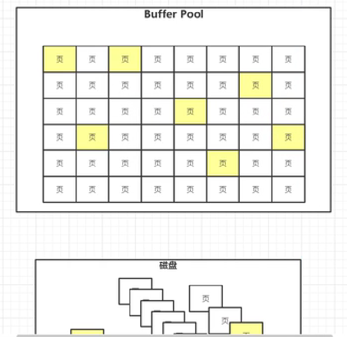
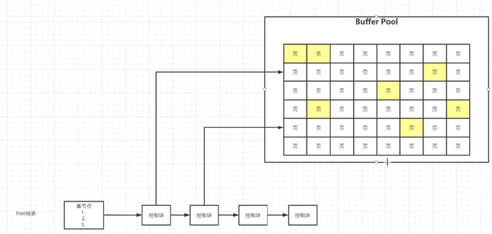
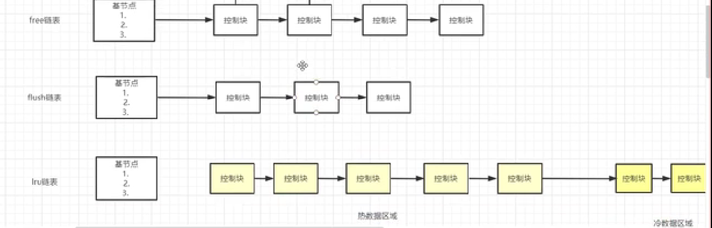
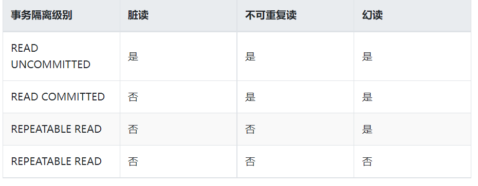

## 事务
* 事务就是一组原子性的SQL语句.
### buffer Pool 
* 当启动mysql会开启默认为128M的内存空间来保存从磁盘获取的页的数据到这块内存空间。

* InnoDB通过free链表来管理buffer Pool中的空闲页，通过控制块来指向空白页.即从磁盘中的获取的页数据通过
控制块放入到buffer Pool中对应的空闲页中。
* 通过flush链表来管理buffer Poll中的脏页(通过事务修改过的页)。通过链表中控制块指向脏页。
* 通过lru链表来对Buffer Pool中的页进行淘汰。通过头插法将最新的页插入到链表中的控制块。当buffer Pool中的页满后，删除链表最后的控制块。
也存在当全表扫描时，也造成数据的覆盖，性能下降。因此链表被划分为热数据区域(5/8)和冷数据区域(3/8)。当两次访问页的时间大于1秒时，把页放入到热数据的控制块
，否则就放入冷数据页，避免了全表扫描造成热数据被覆盖。生成redo log后，mysql通过后台进程经将脏页持久化到磁盘。当MySQL挂了之后，
会通过redo log恢复数据。

### 事务具有的ACID的特性
1. 原子性:事务中所有的操作那么全部提交成功，要么全部失败回滚
2. 一致性：数据库总是从一个一致性状态转换到另一个一致性的状态
3. 隔离性：一个事务在所做修改在提交前对其他事务是不可见的
4. 持久性：一旦事务提交，说有的修改都会永久保存在数据库中
#### 事务的隔离级别
1. 读未提交：事务中的修改即使未提交也是对其他事务可见，这级别的事务隔离有脏读、重复读、幻读的问题。  
2. 读也提交：事务提交后所做的修改才会被另一个事务所看见，可能产生一个事务中两次查询的结果不同。
3. 可重复读： 只有当前事务提交才能看见另一个事务的修改结果。解决了一个事务中两次查询的结果不同的问题。
4. 可串行化：只有一个事务提交之后才会执行另一个事务。

#### 死锁
* 死锁：两个或多个事务在同一资源上相互占用并请求锁定对方占用的资源，从而导致恶性循环的现象。MySQL的部分存储引擎能够检测到死锁的循环依赖并产生相应的错误。InnoDB引擎解决死锁的方案是将持有最少排它锁的事务进行回滚
### MVCC原理
* mvcc 多版本并发控制：指在读取数据时通过一种类似快照的方式将数据保存下来，这样读锁和写锁不冲突。是 innodb 实现事务并发与回滚的重要功能。
#### 版本链
* 每次更新后，都会将旧值放到一条 undo log 中，就算是该记录的一个旧版本，随着更新次数的增多，所有的版本都会被roll_ptr 属性连接成一个链表，我们把这个链表称之为版本链，版本链的头节点就是当前记录最新的值
> trx_id：每次一个事务对某条聚簇索引记录进行改动时，都会把该事务的事务id赋值给trx_id隐藏列。
> roll_pointer：每次对某条聚簇索引记录进行改动时，都会把旧的版本写入到undo日志中，然后这个隐藏列就相当于一个指针，可以通过它来找到该记录修改前的信息。
#### ReadView
* InnoDB提出了一个ReadView的概念，这个ReadView 中有个 id 列表 trx_ids 来存储系统中当前活跃着的读写事务，也就是 begin 了还未 commit 或 rollback 的事务

## 参考文献：
[MySQL运行原理与基础架构](https://www.linuxidc.com/Linux/2014-04/99721.htm)
