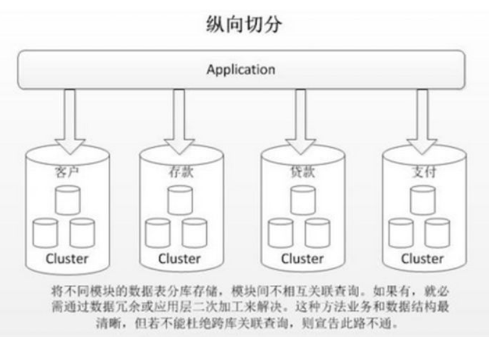
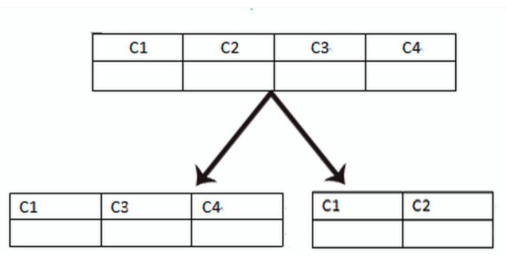
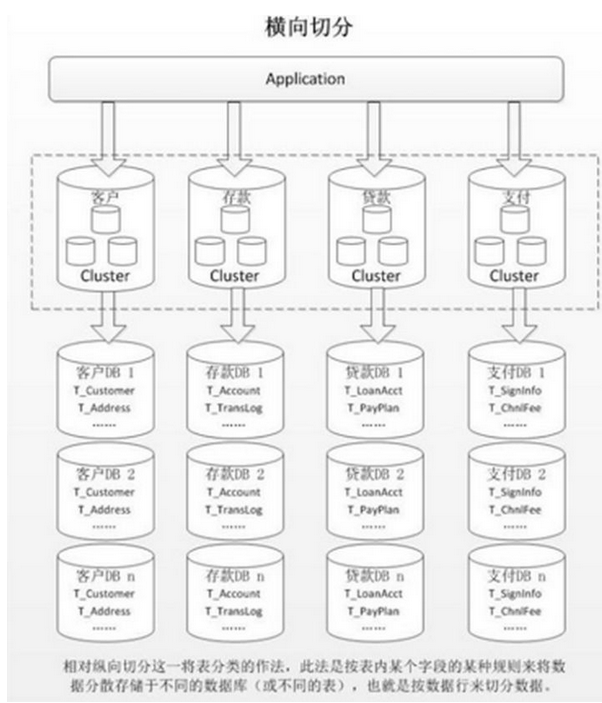

## 数据切分
* 当数据库中的数据或者单表数据过大时，会影响对数据库查询等操作的效率。此时可以减轻数据库的负担
可以将数据库进行拆分，即分库分表。来提高数据库的效率。
* 数据库有两种拆分方式：水平切分和垂直切分

## 垂直切分
### 垂直分库
* 垂直分库：根据业务解耦，以表为单位，将相同业务的表存储在同一数据库中。将大数据库拆分为不同的小数据库。
小数据库的结构和存储的数据不一样。小数据库的并集为大数据库。

* 使用场景高并发时，将数据分类到不同数据库中，提升数据库的查询效率
### 垂直分表
* 垂直分表：是以字段为单位，将表中的不常用的字段和字段名较长的字段拆分到扩展表中，其余放入到主表中。也可以经热数据放入主表，冷
数据放入拓展表。主表和拓展表的数据结构和存储的数据是不一样。将表中的进行冷热数据的拆分，减少了对磁盘io的操作，提升数据库的效率

* 使用场景：表的记录并不多，但是字段多，并且热点数据和非热点数据在一起，单行数据所需的存储空间较大。以至于数据库缓存的数据行减少，查询时会去读磁盘数据产生大量的随机读IO，产生IO瓶颈
### 优缺点
* 优点：业务解耦合，方便对不同业务进行管理，提升数据库的效率
* 缺点：部分表不能join,表中的热数据太多

## 水平切分
### 水平分库和分表
* 都是以字段为单位，通过哈希和随机等策略，将数据分到不同的子库或者子表中。
所有的子库和子表的数据结构一样和数据不一致，即所有子库的数据等于数据库中的数据。形成分布式的效果。

* 使用场景：数据量行数巨大，存在单库读写、存储性能瓶颈，数据量太多，影响了SQL效率，加重了CPU负担，以至于成为瓶颈。
### 优缺点
* 优点：提升系统稳定性和负载能力
* 缺点：事务一致性难以保证

## 数据库的瓶颈
* 数据库的瓶颈可分为：io瓶颈和cpu瓶颈
### io瓶颈
1. 磁盘读写io瓶颈：当热数据过多时，数据库内存(buffer Pool)保存不下时，会产生大量的io。此时就需要进行分库和垂直分表。
2. 网络io瓶颈：请求的数据太多，网络带宽不够，此时就需要分库。
### CPU瓶颈
1. sql中使用了大量的cpu运算的操作。此时需要优化sql,如增加索引
2. 单表数据量大时，且进行全表扫描，查询效率低时，需要水平分表分库。
### 
## 参考文献：
[数据库分库分表思路](https://zhuanlan.zhihu.com/p/104992837)
