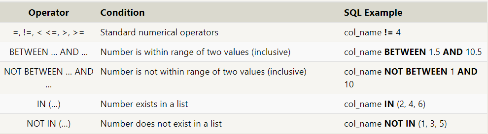
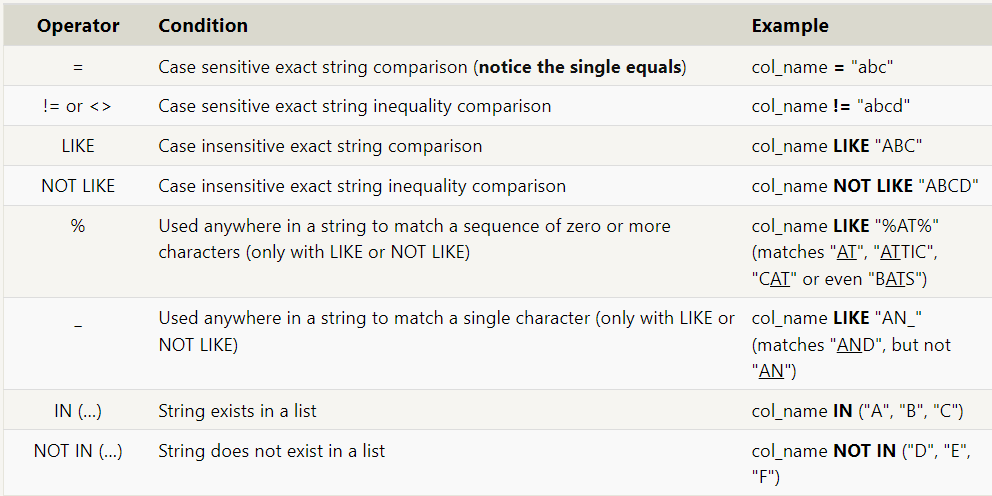
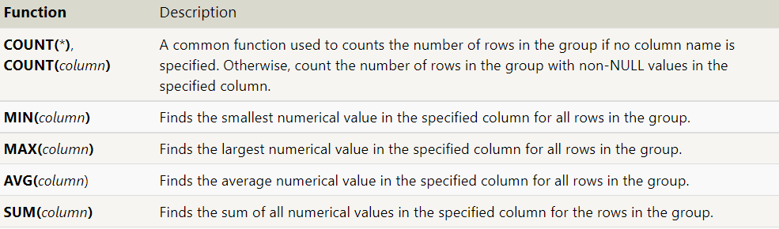
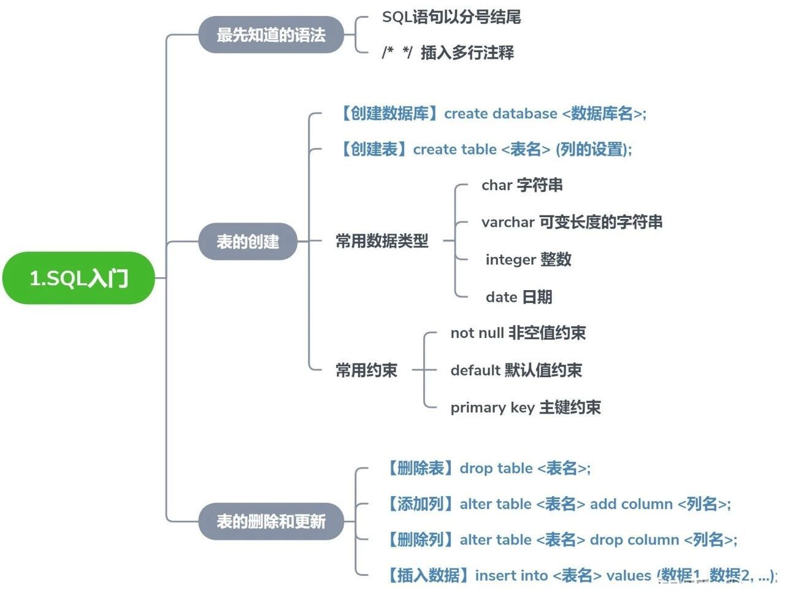
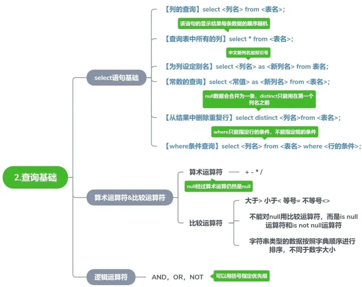
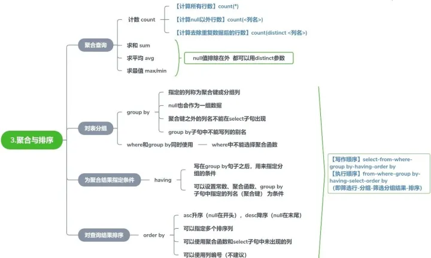
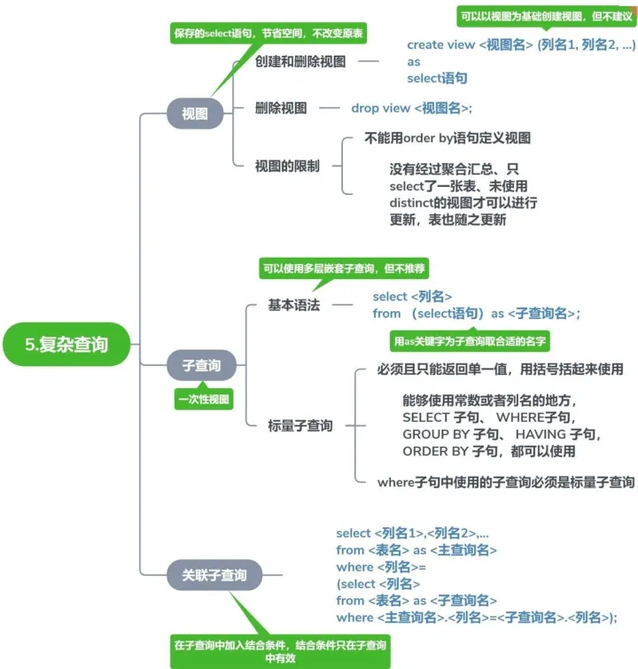

## 查询命令（select）

- 查看表结构：desc 或则show columns from tables;
- 查询特定的列：select column, another_column,…… FROM table;
- 查询所有*：select *from table;
- 带约束查询：SELECT column, another_column, … FROM table WHERE \*condition\*    AND/OR \*another_condition\*    AND/OR …**;



## 对查询结果进行筛选和排序：

- SQL 提供了一种使用关键字丢弃具有重复列值的行的便捷方法(DISTINCT):

  ```sql
    SELECT **DISTINCT** column, another_column, … FROM mytable WHERE *condition(s)*;
  ```

- SQL 提供了一种使用子句按给定列按升序或降序对结果进行排序的方法(`ORDER BY`):
    ```sql
  SELECT column, another_column, … FROM mytable WHERE *condition(s)* **ORDER BY column ASC/DESC**;
  ```
- 将结果限制为子集(ORDER BY``LIMIT``OFFSET``LIMIT``OFFSET):
    ```sql
  SELECT column, another_column, … FROM mytable WHERE *condition(s)* ORDER BY column ASC/DESC **LIMIT num_limit OFFSET num_offset**;
  ```
- 修改表名：alter table old_table_name rename to new_name_name;

- 增加表注释：alter table table_name comment "注释"；

- 增加表字段注释：alter table table_name colunm modify 字段名 类型 comment "注释"；

- 使用 JOIN 的多表查询：共享有关单个实体的信息的表需要具有一个主键，用于在数据库中唯一标识该实体。一种常见的主键类型是自动递增的整数（因为它们节省空间），但它也可以是字符串，散列值，只要它是唯一的。

   ```sql
    SELECT column, another_table_column, …
    FROM mytable
    INNER JOIN another_table 
      ON mytable.id = another_table.id
    WHERE condition(s)
    ORDER BY column, … ASC/DESC
    LIMIT num_limit OFFSET num_offset;
   ```
- 外部连接：在多个表上使用左/右/全联名选择查询：
   ```sql
    SELECT column, another_column, …
      FROM mytable
      INNER/LEFT/RIGHT/FULL JOIN another_table 
        ON mytable.id = another_table.matching_id
      WHERE condition(s)
      ORDER BY column, … ASC/DESC
      LIMIT num_limit OFFSET num_offset;
   ```
- 使用表达式进行查询：

  - 除了使用 SQL 查询和引用原始列数据外，还可以使用*表达式*对查询中的列值编写更复杂的逻辑。这些表达式可以使用数学 字符串函数以及基本算术，用于在执行查询时转换值

    ```sql
    SELECT particle_speed / 2.0 AS half_particle_speed
    FROM physics_data
    WHERE ABS(particle_position) * 10.0 > 500;	
    ```

   - 选择具有表达式别名的查询

        ```sql
        SELECT col_expression AS expr_description, …
        FROM mytable;
        ```

- 使用聚合的查询：SQL 还支持使用 允许您汇总有关一组行的信息的聚合表达式（或函数） 的数据

  ```sql
  SELECT AGG_FUNC(column_or_expression) AS aggregate_description, …
  FROM mytable
  WHERE constraint_expression;
  ```

  

 - GROUP BY：指定列中具有相同值的行进行分组

 ```sql
    SELECT AGG_FUNC(column_or_expression) AS aggregate_description, …
    FROM mytable
    WHERE constraint_expression
    GROUP BY column;
 ```


- HAVING GROUP BY:子句约束的编写方式与子句约束相同，并且 应用于分组行

  ```sql
  SELECT group_by_column, AGG_FUNC(column_expression) AS aggregate_result_alias, …
  FROM mytable
  WHERE condition
  GROUP BY column
  HAVING group_condition;
  ```

## 插入数据
插入数据：将数据插入数据库时，我们需要使用 anstatement，它声明哪个表 要写入的，我们正在填充的数据列，以及要插入的一行或多行数据。在 通常，插入的每一行数据都应包含表中每个相应列的值。 您可以通过按顺序列出来一次插入多行。`INSERT`

   ```sql
        INSERT INTO mytable
        VALUES (value_or_expr, another_value_or_expr, …),
         (value_or_expr_2, another_value_or_expr_2, …),
         …;
        -- 插入具有特定列的语句
        INSERT INTO mytable
        (column, another_column, …)
        VALUES (value_or_expr, another_value_or_expr, …),
            (value_or_expr_2, another_value_or_expr_2, …),
         …;
    
   ```


## 更新数据：UPDATE

  ```sql
        UPDATE mytable
        SET column = value_or_expr, 
        other_column = another_value_or_expr, 
        …
        WHERE condition;
  ```

## 删除行:DELETE,WHERE

  ```sql
        DELETE FROM mytable
        WHERE condition;
  ```

##  主键与外键
- 主键(primary key)：表中唯一标识的一条记录，不能重复，不能为null, 用来保证数据的完整性

- 外键(FOREIGN KEY)：是另一张表中的主键，外键可以重复，可以为null,用来和其他表建立联系，存储引擎为：innodb

  - 外键数据类型必须要与父表中的主键的类型完全一致
  - 一张表中的外键名字不能重复
  - 增加外键字段（数据存在），必须保证数据与父表中的主键要求对应

- 外键的作用：对子表和父表的约束

  - 对子表的约束：在子表进行插入（增和修改）操作时，如果对应的外键字段在父表找不到对应的匹配，那么插入会失败
  - 对父表的约束：在父表中进行插入(删和修改：必须是涉及到主键）操作时，如果对应的主键在子表中也被数据所引用，那么插入操作就会失败；

- 外键的约束，都是针对父表：

  1. distrist:严格模式（默认）：父表不能进行插入操作时（增加或修改，针对着主键），对应主键在子表中被引用的记录
  2. cascade:级联模式：父表操作后，对应的子表也会跟着删除
  3. set null:置空模式：父表操作后，对应的子表的外键字段也会被设置为空
  4. 合理的外键约束模式为：删除时子表设置为空（置空模式），更新时子表级联模式
  5. 语法：foreign key(外键字段) references 父表（主键字段）on delete set null on update cascade;

## 联合查询与子查询
- 联合查询：将多次查询，在记录上进行拼接（字段不会增加），每一次select 语句获取的字段数必须严格一致（但是字段类型无关）

  - 语法：select 语句1 union [union 选项] select 语句 ……
  - union 选项：select选项一样：
    - All 保留所有（不管重复）
    - distinct 去重（整个重复），默认
  - 意义：
    - 单表查询：查询同一张表，但需求不同
    - 多表查询：多张表的结构和数据（结构）完全是一致
  - 在联合查询中使用order by 时，需要对查询语句使用括号，且需要使用limit

- 子查询：查询的结构是在某一个查询之上（一天select语句中包含另一条select）

  - 子查询分类：
    - 按位置分类：子查询语句（select）在外部查询语句（select）的位置：
      - from 子查询：子查询跟在from之后
      - where 子查询：子查询跟在where条件中
      - exists 子查询：子查询是在exists中
    - 按照结果分类：按照子查询的数据进行分类（查询的结构都可以理解为二维表）
      - 标量子查询：子查询查询的结果为一行一列
      - 列子查询：子查询查询的结构为一列多行
      - 行子查询：子查询查询的结构为一行多列（多行多列），需要够着行元素（多个字段构成：eg(id,  name)=(select )），
      - 以上位置都是在where条件语句中
      - 表子查询：子查询查询的结果为多行多列（位置在from之后）

## 视图
- 视图view ：是一种有结构（二维表）但是没结果（结构中不真实存放数据）的虚拟表，结构来源于对应的基表（视图的数据来源）；

  - 创建视图：create view view_name as select 语句，创建完成后很生成对应的frm结构文件；
    - 单表视图：基表来源只有一个
    - 多表视图：基表来源至少两个，字段名不能重复；
  - 查看视图：所有查看表的方式都适用于视图
  - 使用视图：主要是查询使用，将视图当作表一样查询即可，本质是执行分装的select语句；
  - 修改视图：视图本身不可修改，但是可以修改视图的来源(select)；alter view view_name as 新的select 语句；
  - 删除视图：drop view view_name;
  - 视图的意义：
    1. 节省sql语句，将复杂的sql语句保存为视图，可以直接对视图进行操作
    2. 数据安全（相对）：视图操作主要是查询使用，删除视图只是删除结构，不会影响基表的数据；，可以对外提供有用数据，隐藏无用的数据 
    3. 通常在大项目中使用，而且是在多系统中使用；
    4. 视图可以对外友好型，不同的用户使用不同的视图,提供不同的数据；
    5. 视图更容易进行权限控制；
  - 视图数据操作：视图可以进行写操作，但是存在限制，数据在视图中进行操作
    - 视图新增数据：直接对视图数据进行新增
      - 多表视图不能新增，删除数据，可更新数据；
      - 可以向单表中插入，更新，删除数据，但是试图中包含的字段必须在基表中所有不能为null或者没有默认值的字段
      - 更新视图限制：with check option,如果对视图更新的时候， 限定了某个字段，那么在视图更新数据的时，系统会进行验证，保证数据在更新之后，数据依然能被实体查询出来，否则不能更新
      - 视图算法：系统对视图以及外部查询视图的select语句的一种解析方式
        - undefined：未定义（默认）
        - temptable:临时表算法，系统先执行视图的select 语句，然后在执行外部查询语句select
        - merge:合并算法，系统将视图的select语句和外部的查询语句select合并在执行，效率高；
        - 算法指定：在创建视图的时指定create algorithm=指定算法 view view_name as select;

## 数据的备份与还原
  - 单表备份：每次只能备份一张表，只能备份数据（不能备份表结构），通常将表数据导出到文件；

    - 外部导出：select 字段名 into outfile 路径（文件不存在） from 数据源

    - 数据导入：load data infile 路径 into table table_name；-- 怎么备份怎么还原

- sql的备份与还原：系统会对表结构和数据进行处理成sql语句，然后进行备份；还原：执行sql语句即可（主要是备份表结构）；


  - 备份：

    - 没有对应的指令，需要mysqldump.exe;

    - mysqldump -hPup 数据库名字 [数据表名字 ……] >外部文件目录

    - 整个库备份：mysqldump -hPup 数据库名字

  - 还原：

    - mysql -hPup 数据库名字 <备份原件；

    - 使用sql 指令；source 备份原件;

  - 优缺点

    - 可以备份结构
    - 浪费空间

- 增量备份：指定时间段开始备份，备份数据不重复，并且所有的操作都会被备份；

## 事务

- 事务是一系列要发生的操作
- 事务安全是保护连续操作同时满足的一种机制
- 事务安全的意义：保证数据安全的完整性
- 事务的操作：
  - 自动事务
    - 用户操作完，会自动同步到数据表中；
    - 系统通过：autocommit 变量控制
    - 开启或者关闭：set autocommit = on/1 or off /0
  - 手动事务
    - 开启事务： 所有的事务操作先保存在日志（redo.log）命令：start transaction begin 
    - 执行事务：一些列写操作
    - 关闭事务：选择性的将日志文件中的结果同步到数据表或者清空日志文件中的操作
      - 同步事务：同步数据到数据表，命令：commit;
      - 回滚事务：直接清空日志，rollback;
    - 事务原理：开启事务之后，所有的操作都会临时保存在日志文件中，只有在commit 之后才能同步到数据表，其他情况会清空日志
    - 回滚点：当事务开启之后，在某一个操作成功之后，可以设置成功的位置，可以提供后续操作失败后，返回该位置，而非全部回滚，
      - 设置回滚点：savepoint 回滚点名字；
      - 回滚到回滚点：rollback 回滚点名字；

## 索引

- 索引是数据库中常用来提高查询性能的工具

- 索引是在存储引擎中实现，而不是在服务层中实现，每种引擎的索引并不相同

- 普通索引normal:

  - 直接创建索引：create index index_name on table_name (列名[len()]……)
  - 修改表时创建：alter table table_name add index index_name (列名[len()……])
  - 创建表时创建：create table table_name (……，index index_name (列名[(len)]……)

- 唯一索引 unique:创建方式和上方的普通索引类似。即：将普通索引的“index”改为“unique index,区别在：索引的所有列的所有值都必须是唯一

- 主键索引：主键是一种特殊的唯一索引，一般在创建表的时候指定

- 全文索引fulltext:创建方式和上方的普通索引类似。即：将普通索引的“index”改为“fulltext index”。

- 查看索引：show index from table_name;

- 删除索引：drop index index_name on table_name 或者alter table table_name drop index index_name;

- 禁用索引：alter table table_name disable kyes;

- 启用索引：alter table table_name enable keys;

  





