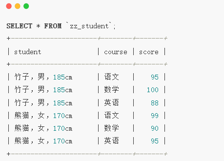
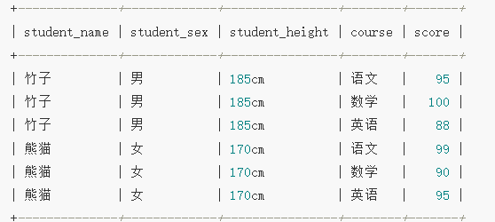
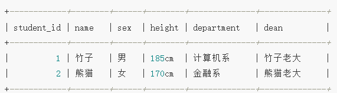
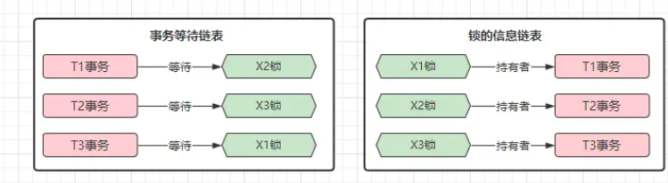
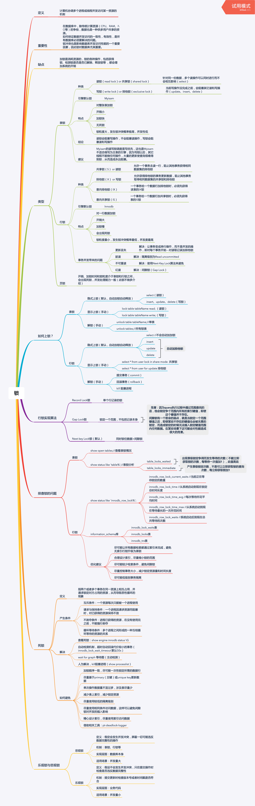

## 多表查询
* 多表一般是主表，主要存储数据的地方，每一个字段都可以重复，没有主键，
无法根据某个字段定位到准确的记录
* 一表一般是从表，主要存储辅助数据，通过主键与主表连接，存储的记录是不可重复的，可以通过主键定位到记录
* 左连接：左连接是以左表取出所有记录与右表匹配，如果没有匹配以null值代表右边的列
* 右连接：右连接是以右表取出所有的记录，与左表进行匹配，如果没有匹配以null值代表左边的列
* 内连接：等值连接，是多表的交集
* 交叉连接：返回两表的笛卡尔乘积，作用是计算两个表之间可能的存在的组合，结果是集中的记录等于两张各自记录数的乘积
## 数据库范式
* 范式：范式是值在设计数据库表时，需要遵循的一些原则，目的是让设计的数据库表结构更为合理和优雅，常见的数据库范式为：数据库三大范式（1NF、2NF、3NF）
和巴斯-科德范式（BCNF）
### 数据库的三大范式
* 三大范式为递进关系，即后续范式是前范式为基础上优化或者后续范式是前范式的优化
#### 第一范式
* 第一范式：确保数据的原子性，也就是存储的数据具备不可在分性
* 原子性：原子性规定一个字段是原子，不能在进行拆分成多个字段
* 第一范式除了对列级别的数据生效外，对行级数据处理一样，即行数据之间相不影响，都是独立的整体
* 若数据库满足第一范式的影响如下：
    1. 客户端语言与表之间无法很好的生成映射关系
    2. 查询得到的数据在进行数据处理时，需要对字段数据进行额外的拆分
    3. 插入数据时，需要对字段值进行额外拼接后才能写入到数据库
   
#### 第二范式
* 第二范式：在第一范式的基础上，要求所有的表中的所有列，其数据都需要依赖于主键，也就是一张表只存储同类型的数据，不能存在同张表中存在与主键没有关系的数据
* 由于数据存在与主键数据之间没有关联性，导致表中的数据存在冗余的情况
* 第二范式要求：每张表的业务属性具备“唯一性”，避免存在一张表存在多种业务属性的情况，即“一张表只描述一件事情”

#### 第三范式
* 第三范式：在第一，第二范式的基础上，要求表中的每一列数据不能与主键外的字段存在关系
* 第三范式满足：表中的每个非主键字段与其他非主键字段之间，都是相互独立的，之间不存在相互依赖的关系，所有字段都依赖主键
* 在设计表结构中，如不满足第三范式，在操作表时就会出现异常，使得表难以维护，相反通过第三范式优化后，表结构会更加优雅灵活，也容易
维护

    

### 巴斯-科德范式
* 在表中除了主键外，还有联合主键，也就是有多个列组成的主键
* 巴斯-科德范式也称为：3.5范式，它是第三范式的补充，第三范式要求是：任何非主键字段与其他非主键字段之间存在依赖关系，即
要求非主键之间具备独立性，巴斯-科德范式要求：任何主属性不能对其他主键子集存在关系，即联合主键中的某列值，不能与联合主键的
其他列存在依赖关系
* 巴斯-科德范式规定联合主键之间的不存在依赖，即满足主键的独立性
* 例如：以classes班级字段、class_adviser班主任字段、name学生姓名字段，组合成一个联合主键，就不符合巴斯-科德范式

### 范式总结
* 第一范式：确保原子性，即保证表中的每一列数据都是不可在分的字段
* 第二范式：确保唯一性，即保证每张表只描述一种义务，一张表只描述一件事情
* 第三范式：确保非主键字段的独立性，即表中除主键外，每个字段之间不存在任何的依赖性，字段之间是独立的
* 巴斯-科德范式：确保主键字段(联合字段)的独立性,即任何主属性不能对其它主键存在依赖关系，联合主键之间相互独立

## 数据库锁机制
## 数据库锁机制
### 数据库锁分类
1. 按照颗粒度分类：
    1. 表级锁：共享读锁和独占写锁
    2. 行级锁：共享锁(s)和排他锁(x)
    3. 页级锁
2. 按照使用方式分类：
    1. 乐观锁
    2. 悲观锁
#### 表级锁
- 开销小，加锁快，不会发生死锁，锁定颗粒度大，发生锁冲突概率高，并发度最低，mylsam和innoDB都是支持的，
- 读读不阻，写写阻，读写互斥，读写锁是串行的，写锁优于读锁
### 行级锁
- 开销大，加锁慢，会发生死锁，锁定颗粒度小，发生锁冲突概率低，并发度高。innoDB支持，因innodb
的行锁是基于索引的
- 共享锁(s锁)也叫读锁，允许多个事务读取同一个资源，不允许修改
- 排他锁(x锁)允许获取排他锁的事务更新数据，阻止其他事务获取相同数据的读锁和排他锁；
### 乐观锁
- 不采用数据库自身加锁的方式，通过用户程序来实现，一般采用版本号机制或者时间蹉的机制
### 悲观锁
- 对数据被其他事务的修改保持保守状态，会通过数据库自身加锁的机制实现，从而保证数据操作的排他性
### 间隙锁
- 使用范围查询而非等值查询时，并请求共享或者排他锁时，会给符合范围条件的已有数据记录的索引加锁，对于键值
在条件范围内，但不存在的记录叫做间隙锁（pap锁）
- 间隙锁可防止幻读和满足恢复和复制的需要
### 数据库死锁
- 死锁现象: 并发事务，本质是数据库多条线程并发执行，需要具备完善的锁机制来避免线程的不安全
    但是也会造成死锁的现象
- 解决死锁问题
    1. 锁超时机制：事务/线程在等待资源时，超过一定时间后自动放弃等待并返回
    2. 外力介入：外部接入，将死锁情况中的某个事务/线程强制结束，让其他事务继续执行
    3. mysql的锁超时机制：一个事务在长时间内无法获取到锁时，就主动放弃等待，默认锁超时时间为50S
    4. mysql死锁检测算法：
        - wait-for graph,启动后会收集两个信息，一个是锁的信息链表：目前持每个锁的事务是谁，
    另一个是等待链表：阻塞的事务要等待的锁是谁 
        - 算法会从之前的事务作为起点，然后从锁的信息链表中找到对应锁的信息，然后根据锁的的持有着，
        在事务等待链表中进行查找，看持有着的事务是否在等待获取其他锁，如果是则看另一个持有锁的事务是否在等待其他锁…… 
        直到锁的信息链表中后，是否存在闭环，若出现则介入（强制回滚其中的一个事务来达到解除死锁的问题）
        
        - 回滚事务时，一般会在undo-log日志中回滚undo量少的事务，回滚代价少
        - 通过innodb_deadlock_detect=on/off来控制是否开启了死锁检测机制 
- 防止死锁
    1. 以固定的顺序访问表和行
    2. 大事务进行拆分
    3. 同一事务，尽可能的一次锁定
    4. 降低隔离级别
    5. 为表添加合理的索引

