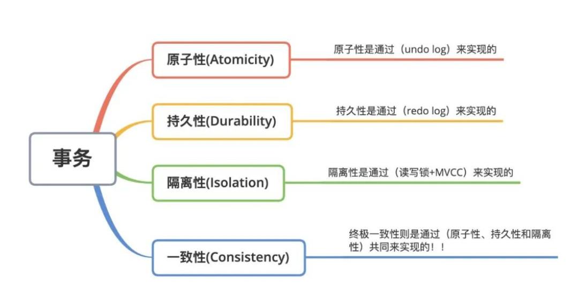

## 事务的ACID原则
- 事务一般要满足ACID原则：
    1. A(atomicity): 原子性
    2. C(consistency): 一致性
    3. I(isolation): 独立性/隔离性
    4. D(Durability): 持久性
- 原子性：指一个事务组成的一组sql要么全部执行成功，要么全部执行失败
- 一致性：不管事务发生前后，原本的数据变化都是一致的，也就是数据库中的数据只允许从一个一致性
状态变化为另一个一致性状态，即一个事务中的所有操作，要么一起改变数据库中的数据，要么都不变，对于其他事务而言，数据
变化是一致的
- 独立性/隔离性: 多个事务之间都是独立的，互不影响，是基于锁的机制和mvcc机制实现的
- 持久性：指一个事务一旦提交，它会保持永久性，即所有更改数据库中的数据都会被写入磁盘做持久化处理
- 相关命令：
    1. 开启一个事务：start transaction| begin | begin work 
    2. 回滚事务：rollback
    3. 提交事务：commit
    4. 关闭或开启自动提交: SET autocommit = 0|1|ON|OFF
- 事务回滚点：当后续操作失败时，就会回滚到该位置（当前成功的位置）
    - 相关命令：
        1. 添加事务回滚点: savepoint point_name
        2. 回滚到指定的回滚点：rollback point_name
     
## mysql事务隔离机制
- 事务隔离机制可分为四个级别：
    1. RU(read uncommitted): 读未提交
    2. RC(read committed): 读已提交
    3. RR(repeatable read): 可重复读
    4. serializable: 序列化/串行化
- 默认隔离级别为：可重复读
-脏读、幻读、不可重复读、脏写问题
    1. 脏读：脏读是指一个事务读到其他事务还没提交的数据，即当前事务读到的数据是其他事务未提交的数据
    2. 幻读：指同一个事务内多次查询返回的结果集不一样。比如同一个事务A，在第一次查询表的数据行数时，发现表中有n条行记录，但是第二次以同等条件查询时，却发现有n+1条记录，这就好像产生了幻觉
    3. 不可重复读: 是指一个事务中，多次读取同一个数据，先后读取数据不一致
    4. 脏写：指同一个事务同时操作同一条数据
- 事务隔离机制实现
    1. 读未提交
       - 处于该级别的数据库，脏读、幻读、不可重复读都可能发生
       - 实现机制：该级别是基于写互斥锁实现的，这个级别在写数据时，采用了互斥锁，解决脏写的问题
       但是读操作不是互斥的，导致其他事务可以读到该事务未提交的数据，从而导致了脏读、幻读、不可重复读的发生
    2. 读已提交
        - 处于该级别的数据库，解决了脏读的问题，不可重复的和幻读的问题同样存在
        - 实现机制：该级别在基于写互斥锁的基础上，才采用了mvcc多版本并发控制即使进行读操作处理，
        即mvcc版本控制不会让另一个事务读取另一个正在修改（未提交）的数据，而是返回修改之间的数据（老版本的数据）
        即没有读取数据的时候，mvcc版本机制会根据事务中的查询命令快速创建一个新的readView,读取到的数据就是新的数据
    3. 可重读读
        - 处于该级别的数据库，解决了脏读、不可重读读的问题，幻读的问题同样存在
        - 实现机制：级别在基于读已体提交的基础上，对mvcc进行了优化，即在同一个事务中不会根据每一次查询都生成一个新的readView
        而是在一个事务中只有第一次查询才创建一个readView,后续查询都使用这个readView的数据,解决了不可重读读的问题
    4. 序列化/串行化级别
        - 处于该级别的数据库，解决了脏读、不可重复读、幻读问题
        - 实现机制：序列化意思是将所有的事务按序排队后串行化处理，也就是操作同一张表的事务只能一个一个执行，事务在执行前需要先获取表级别的锁资源，拿到锁资源的事务才能执行，其余事务则陷入阻塞，等待当前事务释放锁
- 事务隔离机制的命令
    1. 查询当前数据库的隔离级别:
       - SELECT @@tx_isolation;
       - show variables like '%tx_isolation%';
    2. 设置隔离级别为RU级别（当前连接生效）
       - set transaction isolation level read uncommitted;
    3. 设置隔离级别为RC级别（全局生效）
       - set global transaction isolation level read committed;
    4. 设置隔离级别为RR级别（当前连接生效）
       - set tx_isolation = 'repeatable-read';
    5. 设置隔离级别为最高的serializable级别（全局生效）
       - set global.tx_isolation = 'serializable';
         
       
## MySQL 日志
- 常用MySQL日志可分为：undo-log,redo-log,bin-log
1. undo-log
    - undo-log是撤销日志，主要实现在事务回滚和mvcc机制中
    - 当写入类型的sql执行时，都会记录undo-log日志，会生成相应的反sql放入undo-log中
    - 在mvcc机制中，undo-log中记录的旧数据并不止是一条，而是可能存在多条不同版本的undo-log记录
    ，其内部通过roll_prt回滚指针组成但链表，而该链表也称为版本链
2. redo-log
    - redo-log是重做日志，用来实现数据的恢复
    - redo-log是一种预写式日志，即在向内存写数据之前，先写入日志，当后续数据未被刷到磁盘或
    mysql崩溃时可以通过日志来快速恢复数据，确保所有的数据都能被持久化（采用刷盘策略）
3. bin-log
    - 称为二进制日志，主要记录所有对数据库表结构的变更和表数据的修改的操作
- redo-log和bin-log的区别
    1. 生效范围不同，redo-log是innodb引擎独有，而bin-log是所有引擎都通用
    2. 写入方式不同，redo-log是采用两文件循环写，而bin-log是不断创建新文件后追加
    3. 文件格式不同，redo-log是记录所有变更后的数据，而bin-log是记录是变更后的sql
    4. 使用场景不同，redo-log主要实现故障情况下的数据恢复，而bin-log则是用于数据灾备同步
- 日志的主要使用场景：
    1. undo-log: 主要实现事务的ACID和mvcc机制
    2. redo-log: 主要是实现事务的持久性，确保事务提交后不会丢失
    3. bin-log: 主要结合redo-log实现事务原则中的一致性，确保事务提交后数据是一致的
         
         
## 事务总结
- undo-log、redo-log日志来看待ACID的四大特性：原子性、一致性、隔离性、持久性
1. 原子性
    - 原子性要求事务中的所有操作要么全部成功，要么全部失败
    - 实现原理：基于undo-log来实现，在该日志中生成相应的反sql,执行失败时，利用该日志回滚所有写操作
2. 持久性
    - 一致性要求所有的数据需要保存在磁盘中
    - 实现原理：这一点是基于redo-log实现
3. 隔离性
    - 隔离性要求一个事务不会受到另一个事务的影响一个事务不会受到另一个事务的影响
    -实现原理：通过锁机制和mvcc机制实现
4. 一致性
    - 数据库的整体数据变化，只能从一个一致性状态变为另一个一致性状态，其实前面的原子性、持久性、隔离性都是为了确保这点而存在的
    

