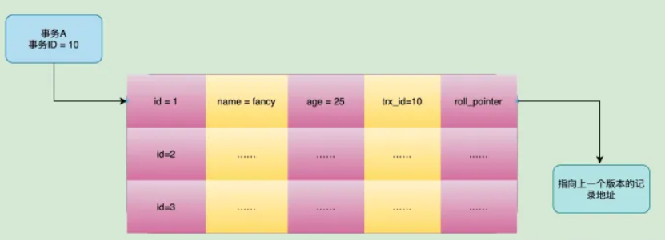
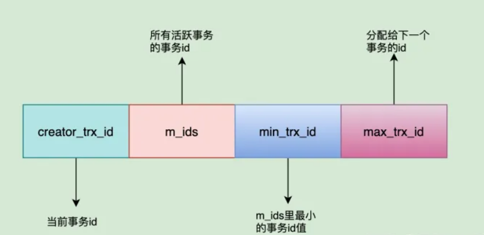
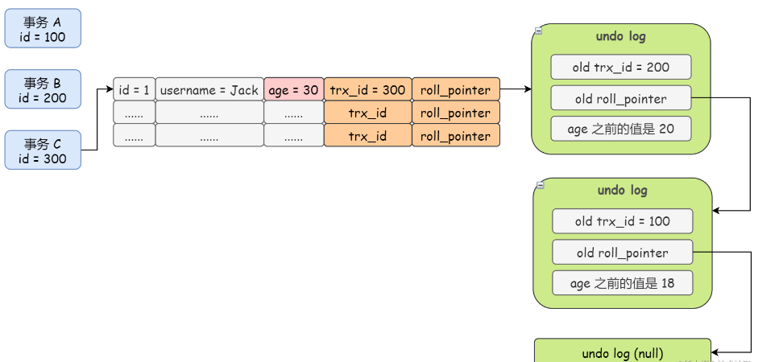

## 索引机制
- 索引是一种数据结构，索引机制是有存储引擎实现，创建索引会基于原有表的数据，从新在磁盘上创建新的本地索引文件
- mysql索引机制的优势：
    1. 提高了查询速度，数量越大，效果越明显
    2. 建立唯一的索引，可确保数据表中的数据唯一性，无需额外的创建唯一的约束
    3. 在使用分组与排序时，可显著减少查询的分组和排序的时间
    4. 在多表查询时，基于主外键字段建立索引，可带来十分明显的性能的提升
    5. 索引默认是B+树有序机构，效率会明显提高
    6. 就整个数据库而言，减少sql执行时间，可提高数据库整体的吞吐量
- mysql索引机制的弊端：
    1. 建立索引会生成本地磁盘文件，需要额外的空间存储索引数据，磁盘占用率会变高
    2. 写入数据时，需要额外的维护索引结构，在增删修改数据时，都需要额外的操作索引
    3. 写入数据时，维护索引需要额外的时间开销，执行sql时效率会降低，性能会下降
- 主键索引存在的陷阱
    - 主键一般会使用自增的id,可确保主键不重复以及主键的唯一性，主键索引是聚簇索引，使用
    b+树的索引的存储结构主键索引是有序的，若主键采用的是无序时，在插入数据可能会导致索引结构的调整
    因此，主键索引最好选用顺序的值，而非随机值
- 联合索引存在的矛盾
    - 在联合查询时，查询条件必须包含索引的第一个字段，在建立联合索引时，要确保建立除的来联合索引命中高，即必须包含
    第一个字段
- 前缀索引: 可以使用一个字段的前N个字符创建索引，可以节省存储空间，但不能使用分组，排序工作，无法完成覆盖扫描等工作
- 全文索引存在的硬伤
    - 全文索引是基于分组实现，分词也会被存储，会造成额外的文件，还存在在更新数据之后，索引的存储与更新的问题
- 唯一索引存在的快慢的问题
    - 唯一索引查询数据比普通索引效率高，因为普通索引会查询整个索引数，唯一索引会引起立马停止检索，但插入数据则相反
- 索引机制中索引失效的场景
    1. 查询语句中带有or会导致索引失效
    2. 模糊查询语句中like以%开头导致索引失效
    3. 字符类型查询时不带引号导致索引失效
    4. 索引字段参与计算导致索引失效
    5. 字段被用于函数计算导致索引失效
    6. 违背最左前缀原则导致索引失效
    7. 不同字段值对比导致索引是失效
    8. 反向范围操作导致索引失效
    
## MVCC机制
- mvcc机制，即多版本并发控制技术，主要提高数据并发性能而设计，采用更好的方式处理了
读写并发冲突的问题，在有读写操作时，也不加锁，确保读操作的非阻塞的
### mvcc实现原理
- mvcc 是通过隐藏字段、undo-log、readView三个实现
    1. 隐藏字段：使用innodb引擎建立一张表后，数据库除了构建显示字段外，通常还会构建隐藏字段主要包括：
        1. DB_ROW_ID: 隐藏主键，当mysql未定义主键时，会使用ROW_ID来作为聚簇索引列
        2. DB_Deleted_Bit：删除标识，当执行delete语句时，会将这个标识deleted_Bit设置为：true/1,若后续事务回滚时，会
        将deleted_Bit设置为false/0,这样就能避免树结构的调整，同时也会使用一个线程自动清理deleted_Bit为true/1的行数据
        3. DB_TRX_ID：最近事务ID,每创建事务，都会分配一个事务ID,遵循顺序递增的特性，但删除的ID为：0
        4. DB_ROLL_PTR：回滚指针，指向undo-log日志中旧版本的数据，通过此来找到改动前的旧版本的数据，
        mvcc就是利用这一点实现行数据的多版本
    2. undo-log: 存储不仅仅一条旧版本的数据，而是存在一个版本链
    
    3. readView: 多版本的并发控制，根据查询时机来选择一个当前事务可见的旧版本数据，
    通常一个事务与一个readView属于一一对应的关系，一般包括四个核心内容：
        1. creator_trx_id: 代表创建当前这个readView的事务ID
        2. trx_id: 代表在生成当前事务readView时，系统内活动的事务id列表
        3. up_limit_id: 活跃的事务中最小的ID
        4. low_limit_id: 生成当前readView时，系统给一个事务分配的ID
        
- 实现原理和过程
    - 当一个事务尝试改动某一条数据时，会将原本表中的数据放入undo_log日志中
    - 当一个事务尝试查询某一条数据时，mvcc会生成一个readView快照
    - 具体实现过程：
        1. 当事务中出现select语句时，会根据当前运行情况生成一个readView
        2. 判断行数据中的隐藏列tex_id最近事务id与readView中的当前readView的ID是否一致
            - 若相同：读取最新版本的数据
            - 若不相同：代表目前要查询的数据是被其他事务修改过，继续向下执行
        3. 判断最近事务id是否小于readView中的最活跃的Id
            - 小于： 代表改动的数据的事务在创建快照前就结束了，可读取最新数据
            - 不小于：表示改动的行数据的事务还在执行，继续往下执行
        4. 判断最近事务id是否小于事务readView中的下一个事务id
            - 大于等于： 代表改动的行数据的事务是生成快照之后在开启的，不能访问最新数据
            - 小于：代表改动的行数据的事务id在最小活跃ID和下一个事务的ID之间，需要进一步的判断
        5. 判断当前快照id是否在系统活跃的事务id列表中
            - 是：表示改动的行数据的事务依旧在执行，不能访问新数据
            - 不是：表示改动行数据的事务已经结束，可以访问最小数据
        - 若不能访问最新版本数据时，则会访问undo-log获取旧版本中的最新数据
        - 若存在版本链，通过roll_ptr(回滚指针)找到版本链的表头，然后遍历链表，通过就版本数据，其隐藏列最近事务id
        不能在快照系统内活动事务的id中的条件返回就版本的数据 
        
- MVCC在事务隔离中机制中的作用
    - 在事务隔离中只有RC(读已提交)和RR(可重复读)两个级别中有运用MVCC机制
        1. 在RC级别下，MVCC机制是在每次select(查询语句)执行前，都会生成一个最新的readView,
        解决了数据库中的脏读的问题，但也存在不可重复读的问题
        2. 在RR级别下，MVCC机制是一个事务只会在首次执行select(查询语句)之前，才会生成一个新的readView,
        后续所有查询操作都会基于着ReadView进行判断，解决了不可重复读的问题