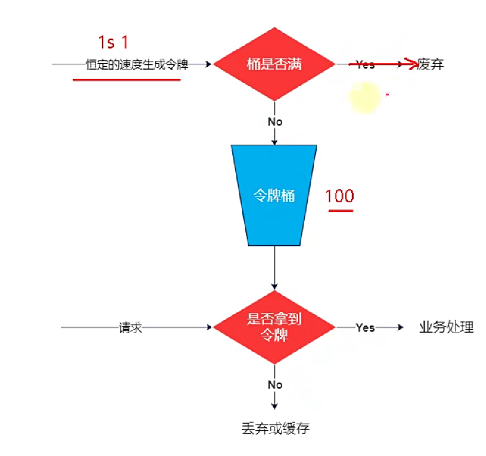
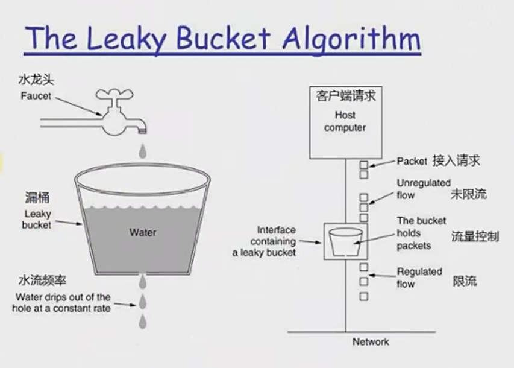

## Nginx
* nginx 是轻量级高并发web服务器，是基于Rest架构风格。通过http协议提供各种网络服务  
其高并发是基于事件驱动架构，io多路复用的epoll,使得可以轻松支持百万计的icp连接。  
轻量级主要体现在：采用插件化开发，cup亲和，将cpu与nginx工作进程绑定，减少cpu切换带来的消耗
## 代理
* 代理是客户端与服务器之间的一层服务器，将客户端的请求转发给服务器，然后服务器的响应转发给客户端
### 正向代理
* 客户端向代理服务器转发请求和指定目标服务器，代理服务器向目标服务器发送请求，并将结果返回给客户端。
对客户端是透明的，即客户端知道访问的是目标服务器，对目标服务器来说是非透明的，并不知道访问服务器是
客户端还是代理服务器
### 反向代理
* 客户端向代理服务器发送请求，代理服务器将请求转发给内部的网络服务器(目标服务器)，在将结果返回给客户端。对于客户端
是非透明的，即客户端不清楚是访问是那一台目标服务器。对于目标服务器是透明的，即目标服务器知道访问的是
代理服务器
* nginx反向代理的配置如下：
```
server {
         listen       80;
         server_name  www.123.com;
 
         location / {
             proxy_pass http://127.0.0.1:8080;
             index  index.html index.htm index.jsp;
         }
     }
```  
我们监听80端口，访问域名为www.123.com，不加端口号时默认为80端口，故访问该域名时会跳转到127.0.0.1:8080路径上
## 负载均衡
* 当请求过大时，将请求分发给各个服务器。负载均衡的分配策略为：weight(权重)轮询，fair(智能调整调度)    
* nginx轮询配置(所有请求都按照时间顺序分配到不同的服务上)
```
upstream  dalaoyang-server {
       server    localhost:10001;
       server    localhost:10002;
}  
```
* nginx权重配置(权重轮询：代理服务器接收到请求，按照设定的权重，请求分配到不同的后端服务器，如果发现后端服务器宕机时，
代理服务器会将其剔除出队列)
```
upstream  dalaoyang-server {
       server    localhost:10001 weight=1;
       server    localhost:10002 weight=2;
}
```
* nginx iphash 配置(每个请求都根据访问ip的hash结果分配)
```
upstream  dalaoyang-server {
       ip_hash; 
       server    localhost:10001 weight=1;
       server    localhost:10002 weight=2;
}
```
* 最少连接(将请求分配到连接数最少的服务上)
```
upstream  dalaoyang-server {
       least_conn;
       server    localhost:10001 weight=1;
       server    localhost:10002 weight=2;
}
```
* far 智能调整调度算法：动态根据后端服务器的请求处理到响应时间进行均衡分配。即响应时间短，处理效率高的服务器
分配到请求的概率高。响应时间长，效率低的服务器分配到请求的概率低。
* far 配置文件如下：
```
upstream  dalaoyang-server {
       server    localhost:10001 weight=1;
       server    localhost:10002 weight=2;
       fair;  
}
```

### 流量控制
* 限流实际就是限制流入请求的数量：有计数器固定窗口算法、令牌桶算法、漏桶算法和限制并发连接数限制  
令牌桶算法:存在一个大小固定的令牌桶，会以恒定的速率源源不断产生令牌。如果令牌消耗速率小于生产令牌的速度，
令牌就会一直产生直至装满整个令牌桶。如果请求获取令牌失败则请求会被禁止访问  

漏桶算法:突发流量会进入到一个漏桶，漏桶会按照我们定义的速率依次处理请求，如果水流过大也就是突发流量过大就会直接溢出，
则多余的请求会被拒绝。所以漏桶算法能控制数据的传输速率。算法的核心是：缓存请求、匀速处理、多余的请求直接丢弃。  

### 统一鉴权
* 客户端请求时，将Token放入在请求头head中。服务器解析Token,对访问者都进行鉴权，最后进入权力访问
### 主流的网关
* Hong：是基于nginx+lua开源的网关
* Traefik是http反向代理和负载均衡器，支持动态配置和较好的伸缩性
* kubernetes是基于Envog Proxy构建的原生k8s网关


## 参考文献：
[Nginx（三）nginx 反向代理 ](https://www.cnblogs.com/ysocean/p/9392908.html)
