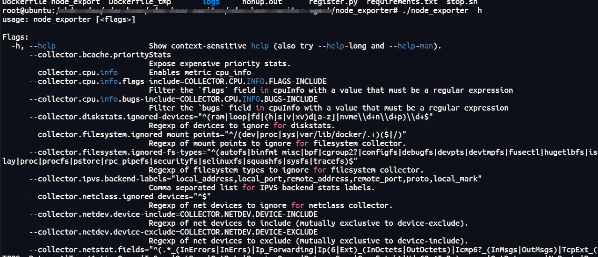
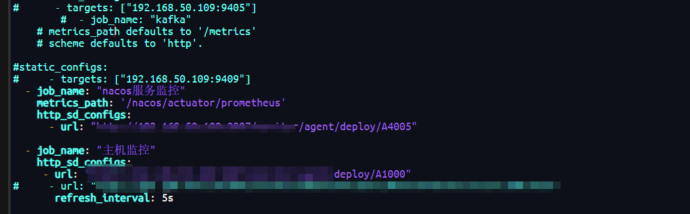
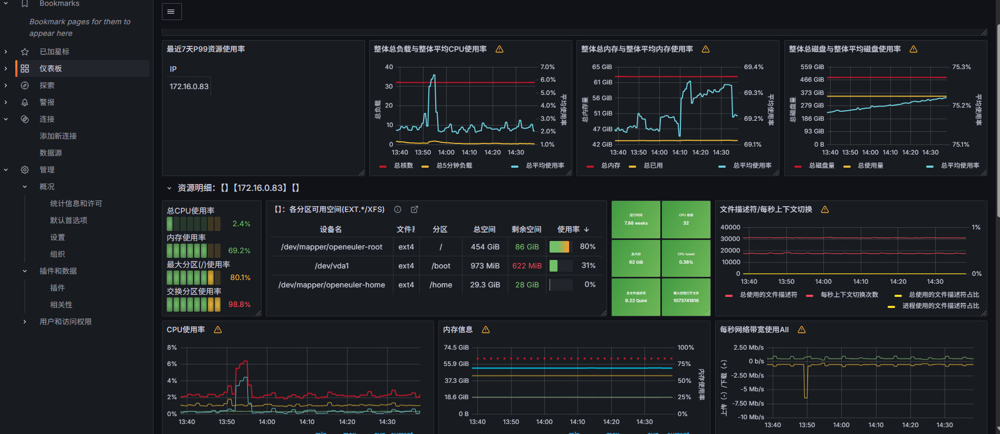

# Prometheus 监控体系：原理、实践、配置与拓展

在现代复杂系统架构里，监控体系是保障系统稳定运行、快速排障的关键。Prometheus 凭借标准化数据流程、灵活拓展能力，成为云原生监控的核心方案。本文结合架构设计，深度拆解其原理、实践与配置要点，教你搭建全链路可观测体系。

## 一、数据格式：监控的 “通用语言”

Prometheus 用标准化格式定义指标，让监控数据有清晰语义，是分析的基础。

### （一）指标标识规则

指标格式为 <metric name>{<label name>=<label value>, ...} ，比如 api_http_requests_total{method="POST", handler="/messages"} ，拆解来看：

- **指标名称**：要能直观体现监控内容，像 http_request_total 就是记录 HTTP 请求总量 。命名得符合正则 [a-zA-Z_:][a-zA-Z0-9_:]* ，用 ASCII 字符、数字、下划线、冒号组合，底层实际存成 __name__=<metric name> ，方便系统识别。

- **标签（Label）**：用来描述样本特征，方便后续过滤、聚合数据。名称得是 [a-zA-Z_][a-zA-Z0-9_]* 规则的 ASCII 组合，__ 开头是系统保留的，别乱用；值就灵活多了，任意 Unicode 字符都行，适配各种业务场景打标签。

### （二）时间序列与样本构成

Prometheus 把监控数据存成**时间序列（time-series）**，每个序列由 “指标名称 + 标签集” 唯一确定。序列里的 ** 样本（sample）** 包含三部分：

- **指标（metric）**：名称加标签集，精准描述样本特征；

- **时间戳（timestamp）**：精确到毫秒，记录数据产生的时刻；

- **样本值（value）**：用 float64 浮点型，存具体的监控数值。

### （三）四种核心指标类型

为了覆盖不同监控场景，Prometheus 设计了四类指标：

- **Counter（计数器）**：只会单调递增，适合统计请求数、任务完成数、错误次数这些，一直往上加，不会降。比如统计 http请求总数 ，就用它。

- **Gauge（仪表盘）**：数值可增可减，像内存使用率、当前并发请求数这种动态变化的，就用它。还支持做求和、算均值、找极值这些计算，比如 node_memory_MemFree 看主机空闲内存 。

- **Histogram（直方图）**：主要用来分析请求耗时、响应大小这类数据的分布。通过 “存储桶（bucket）” 统计，能记录样本总和（sum）、次数（count）还有桶的边界，像分析磁盘使用率、请求总次数分布，就靠它。

- **Summary（摘要）**：直接存分位数（客户端自己算好），不用像 Histogram 那样依赖函数算。要是想精准统计请求耗时、响应大小的分位情况，比如 go_gc_duration_seconds_count 看 GC 总次数 ，用它就很方便。

## 二、传输协议与方式：数据怎么 “跑” 起来

监控数据要在服务端和客户端之间传输，得确定好协议和方式，保证采集高效、稳定。

### （一）传输协议

Prometheus 最常用的是 **HTTP 协议** 来拉数据，配置好 agent 的 HTTP 接口，定时发 GET 请求去采集。当然，也支持本地文件、RPC、队列这些方式，灵活适配不同部署情况。比如监控服务和 agent 在同一台机器，就可以本地读文件；跨机器部署，就用网络协议传输。

### （二）传输方式

从监控服务器的角度看，有两种传输模式：

- **主动拉取（Pull）**：Prometheus 主动出击，定时调用 agent 的 HTTP 接口或者 RPC 方法，把数据拿过来。像用 node_exporter 拉取主机指标，就是典型的主动拉取。

- **被动推送（Push）**：agent 主动把数据推到队列或者数据库里，Prometheus 再定时从这些地方把数据捞出来。这种适合那些没办法主动暴露接口的场景，比如有些第三方服务的监控。

## 三、拓展监控对象：让监控 “触角” 更全

系统里的监控对象多种多样，得针对性处理，保证监控体系能扩展。

### （一）两类监控对象的适配方法

- **能部署 agent 的场景**：像微服务这种，直接在要监控的对象上装 agent（比如 exporter ）。agent 负责采集运行数据，按照 Prometheus 的格式打包好，再通过主动或者被动的方式，把数据传给服务端。

- **受限场景（没法部署 / 改代码）**：像 MySQL、Redis 这些中间件，或者淘宝、百度这类第三方服务，就得用 “中间 agent”。中间 agent 去连接目标服务（比如用 MySQL 协议、调用第三方 API ），把运行状态（连接数、健康状态这些 ）采集过来，再按照 Prometheus 的格式封装好，提供接口让 Prometheus 拉取，或者直接主动把数据推过去。

### （二）拓展的核心条件

不管监控啥对象，想拓展监控体系，得满足这些条件：

- **agent 依赖**：目标对象得能被 agent 采集到，要么直接装 agent，要么通过中间 agent 代理；

- **格式统一**：数据必须严格按照 Prometheus 的指标格式来，这样才能被识别；

- **协议和方式一致**：传输用的协议（HTTP/RPC 这些 ）、传输方式（拉取还是推送 ），得和整个监控体系匹配上；

- **服务端配置**：Prometheus 这边得配置好对应的采集接口、定时任务，保证能持续拿到数据。要是动态更新监控对象，还得通过配置服务实现热加载。

## 四、Prometheus 与 Grafana 交互：让数据 “看得见”

Grafana 是可视化的好帮手，和 Prometheus 配合起来，能把监控数据变成直观的图表。以监控主机为例，流程是这样的：

### （一）部署 exporter

在主机上装 node_exporter ，它会采集主机的各种信息，像 CPU、内存、磁盘这些，然后暴露一个 HTTP 接口，把 metrics 数据提供出去。



### （二）Prometheus 配置

在 Prometheus 服务端，把 node_exporter 的接口配置好，定时去拉取数据。拉回来之后，先格式化处理，再存到内存数据库里（也会持久化到硬盘 ）。



### （三）Grafana 对接

Grafana 的后端要配置 Prometheus 作为数据源，根据可视化的需求（比如做个大屏模板 ），从 Prometheus 里把指标数据拉过来。前端再把这些数据渲染出来，直观地展示在监控大屏上，完成 “数据采集→存储→可视化” 的闭环。另外，Prometheus 和 Grafana 都有 API，支持自定义的数据交互，比如二次开发、导出数据啥的。



## 五、动态更新监控对象：让监控 “更聪明”

Prometheus 需要动态适应监控对象的变化，实现**热加载**，这样不用重启服务，就能更新监控配置。

### （一）配置服务支撑

通过配置服务暴露一个 HTTP 接口，这个接口返回的是当前需要监控的对象信息。比如系统新增了一个微服务，配置服务里的监控列表就会更新，把新服务的信息加上。

```
 job_name: "主机监控"
    http_sd_configs:
     - url: "http://xxxxxx/xxxxxx"
       refresh_interval: 5s
```

### （二）定时拉取更新

Prometheus 会定时去调用这个接口，拿到最新的监控对象列表，自动更新自己的采集配置。这样不管是新增、删除还是修改监控对象，都能实时跟上，保证监控不脱节。

## 六、配置说明：让监控体系 “稳准狠”

### （一）Prometheus 配置要点

- **静态配置**：在 prometheus.yml 里，直接写死要监控的目标。比如监控主机，就配置 node_exporter 的地址：

```
scrape_configs:
  - job_name: 'node'
    static_configs:
      - targets: ['localhost:9100']  # node_exporter默认端口
```

- **动态发现配置**：适合监控对象经常变化的场景，比如基于文件、DNS、Consul 这些方式自动发现。以 Consul 为例：

```
scrape_configs:
  - job_name: 'consul-services'
    consul_sd_configs:
      - server: 'localhost:8500'
        services: []  # 可指定服务，空则发现所有
```

- **采集周期与超时**：调整 scrape_interval（采集间隔 ）和 scrape_timeout（超时时间 ），适配不同监控需求：

```
global:
  scrape_interval: 15s  # 默认15秒拉一次
  scrape_timeout: 10s   # 拉取超时时间
```

### （二）Grafana 配置关键

1. **数据源配置**：在 Grafana 里添加 Prometheus 数据源，填好地址（比如 http://prometheus:9090 ），保存测试，确保能连通。

1. **仪表盘（Dashboard）配置**：可以自己创建，也能导入社区模板（比如 ID 为 8919 的 Node Exporter 模板 ）。配置的时候，选好数据源，写 PromQL 查询语句（比如 node_cpu_seconds_total{mode="idle"} 看 CPU 空闲时间 ），设置图表类型（折线图、柱状图等 ），让数据可视化更直观。

### （三）Agent 与中间件配置

1. **Exporter 配置**：不同的 exporter 有不同的配置文件。比如 node_exporter 可以通过命令行参数调整采集项（如 --no-collector.diskstats 关闭磁盘统计 ）；mysql_exporter 需要配置数据库连接信息，在配置文件里填好用户名、密码、地址：

```
[client]
user = prometheus
password = yourpassword
host = localhost
port = 3306
```

**中间 agent 配置**：针对第三方服务的中间 agent，要配置好连接目标服务的参数（如 API 密钥、访问地址 ），还有数据转换规则，确保采集的数据符合 Prometheus 格式。
