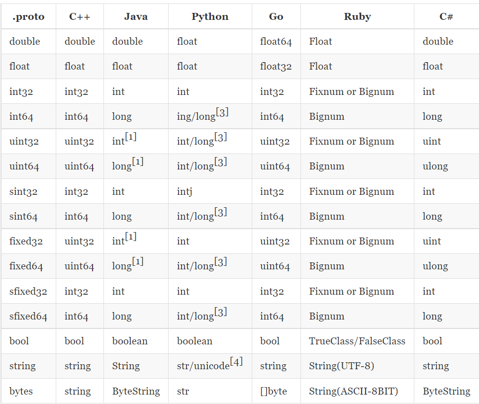

## proto3 语法学习

#### 基本规范

- 文件以.proto为文件后缀，除了结构体外，其他语句以分号结束

- 结构定义可以包含：message、service、enum

- rpc方法定义结尾的分号可有可无

- Message命名采用驼峰命名方式，字段命名采用小写字母加下划线分隔方式；举例：

  ```protobuf
  message ServerMessage{
  	required string server_name = server1;
  }
  ```

- Enums类型名采用驼峰命名方式，字段名采用带大写字母加下划线分隔方式；举例：

  ```protobuf
  enum Sought{
  	FIRST_VALUE = 100;
  	SECONED_VALUE = 1200;
  }
  ```

- Service类型采用驼峰命名方式；举例：

  ```protobuf
  service UserService
  {
   rpc Login(LoginRequest)return(LoginResponse);
  }
  ```

  #### 字段规则

  - 字段格式：限定修饰符|数据类型|字段名称|=|字段编码值|[字段默认值]

  - 限定修饰符号 required\optional\repeated

    - required:表示是一个必须的字段，必须要发送给对方，在发送之前必须设置该字段的值，对于接收方，必须能够识别该字段的意思，在发送之前没有设置required字段或者无法识别该字段都会引起编码异常，导致消息被丢弃
    - optional:表示为可选字段，对于发送方，在发送消息时，可以选择性设置或者不设置该字段值，对于接收方，如果能够识别可选字段就进行相应的处理，如果无法识别，则就忽略该字段，消息中的其他字段正常处理。因为optional字段的特性，很多接口在升级版本中把后面添加大的字段都统一设置为optional字段，这样在老版本无法升级的时，也能正常于新的软件进行通信，只不过新的字段无法识别而已，因为并不是每个节点都需要新的功能，因此可以做到按需升级和平滑过渡
    - repeated:表示该字段可以包含0-n个元素，其特性和optional一样，但是每一次可以包含个多个值，可以看作是在传递一个数组的值

  - 数据类型：protobuf定义了一套基本的数据类型，几乎可以映射到c++\java等语言的基础数据类型

    

- 字段名称
  -  字段名称的命名与c、c++、java等语言的变量命名方式几乎相同
  - protobuf建议字段的命名采用采用下滑线分割的驼峰式
- 字段编码值
  - 有了字段编码值，通信双方才能互相识别对方的字段，相同的编码值，其限定修饰符和数据类型必须相同，编码值的范围为：1-2^32
  - 其中1-15的编码时间和空间效率都很高，编码值越大，其编码的是时间和空间效率就越低，所以建议把经常要传递的值把其字段编码设置为1-15之前的值
  - 1900-2000编码值为Google protobuf系统内部保留值，建议不要使用
- 字段默认值
  - 当在传递数据时，对于required数据类型，如果用户没有设置值，则使用默认值传递到对端

#### service定义

- 如果想要将消息类型用在rpc系统中，可以在.proto文件中定义一个RPC服务接口， protocol buffer 编译器会根据所选择的不同语言生成对应的服务器接口代码

- 例如，想要定义一个RPC服务并具有一个方法，该方法接收SearchRequest并返回一个SearchResponse，此时可以在.proto文件中进行如下定义：

  ```protobuf
   service SearchService {
          rpc Search (SearchRequest) returns (SearchResponse) {}
      }
  ```

- 生成的接口代码作为客户端与服务器的约定。服务端必须实现定义的所有接口方法，客户端直接调用同名方法向服务端发送请求，值得一提的是，即使业务上不需要参数也必须指定一个请求消息，一般会定义空的message

  

#### Message定义

- 一个message类型定义了一个请求或者响应的消息格式，可以包含多种类型的字段

- 字段名用小写，转为go文件时会自动转为大写，message就相当于结构体

- 首行声明使用的protobuf版本为proto3

  ```protobuf
  syntax = "proto3"
  massage SearchRequest{
     	string name = "zcj";  // 查询的名字
     	int32  pirce= 600;    //价格
     	int32 producet_num = 1; // 产品编号
  }
  ```

- 一个.proto文件中可以定义多个消息类型，一般用于同时定义的多个相关的信息

  ```protobuf
  syntax = "proto3"
  massage SearchRequest{
     	string name = "zcj";  // 查询的名字
     	int32  pirce= 600;    //价格
     	int32 producet_num = 1; // 产品编号
  }
  // 响应
  message SearchResponse{
  // 响应信息
  }
  ```

- message 支持嵌套使用，作为另一个message中的字段类型

  

    ```protobuf
    message Result{
        string name = "zcj";
        string title = "proto3";
        int32 price = 1000;
    }
    message SearchResponse{
        repeated Result result = 1;
    }
    ```

- 支持嵌套信息，消息可以包含另一个消息作为字段，也可以在消息内定义一个新的消息

- 内部声明的message类型明显可以在内部直接使用

  

    ```protobuf
    message SearchReponse{
        message Resylt{
        string name = "zcj";
        string title = "proto3";
        int32 price = 1000;
        }
        repeated Resylt re = 1;
    }
    ```

#### proto3的Map类型

- proto3支持map类型声明

- 键、值类型可以是内置的类型，也可以是自定义的message类型

- 字段不支持repeated属性

     ```protobuf
      map<key_type, value_type>map_filed = N;
      //支持定义的类型
      message Produce{
        string name = "zcj";
      }
      map<string, Product> pro = 1;
     ```

  #### proto3文件编译

  - 通过定义好的.proto文件生成的Java，python，c/c++， GO等语言的代码，需要安装编译器protoc
  - 当使用protocol buffer 编译器允许.proto文件时，编译器生成所选择语言的代码，用于使用在.proto文件中定义的消息类型，服务接口约定等，不同的语言生成代码格式不同：
    - c++:每个.proto文件生成一个.h和一个.cc文件，每一个消息类型对应一个类
    - Java：生成一个.Java文件，同样每个消息对应一个类，同时还有一个特殊的Builder类用于创建信息接口
    - Go：生成一个.pb.go文件，每一个消息类型对应这一个结构体
    - Python: 姿势不太一样，每个.proto文件中的消息类型生成一个含有静态描述符的模块，该模块与一个元类metaclass在运行时创建需要的Python数据访问类

  #### import导入定义

  - 可以使用import 接口语句导入使用其他描述文件中的声明的类型
  - protobuf 接口文件可以像C语言的#include或者Java的import的行为大致一致
  - protocol buffer编译器会在-I /--proto_path参数指定的目录中查找导入的文件，如果没有指定该参数，默认使用当前的目录查找

  #### 包的使用

  - 在proto文件中使用package声明包，避免命名冲突
  - 在其他的消息格式定义中可以使用包名+消息名的方式使用类型
  - 在不同语言中，包含定义对编译后生成的代码影响不同：
    - C++：对应C++命令空间
    - Java 中：package会作为Java包名，除非指定了option jave_package选项
    - Python 中：package被忽略
    - Go 中：默认使用package名作为包名，除非指定了option go_package选项
    
    #### 测试
    ##### message 测试
    - proto 文件内容
        ```protobuf
        syntax = "proto3"; // 语法声明
        
        package main; // 默认与go文件中的包名一致
        // option go_package = "zcj_proto"; // 不一致时，可以使用go_package
        
        // 测试message 采用为驼峰的命令方式
         message TestMessage{
             string te_name = 1;
             int32 te_age = 2;
             int32 te_count = 3;
             double te_money = 4;
             float te_score = 5;
             bool te_fat = 6;
             bytes te_char = 7;
             // 枚举类型
             enum Status{
                 OK = 0;
                 FAIL = 1;
             }
             message TeChild{
                 string ch_name = 1;
                 string ch_sex = 2;
             }
             TeChild childs = 9;
             // map类型
             map<string, int32> te_map = 10;
         }
        ```
    - 生成go 文件内容
        ```go
        // Code generated by protoc-gen-go. DO NOT EDIT.
        // source: proto3.proto
        
        package test_message
        
        import (
            fmt "fmt"
            proto "github.com/golang/protobuf/proto"
            math "math"
        )
        
        // Reference imports to suppress errors if they are not otherwise used.
        var _ = proto.Marshal
        var _ = fmt.Errorf
        var _ = math.Inf
        
        // This is a compile-time assertion to ensure that this generated file
        // is compatible with the proto package it is being compiled against.
        // A compilation error at this line likely means your copy of the
        // proto package needs to be updated.
        const _ = proto.ProtoPackageIsVersion3 // please upgrade the proto package
        
        // 枚举类型
        type TestMessage_Status int32
        
        const (
            TestMessage_OK   TestMessage_Status = 0
            TestMessage_FAIL TestMessage_Status = 1
        )
        
        var TestMessage_Status_name = map[int32]string{
            0: "OK",
            1: "FAIL",
        }
        
        var TestMessage_Status_value = map[string]int32{
            "OK":   0,
            "FAIL": 1,
        }
        
        func (x TestMessage_Status) String() string {
            return proto.EnumName(TestMessage_Status_name, int32(x))
        }
        
        func (TestMessage_Status) EnumDescriptor() ([]byte, []int) {
            return fileDescriptor_4fee6d65e34a64b6, []int{0, 0}
        }
        
        // 测试message 采用为驼峰的命令方式
        type TestMessage struct {
            TeName  string               `protobuf:"bytes,1,opt,name=te_name,json=teName,proto3" json:"te_name,omitempty"`
            TeAge   int32                `protobuf:"varint,2,opt,name=te_age,json=teAge,proto3" json:"te_age,omitempty"`
            TeCount int32                `protobuf:"varint,3,opt,name=te_count,json=teCount,proto3" json:"te_count,omitempty"`
            TeMoney float64              `protobuf:"fixed64,4,opt,name=te_money,json=teMoney,proto3" json:"te_money,omitempty"`
            TeScore float32              `protobuf:"fixed32,5,opt,name=te_score,json=teScore,proto3" json:"te_score,omitempty"`
            TeFat   bool                 `protobuf:"varint,6,opt,name=te_fat,json=teFat,proto3" json:"te_fat,omitempty"`
            TeChar  []byte               `protobuf:"bytes,7,opt,name=te_char,json=teChar,proto3" json:"te_char,omitempty"`
            Childs  *TestMessage_TeChild `protobuf:"bytes,9,opt,name=childs,proto3" json:"childs,omitempty"`
            // map类型
            TeMap                map[string]int32 `protobuf:"bytes,10,rep,name=te_map,json=teMap,proto3" json:"te_map,omitempty" protobuf_key:"bytes,1,opt,name=key,proto3" protobuf_val:"varint,2,opt,name=value,proto3"`
            XXX_NoUnkeyedLiteral struct{}         `json:"-"`
            XXX_unrecognized     []byte           `json:"-"`
            XXX_sizecache        int32            `json:"-"`
        }
        
        func (m *TestMessage) Reset()         { *m = TestMessage{} }
        func (m *TestMessage) String() string { return proto.CompactTextString(m) }
        func (*TestMessage) ProtoMessage()    {}
        func (*TestMessage) Descriptor() ([]byte, []int) {
            return fileDescriptor_4fee6d65e34a64b6, []int{0}
        }
        
        func (m *TestMessage) XXX_Unmarshal(b []byte) error {
            return xxx_messageInfo_TestMessage.Unmarshal(m, b)
        }
        func (m *TestMessage) XXX_Marshal(b []byte, deterministic bool) ([]byte, error) {
            return xxx_messageInfo_TestMessage.Marshal(b, m, deterministic)
        }
        func (m *TestMessage) XXX_Merge(src proto.Message) {
            xxx_messageInfo_TestMessage.Merge(m, src)
        }
        func (m *TestMessage) XXX_Size() int {
            return xxx_messageInfo_TestMessage.Size(m)
        }
        func (m *TestMessage) XXX_DiscardUnknown() {
            xxx_messageInfo_TestMessage.DiscardUnknown(m)
        }
        
        var xxx_messageInfo_TestMessage proto.InternalMessageInfo
        
        func (m *TestMessage) GetTeName() string {
            if m != nil {
                return m.TeName
            }
            return ""
        }
        
        func (m *TestMessage) GetTeAge() int32 {
            if m != nil {
                return m.TeAge
            }
            return 0
        }
        
        func (m *TestMessage) GetTeCount() int32 {
            if m != nil {
                return m.TeCount
            }
            return 0
        }
        
        func (m *TestMessage) GetTeMoney() float64 {
            if m != nil {
                return m.TeMoney
            }
            return 0
        }
        
        func (m *TestMessage) GetTeScore() float32 {
            if m != nil {
                return m.TeScore
            }
            return 0
        }
        
        func (m *TestMessage) GetTeFat() bool {
            if m != nil {
                return m.TeFat
            }
            return false
        }
        
        func (m *TestMessage) GetTeChar() []byte {
            if m != nil {
                return m.TeChar
            }
            return nil
        }
        
        func (m *TestMessage) GetChilds() *TestMessage_TeChild {
            if m != nil {
                return m.Childs
            }
            return nil
        }
        
        func (m *TestMessage) GetTeMap() map[string]int32 {
            if m != nil {
                return m.TeMap
            }
            return nil
        }
        
        type TestMessage_TeChild struct {
            ChName               string   `protobuf:"bytes,1,opt,name=ch_name,json=chName,proto3" json:"ch_name,omitempty"`
            ChSex                string   `protobuf:"bytes,2,opt,name=ch_sex,json=chSex,proto3" json:"ch_sex,omitempty"`
            XXX_NoUnkeyedLiteral struct{} `json:"-"`
            XXX_unrecognized     []byte   `json:"-"`
            XXX_sizecache        int32    `json:"-"`
        }
        
        func (m *TestMessage_TeChild) Reset()         { *m = TestMessage_TeChild{} }
        func (m *TestMessage_TeChild) String() string { return proto.CompactTextString(m) }
        func (*TestMessage_TeChild) ProtoMessage()    {}
        func (*TestMessage_TeChild) Descriptor() ([]byte, []int) {
            return fileDescriptor_4fee6d65e34a64b6, []int{0, 0}
        }
        
        func (m *TestMessage_TeChild) XXX_Unmarshal(b []byte) error {
            return xxx_messageInfo_TestMessage_TeChild.Unmarshal(m, b)
        }
        func (m *TestMessage_TeChild) XXX_Marshal(b []byte, deterministic bool) ([]byte, error) {
            return xxx_messageInfo_TestMessage_TeChild.Marshal(b, m, deterministic)
        }
        func (m *TestMessage_TeChild) XXX_Merge(src proto.Message) {
            xxx_messageInfo_TestMessage_TeChild.Merge(m, src)
        }
        func (m *TestMessage_TeChild) XXX_Size() int {
            return xxx_messageInfo_TestMessage_TeChild.Size(m)
        }
        func (m *TestMessage_TeChild) XXX_DiscardUnknown() {
            xxx_messageInfo_TestMessage_TeChild.DiscardUnknown(m)
        }
        
        var xxx_messageInfo_TestMessage_TeChild proto.InternalMessageInfo
        
        func (m *TestMessage_TeChild) GetChName() string {
            if m != nil {
                return m.ChName
            }
            return ""
        }
        
        func (m *TestMessage_TeChild) GetChSex() string {
            if m != nil {
                return m.ChSex
            }
            return ""
        }
        
        func init() {
            proto.RegisterEnum("main.TestMessage_Status", TestMessage_Status_name, TestMessage_Status_value)
            proto.RegisterType((*TestMessage)(nil), "main.TestMessage")
            proto.RegisterMapType((map[string]int32)(nil), "main.TestMessage.TeMapEntry")
            proto.RegisterType((*TestMessage_TeChild)(nil), "main.TestMessage.TeChild")
        }
        
        func init() { proto.RegisterFile("proto3.proto", fileDescriptor_4fee6d65e34a64b6) }
        
        var fileDescriptor_4fee6d65e34a64b6 = []byte{
            // 333 bytes of a gzipped FileDescriptorProto
            0x1f, 0x8b, 0x08, 0x00, 0x00, 0x00, 0x00, 0x00, 0x02, 0xff, 0x6c, 0x51, 0x4d, 0x6f, 0xea, 0x30,
            0x10, 0x7c, 0x4e, 0x48, 0x02, 0x0b, 0x07, 0x64, 0xbd, 0xa7, 0x67, 0x50, 0x0f, 0x16, 0x27, 0x9f,
            0x22, 0x15, 0x2e, 0xb4, 0x37, 0x84, 0x8a, 0x54, 0xb5, 0x69, 0xa5, 0xc0, 0x3d, 0x72, 0xdd, 0x2d,
            0x41, 0x25, 0x1f, 0x4a, 0x96, 0x0a, 0x7e, 0x59, 0xff, 0x5e, 0xe5, 0x34, 0xfd, 0x92, 0x7a, 0xb2,
            0x47, 0xb3, 0xbb, 0x33, 0x3b, 0x0b, 0x83, 0xb2, 0x2a, 0xa8, 0x98, 0x85, 0xcd, 0xc3, 0x3b, 0x99,
            0xde, 0xe5, 0x93, 0x57, 0x17, 0xfa, 0x1b, 0xac, 0x29, 0xc2, 0xba, 0xd6, 0x5b, 0xe4, 0xff, 0x21,
            0x20, 0x4c, 0x72, 0x9d, 0xa1, 0x60, 0x92, 0xa9, 0x5e, 0xec, 0x13, 0xde, 0xe9, 0x0c, 0xf9, 0x3f,
            0xf0, 0x09, 0x13, 0xbd, 0x45, 0xe1, 0x48, 0xa6, 0xbc, 0xd8, 0x23, 0x5c, 0x6c, 0x91, 0x8f, 0xa0,
            0x4b, 0x98, 0x98, 0xe2, 0x90, 0x93, 0x70, 0x1b, 0x22, 0x20, 0x5c, 0x5a, 0xd8, 0x52, 0x59, 0x91,
            0xe3, 0x49, 0x74, 0x24, 0x53, 0xcc, 0x52, 0x91, 0x85, 0x2d, 0x55, 0x9b, 0xa2, 0x42, 0xe1, 0x49,
            0xa6, 0x1c, 0x4b, 0xad, 0x2d, 0x6c, 0x75, 0x9e, 0x34, 0x09, 0x5f, 0x32, 0xd5, 0xb5, 0x3a, 0x2b,
            0x4d, 0xad, 0x2f, 0x93, 0xea, 0x4a, 0x04, 0x92, 0xa9, 0x81, 0xf5, 0xb5, 0x4c, 0x75, 0xc5, 0xcf,
            0xc1, 0x37, 0xe9, 0x6e, 0xff, 0x58, 0x8b, 0x9e, 0x64, 0xaa, 0x3f, 0x1d, 0x85, 0x76, 0xaf, 0xf0,
            0xdb, 0x4e, 0xe1, 0x06, 0x97, 0xb6, 0x22, 0x6e, 0x0b, 0xf9, 0xac, 0x91, 0xc8, 0x74, 0x29, 0x40,
            0xba, 0xaa, 0x3f, 0x3d, 0xfb, 0xad, 0x25, 0xd2, 0xe5, 0x55, 0x4e, 0xd5, 0xc9, 0x1a, 0x88, 0x74,
            0x39, 0xbe, 0x80, 0xa0, 0x9d, 0x63, 0xbd, 0x98, 0xf4, 0x47, 0x46, 0x26, 0xfd, 0xc8, 0xc8, 0xa4,
            0x49, 0x8d, 0xc7, 0x26, 0xa3, 0x5e, 0xec, 0x99, 0x74, 0x8d, 0xc7, 0xf1, 0x1c, 0xe0, 0x6b, 0x1e,
            0x1f, 0x82, 0xfb, 0x8c, 0xa7, 0xb6, 0xd3, 0x7e, 0xf9, 0x5f, 0xf0, 0x5e, 0xf4, 0xfe, 0xf0, 0x99,
            0x6c, 0x03, 0x2e, 0x9d, 0x39, 0x9b, 0x8c, 0xc1, 0x5f, 0x93, 0xa6, 0x43, 0xcd, 0x7d, 0x70, 0xee,
            0x6f, 0x86, 0x7f, 0x78, 0x17, 0x3a, 0xab, 0xc5, 0xf5, 0xed, 0x90, 0x3d, 0xf8, 0xef, 0xd7, 0x7c,
            0x0b, 0x00, 0x00, 0xff, 0xff, 0x30, 0x6b, 0xfd, 0xd9, 0xd6, 0x01, 0x00, 0x00,
        }
    
        ```
    - 生成C++ 文件内容
        ```c++
            // Generated by the protocol buffer compiler.  DO NOT EDIT!
            // source: proto3.proto
            
            #ifndef GOOGLE_PROTOBUF_INCLUDED_proto3_2eproto
            #define GOOGLE_PROTOBUF_INCLUDED_proto3_2eproto
            
            #include <limits>
            #include <string>
            
            #include <google/protobuf/port_def.inc>
            #if PROTOBUF_VERSION < 3021000
            #error This file was generated by a newer version of protoc which is
            #error incompatible with your Protocol Buffer headers. Please update
            #error your headers.
            #endif
            #if 3021005 < PROTOBUF_MIN_PROTOC_VERSION
            #error This file was generated by an older version of protoc which is
            #error incompatible with your Protocol Buffer headers. Please
            #error regenerate this file with a newer version of protoc.
            #endif
            
            #include <google/protobuf/port_undef.inc>
            #include <google/protobuf/io/coded_stream.h>
            #include <google/protobuf/arena.h>
            #include <google/protobuf/arenastring.h>
            #include <google/protobuf/generated_message_util.h>
            #include <google/protobuf/metadata_lite.h>
            #include <google/protobuf/generated_message_reflection.h>
            #include <google/protobuf/message.h>
            #include <google/protobuf/repeated_field.h>  // IWYU pragma: export
            #include <google/protobuf/extension_set.h>  // IWYU pragma: export
            #include <google/protobuf/map.h>  // IWYU pragma: export
            #include <google/protobuf/map_entry.h>
            #include <google/protobuf/map_field_inl.h>
            #include <google/protobuf/generated_enum_reflection.h>
            #include <google/protobuf/unknown_field_set.h>
            // @@protoc_insertion_point(includes)
            #include <google/protobuf/port_def.inc>
            #define PROTOBUF_INTERNAL_EXPORT_proto3_2eproto
            PROTOBUF_NAMESPACE_OPEN
            namespace internal {
            class AnyMetadata;
            }  // namespace internal
            PROTOBUF_NAMESPACE_CLOSE
            
            // Internal implementation detail -- do not use these members.
            struct TableStruct_proto3_2eproto {
              static const uint32_t offsets[];
            };
            extern const ::PROTOBUF_NAMESPACE_ID::internal::DescriptorTable descriptor_table_proto3_2eproto;
            namespace main {
            class TestMessage;
            struct TestMessageDefaultTypeInternal;
            extern TestMessageDefaultTypeInternal _TestMessage_default_instance_;
            class TestMessage_TeChild;
            struct TestMessage_TeChildDefaultTypeInternal;
            extern TestMessage_TeChildDefaultTypeInternal _TestMessage_TeChild_default_instance_;
            class TestMessage_TeMapEntry_DoNotUse;
            struct TestMessage_TeMapEntry_DoNotUseDefaultTypeInternal;
            extern TestMessage_TeMapEntry_DoNotUseDefaultTypeInternal _TestMessage_TeMapEntry_DoNotUse_default_instance_;
            }  // namespace main
            PROTOBUF_NAMESPACE_OPEN
            template<> ::main::TestMessage* Arena::CreateMaybeMessage<::main::TestMessage>(Arena*);
            template<> ::main::TestMessage_TeChild* Arena::CreateMaybeMessage<::main::TestMessage_TeChild>(Arena*);
            template<> ::main::TestMessage_TeMapEntry_DoNotUse* Arena::CreateMaybeMessage<::main::TestMessage_TeMapEntry_DoNotUse>(Arena*);
            PROTOBUF_NAMESPACE_CLOSE
            namespace main {
            
            enum TestMessage_Status : int {
              TestMessage_Status_OK = 0,
              TestMessage_Status_FAIL = 1,
              TestMessage_Status_TestMessage_Status_INT_MIN_SENTINEL_DO_NOT_USE_ = std::numeric_limits<int32_t>::min(),
              TestMessage_Status_TestMessage_Status_INT_MAX_SENTINEL_DO_NOT_USE_ = std::numeric_limits<int32_t>::max()
            };
            bool TestMessage_Status_IsValid(int value);
            constexpr TestMessage_Status TestMessage_Status_Status_MIN = TestMessage_Status_OK;
            constexpr TestMessage_Status TestMessage_Status_Status_MAX = TestMessage_Status_FAIL;
            constexpr int TestMessage_Status_Status_ARRAYSIZE = TestMessage_Status_Status_MAX + 1;
            
            const ::PROTOBUF_NAMESPACE_ID::EnumDescriptor* TestMessage_Status_descriptor();
            template<typename T>
            inline const std::string& TestMessage_Status_Name(T enum_t_value) {
              static_assert(::std::is_same<T, TestMessage_Status>::value ||
                ::std::is_integral<T>::value,
                "Incorrect type passed to function TestMessage_Status_Name.");
              return ::PROTOBUF_NAMESPACE_ID::internal::NameOfEnum(
                TestMessage_Status_descriptor(), enum_t_value);
            }
            inline bool TestMessage_Status_Parse(
                ::PROTOBUF_NAMESPACE_ID::ConstStringParam name, TestMessage_Status* value) {
              return ::PROTOBUF_NAMESPACE_ID::internal::ParseNamedEnum<TestMessage_Status>(
                TestMessage_Status_descriptor(), name, value);
            }
            // ===================================================================
            
            class TestMessage_TeChild final :
                public ::PROTOBUF_NAMESPACE_ID::Message /* @@protoc_insertion_point(class_definition:main.TestMessage.TeChild) */ {
             public:
              inline TestMessage_TeChild() : TestMessage_TeChild(nullptr) {}
              ~TestMessage_TeChild() override;
              explicit PROTOBUF_CONSTEXPR TestMessage_TeChild(::PROTOBUF_NAMESPACE_ID::internal::ConstantInitialized);
            
              TestMessage_TeChild(const TestMessage_TeChild& from);
              TestMessage_TeChild(TestMessage_TeChild&& from) noexcept
                : TestMessage_TeChild() {
                *this = ::std::move(from);
              }
            
              inline TestMessage_TeChild& operator=(const TestMessage_TeChild& from) {
                CopyFrom(from);
                return *this;
              }
              inline TestMessage_TeChild& operator=(TestMessage_TeChild&& from) noexcept {
                if (this == &from) return *this;
                if (GetOwningArena() == from.GetOwningArena()
              #ifdef PROTOBUF_FORCE_COPY_IN_MOVE
                    && GetOwningArena() != nullptr
              #endif  // !PROTOBUF_FORCE_COPY_IN_MOVE
                ) {
                  InternalSwap(&from);
                } else {
                  CopyFrom(from);
                }
                return *this;
              }
            
              static const ::PROTOBUF_NAMESPACE_ID::Descriptor* descriptor() {
                return GetDescriptor();
              }
              static const ::PROTOBUF_NAMESPACE_ID::Descriptor* GetDescriptor() {
                return default_instance().GetMetadata().descriptor;
              }
              static const ::PROTOBUF_NAMESPACE_ID::Reflection* GetReflection() {
                return default_instance().GetMetadata().reflection;
              }
              static const TestMessage_TeChild& default_instance() {
                return *internal_default_instance();
              }
              static inline const TestMessage_TeChild* internal_default_instance() {
                return reinterpret_cast<const TestMessage_TeChild*>(
                           &_TestMessage_TeChild_default_instance_);
              }
              static constexpr int kIndexInFileMessages =
                0;
            
              friend void swap(TestMessage_TeChild& a, TestMessage_TeChild& b) {
                a.Swap(&b);
              }
              inline void Swap(TestMessage_TeChild* other) {
                if (other == this) return;
              #ifdef PROTOBUF_FORCE_COPY_IN_SWAP
                if (GetOwningArena() != nullptr &&
                    GetOwningArena() == other->GetOwningArena()) {
               #else  // PROTOBUF_FORCE_COPY_IN_SWAP
                if (GetOwningArena() == other->GetOwningArena()) {
              #endif  // !PROTOBUF_FORCE_COPY_IN_SWAP
                  InternalSwap(other);
                } else {
                  ::PROTOBUF_NAMESPACE_ID::internal::GenericSwap(this, other);
                }
              }
              void UnsafeArenaSwap(TestMessage_TeChild* other) {
                if (other == this) return;
                GOOGLE_DCHECK(GetOwningArena() == other->GetOwningArena());
                InternalSwap(other);
              }
            
              // implements Message ----------------------------------------------
            
              TestMessage_TeChild* New(::PROTOBUF_NAMESPACE_ID::Arena* arena = nullptr) const final {
                return CreateMaybeMessage<TestMessage_TeChild>(arena);
              }
              using ::PROTOBUF_NAMESPACE_ID::Message::CopyFrom;
              void CopyFrom(const TestMessage_TeChild& from);
              using ::PROTOBUF_NAMESPACE_ID::Message::MergeFrom;
              void MergeFrom( const TestMessage_TeChild& from) {
                TestMessage_TeChild::MergeImpl(*this, from);
              }
              private:
              static void MergeImpl(::PROTOBUF_NAMESPACE_ID::Message& to_msg, const ::PROTOBUF_NAMESPACE_ID::Message& from_msg);
              public:
              PROTOBUF_ATTRIBUTE_REINITIALIZES void Clear() final;
              bool IsInitialized() const final;
            
              size_t ByteSizeLong() const final;
              const char* _InternalParse(const char* ptr, ::PROTOBUF_NAMESPACE_ID::internal::ParseContext* ctx) final;
              uint8_t* _InternalSerialize(
                  uint8_t* target, ::PROTOBUF_NAMESPACE_ID::io::EpsCopyOutputStream* stream) const final;
              int GetCachedSize() const final { return _impl_._cached_size_.Get(); }
            
              private:
              void SharedCtor(::PROTOBUF_NAMESPACE_ID::Arena* arena, bool is_message_owned);
              void SharedDtor();
              void SetCachedSize(int size) const final;
              void InternalSwap(TestMessage_TeChild* other);
            
              private:
              friend class ::PROTOBUF_NAMESPACE_ID::internal::AnyMetadata;
              static ::PROTOBUF_NAMESPACE_ID::StringPiece FullMessageName() {
                return "main.TestMessage.TeChild";
              }
              protected:
              explicit TestMessage_TeChild(::PROTOBUF_NAMESPACE_ID::Arena* arena,
                                   bool is_message_owned = false);
              public:
            
              static const ClassData _class_data_;
              const ::PROTOBUF_NAMESPACE_ID::Message::ClassData*GetClassData() const final;
            
              ::PROTOBUF_NAMESPACE_ID::Metadata GetMetadata() const final;
            
              // nested types ----------------------------------------------------
            
              // accessors -------------------------------------------------------
            
              enum : int {
                kChNameFieldNumber = 1,
                kChSexFieldNumber = 2,
              };
              // string ch_name = 1;
              void clear_ch_name();
              const std::string& ch_name() const;
              template <typename ArgT0 = const std::string&, typename... ArgT>
              void set_ch_name(ArgT0&& arg0, ArgT... args);
              std::string* mutable_ch_name();
              PROTOBUF_NODISCARD std::string* release_ch_name();
              void set_allocated_ch_name(std::string* ch_name);
              private:
              const std::string& _internal_ch_name() const;
              inline PROTOBUF_ALWAYS_INLINE void _internal_set_ch_name(const std::string& value);
              std::string* _internal_mutable_ch_name();
              public:
            
              // string ch_sex = 2;
              void clear_ch_sex();
              const std::string& ch_sex() const;
              template <typename ArgT0 = const std::string&, typename... ArgT>
              void set_ch_sex(ArgT0&& arg0, ArgT... args);
              std::string* mutable_ch_sex();
              PROTOBUF_NODISCARD std::string* release_ch_sex();
              void set_allocated_ch_sex(std::string* ch_sex);
              private:
              const std::string& _internal_ch_sex() const;
              inline PROTOBUF_ALWAYS_INLINE void _internal_set_ch_sex(const std::string& value);
              std::string* _internal_mutable_ch_sex();
              public:
            
              // @@protoc_insertion_point(class_scope:main.TestMessage.TeChild)
             private:
              class _Internal;
            
              template <typename T> friend class ::PROTOBUF_NAMESPACE_ID::Arena::InternalHelper;
              typedef void InternalArenaConstructable_;
              typedef void DestructorSkippable_;
              struct Impl_ {
                ::PROTOBUF_NAMESPACE_ID::internal::ArenaStringPtr ch_name_;
                ::PROTOBUF_NAMESPACE_ID::internal::ArenaStringPtr ch_sex_;
                mutable ::PROTOBUF_NAMESPACE_ID::internal::CachedSize _cached_size_;
              };
              union { Impl_ _impl_; };
              friend struct ::TableStruct_proto3_2eproto;
            };
            // -------------------------------------------------------------------
            
            class TestMessage_TeMapEntry_DoNotUse : public ::PROTOBUF_NAMESPACE_ID::internal::MapEntry<TestMessage_TeMapEntry_DoNotUse, 
                std::string, int32_t,
                ::PROTOBUF_NAMESPACE_ID::internal::WireFormatLite::TYPE_STRING,
                ::PROTOBUF_NAMESPACE_ID::internal::WireFormatLite::TYPE_INT32> {
            public:
              typedef ::PROTOBUF_NAMESPACE_ID::internal::MapEntry<TestMessage_TeMapEntry_DoNotUse, 
                std::string, int32_t,
                ::PROTOBUF_NAMESPACE_ID::internal::WireFormatLite::TYPE_STRING,
                ::PROTOBUF_NAMESPACE_ID::internal::WireFormatLite::TYPE_INT32> SuperType;
              TestMessage_TeMapEntry_DoNotUse();
              explicit PROTOBUF_CONSTEXPR TestMessage_TeMapEntry_DoNotUse(
                  ::PROTOBUF_NAMESPACE_ID::internal::ConstantInitialized);
              explicit TestMessage_TeMapEntry_DoNotUse(::PROTOBUF_NAMESPACE_ID::Arena* arena);
              void MergeFrom(const TestMessage_TeMapEntry_DoNotUse& other);
              static const TestMessage_TeMapEntry_DoNotUse* internal_default_instance() { return reinterpret_cast<const TestMessage_TeMapEntry_DoNotUse*>(&_TestMessage_TeMapEntry_DoNotUse_default_instance_); }
              static bool ValidateKey(std::string* s) {
                return ::PROTOBUF_NAMESPACE_ID::internal::WireFormatLite::VerifyUtf8String(s->data(), static_cast<int>(s->size()), ::PROTOBUF_NAMESPACE_ID::internal::WireFormatLite::PARSE, "main.TestMessage.TeMapEntry.key");
             }
              static bool ValidateValue(void*) { return true; }
              using ::PROTOBUF_NAMESPACE_ID::Message::MergeFrom;
              ::PROTOBUF_NAMESPACE_ID::Metadata GetMetadata() const final;
              friend struct ::TableStruct_proto3_2eproto;
            };
            
            // -------------------------------------------------------------------
            
            class TestMessage final :
                public ::PROTOBUF_NAMESPACE_ID::Message /* @@protoc_insertion_point(class_definition:main.TestMessage) */ {
             public:
              inline TestMessage() : TestMessage(nullptr) {}
              ~TestMessage() override;
              explicit PROTOBUF_CONSTEXPR TestMessage(::PROTOBUF_NAMESPACE_ID::internal::ConstantInitialized);
            
              TestMessage(const TestMessage& from);
              TestMessage(TestMessage&& from) noexcept
                : TestMessage() {
                *this = ::std::move(from);
              }
            
              inline TestMessage& operator=(const TestMessage& from) {
                CopyFrom(from);
                return *this;
              }
              inline TestMessage& operator=(TestMessage&& from) noexcept {
                if (this == &from) return *this;
                if (GetOwningArena() == from.GetOwningArena()
              #ifdef PROTOBUF_FORCE_COPY_IN_MOVE
                    && GetOwningArena() != nullptr
              #endif  // !PROTOBUF_FORCE_COPY_IN_MOVE
                ) {
                  InternalSwap(&from);
                } else {
                  CopyFrom(from);
                }
                return *this;
              }
            
              static const ::PROTOBUF_NAMESPACE_ID::Descriptor* descriptor() {
                return GetDescriptor();
              }
              static const ::PROTOBUF_NAMESPACE_ID::Descriptor* GetDescriptor() {
                return default_instance().GetMetadata().descriptor;
              }
              static const ::PROTOBUF_NAMESPACE_ID::Reflection* GetReflection() {
                return default_instance().GetMetadata().reflection;
              }
              static const TestMessage& default_instance() {
                return *internal_default_instance();
              }
              static inline const TestMessage* internal_default_instance() {
                return reinterpret_cast<const TestMessage*>(
                           &_TestMessage_default_instance_);
              }
              static constexpr int kIndexInFileMessages =
                2;
            
              friend void swap(TestMessage& a, TestMessage& b) {
                a.Swap(&b);
              }
              inline void Swap(TestMessage* other) {
                if (other == this) return;
              #ifdef PROTOBUF_FORCE_COPY_IN_SWAP
                if (GetOwningArena() != nullptr &&
                    GetOwningArena() == other->GetOwningArena()) {
               #else  // PROTOBUF_FORCE_COPY_IN_SWAP
                if (GetOwningArena() == other->GetOwningArena()) {
              #endif  // !PROTOBUF_FORCE_COPY_IN_SWAP
                  InternalSwap(other);
                } else {
                  ::PROTOBUF_NAMESPACE_ID::internal::GenericSwap(this, other);
                }
              }
              void UnsafeArenaSwap(TestMessage* other) {
                if (other == this) return;
                GOOGLE_DCHECK(GetOwningArena() == other->GetOwningArena());
                InternalSwap(other);
              }
            
              // implements Message ----------------------------------------------
            
              TestMessage* New(::PROTOBUF_NAMESPACE_ID::Arena* arena = nullptr) const final {
                return CreateMaybeMessage<TestMessage>(arena);
              }
              using ::PROTOBUF_NAMESPACE_ID::Message::CopyFrom;
              void CopyFrom(const TestMessage& from);
              using ::PROTOBUF_NAMESPACE_ID::Message::MergeFrom;
              void MergeFrom( const TestMessage& from) {
                TestMessage::MergeImpl(*this, from);
              }
              private:
              static void MergeImpl(::PROTOBUF_NAMESPACE_ID::Message& to_msg, const ::PROTOBUF_NAMESPACE_ID::Message& from_msg);
              public:
              PROTOBUF_ATTRIBUTE_REINITIALIZES void Clear() final;
              bool IsInitialized() const final;
            
              size_t ByteSizeLong() const final;
              const char* _InternalParse(const char* ptr, ::PROTOBUF_NAMESPACE_ID::internal::ParseContext* ctx) final;
              uint8_t* _InternalSerialize(
                  uint8_t* target, ::PROTOBUF_NAMESPACE_ID::io::EpsCopyOutputStream* stream) const final;
              int GetCachedSize() const final { return _impl_._cached_size_.Get(); }
            
              private:
              void SharedCtor(::PROTOBUF_NAMESPACE_ID::Arena* arena, bool is_message_owned);
              void SharedDtor();
              void SetCachedSize(int size) const final;
              void InternalSwap(TestMessage* other);
            
              private:
              friend class ::PROTOBUF_NAMESPACE_ID::internal::AnyMetadata;
              static ::PROTOBUF_NAMESPACE_ID::StringPiece FullMessageName() {
                return "main.TestMessage";
              }
              protected:
              explicit TestMessage(::PROTOBUF_NAMESPACE_ID::Arena* arena,
                                   bool is_message_owned = false);
              private:
              static void ArenaDtor(void* object);
              public:
            
              static const ClassData _class_data_;
              const ::PROTOBUF_NAMESPACE_ID::Message::ClassData*GetClassData() const final;
            
              ::PROTOBUF_NAMESPACE_ID::Metadata GetMetadata() const final;
            
              // nested types ----------------------------------------------------
            
              typedef TestMessage_TeChild TeChild;
            
              typedef TestMessage_Status Status;
              static constexpr Status OK =
                TestMessage_Status_OK;
              static constexpr Status FAIL =
                TestMessage_Status_FAIL;
              static inline bool Status_IsValid(int value) {
                return TestMessage_Status_IsValid(value);
              }
              static constexpr Status Status_MIN =
                TestMessage_Status_Status_MIN;
              static constexpr Status Status_MAX =
                TestMessage_Status_Status_MAX;
              static constexpr int Status_ARRAYSIZE =
                TestMessage_Status_Status_ARRAYSIZE;
              static inline const ::PROTOBUF_NAMESPACE_ID::EnumDescriptor*
              Status_descriptor() {
                return TestMessage_Status_descriptor();
              }
              template<typename T>
              static inline const std::string& Status_Name(T enum_t_value) {
                static_assert(::std::is_same<T, Status>::value ||
                  ::std::is_integral<T>::value,
                  "Incorrect type passed to function Status_Name.");
                return TestMessage_Status_Name(enum_t_value);
              }
              static inline bool Status_Parse(::PROTOBUF_NAMESPACE_ID::ConstStringParam name,
                  Status* value) {
                return TestMessage_Status_Parse(name, value);
              }
            
              // accessors -------------------------------------------------------
            
              enum : int {
                kTeMapFieldNumber = 10,
                kTeNameFieldNumber = 1,
                kTeCharFieldNumber = 7,
                kChildsFieldNumber = 9,
                kTeAgeFieldNumber = 2,
                kTeCountFieldNumber = 3,
                kTeMoneyFieldNumber = 4,
                kTeScoreFieldNumber = 5,
                kTeFatFieldNumber = 6,
              };
              // map<string, int32> te_map = 10;
              int te_map_size() const;
              private:
              int _internal_te_map_size() const;
              public:
              void clear_te_map();
              private:
              const ::PROTOBUF_NAMESPACE_ID::Map< std::string, int32_t >&
                  _internal_te_map() const;
              ::PROTOBUF_NAMESPACE_ID::Map< std::string, int32_t >*
                  _internal_mutable_te_map();
              public:
              const ::PROTOBUF_NAMESPACE_ID::Map< std::string, int32_t >&
                  te_map() const;
              ::PROTOBUF_NAMESPACE_ID::Map< std::string, int32_t >*
                  mutable_te_map();
            
              // string te_name = 1;
              void clear_te_name();
              const std::string& te_name() const;
              template <typename ArgT0 = const std::string&, typename... ArgT>
              void set_te_name(ArgT0&& arg0, ArgT... args);
              std::string* mutable_te_name();
              PROTOBUF_NODISCARD std::string* release_te_name();
              void set_allocated_te_name(std::string* te_name);
              private:
              const std::string& _internal_te_name() const;
              inline PROTOBUF_ALWAYS_INLINE void _internal_set_te_name(const std::string& value);
              std::string* _internal_mutable_te_name();
              public:
            
              // bytes te_char = 7;
              void clear_te_char();
              const std::string& te_char() const;
              template <typename ArgT0 = const std::string&, typename... ArgT>
              void set_te_char(ArgT0&& arg0, ArgT... args);
              std::string* mutable_te_char();
              PROTOBUF_NODISCARD std::string* release_te_char();
              void set_allocated_te_char(std::string* te_char);
              private:
              const std::string& _internal_te_char() const;
              inline PROTOBUF_ALWAYS_INLINE void _internal_set_te_char(const std::string& value);
              std::string* _internal_mutable_te_char();
              public:
            
              // .main.TestMessage.TeChild childs = 9;
              bool has_childs() const;
              private:
              bool _internal_has_childs() const;
              public:
              void clear_childs();
              const ::main::TestMessage_TeChild& childs() const;
              PROTOBUF_NODISCARD ::main::TestMessage_TeChild* release_childs();
              ::main::TestMessage_TeChild* mutable_childs();
              void set_allocated_childs(::main::TestMessage_TeChild* childs);
              private:
              const ::main::TestMessage_TeChild& _internal_childs() const;
              ::main::TestMessage_TeChild* _internal_mutable_childs();
              public:
              void unsafe_arena_set_allocated_childs(
                  ::main::TestMessage_TeChild* childs);
              ::main::TestMessage_TeChild* unsafe_arena_release_childs();
            
              // int32 te_age = 2;
              void clear_te_age();
              int32_t te_age() const;
              void set_te_age(int32_t value);
              private:
              int32_t _internal_te_age() const;
              void _internal_set_te_age(int32_t value);
              public:
            
              // int32 te_count = 3;
              void clear_te_count();
              int32_t te_count() const;
              void set_te_count(int32_t value);
              private:
              int32_t _internal_te_count() const;
              void _internal_set_te_count(int32_t value);
              public:
            
              // double te_money = 4;
              void clear_te_money();
              double te_money() const;
              void set_te_money(double value);
              private:
              double _internal_te_money() const;
              void _internal_set_te_money(double value);
              public:
            
              // float te_score = 5;
              void clear_te_score();
              float te_score() const;
              void set_te_score(float value);
              private:
              float _internal_te_score() const;
              void _internal_set_te_score(float value);
              public:
            
              // bool te_fat = 6;
              void clear_te_fat();
              bool te_fat() const;
              void set_te_fat(bool value);
              private:
              bool _internal_te_fat() const;
              void _internal_set_te_fat(bool value);
              public:
            
              // @@protoc_insertion_point(class_scope:main.TestMessage)
             private:
              class _Internal;
            
              template <typename T> friend class ::PROTOBUF_NAMESPACE_ID::Arena::InternalHelper;
              typedef void InternalArenaConstructable_;
              typedef void DestructorSkippable_;
              struct Impl_ {
                ::PROTOBUF_NAMESPACE_ID::internal::MapField<
                    TestMessage_TeMapEntry_DoNotUse,
                    std::string, int32_t,
                    ::PROTOBUF_NAMESPACE_ID::internal::WireFormatLite::TYPE_STRING,
                    ::PROTOBUF_NAMESPACE_ID::internal::WireFormatLite::TYPE_INT32> te_map_;
                ::PROTOBUF_NAMESPACE_ID::internal::ArenaStringPtr te_name_;
                ::PROTOBUF_NAMESPACE_ID::internal::ArenaStringPtr te_char_;
                ::main::TestMessage_TeChild* childs_;
                int32_t te_age_;
                int32_t te_count_;
                double te_money_;
                float te_score_;
                bool te_fat_;
                mutable ::PROTOBUF_NAMESPACE_ID::internal::CachedSize _cached_size_;
              };
              union { Impl_ _impl_; };
              friend struct ::TableStruct_proto3_2eproto;
            };
            // ===================================================================
            
            
            // ===================================================================
            
            #ifdef __GNUC__
              #pragma GCC diagnostic push
              #pragma GCC diagnostic ignored "-Wstrict-aliasing"
            #endif  // __GNUC__
            // TestMessage_TeChild
            
            // string ch_name = 1;
            inline void TestMessage_TeChild::clear_ch_name() {
              _impl_.ch_name_.ClearToEmpty();
            }
            inline const std::string& TestMessage_TeChild::ch_name() const {
              // @@protoc_insertion_point(field_get:main.TestMessage.TeChild.ch_name)
              return _internal_ch_name();
            }
            template <typename ArgT0, typename... ArgT>
            inline PROTOBUF_ALWAYS_INLINE
            void TestMessage_TeChild::set_ch_name(ArgT0&& arg0, ArgT... args) {
             
             _impl_.ch_name_.Set(static_cast<ArgT0 &&>(arg0), args..., GetArenaForAllocation());
              // @@protoc_insertion_point(field_set:main.TestMessage.TeChild.ch_name)
            }
            inline std::string* TestMessage_TeChild::mutable_ch_name() {
              std::string* _s = _internal_mutable_ch_name();
              // @@protoc_insertion_point(field_mutable:main.TestMessage.TeChild.ch_name)
              return _s;
            }
            inline const std::string& TestMessage_TeChild::_internal_ch_name() const {
              return _impl_.ch_name_.Get();
            }
            inline void TestMessage_TeChild::_internal_set_ch_name(const std::string& value) {
              
              _impl_.ch_name_.Set(value, GetArenaForAllocation());
            }
            inline std::string* TestMessage_TeChild::_internal_mutable_ch_name() {
              
              return _impl_.ch_name_.Mutable(GetArenaForAllocation());
            }
            inline std::string* TestMessage_TeChild::release_ch_name() {
              // @@protoc_insertion_point(field_release:main.TestMessage.TeChild.ch_name)
              return _impl_.ch_name_.Release();
            }
            inline void TestMessage_TeChild::set_allocated_ch_name(std::string* ch_name) {
              if (ch_name != nullptr) {
                
              } else {
                
              }
              _impl_.ch_name_.SetAllocated(ch_name, GetArenaForAllocation());
            #ifdef PROTOBUF_FORCE_COPY_DEFAULT_STRING
              if (_impl_.ch_name_.IsDefault()) {
                _impl_.ch_name_.Set("", GetArenaForAllocation());
              }
            #endif // PROTOBUF_FORCE_COPY_DEFAULT_STRING
              // @@protoc_insertion_point(field_set_allocated:main.TestMessage.TeChild.ch_name)
            }
            
            // string ch_sex = 2;
            inline void TestMessage_TeChild::clear_ch_sex() {
              _impl_.ch_sex_.ClearToEmpty();
            }
            inline const std::string& TestMessage_TeChild::ch_sex() const {
              // @@protoc_insertion_point(field_get:main.TestMessage.TeChild.ch_sex)
              return _internal_ch_sex();
            }
            template <typename ArgT0, typename... ArgT>
            inline PROTOBUF_ALWAYS_INLINE
            void TestMessage_TeChild::set_ch_sex(ArgT0&& arg0, ArgT... args) {
             
             _impl_.ch_sex_.Set(static_cast<ArgT0 &&>(arg0), args..., GetArenaForAllocation());
              // @@protoc_insertion_point(field_set:main.TestMessage.TeChild.ch_sex)
            }
            inline std::string* TestMessage_TeChild::mutable_ch_sex() {
              std::string* _s = _internal_mutable_ch_sex();
              // @@protoc_insertion_point(field_mutable:main.TestMessage.TeChild.ch_sex)
              return _s;
            }
            inline const std::string& TestMessage_TeChild::_internal_ch_sex() const {
              return _impl_.ch_sex_.Get();
            }
            inline void TestMessage_TeChild::_internal_set_ch_sex(const std::string& value) {
              
              _impl_.ch_sex_.Set(value, GetArenaForAllocation());
            }
            inline std::string* TestMessage_TeChild::_internal_mutable_ch_sex() {
              
              return _impl_.ch_sex_.Mutable(GetArenaForAllocation());
            }
            inline std::string* TestMessage_TeChild::release_ch_sex() {
              // @@protoc_insertion_point(field_release:main.TestMessage.TeChild.ch_sex)
              return _impl_.ch_sex_.Release();
            }
            inline void TestMessage_TeChild::set_allocated_ch_sex(std::string* ch_sex) {
              if (ch_sex != nullptr) {
                
              } else {
                
              }
              _impl_.ch_sex_.SetAllocated(ch_sex, GetArenaForAllocation());
            #ifdef PROTOBUF_FORCE_COPY_DEFAULT_STRING
              if (_impl_.ch_sex_.IsDefault()) {
                _impl_.ch_sex_.Set("", GetArenaForAllocation());
              }
            #endif // PROTOBUF_FORCE_COPY_DEFAULT_STRING
              // @@protoc_insertion_point(field_set_allocated:main.TestMessage.TeChild.ch_sex)
            }
            
            // -------------------------------------------------------------------
            
            // -------------------------------------------------------------------
            
            // TestMessage
            
            // string te_name = 1;
            inline void TestMessage::clear_te_name() {
              _impl_.te_name_.ClearToEmpty();
            }
            inline const std::string& TestMessage::te_name() const {
              // @@protoc_insertion_point(field_get:main.TestMessage.te_name)
              return _internal_te_name();
            }
            template <typename ArgT0, typename... ArgT>
            inline PROTOBUF_ALWAYS_INLINE
            void TestMessage::set_te_name(ArgT0&& arg0, ArgT... args) {
             
             _impl_.te_name_.Set(static_cast<ArgT0 &&>(arg0), args..., GetArenaForAllocation());
              // @@protoc_insertion_point(field_set:main.TestMessage.te_name)
            }
            inline std::string* TestMessage::mutable_te_name() {
              std::string* _s = _internal_mutable_te_name();
              // @@protoc_insertion_point(field_mutable:main.TestMessage.te_name)
              return _s;
            }
            inline const std::string& TestMessage::_internal_te_name() const {
              return _impl_.te_name_.Get();
            }
            inline void TestMessage::_internal_set_te_name(const std::string& value) {
              
              _impl_.te_name_.Set(value, GetArenaForAllocation());
            }
            inline std::string* TestMessage::_internal_mutable_te_name() {
              
              return _impl_.te_name_.Mutable(GetArenaForAllocation());
            }
            inline std::string* TestMessage::release_te_name() {
              // @@protoc_insertion_point(field_release:main.TestMessage.te_name)
              return _impl_.te_name_.Release();
            }
            inline void TestMessage::set_allocated_te_name(std::string* te_name) {
              if (te_name != nullptr) {
                
              } else {
                
              }
              _impl_.te_name_.SetAllocated(te_name, GetArenaForAllocation());
            #ifdef PROTOBUF_FORCE_COPY_DEFAULT_STRING
              if (_impl_.te_name_.IsDefault()) {
                _impl_.te_name_.Set("", GetArenaForAllocation());
              }
            #endif // PROTOBUF_FORCE_COPY_DEFAULT_STRING
              // @@protoc_insertion_point(field_set_allocated:main.TestMessage.te_name)
            }
            
            // int32 te_age = 2;
            inline void TestMessage::clear_te_age() {
              _impl_.te_age_ = 0;
            }
            inline int32_t TestMessage::_internal_te_age() const {
              return _impl_.te_age_;
            }
            inline int32_t TestMessage::te_age() const {
              // @@protoc_insertion_point(field_get:main.TestMessage.te_age)
              return _internal_te_age();
            }
            inline void TestMessage::_internal_set_te_age(int32_t value) {
              
              _impl_.te_age_ = value;
            }
            inline void TestMessage::set_te_age(int32_t value) {
              _internal_set_te_age(value);
              // @@protoc_insertion_point(field_set:main.TestMessage.te_age)
            }
            
            // int32 te_count = 3;
            inline void TestMessage::clear_te_count() {
              _impl_.te_count_ = 0;
            }
            inline int32_t TestMessage::_internal_te_count() const {
              return _impl_.te_count_;
            }
            inline int32_t TestMessage::te_count() const {
              // @@protoc_insertion_point(field_get:main.TestMessage.te_count)
              return _internal_te_count();
            }
            inline void TestMessage::_internal_set_te_count(int32_t value) {
              
              _impl_.te_count_ = value;
            }
            inline void TestMessage::set_te_count(int32_t value) {
              _internal_set_te_count(value);
              // @@protoc_insertion_point(field_set:main.TestMessage.te_count)
            }
            
            // double te_money = 4;
            inline void TestMessage::clear_te_money() {
              _impl_.te_money_ = 0;
            }
            inline double TestMessage::_internal_te_money() const {
              return _impl_.te_money_;
            }
            inline double TestMessage::te_money() const {
              // @@protoc_insertion_point(field_get:main.TestMessage.te_money)
              return _internal_te_money();
            }
            inline void TestMessage::_internal_set_te_money(double value) {
              
              _impl_.te_money_ = value;
            }
            inline void TestMessage::set_te_money(double value) {
              _internal_set_te_money(value);
              // @@protoc_insertion_point(field_set:main.TestMessage.te_money)
            }
            
            // float te_score = 5;
            inline void TestMessage::clear_te_score() {
              _impl_.te_score_ = 0;
            }
            inline float TestMessage::_internal_te_score() const {
              return _impl_.te_score_;
            }
            inline float TestMessage::te_score() const {
              // @@protoc_insertion_point(field_get:main.TestMessage.te_score)
              return _internal_te_score();
            }
            inline void TestMessage::_internal_set_te_score(float value) {
              
              _impl_.te_score_ = value;
            }
            inline void TestMessage::set_te_score(float value) {
              _internal_set_te_score(value);
              // @@protoc_insertion_point(field_set:main.TestMessage.te_score)
            }
            
            // bool te_fat = 6;
            inline void TestMessage::clear_te_fat() {
              _impl_.te_fat_ = false;
            }
            inline bool TestMessage::_internal_te_fat() const {
              return _impl_.te_fat_;
            }
            inline bool TestMessage::te_fat() const {
              // @@protoc_insertion_point(field_get:main.TestMessage.te_fat)
              return _internal_te_fat();
            }
            inline void TestMessage::_internal_set_te_fat(bool value) {
              
              _impl_.te_fat_ = value;
            }
            inline void TestMessage::set_te_fat(bool value) {
              _internal_set_te_fat(value);
              // @@protoc_insertion_point(field_set:main.TestMessage.te_fat)
            }
            
            // bytes te_char = 7;
            inline void TestMessage::clear_te_char() {
              _impl_.te_char_.ClearToEmpty();
            }
            inline const std::string& TestMessage::te_char() const {
              // @@protoc_insertion_point(field_get:main.TestMessage.te_char)
              return _internal_te_char();
            }
            template <typename ArgT0, typename... ArgT>
            inline PROTOBUF_ALWAYS_INLINE
            void TestMessage::set_te_char(ArgT0&& arg0, ArgT... args) {
             
             _impl_.te_char_.SetBytes(static_cast<ArgT0 &&>(arg0), args..., GetArenaForAllocation());
              // @@protoc_insertion_point(field_set:main.TestMessage.te_char)
            }
            inline std::string* TestMessage::mutable_te_char() {
              std::string* _s = _internal_mutable_te_char();
              // @@protoc_insertion_point(field_mutable:main.TestMessage.te_char)
              return _s;
            }
            inline const std::string& TestMessage::_internal_te_char() const {
              return _impl_.te_char_.Get();
            }
            inline void TestMessage::_internal_set_te_char(const std::string& value) {
              
              _impl_.te_char_.Set(value, GetArenaForAllocation());
            }
            inline std::string* TestMessage::_internal_mutable_te_char() {
              
              return _impl_.te_char_.Mutable(GetArenaForAllocation());
            }
            inline std::string* TestMessage::release_te_char() {
              // @@protoc_insertion_point(field_release:main.TestMessage.te_char)
              return _impl_.te_char_.Release();
            }
            inline void TestMessage::set_allocated_te_char(std::string* te_char) {
              if (te_char != nullptr) {
                
              } else {
                
              }
              _impl_.te_char_.SetAllocated(te_char, GetArenaForAllocation());
            #ifdef PROTOBUF_FORCE_COPY_DEFAULT_STRING
              if (_impl_.te_char_.IsDefault()) {
                _impl_.te_char_.Set("", GetArenaForAllocation());
              }
            #endif // PROTOBUF_FORCE_COPY_DEFAULT_STRING
              // @@protoc_insertion_point(field_set_allocated:main.TestMessage.te_char)
            }
            
            // .main.TestMessage.TeChild childs = 9;
            inline bool TestMessage::_internal_has_childs() const {
              return this != internal_default_instance() && _impl_.childs_ != nullptr;
            }
            inline bool TestMessage::has_childs() const {
              return _internal_has_childs();
            }
            inline void TestMessage::clear_childs() {
              if (GetArenaForAllocation() == nullptr && _impl_.childs_ != nullptr) {
                delete _impl_.childs_;
              }
              _impl_.childs_ = nullptr;
            }
            inline const ::main::TestMessage_TeChild& TestMessage::_internal_childs() const {
              const ::main::TestMessage_TeChild* p = _impl_.childs_;
              return p != nullptr ? *p : reinterpret_cast<const ::main::TestMessage_TeChild&>(
                  ::main::_TestMessage_TeChild_default_instance_);
            }
            inline const ::main::TestMessage_TeChild& TestMessage::childs() const {
              // @@protoc_insertion_point(field_get:main.TestMessage.childs)
              return _internal_childs();
            }
            inline void TestMessage::unsafe_arena_set_allocated_childs(
                ::main::TestMessage_TeChild* childs) {
              if (GetArenaForAllocation() == nullptr) {
                delete reinterpret_cast<::PROTOBUF_NAMESPACE_ID::MessageLite*>(_impl_.childs_);
              }
              _impl_.childs_ = childs;
              if (childs) {
                
              } else {
                
              }
              // @@protoc_insertion_point(field_unsafe_arena_set_allocated:main.TestMessage.childs)
            }
            inline ::main::TestMessage_TeChild* TestMessage::release_childs() {
              
              ::main::TestMessage_TeChild* temp = _impl_.childs_;
              _impl_.childs_ = nullptr;
            #ifdef PROTOBUF_FORCE_COPY_IN_RELEASE
              auto* old =  reinterpret_cast<::PROTOBUF_NAMESPACE_ID::MessageLite*>(temp);
              temp = ::PROTOBUF_NAMESPACE_ID::internal::DuplicateIfNonNull(temp);
              if (GetArenaForAllocation() == nullptr) { delete old; }
            #else  // PROTOBUF_FORCE_COPY_IN_RELEASE
              if (GetArenaForAllocation() != nullptr) {
                temp = ::PROTOBUF_NAMESPACE_ID::internal::DuplicateIfNonNull(temp);
              }
            #endif  // !PROTOBUF_FORCE_COPY_IN_RELEASE
              return temp;
            }
            inline ::main::TestMessage_TeChild* TestMessage::unsafe_arena_release_childs() {
              // @@protoc_insertion_point(field_release:main.TestMessage.childs)
              
              ::main::TestMessage_TeChild* temp = _impl_.childs_;
              _impl_.childs_ = nullptr;
              return temp;
            }
            inline ::main::TestMessage_TeChild* TestMessage::_internal_mutable_childs() {
              
              if (_impl_.childs_ == nullptr) {
                auto* p = CreateMaybeMessage<::main::TestMessage_TeChild>(GetArenaForAllocation());
                _impl_.childs_ = p;
              }
              return _impl_.childs_;
            }
            inline ::main::TestMessage_TeChild* TestMessage::mutable_childs() {
              ::main::TestMessage_TeChild* _msg = _internal_mutable_childs();
              // @@protoc_insertion_point(field_mutable:main.TestMessage.childs)
              return _msg;
            }
            inline void TestMessage::set_allocated_childs(::main::TestMessage_TeChild* childs) {
              ::PROTOBUF_NAMESPACE_ID::Arena* message_arena = GetArenaForAllocation();
              if (message_arena == nullptr) {
                delete _impl_.childs_;
              }
              if (childs) {
                ::PROTOBUF_NAMESPACE_ID::Arena* submessage_arena =
                    ::PROTOBUF_NAMESPACE_ID::Arena::InternalGetOwningArena(childs);
                if (message_arena != submessage_arena) {
                  childs = ::PROTOBUF_NAMESPACE_ID::internal::GetOwnedMessage(
                      message_arena, childs, submessage_arena);
                }
                
              } else {
                
              }
              _impl_.childs_ = childs;
              // @@protoc_insertion_point(field_set_allocated:main.TestMessage.childs)
            }
            
            // map<string, int32> te_map = 10;
            inline int TestMessage::_internal_te_map_size() const {
              return _impl_.te_map_.size();
            }
            inline int TestMessage::te_map_size() const {
              return _internal_te_map_size();
            }
            inline void TestMessage::clear_te_map() {
              _impl_.te_map_.Clear();
            }
            inline const ::PROTOBUF_NAMESPACE_ID::Map< std::string, int32_t >&
            TestMessage::_internal_te_map() const {
              return _impl_.te_map_.GetMap();
            }
            inline const ::PROTOBUF_NAMESPACE_ID::Map< std::string, int32_t >&
            TestMessage::te_map() const {
              // @@protoc_insertion_point(field_map:main.TestMessage.te_map)
              return _internal_te_map();
            }
            inline ::PROTOBUF_NAMESPACE_ID::Map< std::string, int32_t >*
            TestMessage::_internal_mutable_te_map() {
              return _impl_.te_map_.MutableMap();
            }
            inline ::PROTOBUF_NAMESPACE_ID::Map< std::string, int32_t >*
            TestMessage::mutable_te_map() {
              // @@protoc_insertion_point(field_mutable_map:main.TestMessage.te_map)
              return _internal_mutable_te_map();
            }
            
            #ifdef __GNUC__
              #pragma GCC diagnostic pop
            #endif  // __GNUC__
            // -------------------------------------------------------------------
            
            // -------------------------------------------------------------------
            
            
            // @@protoc_insertion_point(namespace_scope)
            
            }  // namespace main
            
            PROTOBUF_NAMESPACE_OPEN
            
            template <> struct is_proto_enum< ::main::TestMessage_Status> : ::std::true_type {};
            template <>
            inline const EnumDescriptor* GetEnumDescriptor< ::main::TestMessage_Status>() {
              return ::main::TestMessage_Status_descriptor();
            }
            
            PROTOBUF_NAMESPACE_CLOSE
            
            // @@protoc_insertion_point(global_scope)
            
            #include <google/protobuf/port_undef.inc>
            #endif  // GOOGLE_PROTOBUF_INCLUDED_GOOGLE_PROTOBUF_INCLUDED_proto3_2eproto
        ```
    
    - 生成python 文件内容
        ```python
            # -*- coding: utf-8 -*-
            # Generated by the protocol buffer compiler.  DO NOT EDIT!
            # source: proto3.proto
            """Generated protocol buffer code."""
            from google.protobuf.internal import builder as _builder
            from google.protobuf import descriptor as _descriptor
            from google.protobuf import descriptor_pool as _descriptor_pool
            from google.protobuf import symbol_database as _symbol_database
            # @@protoc_insertion_point(imports)
            
            _sym_db = _symbol_database.Default()
            
            
            
            
            DESCRIPTOR = _descriptor_pool.Default().AddSerializedFile(b'\n\x0cproto3.proto\x12\x04main\"\xd4\x02\n\x0bTestMessage\x12\x0f\n\x07te_name\x18\x01 \x01(\t\x12\x0e\n\x06te_age\x18\x02 \x01(\x05\x12\x10\n\x08te_count\x18\x03 \x01(\x05\x12\x10\n\x08te_money\x18\x04 \x01(\x01\x12\x10\n\x08te_score\x18\x05 \x01(\x02\x12\x0e\n\x06te_fat\x18\x06 \x01(\x08\x12\x0f\n\x07te_char\x18\x07 \x01(\x0c\x12)\n\x06\x63hilds\x18\t \x01(\x0b\x32\x19.main.TestMessage.TeChild\x12,\n\x06te_map\x18\n \x03(\x0b\x32\x1c.main.TestMessage.TeMapEntry\x1a*\n\x07TeChild\x12\x0f\n\x07\x63h_name\x18\x01 \x01(\t\x12\x0e\n\x06\x63h_sex\x18\x02 \x01(\t\x1a,\n\nTeMapEntry\x12\x0b\n\x03key\x18\x01 \x01(\t\x12\r\n\x05value\x18\x02 \x01(\x05:\x02\x38\x01\"\x1a\n\x06Status\x12\x06\n\x02OK\x10\x00\x12\x08\n\x04\x46\x41IL\x10\x01\x62\x06proto3')
            
            _builder.BuildMessageAndEnumDescriptors(DESCRIPTOR, globals())
            _builder.BuildTopDescriptorsAndMessages(DESCRIPTOR, 'proto3_pb2', globals())
            if _descriptor._USE_C_DESCRIPTORS == False:
            
              DESCRIPTOR._options = None
              _TESTMESSAGE_TEMAPENTRY._options = None
              _TESTMESSAGE_TEMAPENTRY._serialized_options = b'8\001'
              _TESTMESSAGE._serialized_start=23
              _TESTMESSAGE._serialized_end=363
              _TESTMESSAGE_TECHILD._serialized_start=247
              _TESTMESSAGE_TECHILD._serialized_end=289
              _TESTMESSAGE_TEMAPENTRY._serialized_start=291
              _TESTMESSAGE_TEMAPENTRY._serialized_end=335
              _TESTMESSAGE_STATUS._serialized_start=337
              _TESTMESSAGE_STATUS._serialized_end=363
            # @@protoc_insertion_point(module_scope)
        ```
      
    ##### service 测试
    - proto 文件内容
        ```protobuf
            syntax = "proto3"; // 语法声明
            
            package main;  // 包声明
            
            service TestService{
                // 测试方法
                rpc TestServer(Request) returns (Response){}
            }
            // request 请求结构体
            message Request{
                string te_name = 1;
            }
            
            // response 响应结构体
            message Response{
                string message = 1;
            }

        ```
      
    - 生成go 文件内容
        ```go
          // Code generated by protoc-gen-go. DO NOT EDIT.
          // source: service.proto
          
          package main
          
          import (
          	fmt "fmt"
          	proto "github.com/golang/protobuf/proto"
          	math "math"
          )
          
          // Reference imports to suppress errors if they are not otherwise used.
          var _ = proto.Marshal
          var _ = fmt.Errorf
          var _ = math.Inf
          
          // This is a compile-time assertion to ensure that this generated file
          // is compatible with the proto package it is being compiled against.
          // A compilation error at this line likely means your copy of the
          // proto package needs to be updated.
          const _ = proto.ProtoPackageIsVersion3 // please upgrade the proto package
          
          // request 请求结构体
          type Request struct {
          	TeName               string   `protobuf:"bytes,1,opt,name=te_name,json=teName,proto3" json:"te_name,omitempty"`
          	XXX_NoUnkeyedLiteral struct{} `json:"-"`
          	XXX_unrecognized     []byte   `json:"-"`
          	XXX_sizecache        int32    `json:"-"`
          }
          
          func (m *Request) Reset()         { *m = Request{} }
          func (m *Request) String() string { return proto.CompactTextString(m) }
          func (*Request) ProtoMessage()    {}
          func (*Request) Descriptor() ([]byte, []int) {
          	return fileDescriptor_a0b84a42fa06f626, []int{0}
          }
          
          func (m *Request) XXX_Unmarshal(b []byte) error {
          	return xxx_messageInfo_Request.Unmarshal(m, b)
          }
          func (m *Request) XXX_Marshal(b []byte, deterministic bool) ([]byte, error) {
          	return xxx_messageInfo_Request.Marshal(b, m, deterministic)
          }
          func (m *Request) XXX_Merge(src proto.Message) {
          	xxx_messageInfo_Request.Merge(m, src)
          }
          func (m *Request) XXX_Size() int {
          	return xxx_messageInfo_Request.Size(m)
          }
          func (m *Request) XXX_DiscardUnknown() {
          	xxx_messageInfo_Request.DiscardUnknown(m)
          }
          
          var xxx_messageInfo_Request proto.InternalMessageInfo
          
          func (m *Request) GetTeName() string {
          	if m != nil {
          		return m.TeName
          	}
          	return ""
          }
          
          // response 响应结构体
          type Response struct {
          	Message              string   `protobuf:"bytes,1,opt,name=message,proto3" json:"message,omitempty"`
          	XXX_NoUnkeyedLiteral struct{} `json:"-"`
          	XXX_unrecognized     []byte   `json:"-"`
          	XXX_sizecache        int32    `json:"-"`
          }
          
          func (m *Response) Reset()         { *m = Response{} }
          func (m *Response) String() string { return proto.CompactTextString(m) }
          func (*Response) ProtoMessage()    {}
          func (*Response) Descriptor() ([]byte, []int) {
          	return fileDescriptor_a0b84a42fa06f626, []int{1}
          }
          
          func (m *Response) XXX_Unmarshal(b []byte) error {
          	return xxx_messageInfo_Response.Unmarshal(m, b)
          }
          func (m *Response) XXX_Marshal(b []byte, deterministic bool) ([]byte, error) {
          	return xxx_messageInfo_Response.Marshal(b, m, deterministic)
          }
          func (m *Response) XXX_Merge(src proto.Message) {
          	xxx_messageInfo_Response.Merge(m, src)
          }
          func (m *Response) XXX_Size() int {
          	return xxx_messageInfo_Response.Size(m)
          }
          func (m *Response) XXX_DiscardUnknown() {
          	xxx_messageInfo_Response.DiscardUnknown(m)
          }
          
          var xxx_messageInfo_Response proto.InternalMessageInfo
          
          func (m *Response) GetMessage() string {
          	if m != nil {
          		return m.Message
          	}
          	return ""
          }
          
          func init() {
          	proto.RegisterType((*Request)(nil), "main.Request")
          	proto.RegisterType((*Response)(nil), "main.Response")
          }
          
          func init() { proto.RegisterFile("service.proto", fileDescriptor_a0b84a42fa06f626) }
          
          var fileDescriptor_a0b84a42fa06f626 = []byte{
          	// 147 bytes of a gzipped FileDescriptorProto
          	0x1f, 0x8b, 0x08, 0x00, 0x00, 0x00, 0x00, 0x00, 0x02, 0xff, 0xe2, 0xe2, 0x2d, 0x4e, 0x2d, 0x2a,
          	0xcb, 0x4c, 0x4e, 0xd5, 0x2b, 0x28, 0xca, 0x2f, 0xc9, 0x17, 0x62, 0xc9, 0x4d, 0xcc, 0xcc, 0x53,
          	0x52, 0xe2, 0x62, 0x0f, 0x4a, 0x2d, 0x2c, 0x4d, 0x2d, 0x2e, 0x11, 0x12, 0xe7, 0x62, 0x2f, 0x49,
          	0x8d, 0xcf, 0x4b, 0xcc, 0x4d, 0x95, 0x60, 0x54, 0x60, 0xd4, 0xe0, 0x0c, 0x62, 0x2b, 0x49, 0xf5,
          	0x4b, 0xcc, 0x4d, 0x55, 0x52, 0xe1, 0xe2, 0x08, 0x4a, 0x2d, 0x2e, 0xc8, 0xcf, 0x2b, 0x4e, 0x15,
          	0x92, 0xe0, 0x62, 0xcf, 0x4d, 0x2d, 0x2e, 0x4e, 0x4c, 0x87, 0x29, 0x82, 0x71, 0x8d, 0x6c, 0xb8,
          	0xb8, 0x43, 0x52, 0x8b, 0x4b, 0x82, 0x21, 0x96, 0x08, 0xe9, 0x72, 0x71, 0xc1, 0xb8, 0xa9, 0x45,
          	0x42, 0xbc, 0x7a, 0x20, 0xdb, 0xf4, 0xa0, 0x56, 0x49, 0xf1, 0xc1, 0xb8, 0x10, 0x53, 0x95, 0x18,
          	0x92, 0xd8, 0xc0, 0x8e, 0x32, 0x06, 0x04, 0x00, 0x00, 0xff, 0xff, 0xc6, 0x10, 0x76, 0x3d, 0xa5,
          	0x00, 0x00, 0x00,
          }

        ```
      
    - 生成C++ 文件内容
        ```c++
            // Generated by the protocol buffer compiler.  DO NOT EDIT!
            // source: service.proto
            
            #ifndef GOOGLE_PROTOBUF_INCLUDED_service_2eproto
            #define GOOGLE_PROTOBUF_INCLUDED_service_2eproto
            
            #include <limits>
            #include <string>
            
            #include <google/protobuf/port_def.inc>
            #if PROTOBUF_VERSION < 3021000
            #error This file was generated by a newer version of protoc which is
            #error incompatible with your Protocol Buffer headers. Please update
            #error your headers.
            #endif
            #if 3021005 < PROTOBUF_MIN_PROTOC_VERSION
            #error This file was generated by an older version of protoc which is
            #error incompatible with your Protocol Buffer headers. Please
            #error regenerate this file with a newer version of protoc.
            #endif
            
            #include <google/protobuf/port_undef.inc>
            #include <google/protobuf/io/coded_stream.h>
            #include <google/protobuf/arena.h>
            #include <google/protobuf/arenastring.h>
            #include <google/protobuf/generated_message_util.h>
            #include <google/protobuf/metadata_lite.h>
            #include <google/protobuf/generated_message_reflection.h>
            #include <google/protobuf/message.h>
            #include <google/protobuf/repeated_field.h>  // IWYU pragma: export
            #include <google/protobuf/extension_set.h>  // IWYU pragma: export
            #include <google/protobuf/unknown_field_set.h>
            // @@protoc_insertion_point(includes)
            #include <google/protobuf/port_def.inc>
            #define PROTOBUF_INTERNAL_EXPORT_service_2eproto
            PROTOBUF_NAMESPACE_OPEN
            namespace internal {
            class AnyMetadata;
            }  // namespace internal
            PROTOBUF_NAMESPACE_CLOSE
            
            // Internal implementation detail -- do not use these members.
            struct TableStruct_service_2eproto {
              static const uint32_t offsets[];
            };
            extern const ::PROTOBUF_NAMESPACE_ID::internal::DescriptorTable descriptor_table_service_2eproto;
            namespace main {
            class Request;
            struct RequestDefaultTypeInternal;
            extern RequestDefaultTypeInternal _Request_default_instance_;
            class Response;
            struct ResponseDefaultTypeInternal;
            extern ResponseDefaultTypeInternal _Response_default_instance_;
            }  // namespace main
            PROTOBUF_NAMESPACE_OPEN
            template<> ::main::Request* Arena::CreateMaybeMessage<::main::Request>(Arena*);
            template<> ::main::Response* Arena::CreateMaybeMessage<::main::Response>(Arena*);
            PROTOBUF_NAMESPACE_CLOSE
            namespace main {
            
            // ===================================================================
            
            class Request final :
                public ::PROTOBUF_NAMESPACE_ID::Message /* @@protoc_insertion_point(class_definition:main.Request) */ {
             public:
              inline Request() : Request(nullptr) {}
              ~Request() override;
              explicit PROTOBUF_CONSTEXPR Request(::PROTOBUF_NAMESPACE_ID::internal::ConstantInitialized);
            
              Request(const Request& from);
              Request(Request&& from) noexcept
                : Request() {
                *this = ::std::move(from);
              }
            
              inline Request& operator=(const Request& from) {
                CopyFrom(from);
                return *this;
              }
              inline Request& operator=(Request&& from) noexcept {
                if (this == &from) return *this;
                if (GetOwningArena() == from.GetOwningArena()
              #ifdef PROTOBUF_FORCE_COPY_IN_MOVE
                    && GetOwningArena() != nullptr
              #endif  // !PROTOBUF_FORCE_COPY_IN_MOVE
                ) {
                  InternalSwap(&from);
                } else {
                  CopyFrom(from);
                }
                return *this;
              }
            
              static const ::PROTOBUF_NAMESPACE_ID::Descriptor* descriptor() {
                return GetDescriptor();
              }
              static const ::PROTOBUF_NAMESPACE_ID::Descriptor* GetDescriptor() {
                return default_instance().GetMetadata().descriptor;
              }
              static const ::PROTOBUF_NAMESPACE_ID::Reflection* GetReflection() {
                return default_instance().GetMetadata().reflection;
              }
              static const Request& default_instance() {
                return *internal_default_instance();
              }
              static inline const Request* internal_default_instance() {
                return reinterpret_cast<const Request*>(
                           &_Request_default_instance_);
              }
              static constexpr int kIndexInFileMessages =
                0;
            
              friend void swap(Request& a, Request& b) {
                a.Swap(&b);
              }
              inline void Swap(Request* other) {
                if (other == this) return;
              #ifdef PROTOBUF_FORCE_COPY_IN_SWAP
                if (GetOwningArena() != nullptr &&
                    GetOwningArena() == other->GetOwningArena()) {
               #else  // PROTOBUF_FORCE_COPY_IN_SWAP
                if (GetOwningArena() == other->GetOwningArena()) {
              #endif  // !PROTOBUF_FORCE_COPY_IN_SWAP
                  InternalSwap(other);
                } else {
                  ::PROTOBUF_NAMESPACE_ID::internal::GenericSwap(this, other);
                }
              }
              void UnsafeArenaSwap(Request* other) {
                if (other == this) return;
                GOOGLE_DCHECK(GetOwningArena() == other->GetOwningArena());
                InternalSwap(other);
              }
            
              // implements Message ----------------------------------------------
            
              Request* New(::PROTOBUF_NAMESPACE_ID::Arena* arena = nullptr) const final {
                return CreateMaybeMessage<Request>(arena);
              }
              using ::PROTOBUF_NAMESPACE_ID::Message::CopyFrom;
              void CopyFrom(const Request& from);
              using ::PROTOBUF_NAMESPACE_ID::Message::MergeFrom;
              void MergeFrom( const Request& from) {
                Request::MergeImpl(*this, from);
              }
              private:
              static void MergeImpl(::PROTOBUF_NAMESPACE_ID::Message& to_msg, const ::PROTOBUF_NAMESPACE_ID::Message& from_msg);
              public:
              PROTOBUF_ATTRIBUTE_REINITIALIZES void Clear() final;
              bool IsInitialized() const final;
            
              size_t ByteSizeLong() const final;
              const char* _InternalParse(const char* ptr, ::PROTOBUF_NAMESPACE_ID::internal::ParseContext* ctx) final;
              uint8_t* _InternalSerialize(
                  uint8_t* target, ::PROTOBUF_NAMESPACE_ID::io::EpsCopyOutputStream* stream) const final;
              int GetCachedSize() const final { return _impl_._cached_size_.Get(); }
            
              private:
              void SharedCtor(::PROTOBUF_NAMESPACE_ID::Arena* arena, bool is_message_owned);
              void SharedDtor();
              void SetCachedSize(int size) const final;
              void InternalSwap(Request* other);
            
              private:
              friend class ::PROTOBUF_NAMESPACE_ID::internal::AnyMetadata;
              static ::PROTOBUF_NAMESPACE_ID::StringPiece FullMessageName() {
                return "main.Request";
              }
              protected:
              explicit Request(::PROTOBUF_NAMESPACE_ID::Arena* arena,
                                   bool is_message_owned = false);
              public:
            
              static const ClassData _class_data_;
              const ::PROTOBUF_NAMESPACE_ID::Message::ClassData*GetClassData() const final;
            
              ::PROTOBUF_NAMESPACE_ID::Metadata GetMetadata() const final;
            
              // nested types ----------------------------------------------------
            
              // accessors -------------------------------------------------------
            
              enum : int {
                kTeNameFieldNumber = 1,
              };
              // string te_name = 1;
              void clear_te_name();
              const std::string& te_name() const;
              template <typename ArgT0 = const std::string&, typename... ArgT>
              void set_te_name(ArgT0&& arg0, ArgT... args);
              std::string* mutable_te_name();
              PROTOBUF_NODISCARD std::string* release_te_name();
              void set_allocated_te_name(std::string* te_name);
              private:
              const std::string& _internal_te_name() const;
              inline PROTOBUF_ALWAYS_INLINE void _internal_set_te_name(const std::string& value);
              std::string* _internal_mutable_te_name();
              public:
            
              // @@protoc_insertion_point(class_scope:main.Request)
             private:
              class _Internal;
            
              template <typename T> friend class ::PROTOBUF_NAMESPACE_ID::Arena::InternalHelper;
              typedef void InternalArenaConstructable_;
              typedef void DestructorSkippable_;
              struct Impl_ {
                ::PROTOBUF_NAMESPACE_ID::internal::ArenaStringPtr te_name_;
                mutable ::PROTOBUF_NAMESPACE_ID::internal::CachedSize _cached_size_;
              };
              union { Impl_ _impl_; };
              friend struct ::TableStruct_service_2eproto;
            };
            // -------------------------------------------------------------------
            
            class Response final :
                public ::PROTOBUF_NAMESPACE_ID::Message /* @@protoc_insertion_point(class_definition:main.Response) */ {
             public:
              inline Response() : Response(nullptr) {}
              ~Response() override;
              explicit PROTOBUF_CONSTEXPR Response(::PROTOBUF_NAMESPACE_ID::internal::ConstantInitialized);
            
              Response(const Response& from);
              Response(Response&& from) noexcept
                : Response() {
                *this = ::std::move(from);
              }
            
              inline Response& operator=(const Response& from) {
                CopyFrom(from);
                return *this;
              }
              inline Response& operator=(Response&& from) noexcept {
                if (this == &from) return *this;
                if (GetOwningArena() == from.GetOwningArena()
              #ifdef PROTOBUF_FORCE_COPY_IN_MOVE
                    && GetOwningArena() != nullptr
              #endif  // !PROTOBUF_FORCE_COPY_IN_MOVE
                ) {
                  InternalSwap(&from);
                } else {
                  CopyFrom(from);
                }
                return *this;
              }
            
              static const ::PROTOBUF_NAMESPACE_ID::Descriptor* descriptor() {
                return GetDescriptor();
              }
              static const ::PROTOBUF_NAMESPACE_ID::Descriptor* GetDescriptor() {
                return default_instance().GetMetadata().descriptor;
              }
              static const ::PROTOBUF_NAMESPACE_ID::Reflection* GetReflection() {
                return default_instance().GetMetadata().reflection;
              }
              static const Response& default_instance() {
                return *internal_default_instance();
              }
              static inline const Response* internal_default_instance() {
                return reinterpret_cast<const Response*>(
                           &_Response_default_instance_);
              }
              static constexpr int kIndexInFileMessages =
                1;
            
              friend void swap(Response& a, Response& b) {
                a.Swap(&b);
              }
              inline void Swap(Response* other) {
                if (other == this) return;
              #ifdef PROTOBUF_FORCE_COPY_IN_SWAP
                if (GetOwningArena() != nullptr &&
                    GetOwningArena() == other->GetOwningArena()) {
               #else  // PROTOBUF_FORCE_COPY_IN_SWAP
                if (GetOwningArena() == other->GetOwningArena()) {
              #endif  // !PROTOBUF_FORCE_COPY_IN_SWAP
                  InternalSwap(other);
                } else {
                  ::PROTOBUF_NAMESPACE_ID::internal::GenericSwap(this, other);
                }
              }
              void UnsafeArenaSwap(Response* other) {
                if (other == this) return;
                GOOGLE_DCHECK(GetOwningArena() == other->GetOwningArena());
                InternalSwap(other);
              }
            
              // implements Message ----------------------------------------------
            
              Response* New(::PROTOBUF_NAMESPACE_ID::Arena* arena = nullptr) const final {
                return CreateMaybeMessage<Response>(arena);
              }
              using ::PROTOBUF_NAMESPACE_ID::Message::CopyFrom;
              void CopyFrom(const Response& from);
              using ::PROTOBUF_NAMESPACE_ID::Message::MergeFrom;
              void MergeFrom( const Response& from) {
                Response::MergeImpl(*this, from);
              }
              private:
              static void MergeImpl(::PROTOBUF_NAMESPACE_ID::Message& to_msg, const ::PROTOBUF_NAMESPACE_ID::Message& from_msg);
              public:
              PROTOBUF_ATTRIBUTE_REINITIALIZES void Clear() final;
              bool IsInitialized() const final;
            
              size_t ByteSizeLong() const final;
              const char* _InternalParse(const char* ptr, ::PROTOBUF_NAMESPACE_ID::internal::ParseContext* ctx) final;
              uint8_t* _InternalSerialize(
                  uint8_t* target, ::PROTOBUF_NAMESPACE_ID::io::EpsCopyOutputStream* stream) const final;
              int GetCachedSize() const final { return _impl_._cached_size_.Get(); }
            
              private:
              void SharedCtor(::PROTOBUF_NAMESPACE_ID::Arena* arena, bool is_message_owned);
              void SharedDtor();
              void SetCachedSize(int size) const final;
              void InternalSwap(Response* other);
            
              private:
              friend class ::PROTOBUF_NAMESPACE_ID::internal::AnyMetadata;
              static ::PROTOBUF_NAMESPACE_ID::StringPiece FullMessageName() {
                return "main.Response";
              }
              protected:
              explicit Response(::PROTOBUF_NAMESPACE_ID::Arena* arena,
                                   bool is_message_owned = false);
              public:
            
              static const ClassData _class_data_;
              const ::PROTOBUF_NAMESPACE_ID::Message::ClassData*GetClassData() const final;
            
              ::PROTOBUF_NAMESPACE_ID::Metadata GetMetadata() const final;
            
              // nested types ----------------------------------------------------
            
              // accessors -------------------------------------------------------
            
              enum : int {
                kMessageFieldNumber = 1,
              };
              // string message = 1;
              void clear_message();
              const std::string& message() const;
              template <typename ArgT0 = const std::string&, typename... ArgT>
              void set_message(ArgT0&& arg0, ArgT... args);
              std::string* mutable_message();
              PROTOBUF_NODISCARD std::string* release_message();
              void set_allocated_message(std::string* message);
              private:
              const std::string& _internal_message() const;
              inline PROTOBUF_ALWAYS_INLINE void _internal_set_message(const std::string& value);
              std::string* _internal_mutable_message();
              public:
            
              // @@protoc_insertion_point(class_scope:main.Response)
             private:
              class _Internal;
            
              template <typename T> friend class ::PROTOBUF_NAMESPACE_ID::Arena::InternalHelper;
              typedef void InternalArenaConstructable_;
              typedef void DestructorSkippable_;
              struct Impl_ {
                ::PROTOBUF_NAMESPACE_ID::internal::ArenaStringPtr message_;
                mutable ::PROTOBUF_NAMESPACE_ID::internal::CachedSize _cached_size_;
              };
              union { Impl_ _impl_; };
              friend struct ::TableStruct_service_2eproto;
            };
            // ===================================================================
            
            
            // ===================================================================
            
            #ifdef __GNUC__
              #pragma GCC diagnostic push
              #pragma GCC diagnostic ignored "-Wstrict-aliasing"
            #endif  // __GNUC__
            // Request
            
            // string te_name = 1;
            inline void Request::clear_te_name() {
              _impl_.te_name_.ClearToEmpty();
            }
            inline const std::string& Request::te_name() const {
              // @@protoc_insertion_point(field_get:main.Request.te_name)
              return _internal_te_name();
            }
            template <typename ArgT0, typename... ArgT>
            inline PROTOBUF_ALWAYS_INLINE
            void Request::set_te_name(ArgT0&& arg0, ArgT... args) {
             
             _impl_.te_name_.Set(static_cast<ArgT0 &&>(arg0), args..., GetArenaForAllocation());
              // @@protoc_insertion_point(field_set:main.Request.te_name)
            }
            inline std::string* Request::mutable_te_name() {
              std::string* _s = _internal_mutable_te_name();
              // @@protoc_insertion_point(field_mutable:main.Request.te_name)
              return _s;
            }
            inline const std::string& Request::_internal_te_name() const {
              return _impl_.te_name_.Get();
            }
            inline void Request::_internal_set_te_name(const std::string& value) {
              
              _impl_.te_name_.Set(value, GetArenaForAllocation());
            }
            inline std::string* Request::_internal_mutable_te_name() {
              
              return _impl_.te_name_.Mutable(GetArenaForAllocation());
            }
            inline std::string* Request::release_te_name() {
              // @@protoc_insertion_point(field_release:main.Request.te_name)
              return _impl_.te_name_.Release();
            }
            inline void Request::set_allocated_te_name(std::string* te_name) {
              if (te_name != nullptr) {
                
              } else {
                
              }
              _impl_.te_name_.SetAllocated(te_name, GetArenaForAllocation());
            #ifdef PROTOBUF_FORCE_COPY_DEFAULT_STRING
              if (_impl_.te_name_.IsDefault()) {
                _impl_.te_name_.Set("", GetArenaForAllocation());
              }
            #endif // PROTOBUF_FORCE_COPY_DEFAULT_STRING
              // @@protoc_insertion_point(field_set_allocated:main.Request.te_name)
            }
            
            // -------------------------------------------------------------------
            
            // Response
            
            // string message = 1;
            inline void Response::clear_message() {
              _impl_.message_.ClearToEmpty();
            }
            inline const std::string& Response::message() const {
              // @@protoc_insertion_point(field_get:main.Response.message)
              return _internal_message();
            }
            template <typename ArgT0, typename... ArgT>
            inline PROTOBUF_ALWAYS_INLINE
            void Response::set_message(ArgT0&& arg0, ArgT... args) {
             
             _impl_.message_.Set(static_cast<ArgT0 &&>(arg0), args..., GetArenaForAllocation());
              // @@protoc_insertion_point(field_set:main.Response.message)
            }
            inline std::string* Response::mutable_message() {
              std::string* _s = _internal_mutable_message();
              // @@protoc_insertion_point(field_mutable:main.Response.message)
              return _s;
            }
            inline const std::string& Response::_internal_message() const {
              return _impl_.message_.Get();
            }
            inline void Response::_internal_set_message(const std::string& value) {
              
              _impl_.message_.Set(value, GetArenaForAllocation());
            }
            inline std::string* Response::_internal_mutable_message() {
              
              return _impl_.message_.Mutable(GetArenaForAllocation());
            }
            inline std::string* Response::release_message() {
              // @@protoc_insertion_point(field_release:main.Response.message)
              return _impl_.message_.Release();
            }
            inline void Response::set_allocated_message(std::string* message) {
              if (message != nullptr) {
                
              } else {
                
              }
              _impl_.message_.SetAllocated(message, GetArenaForAllocation());
            #ifdef PROTOBUF_FORCE_COPY_DEFAULT_STRING
              if (_impl_.message_.IsDefault()) {
                _impl_.message_.Set("", GetArenaForAllocation());
              }
            #endif // PROTOBUF_FORCE_COPY_DEFAULT_STRING
              // @@protoc_insertion_point(field_set_allocated:main.Response.message)
            }
            
            #ifdef __GNUC__
              #pragma GCC diagnostic pop
            #endif  // __GNUC__
            // -------------------------------------------------------------------
            
            
            // @@protoc_insertion_point(namespace_scope)
            
            }  // namespace main
            
            // @@protoc_insertion_point(global_scope)
            
            #include <google/protobuf/port_undef.inc>
            #endif  // GOOGLE_PROTOBUF_INCLUDED_GOOGLE_PROTOBUF_INCLUDED_service_2eproto

        ```
      
    - 生成python 文件内容
        ```python
            # -*- coding: utf-8 -*-
            # Generated by the protocol buffer compiler.  DO NOT EDIT!
            # source: service.proto
            """Generated protocol buffer code."""
            from google.protobuf.internal import builder as _builder
            from google.protobuf import descriptor as _descriptor
            from google.protobuf import descriptor_pool as _descriptor_pool
            from google.protobuf import symbol_database as _symbol_database
            # @@protoc_insertion_point(imports)
            
            _sym_db = _symbol_database.Default()
            
            
            
            
            DESCRIPTOR = _descriptor_pool.Default().AddSerializedFile(b'\n\rservice.proto\x12\x04main\"\x1a\n\x07Request\x12\x0f\n\x07te_name\x18\x01 \x01(\t\"\x1b\n\x08Response\x12\x0f\n\x07message\x18\x01 \x01(\t2<\n\x0bTestService\x12-\n\nTestServer\x12\r.main.Request\x1a\x0e.main.Response\"\x00\x62\x06proto3')
            
            _builder.BuildMessageAndEnumDescriptors(DESCRIPTOR, globals())
            _builder.BuildTopDescriptorsAndMessages(DESCRIPTOR, 'service_pb2', globals())
            if _descriptor._USE_C_DESCRIPTORS == False:
            
              DESCRIPTOR._options = None
              _REQUEST._serialized_start=23
              _REQUEST._serialized_end=49
              _RESPONSE._serialized_start=51
              _RESPONSE._serialized_end=78
              _TESTSERVICE._serialized_start=80
              _TESTSERVICE._serialized_end=140
            # @@protoc_insertion_point(module_scope)

        ```