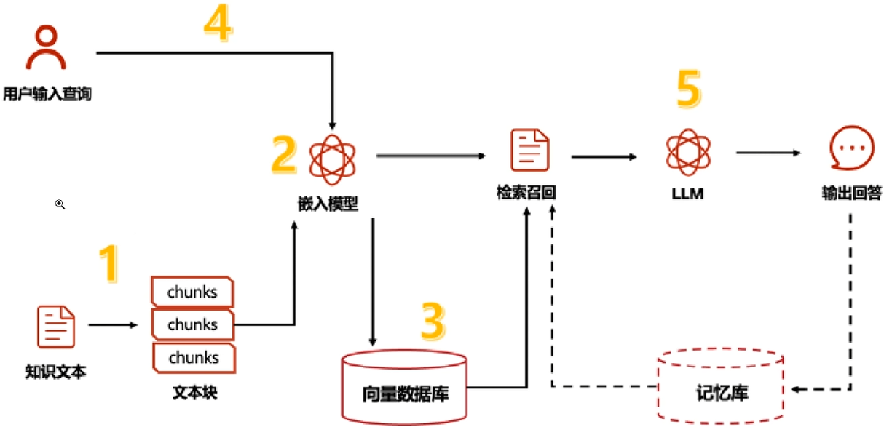
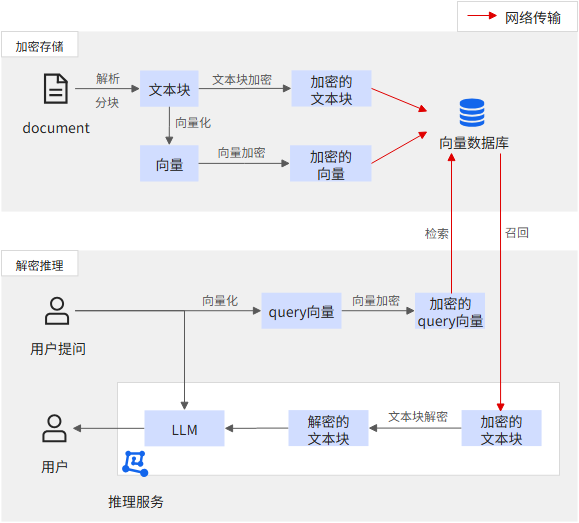
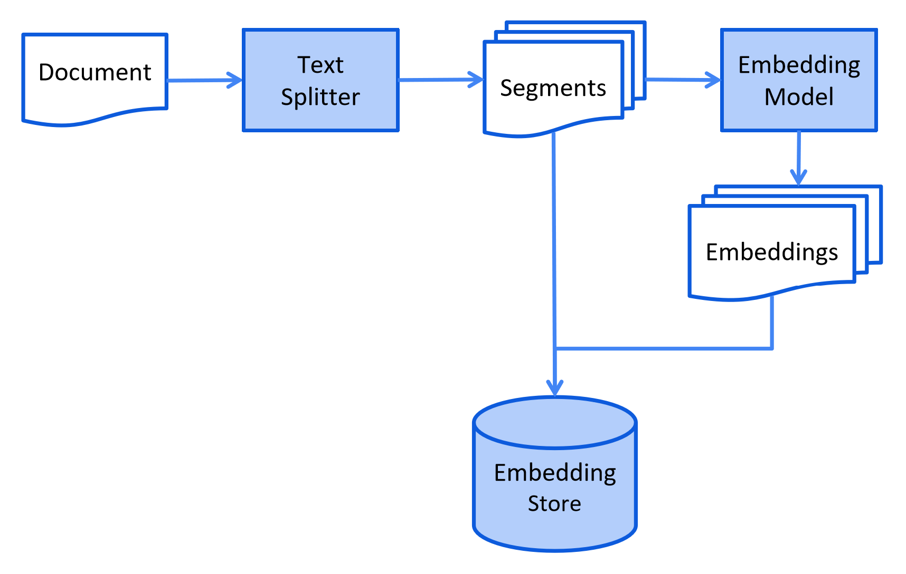
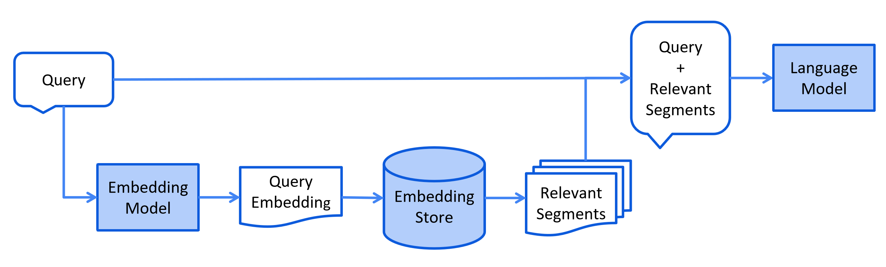

# 检索增强生成（RAG）：从原理到工程实践的深度解析

在大语言模型（LLM）快速迭代的今天，如何让模型既具备通用智能，又能精准调用特定领域知识，成为企业级 AI 应用的核心挑战。检索增强生成（Retrieval-Augmented Generation，RAG）技术通过 "检索 + 生成" 的协同模式，成功解决了纯 LLM 在知识时效性、准确性和领域适配性上的短板，成为连接通用 AI 与垂直业务的关键桥梁。本文将从技术原理出发，结合实战代码，全面剖析 RAG 的实现路径与工程实践。

## 一、RAG 的基本概念和原理

RAG 技术的核心思想源于信息检索与自然语言生成的融合：**在生成回答前，先从外部知识库中检索与问题相关的事实性信息，再让模型基于这些 "证据" 进行推理生成**。这种机制将 LLM 的 "闭卷考试" 模式转变为 "开卷考试"，从根本上解决了三个核心问题：

- **知识时效性局限**：LLM 训练数据存在截止日期，无法应对动态更新的业务知识（如 2025 年的新法规、企业内部文档更新）；
- **幻觉生成风险**：模型可能编造不存在的事实（如虚构产品参数、学术引用），在医疗、法律等领域可能引发严重后果；
- **领域知识壁垒**：通用模型对专业领域（如网络安全、金融风控）的深度知识掌握不足，难以生成精准回答。

从技术本质看，RAG 是一种**混合增强架构**：通过检索模块将外部知识引入生成过程，形成 "知识输入 - 模型推理 - 结果输出" 的闭环。这种架构既保留了 LLM 的上下文理解与自然语言生成能力，又通过外部知识库实现了知识的可控更新与精准调用。



可以加密文本块和向量（向量也可能泄露原始语义），从而使用密文进行存储与网络传输。对于向量加密需采用特殊加密算法使得加密后向量仍能进行相似度检索。


## 二、RAG 的工作流程

一个完整的 RAG 系统可分为**离线知识库构建**与**在线问答交互**两大阶段，包含五个核心步骤：

### 1. 离线知识库构建

- **文档采集**：收集结构化（如 Excel 表格）、半结构化（如 PDF 手册）和非结构化（如图片、音频转文本）数据；
- **文档预处理**：对原始数据进行清洗（去噪、格式统一）、拆分（按语义单元切割长文档）；
- **向量编码**：通过嵌入模型（Embedding Model）将文本片段转化为高维向量，捕捉语义特征；
- **向量存储**：将向量及关联文本存入向量数据库，建立可检索的知识索引。



### 2. 在线问答交互

- **查询理解与检索**：将用户问题转化为向量，在向量数据库中检索最相似的文本片段（Top-K）；
- **增强生成**：将检索到的文本作为上下文输入 LLM，生成基于事实的回答。




这种 "离线建库 + 在线调用" 的模式，既保证了知识更新的灵活性（无需重新训练模型），又确保了问答的实时性（检索与生成均为毫秒级操作）

## 三、实现 RAG 的关键技术

### 1. 文档加载：多源数据的统一接入

文档加载是 RAG 的入口环节，需支持多种格式文件的解析。示例代码中`Knowledge`类通过`loader_mapping`实现了多类型文件的适配：

```python
# 文件类型与加载器的映射关系
self.loader_mapping = {
    "txt": TextLoader,
    "pdf": PyMuPDFLoader,
    "docx": Docx2txtLoader,
    "xlsx": UnstructuredExcelLoader,
    "pptx": UnstructuredPowerPointLoader,
    "image": UnstructuredImageLoader,
    "default": UnstructuredFileLoader
}
```

**技术要点**：

- 针对 PDF 优先选择`PyMuPDFLoader`，支持高效解析带格式文本；
- 图片文件需配合 OCR 技术（如`UnstructuredImageLoader`）提取文字；
- 大型文档（如数百页 PDF）需实现流式加载，避免内存溢出。

### 2. 文本分割：语义完整与检索效率的平衡

长文档直接编码会导致语义稀释，需按语义单元拆分。示例中使用`RecursiveCharacterTextSplitter`：

```python
self.text_splitter = RecursiveCharacterTextSplitter(
    chunk_size=4000,  # 每块最大长度
    chunk_overlap=500,  # 块间重叠部分，保证语义连贯性
    length_function=len
)
```

**分割策略**：

- 优先按自然分隔符（段落、句子）拆分，避免破坏语义；
- `chunk_size`需根据嵌入模型最大输入长度调整（如 BERT 类模型通常支持 512 tokens）；
- 重叠部分（`chunk_overlap`）建议设置为总长度的 10%-20%，防止上下文断裂。

### 3. 向量数据库：高效相似性检索

向量数据库是 RAG 的 "大脑"，负责存储向量并支持快速近邻检索。示例中`ChromaDB`类实现了向量库的初始化与操作：

```python
# 初始化Chroma向量数据库
db = Chroma(
    collection_name=config.chroma_config().get("collection_name"),
    client=HttpClient(host=host, port=port),
    embedding_function=DashScopeEmbeddings(
        model=embedding_model_name,
        dashscope_api_key=api_key
    )
)
```

**选型考量**：

- 轻量级场景可选 Chroma、FAISS（适合单机部署）；
- 大规模集群场景推荐 Milvus、Weaviate（支持分布式存储与水平扩展）；
- 需关注向量数据库的索引类型（如 HNSW、IVF）对检索速度的影响。

### 4. 检索与生成：精准性与流畅性的协同

检索阶段需平衡召回率与精确率，生成阶段需控制模型对检索结果的依赖度。示例中通过以下流程实现：

1. **检索环节**：

```python
# 基于用户查询检索相似文档
query = "已监听端口"
docs = chromadb.query(query)  # 内部调用similarity_search
retriever = self.chromadb.as_retriever(search_kwargs={"k": 5})
```

   2.**生成环节**：

```python
  tool = create_retriever_tool(
            retriever,
            name="知识库检索",
            description="从知识库中检索相关信息来回答问题"
        )

        instructions = """
           您是一个设计用于查询检索知识库并回答问题的代理;
           您可以使用检索工具，并基于检索内容来回答问题;
           您可以通过不查询文档就知道答案，但您仍然需要通过查询文档来获取答案;
           如果您从文档中找不到任何信息用于回答问题，则只需返回“抱歉，这个问题我还不知道”作为答案。
           """
        # 基础提示模板
        base_prompt_template = """
           {instructions}

           TOOLS:
           ------
           You have access to the following tools:
           {tools}

           To use a tool,please use the following format:

           Thought: Do I need to use a tool? Yes
           Action: the action to take,should be one of [{tool_names}]
           Action Input: {input}
           Observations: the result of the action

           When you have a response to say to the Human,or if you do not need to use a tool,you MUST use the format:
           Thought: Do I need to use a tool: No
           Final Answer:[your response here]

           Begin!

           Previous conversation history:
           {chat_history}

           New input:{input}
           {agent_scratchpad}
           """
        # 创建基础提示词模板
        base_prompt = PromptTemplate.from_template(
            template=base_prompt_template
        )
        # 创建部分填充的提示词模板
        prompt = base_prompt.partial(
            instructions=instructions
        )
        agent = create_react_agent(
            self.model,
            [tool],
            prompt
        )

```

**优化技巧**：

- 采用混合检索策略（关键词检索 + 向量检索）提升召回率；
- 通过`search_kwargs={"k": 5}`控制返回的文档数量（通常 5-10 篇为宜）；
- 生成阶段使用提示词工程（如 "严格基于提供的信息回答，不编造内容"）约束模型行为。

## 四、完整代码示例

- rag代码示例

```python
"""
知识库 RAG
"""
import logging
from typing import Optional, List

from langchain_community.document_loaders import PyMuPDFLoader, TextLoader, Docx2txtLoader, UnstructuredExcelLoader, \
    UnstructuredPowerPointLoader, UnstructuredImageLoader, UnstructuredFileLoader
from langchain_core.tools import create_retriever_tool
from langchain_text_splitters import RecursiveCharacterTextSplitter

from DB.chroma import ChromaDB
from config.config import Config
from enums.model_enums import ModelType

# 配置日志
logging.basicConfig(
    level=logging.INFO,
    format='%(asctime)s - %(name)s - %(levelname)s - %(message)s'
)
logger = logging.getLogger(__name__)
class Knowledge:
    """文档处理器，负责加载和处理各种类型的文档"""
    def __init__(self):
        # 初始化文本分割器
        self.text_splitter = RecursiveCharacterTextSplitter(
            chunk_size=4000,  # 每块最大长度
            chunk_overlap=500,  # 块之间的重叠部分
            length_function=len,
            is_separator_regex=False
        )

        # 文件类型与对应加载器的映射
        self.loader_mapping = {
            "txt": TextLoader,
            "pdf": PyMuPDFLoader,
            "docx": Docx2txtLoader,
            "xlsx": UnstructuredExcelLoader,
            "xls": UnstructuredExcelLoader,
            "pptx": UnstructuredPowerPointLoader,
            "ppt": UnstructuredPowerPointLoader,
            "image": UnstructuredImageLoader,
            "png": UnstructuredImageLoader,
            "jpg": UnstructuredImageLoader,
            "jpeg": UnstructuredImageLoader,
            "default": UnstructuredFileLoader  # 默认加载器
        }

    def clean_text(self, text: str) -> str:
        """清理文本内容"""
        if not text:
            return ""

        # 移除多余的空格和换行
        text = " ".join(text.split())
        # 截断超长文本
        return text[:8000] if len(text) > 8000 else text

    def load_single_file(self, file_path: str, file_type: str) -> Optional[List]:
        """加载单个文件"""
        try:
            # 获取合适的加载器
            loader_class = self.loader_mapping.get(file_type.lower(), self.loader_mapping["default"])

            # 特殊处理：文本文件需要指定编码
            if file_type.lower() == "txt":
                loader = loader_class(file_path, encoding="utf-8")
            else:
                loader = loader_class(file_path)

            return loader.load()
        except Exception as e:
            logger.error(f"加载文件 {file_path} 时出错: {str(e)}")
            return None

    def split_documents(self, documents: List) -> List:
        """分割文档"""
        if not documents:
            return []

        try:
            return self.text_splitter.split_documents(documents)
        except Exception as e:
            logger.error(f"分割文档时出错: {str(e)}")
            return documents  # 如果分割失败，返回原始文档


    def load_files(self, file_paths: List[str], file_type: str) -> List:
        """加载并处理多个文件"""
        all_documents = []

        for file_path in file_paths:
            try:
                logger.info(f"正在处理文件: {file_path}")
                documents = self.load_single_file(file_path, file_type)
                if documents:
                    split_docs = self.split_documents(documents)
                    all_documents.extend(split_docs)
            except Exception as e:
                logger.error(f"处理文件 {file_path} 时出错: {str(e)}")
                continue

        return all_documents


if __name__ == "__main__":
    # files = ["D:\work\安服工作\安服资料\第2篇：Linux入侵排查.pdf","D:\work\安服工作\安服资料\Web安全开发指南 电子版.pdf"]
    # document_processor = Knowledge()
    # documents = document_processor.load_files(files, "pdf")
    # print(documents)
    # #批量写入
    config = Config('conf/config.yml')
    chromadb = ChromaDB(config, ModelType.QWEN)
    # chromadb.add(documents)
    # # 向量数据库查询
    # query = "已监听端⼝ "
    # docs = chromadb.query(query)
    # for doc in docs:
    #     print(doc)
    retriever = chromadb.as_retriever(search_kwargs={"k": 3})
    tool = create_retriever_tool(
        retriever,
        name="知识库检索",
        description="从知识库中检索相关信息来回答问题"
    )
```

- chroma向量数据库代码示例

```python
# chroma向量数据库
from chromadb import HttpClient
from langchain_chroma import Chroma
from langchain_community.embeddings import DashScopeEmbeddings

from config.config import Config
from enums.model_enums import ModelType


class ChromaDB:
    def __init__(self, config: Config, model_type: ModelType):
        self.config = config
        try:
            client = HttpClient(host=config.chroma_config().get("host"), port=config.chroma_config().get("port"))

            embedding = DashScopeEmbeddings(
                model=config.model_config(model_type).get("embeddingModelName"),
                dashscope_api_key=config.model_config(model_type).get("apiKey")
            )

            db = Chroma(
                collection_name=config.chroma_config().get("collection_name"),
                client=client,
                embedding_function=embedding  # 传入嵌入函数
            )
            db.get()  # 尝试访问集合验证连接
            print("连接向量数据库成功..")
            self.db = db
        except Exception as e:
            # 异常处理
            raise Exception(f"链接向量数据库失败: {str(e)}, 请检查配置信息") from e

    def add(self, documents):
        # 新增：按API限制拆分批次（每批最多10个文档）
        batch_size = 10
        for i in range(0, len(documents), batch_size):
            batch = documents[i:i + batch_size]  # 截取批次文档
            self.db.add_documents(batch)  # 分批添加
            print(f"已添加第 {i // batch_size + 1} 批文档，共 {len(batch)} 个")
            # 新增：添加文档后，刷新索引

    def query(self, query):
        # 查询文档
        docs = self.db.similarity_search(query)
        return docs

    def delete(self, document_id):
        # 删除文档
        self.db.delete(document_id)
        print(f"已删除文档 ID: {document_id}")

    def update(self, document_id, doc):
        # 更新文档
        self.db.update_document(document_id, doc)
        print(f"已更新文档 ID: {document_id}")

    def list(self):
        # 列出所有文档
        return self.db.get()

    def delete_all(self):
        # 删除所有文档
        self.db.delete_collection()
        print("已删除所有文档")

    def get_id(self, document_id):
        return self.db.get(document_id)

    def as_retriever(self, search_kwargs):
        return self.db.as_retriever(search_kwargs=search_kwargs)

    # def db(self):
    #     return self.db


# if __name__ == '__main__':
#     config = Config('../conf/config.yml')
#     chromadb = ChromaDB(config, ModelType.QWEN)
#     docs = chromadb.list()
#     print(docs)
#     print(chromadb.get_id("0f506577-1db5-42fb-b70d-fe77fb7fe173"))


```

## 五、代码仓库路径

[zcj-git520/AiLargeModel: 大模型应用开发学习](https://github.com/zcj-git520/AiLargeModel)
