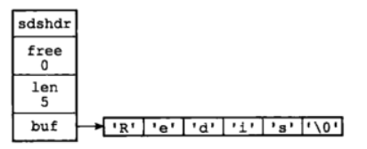
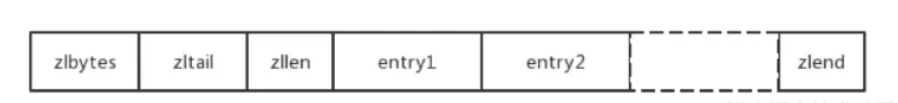
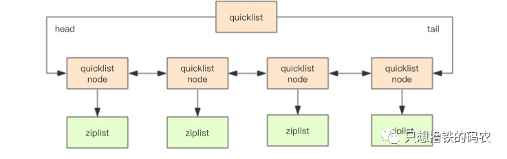
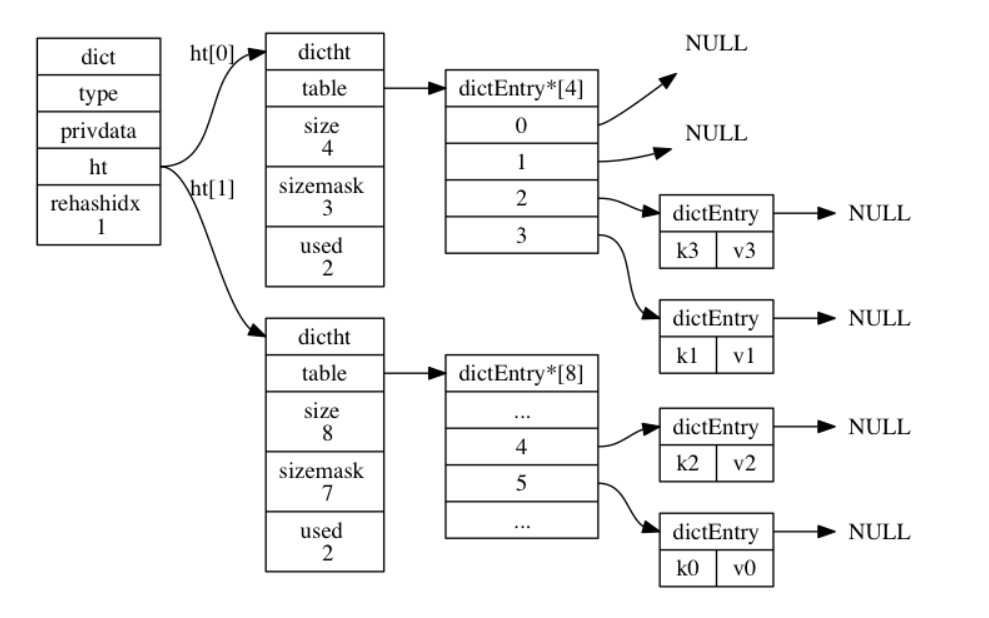
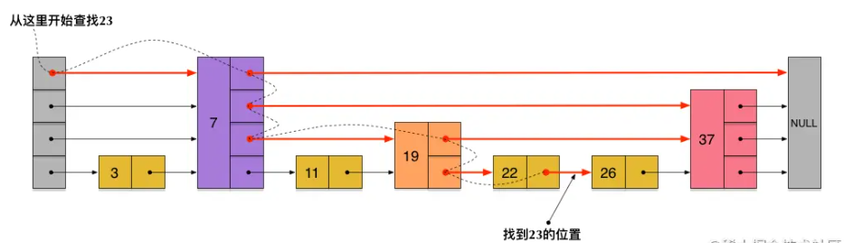

## redis
* redis 是一个开源（BSD许可）的，数据结构为key-value的存储系统。它可以用作分布式数据库、缓存
和消息队列（消息中间件）。数据保存在内存中，存取速度快，并发能力强。
* redis 支持多种数据结构，如字符串、map(哈希)、列表、集合、有序集合等数据类型。数据都是原子操作，
数据都缓存在内存中，会定期将数据更新到磁盘或者修改操作写入追加记录。再次基础上实现了主从（master-slave）

## redis 数据结构
### 字符串(string)类型
* 字符串类型是redis最基础的数据结构，可以存储简单的字符串也可存储复杂的xml、json、二进制数据（如图像、音频）
* value内部以保存整数的int和保存字符的sds组成的数据存储结构。sds内部结构为：
```
struct sdshdr {
    int len;    // 记录着buf中也使用的字符串数量
    int free;   // 记录着buf中未使用的字符串数量
    char buh[]; // 字符串数组，用于保存字符串
}
```

#### 字符串类型特性
1. 分配冗余空间：采用预先分配冗余空间的方式来减少内存的频繁分配
2. 自动扩容： 当字符串所占空间小于1MB时，redis会按照字符串（len + addLen）*2倍数存储空间增加，
当字符串的存储空间超过所占空间的1MB时，每次自会增加1MB的存储空间扩容，最大扩容为512MB的存储空间
3. 二进制的安全性，兼容c语言函数库中字符串以\0结束。

#### 字符串常用的场景
1. 缓存功能： 基于redis作为缓存再配合其他的数据库最为存储层，利用redis的数据存储在内存和支持高并发的特点，可以大大加快
系统的读写速度以及降低后端数据库的压力。（单值缓存、对象缓存、分布式锁等）
2. 计数器： 使用redis作为系统的实时计数器，可以加快计数和查询功能。
3. 共享用户的session：利用redis将用户的session集中管理，这种模式确保redis的高可用。每次用户的session的更新和获取快速完成

### 列表(list)
* list类型的value对象内部采用的quicklist(快速列表)或者ziplist(压缩列表)承载。当list的元素和单个元素较小时采用ziplist实现来减少内存的
占用否则采用quicklist结构进行存储。
* ziplist所有内容都存放在来连续的内存中。zipbytes表示ziplist的总长度， zltail表示指向最末的元素，zllen表示元素个数， entryX表示元素自身内容， zlend是ziplist的定界符
ziplist的内部结构为：
```
typedef struct ziplist{
     /*ziplist分配的内存大小*/
     uint32_t bytes;
     /*达到尾部的偏移量*/
     uint32_t tail_offset;
     /*存储元素实体个数*/
     uint16_t length;
     /*存储内容实体元素*/
     unsigned char* content[];
     /*尾部标识*/
     unsigned char end;
}ziplist;

/*元素实体所有信息, 仅仅是描述使用, 内存中并非如此存储*/
typedef struct zlentry {
     /*前一个元素长度需要空间和前一个元素长度*/
    unsigned int prevrawlensize, prevrawlen;
     /*元素长度需要空间和元素长度*/
    unsigned int lensize, len;
     /*头部长度即prevrawlensize + lensize*/
    unsigned int headersize;
     /*元素内容编码*/
    unsigned char encoding;
     /*元素实际内容*/
    unsigned char *p;
}zlentry;

```

* quicklist是底层是ziplist的双向链表,结构为：
```
struct quicklistNode {
    quicklistNode *prev;
    quicklistNode *next;
    ziplist *zl;         // 指向压缩列表
    int32 size;          // ziplist字节总数
    int16 count;         // ziplist中元素数量
    int2 encoding;       // 存储形式，表示原生字节数组还是LZF压缩存储
    ...
} quicklistNode；

// 快速列表
struct quicklist {
    quicklistNode *head;
    quicklistNode *next;
    long count;           // 元素总数
    int nodes;            // ziplist节点个数
    int compressDepth;    // LZF算法压缩深度
}
quicklist;
```

* redis的list支持存储2的32次方个元素，可以通过下标获取指定元素和莫个范围的元素集
#### 列表常用场景
1. 消息队列：redis的链表式结构，可以轻松实现阻塞队列，可以使用左进右出的命令完成队列的设计
2. 文章列表或者数据分页展示的应用

### map类型(hash 散列)
* map主要由hashtable和ziplist两种承载方式承载。当存储数据较小时，采用ziplist实现
#### hashtable组成
1. dict: 当dictht需要扩容/缩容时，用于管理桶的迁移，结构图下
```
typedef struct dict{
  // 类型特定函数
  dictType *type;
  // 私有数据
  void *private;
  // 哈希表
  dictht ht[2];
  // rehash 索引，当当前的字典不在 rehash 时，值为-1
  int trehashidx;
}
```
2. dictht: 维护哈希表的说有桶连,结构如下：
```
typedef struct dictht{
     //哈希表数组
     dictEntry **table;
     //哈希表大小
     unsigned long size;
     //哈希表大小掩码，用于计算索引值
     //总是等于 size-1
     unsigned long sizemask;
     //该哈希表已有节点的数量
     unsigned long used;
 
}dictht
```
3. dictEntry:管理一个k-v对，同时保留着一个桶中相邻元素的指针，一次维护哈希桶内部相连，结构如下
```
typedef struct dictEntry{
     void *key;
     union{
          void *val;
          uint64_tu64;
          int64_ts64;
     }v;
     //下一个
     struct dictEntry *next;
}dictEntry
```

#### ziplist
* map中对应的ziplist的entry的个数一定是2的整数倍。即奇数存放着key,偶数存放着value

#### map类型的特性
1. map内部的key和value不能在嵌套map,只能是string，int或着是float
2. 负载因子 = 哈希表中已有的元素/哈希桶数
3. 扩容：通过负载因子判断是否需要增加桶数。即当负载因子小于1时，一定不扩容，
当负载因子大于1，且在没有在执行BGSAVE进行或当负载因子大于5时，一顶会进行扩容，
扩容时，新桶的数目是现有桶数目的两倍。
4. 缩容：当负载因子小于0.1时，就进行缩容。
5. 扩/缩容都是通过新建哈希表的方式实现，扩容时新建现有桶的2倍的新表，缩容时是新建原表的一半新建哈希表。
将原表的桶逐步迁移到目标表(新建的哈希表)

#### map常用场景
1. 利用键值对的特性，用来存储关系性数据库中表的记录
2. 存储用户信息，优化用户信息的来源，提高系统的性能

### 集合(set)类型
* set是由inset或者hashtable来存储，hashtable的value永远为nil,只有int类型是使用inset进行存储
* inset:其核心是一个字符数组
#### set类型的特性
* 允许重复元素，没有顺序，没有下表，支持集合内的增删改查，并支持多个集合的交、并、差集等操作
#### set常用场景
1. 根据set的特性，适合于聚合分类，如标签、好友共同喜好等场景
2. 利用set中元素的唯一性，适合于数据的唯一性，如统计网站的独立ip

### 有序集合(sorted-set)
* sorter-set是的内部结构是以压缩列表(ziplist)或者跳跃表(skiplist)+hashtable构成
* sorted-set类似于map的键值对(key-value)且有序，value是一个浮点数称之为score，是排序的根据
* 跳跃表(skiplist)其核心点主要是包括一个dict对象和一个skiplist对象,结构如下：
```
typedef struct zset{
     //跳跃表
     zskiplist *zsl;
     //字典
     dict *dice;
} zset

/* ZSETs use a specialized version of Skiplists */
/*
 * 跳跃表节点
 */
typedef struct zskiplistNode {

    // 成员对象
    robj *obj;

    // 分值
    double score;

    // 后退指针
    struct zskiplistNode *backward;

    // 层
    struct zskiplistLevel {

        // 前进指针
        struct zskiplistNode *forward;

        // 跨度
        unsigned int span;

    } level[];

} zskiplistNode;

/*
 * 跳跃表
 */
typedef struct zskiplist {

    // 表头节点和表尾节点
    struct zskiplistNode *header, *tail;

    // 表中节点的数量
    unsigned long length;

    // 表中层数最大的节点的层数
    int level;

} zskiplist;


```

#### 有序集合(sorted-set)特性
* sorted-set是集合的基础上，增加了给每一个元素设置分数(score),利用该分数进行排序，集合元素是唯一的，分数是不唯一的。
#### 有序集合(sorted-set)常用创景
1. 利用它的特性，可以适合于排序的场景，如排行榜等
2. 根据集合的每个元素都设置了一个score分数的特性，做带权的队列，如：普通的信息的权重为1，重要的信息的权重为2，
应用线程可以根据权重调用。

## 参考文献：
[Redis底层数据结构详解](https://cloud.tencent.com/developer/article/1690533)
