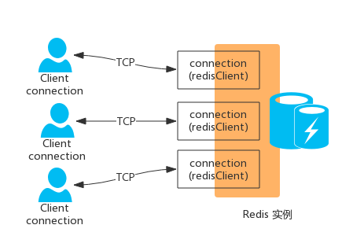
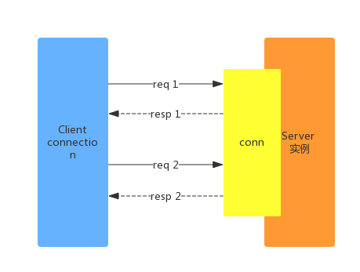
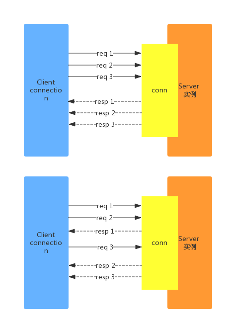
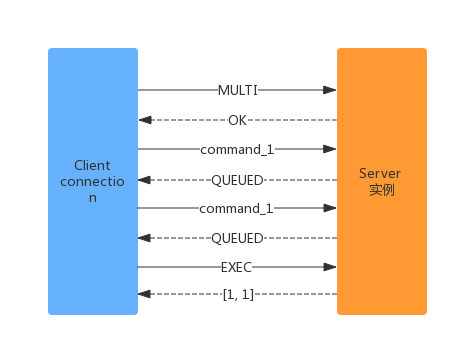
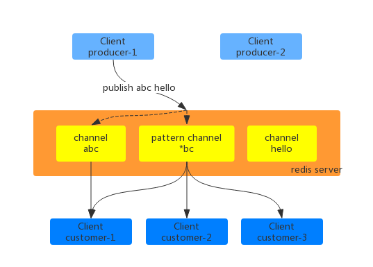

## redis的网络协议
* redis是基于tcp/ip协议，即客户端与服务器保持双工连接，通过序列化的协议(resp协议)进行数据的交互，在Redis中，协议数据分为不同的类型，
每种类型的数据均以CRLF（\r\n）结束，通过数据的首字符区分类型

* redis服务器是一个事件驱动系统主要分为：文件事件(io事件)和时间事件
* 文件驱动：socket的读取事件(io事件)是由；连接(三次握手)、请求、响应(数据返回)、断开连接(四次挥手)组成，redis是采用单线程
和epoll(io多路复用)的机制处理相关的文件事件。
* 时间事件：可分为定时事件(程序在指定时间后执行相关的操作)和周期事件(程序每隔一段时间运行相关的操作)

## redis客户端与服务器交互模式
### 串行的请求/交互模式
* 客户端与服务器建立长连接，通过心跳检测(ping-pong)ack应答，即客户端发送请求，服务器在进行响应。
* 在单连接下。大部分时间都是处于网络等待上(客户端在发送请求命令，并监听socket返回，通常以阻塞模式等待服务器端的响应)，这种模式下
的性能较低

### 管道技术(pipeline)双工的请求/响应模式
* 将一批命令进行打包，然后发送给服务器，服务器获取数据后按顺序打包返回，即批量请求，批量响应。以次来减少网络等待的延时，提高性能

### 原子化的批量请求/响应(事务)模式
* 客户端将请求的命令发送发到服务器，服务器经这些请求暂存在服务器的请求队列中，这过程也称为：请求入队列。服务器在从请求队列中
拿去所有的请求执行，然后再将数据返回给客户端，这过程称为执行阶段。
* 服务器在执行过程中不会在接收其他客户端发送的请求。所有的操作都是原子操作，即请求都执行或都不执行。
* 事务的步骤为：开始事务->请求入队列->执行请求

### 发布/订阅(pub/sub)模式
* 发布者(pub)发送消息，订阅者(sub)接收消息，发布者和订阅者通过(通道)channel关联，所有的channel都是由一个map维护，map的key是
channel的名字，value是所有的订阅者的指针链表。客户端可以订阅任意的数量的频道，也可以进行发布。
* 发布者和订阅者都是客户端，服务器只是进行数据的中转。即发布者着向服务端发起请求，服务端将请求的数据推送给订阅者。

## redis的持久化机制
* redis的持久化机制主要是有：RDB(快照)和AOF(日志)两种持久化的方式。持久的化的作用在于：故障恢复和数据恢复
### RDB(快照)持久化机制
* 快照是redis默认的持久化方案，在指定时间间隔内生成数据集的时间点，即在指定的时间段内将内存的数据写入磁盘，在磁盘
上生成一个rdb的备份文件。在redis重启时加载rdb文件进行数据的恢复。
* 快照的持久化提供自动备份：需要修改配置文件redis.conf。也提供save和bysave(后台子进程)进行主动备份
#### RDB(快照)的工作流程：
1. 主进程会单独创建子进程，将主进程的数据库的数据复制到子进程。
2. 子进程将数据写入到临时文件中进行持久化，在经临时文件替换之前的rdb文件,子进程退出，释放内存中的数据
3. 主进程不进行持久化，即不进行任何的io操作，确保redis的极高的性能
#### RDB(快照)的优缺点
##### 优点
1. 单一的紧凑文件保存了莫一段时间的数据集，比较适合做数据的备份尤其的冷备份
2. 在对数据完整性不敏感下，适合大规模的数据的恢复，因直接从磁盘获取数据，恢复数据快
3. 由子进程进行持久化，主进程不进行持久化，即不进行任何的io操作，确保redis的极高的性能
##### 缺点
1. 不能保障数据的完整性，若redis出现宕机，就不会出现最近的数据未持久化，导致数据的丢失。
2. 当持久化的数据量较大时，会导致持久化的子进程就会很耗时，即使主线程在不参与持久化也可能导致服务器在毫秒级内不能响应
客户端的请求，若数据巨大时且cpu的性能不佳时，会出现秒级不能响应客户端的请求。
### AOF(日志)持久化
* 通过将每个写操作记录到日志中且以追加文件不修改文件的模式，重启时更具根据日志文件从头到未执行一遍即恢复数据。，因AOF采用的是经操作记录以追加模式下写入日志文件中，会导致AOF文件越来越大。AOF引入了重写机制。
* AOF引入了重写机制：当文件AOF是上次重写大小的一倍且文件大于64MB时就创建一个子进程遍历服务器的键值对，转换成一系列 Redis 的操作
指令，序列化到一个新的AOF日志文件中，再替换旧的AOF日志文件。可以修改配置文件设定持久化策略。
#### AOF 提供了三种持久化策略：
1. no: 无 fsync，由系统保证数据刷新到磁盘，速度最快，但很不安全（通常不使用）；
2. always: 每次 fsync，每一个修改内存的 Redis 指令都会执行一次 fsync，速度很慢（通常不使用）；
3. everysec: 每秒进行一次 fsync，有可能丢失一秒的 fsync 的数据。通常选择 everysec 策略，兼顾安全性和效率。

#### AOF(日志)的优缺点
##### 优点
* 可以采用everysec的持久化策略，能确保数据的完整性
##### 缺点
1. AOF的日志文件通常是比rdb文件大
2. 在数据的恢复时，需要遍历日志文件，将日志文件的数据操作命令在执行一遍，导致数据恢复相对于快照(rdb)较慢，尤其在大数据下。

## redis 缓存中的状况于解决方案
### 缓存雪崩
* 数据未加载到内存或者同一时间发生大规模的key失效，从而导致所有的请求都直接在查数据库。导致数据库和cpu负载过高，甚至宕机
#### 解决方案
1. 加锁计数，限制并发的数量，避免出现并发出现大量的请求访问到数据库，降低服务器的吞吐量
2. 设置热点key永不失效，均匀过期，避免出现大面积的key同时失效
3. 设置缓存服务器的主备
### 缓存穿透
* 指客户端请求的数据在缓存和数据库中均没有，导致客户端在每次请求都需要去数据库查询。若在并发时，也会导致数据库和cpu的负载过高，
导致数据库的宕机
#### 解决方案
1. 若查询数据库不存在，直接在缓存中保存一个默认的值，并设置较短的过期时间，下次请求直接从缓存中返回。
2. 使用布隆过滤器，阻挡无效的请求。
### 缓存并发
* 在并发情况下，一个缓存失效，在高并发下访问数据库，缓存更新，也会导致数据的压力变大。
#### 解决方案
* 对缓存加锁，若key不存在，就加锁，当查询数据库的数据写入缓存在解锁

### 缓存预热
* 在系统运行前，将数据加载到缓存中
#### 解决方案
1. 数据量不大，直接加载
2. 数据量大时，设置定时的脚本进行缓存的刷新
3. 数据量巨大时，优先保障热点数据提前加载到缓存中

### 缓存降级
* 指缓存失效或者缓存服务器宕机时，不去访问数据库，直接返回默认值或访问内存数据

### 分布锁
* 使用setnx加锁，并设置超时时间，过了超时时间就解锁，并删除锁

## 参考文献
[Redis 客户端服务端交互1 客户端/服务端协议](https://cloud.tencent.com/developer/article/1193256)
