## redis 常用命令的实践

### 结构化与非结构化

- 关系型数据库

  1. 结构化
  2. 关联性
  3. sql查询
  4. 满足事务的ACID

  

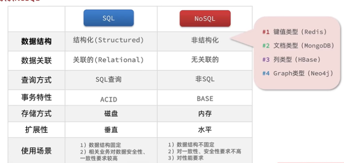
### redis 通用命令

通用指令是部分数据类型的，都可以使用的指令，常见的有：

1. KEYS:查看符合模板的所有key
2. del：删除指定的key
3. exists:判读key是否存在
4. expire:给一个可以设置有效期（单位时间为s），有效期到时会自动删除key
5. ttl:查看key的有效期

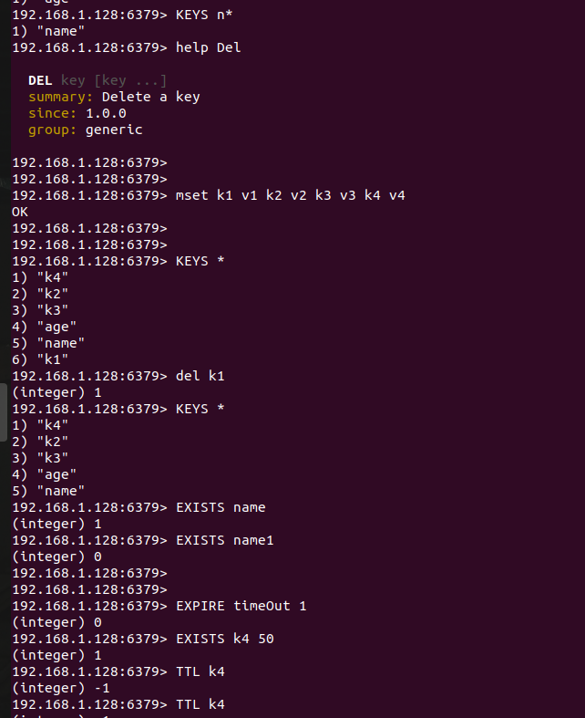

### string 类型常用命令

string类型是redis中最简单的存储类型，其value是字符串，字符串可以分为3类：

1. string:普通字符串

2. int：整数类型，可以自增或自减

3. float:浮点型，可以自增或自减

   无论是哪一种格式，底层都是字节数组形式存储，只不过是编码不同，字符串类型的最大空间不超过512M

   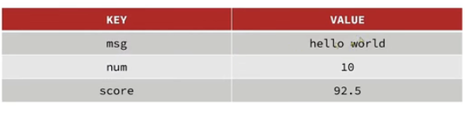

#### 常用的命令有：

1. set:添加或者修改也存在的的一个string类型的键值对

2. get:根据key获取string类型的value

3. mset:批量添加多个stingl类型的键值对

4. mget:根据多个key获取多个string类型的value

5. incr:让一个int的key自增1

6. incrby:让一个整型的key自增并指定步长

7. incrbyfloat:让一个浮点数的数值自增并指定步长

8. setnx:添加一个string类型的键值对，当key存在时，不执行

9. setex:添加一个string类型的键值对，并且设置有效期

   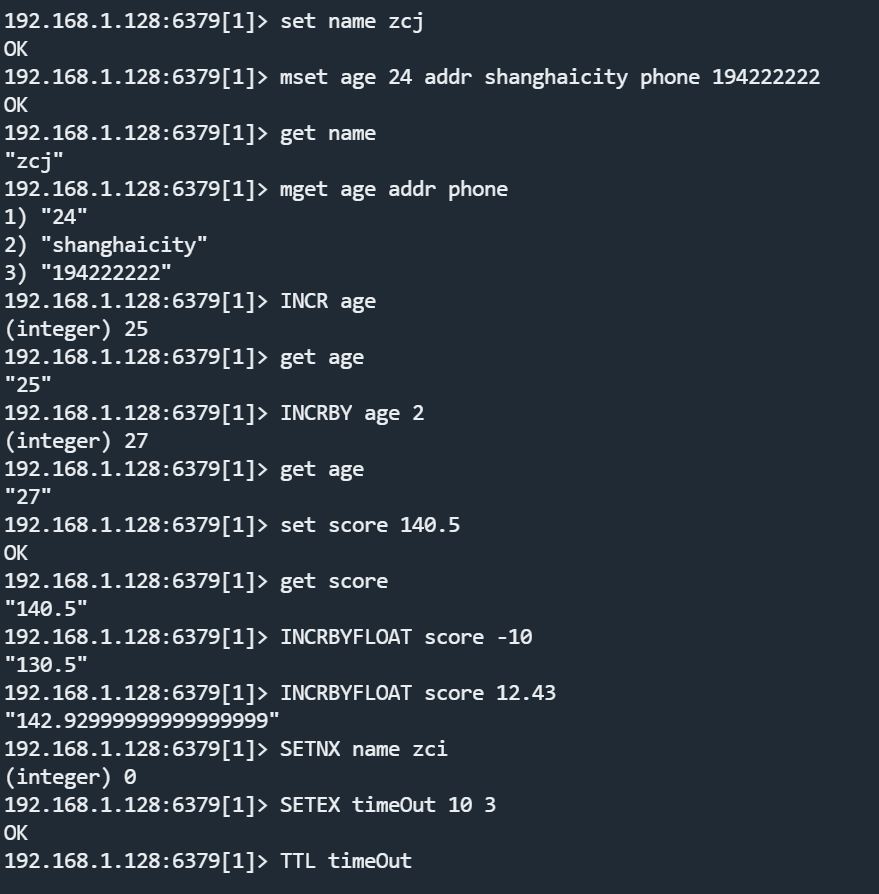    

####   key的结构

redis的key允许有多个单词形成层级结构，有多个单词之间用“：”隔开;

格式如下：项目名：业务名：类型：id;  

- 例如：user相关的key:sysd:user:1
- 例如：产品相相关的key:sysd:product:1

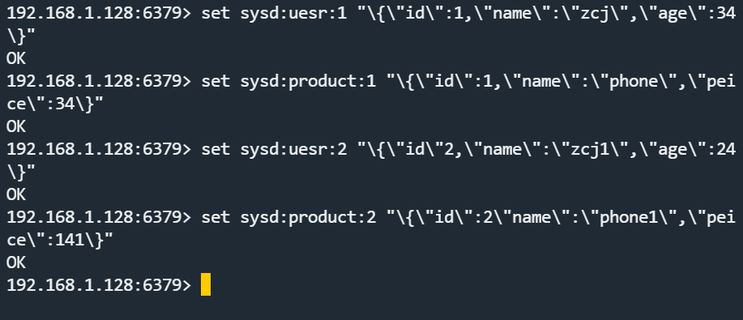

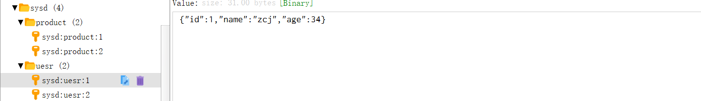

### HASH类型

hash类型是叫散列，其value是一个无序的字典，hash的结构可以将对象的每个单独的字段独立存储，可以对每个字段做CRUD;

#### 常用的命令如下：

1. hset key fileld value :添加或者修改hash类型key的fileld的值

2. hget key fileld: 获取一个hash类型的fileld的值

3. hmset: 批量添加多个hash类型的key的field的值

4. hmget：批量获取多个hash类型的keyde fileld的值

5. hgetall:获取一个hash类型的key中的所有的fileld和value

6. hkeys:获取一个hash类型的key中的所有的filed

7. hvale:获取一个hash类型中的key的所有value

8. hincrby:让一个hash类型key的字段值自增并指定步长

9. hseinx:添加一个hash类型的key的fileld值，若存在则步添加

   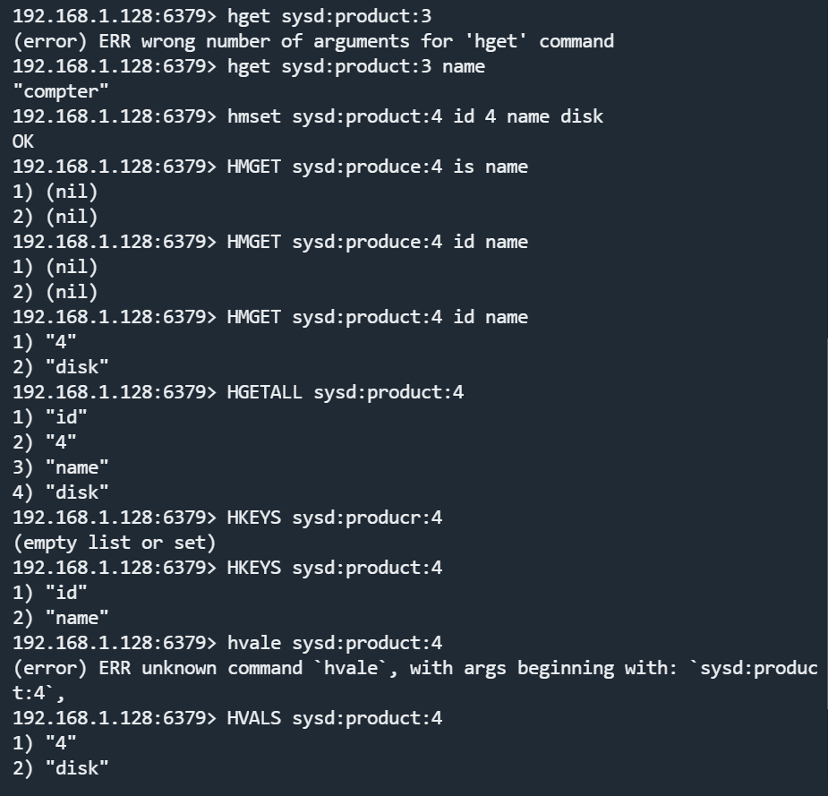

​		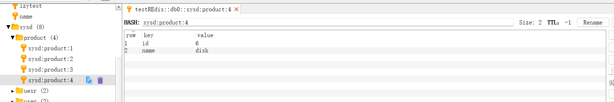

### LIST类型

redis中的list可以看作是一个双向链表的结构，支持正向与反向的检索，有以下特征：

- 有序
- 元素可以重复
- 插入与删除快
- 查询速度一般

#### 常用的命令

1. lpush key value…… ：向左插入一个或多个元素
2. lpop key ：移除左边的第一个元素，没有就返回nil
3. rpush key value……：向右插入一个或者多个元素
4. Rrpop key:移除并返回右侧的第一个元素，没有就返回nil
5. lrang key star end:返回一段角标范围内所有元素
6. blpop和brpop:与lpop和rpop类似，只不过在没有元素时等待的时间，而不是直接返回nil

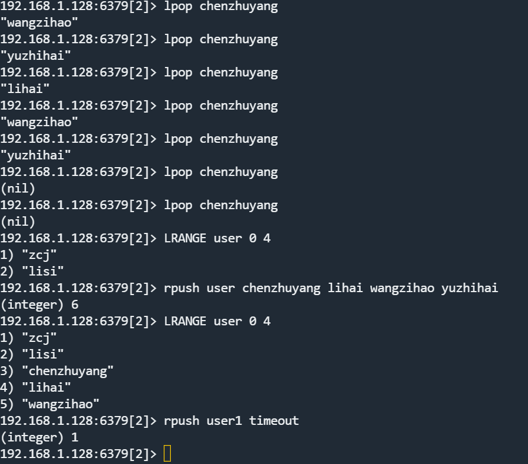

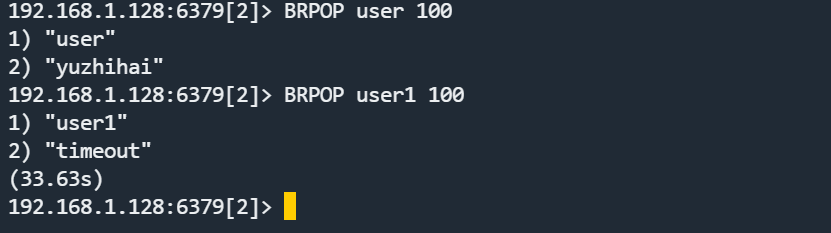

### set类型

redis中的set结构可以看作是一个value为nil的hashmap。具备一下特征：

- 无序
- 元素不可重复
- 查找快
- 支持交集/并集/差集等功能

#### 常用的命令

1. sadd key number ……：向set中添加一个或者多个元素

2. srem key number ……：移除set中指定的元素

3. scard key:返回set中的元素个数

4. sismembre key member:判断一个元素是否存在与一个set中

5. smembers:获取set中所有的元素

6. sinter key1 key2……：求集合之间的交集

7. sdiff key1 key2……：集合之间的差集

8. sunion key1 key2……：集合之间的并集

   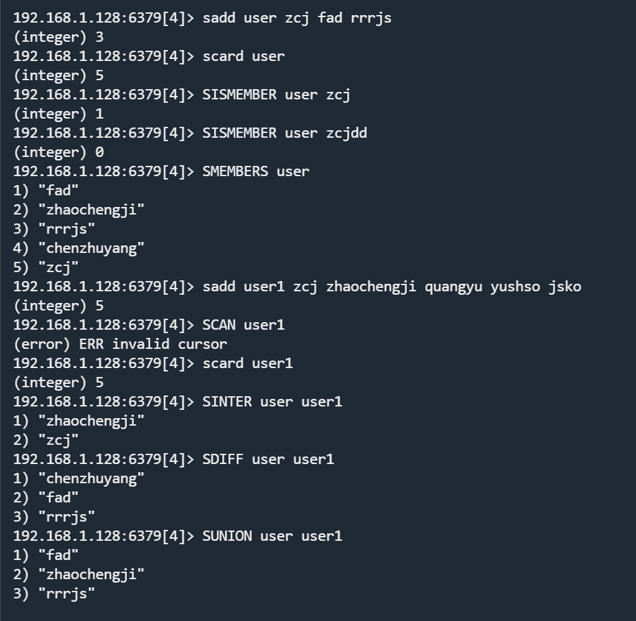

​		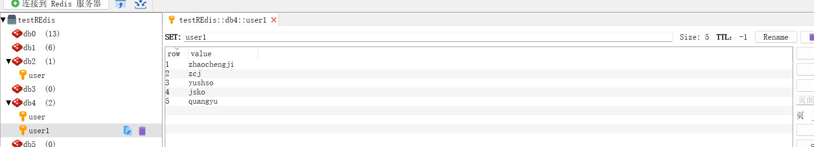

### SortedSet类型

redis的sortedset是一个有序的集合，每一个元素都带有一个score的属性，可以基于score属性对元素进行排序，其底层是一个由一个跳跃表和hash表实现，其具备一下特性：

- 可排序
- 元素不可重复
- 查询速度快

#### 常用命令

1. zadd key score member: 添加一个或者多个元素到有序集合中，如果存在则更新其score

2. zrem key member:删除有序集合中的一个指定元素

3. zscore key member:获取指定元素的的score值

4. zrank key member:获取有序集合元素的排名

5. zcard key:获取有序集合中的元素个数

6. zcount key min max:统计score值在给定范围内中的所有元素和个数

7. zincrby key increment member:让有序集合中的指定元素自增，步长为指定的increment值

8. zrange key min max:按照score排序后，获取指定排名范围的元素

9. zrangebyscore key min max:按照score排序后，获取指定的score范围的元素

10. zdiff/zinter/zuninon:求差集/交集/并集

    注明：排名默认为升序，rev为降序

    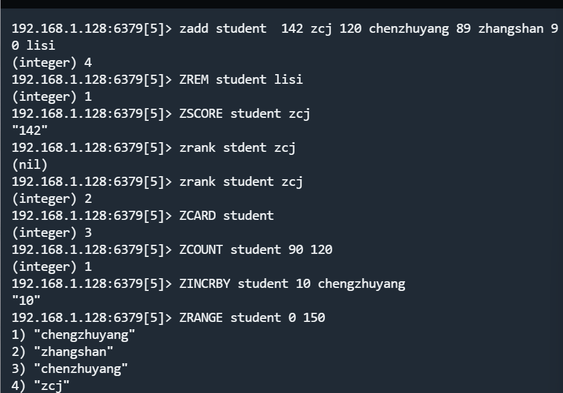

​		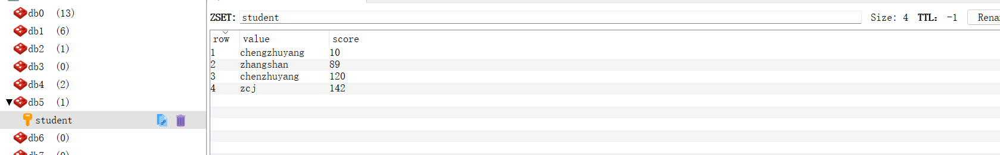