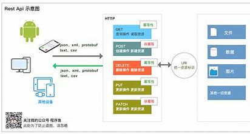

## Restful API
* rest是Representational state Transfer 的缩写（表述性转态传递）
* api是应用程序接口
* Restful API是一种软件结构风格，设计风格，让软件更加清晰、简洁、易维护。是一种流行的软件API
设计风格
## Rest的指导风格
1. 客户端-服务器：通过将用户接口问题与数据存储问题分开，简化服务器组件来提高跨平台放入用户接口的
可移植性性并提高可伸缩性
2. 无转态：从客户端到服务器的每个请求都必须包含理解请求所需的所有信息，并且不能利用服务器上任何存储的上下文。因此，会话状态完全保留在客户端上。
3. 可缓存：缓存约束要求将对请求的响应中的数据隐式或显式标记为可缓存或不可缓存。如果响应是可缓存的，则客户端缓存有权重用该响应数据以用于以后的等效请求。
4. 统一接口：通过将通用性的软件工程原理应用于组件接口，简化了整个系统架构，提高了交互的可见性。为了获得统一的接口，需要多个架构约束来指导组件的行为。REST由四个接口约束定义：资源识别; 通过陈述来处理资源; 自我描述性的信息; 并且，超媒体作为应用程序状态的引擎
5. 分层系统：分层系统风格允许通过约束组件行为来使体系结构由分层层组成，这样每个组件都不能“看到”超出与它们交互的直接层。
6. 按需编码（可选）： REST允许通过以小程序或脚本的形式下载和执行代码来扩展客户端功能。这通过减少预先实现所需的功能数量来简化客户端

## RestFul 架构
1. 资源：网络的实体或者是具体的信息，使用URI(统一资源定位符)，URI是每一个资源的地址或者独一无二的是识别符
2. 表现层： 对资源的外在表现，如：json、xml、txt、二进制等
3. 转态转化：互联网是一种无转态的协议，所有的状态都是保存在服务器上，客户端通过
HTTP的操作方式(GET,POST,PUT,DELETE)等改变服务器的“状态变化”

## RESTful API接口规范
### 接口风格
- 路径和变量均采用小驼峰式，例如deviceId
- 使用HTTP动词作为action操作URL资源，动词一律大写。
  - GET：读取\查询（Read）
  - POST：新建（Create）
  - PUT：更新（Update）
  - PATCH：更新（Update），通常是部分更新
  - DELETE：删除（Delete）
  - HEAD：获取资源的元数据。
  - OPTIONS：获取信息，关于资源的哪些属性是客户端可以改变的。
  - 5种请求动作中，GET、PUT、PATCH、DELETE均是幂等的；只有POST是非幂等的。幂等操作的特点是其任意多次执行所产生的影响均与一次执行的影响相同。**是非幂等是判断接口使用POST还是PUT的决定条件**。幂等的理解见本文附录。
- 参数：
  - PATH（路径）：
     - 版本号放入PATH，且在最前
	    - 尽量使用名词，不使用动词，把每个URL看成一个资源，名称都用复数
		- 微服务名称不放入PATH中
  - Query参数：主要用在GET查询中，简单的PUT动作，也用Query参数
  - Headers参数：公共参数通过header传递，content-type、authorization认证必填，其他统一按调用链规范、速率限制规范填写。content-type应该固定为`application/json`。
  - Body：
     - 统一使用json格式，所有返回都是json格式
	    - POST所有参数通过JSON传递
	   - GET请求不允许有body， 所有参数通过拼接在URL之后传递，**所有的请求参数都要进行遵循[RFC 3986](https://link.zhihu.com/?target=https%3A//tools.ietf.org/html/rfc3986)的URL Encode**。
	   - DELETE删除单个资源时，资源标识通过path传递，批量删除时，通过在body中传递JSON。
- 返回结果
  - 状态码：HTTP状态码标准用法，见后状态码规范
  - Body返回，只提供json返回格式
  - GET：返回资源对象，完整对象或通过Query参数可过滤
  - POST：返回新生成的资源对象，可能是ID或完整的资源对象
  - PUT：返回完整的资源对象
  - DELETE：返回一个空文档
- 过滤信息：查询及查询结果使用
  - pageNo：分页查询标识第几页
  - pageSize：分页查询标识每页多少条数据
  - begin：录像/截图开始时间，Unix时间戳，单位秒
  - end：录像/截图结束时间，Unix时间戳，单位秒
  - orderby：排序规则，desc或asc
  - q：搜索关键字（uri encode之后的）
  - totalCount：总记录数，分页查询，返回json携带
  - totalPages：总页数，分页查询，返回json携带，等于page时，表示当前是最后一页
 - 微服务内部使用http协议，对外使用https协议 
### 详细设计要求
- 输入参数要精简有效
  - 不能把内部对象作为接口参数，通过DTO进行转换；
  - required的字段尽可能少
- CRUD的U(POST)要通过业务分析（领域建模）具体化操作，不要提供灵活但是支持不全面的接口
- 查询尽可能提供丰富的查询条件，可以返回尽可能详细的信息
- 同类资源尽可能统一接口
- 避免多级 URL，比如获取某个作者的某一类文章：
`GET /authors/12/categories/2`
这种 URL 不利于扩展，语义也不明确，往往要想一会，才能明白含义。
更好的做法是，除了第一级，其他级别都用查询字符串表达。
`GET /authors/12?categories=2`
- 如何设计批量处理
 把URL设计为`PATCH /authors/batch`，也就是具体的id传入batch表示批量，参数通过body传递，例如如下：
 ```
{
    {"method":"DELETE","id":"12","value":""}
    {"method":"PUT","id":"23","value":{"name":"michael","group":"fisrt",...}}
}
 ```
 在method中传递HTTP动词，主要是PUT\DELETE，GET通过查询条件本身就支持批量，POST是创建，几乎不需批量创建，而PUT\DELETE都是对某个id操作，同时修改或删除多个id就是批量操作；在id中明确具体的id，value则传递与操作单个id一致的数据。批量操作的返回body与传入body保持一致，只是value可能是error数据也可能是PUT的结果数据。通过这种设计，在实现时，batch操作可以复用单个id操作的处理过程。

### 状态码规范
#### 正确
接口正常访问情况下，服务器返回2××的HTTP状态码。
`200 OK` ：表示已在响应中发出、资源更改成功（GET、PUT） 
`201 Created`：表示新资源被创建（POST） 
`204 No Content` ：资源被删除（DELETE） 

#### 错误
当用户访问接口出错时，服务器会返回给一个合适的4××或者5××的HTTP状态码；以及一个application/json格式的消息体，消息体中包含错误码code和错误说明message，json格式如下：
```
{
    "code":"内部错误代码可以是数字或Exeption字符串，例如20003, OAuthException"
    "message":"格式化的错误信息，英文，此message是对code的更细的错误描述，可以把一些状态变量格式化嵌入。"
}
```
补充说明：以上错误返回全英文，若Web提示，由web客户端建立code的多语言字符串表，把错误码转化为对于的多语言字符串，展示多语言提示。

- 发生错误时，绝对不要返回 200 状态码
- **4××错误( `400=<status code<500` )为客户端的请求错误，需要根据具体的code做相应的提示和逻辑处理，message仅供开发时参考，不建议作为用户提示。**
- **5××错误( `500=<status code` )为服务器或程序出错，客户端只需要提示“服务异常，请稍后重试”即可，该类错误不在每个接口中列出。**

`400 Bad Request` ：服务器不理解客户端的请求，未做任何处理。  
 `401 Unauthorized` ：用户未提供身份验证凭据，或者没有通过身份验证。  
 `403 Forbidden` ：用户通过了身份验证，但是不具有访问资源所需的权限。  
 `404 Not Found` ：所请求的资源不存在，或不可用。  
 `405 Method Not Allowed` ：用户已经通过身份验证，但是所用的 HTTP 方法不在他的权限之内。  
 `410 Gone` ：所请求的资源已从这个地址转移，不再可用。  
 `415 Unsupported Media Type` ：客户端要求的返回格式不支持。比如，API 只能返回 JSON 格式，但是客户端要求返回 XML 格式。  
 `422 Unprocessable Entity`  ：客户端上传的附件无法处理，导致请求失败。  
 `429 Too Many Requests` ：客户端的请求次数超过限额。  
`500 Internal Server Error` ：客户端请求有效，服务器处理时发生了意外。  
 `503 Service Unavailable` ：服务器无法处理请求，一般用于网站或设备维护状态。  
 
### 附录：幂等性
幂等性：幂等性是分布式环境下常见的问题；幂等性指的是多次操作，结果是一致的。（多次操作数据库数据是一致的。）
  - GET方法用于获取资源，不应有副作用，所以是幂等的。
  - DELETE方法用于删除资源，有副作用，但它应该满足幂等性。
  - POST所对应的URI并非创建的资源本身，而是资源的接收者。比如： POST http://www.forum.com/articles 的语义是在 http://www.forum.com/articles 下创建一篇帖子，HTTP响应中应包含帖子的创建状态以及帖子的URI。两次相同的POST请求会在服务器端创建两份资源，它们具有不同的URI；所以，POST方法不具备幂等性。
  - PUT所对应的URI是要创建或更新的资源本身。比如： PUT http://www.forum/articles/4231 的语义是创建或更新ID为4231的帖子。对同一URI进行多次PUT的副作用和一次PUT是相同的；因此，PUT方法具有幂等性。
  - 如何把非幂等的POST操作设计为幂等的，可以参加下面的帖子的示例：
  https://www.cnblogs.com/weidagang2046/archive/2011/06/04/idempotence.html
  
