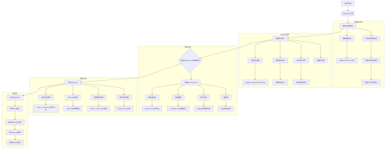
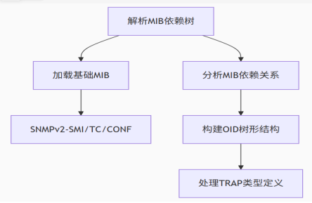
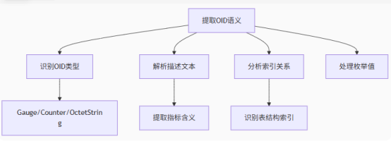
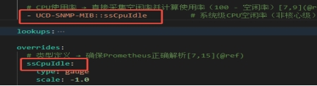
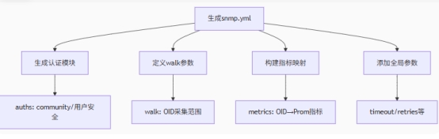

# 深入解析 SNMP Exporter

在现代网络架构中，对交换机、路由器、NAS 等网络设备的监控至关重要。**Prometheus** 作为主流的开源监控系统，以其时序数据存储、灵活的查询语言（PromQL）和丰富的生态组件成为监控领域的标杆。而 **SNMP Exporter** 作为 Prometheus 生态的关键一环，专门解决了网络设备的监控数据采集问题。本文将结合 Prometheus 的核心特性，从组件简况、部署架构、配置格式到工作流程，全面剖析 SNMP Exporter 的核心价值。

## 一、SNMP Exporter 

Prometheus 的核心功能是**时序数据采集、存储与分析**，其工作流程包括：通过 `exporter` 组件采集目标指标 → 存储到时序数据库 → 通过 PromQL 查询分析 → 结合 Grafana 可视化。但网络设备（如交换机、路由器）通常不支持 Prometheus 原生的 HTTP 接口，而是通过 **SNMP 协议** 暴露监控数据。

**SNMP Exporter 的核心作用**：作为 Prometheus 与网络设备之间的 “翻译官”，通过 SNMP 协议从设备采集数据，转换为 Prometheus 可识别的**指标格式**（如 `cpu_usage{device="cisco-fw"} 25`），实现网络设备与 Prometheus 生态的无缝对接。

## 二、SNMP Exporter 简况

SNMP Exporter 是 Prometheus 生态的核心组件之一，其设计围绕 Prometheus 的 “拉取式”（Pull）采集模型展开，核心价值体现在三个方面：


*   **标准化采集**：通过自带的 `generator` 工具解析 MIB 文件（网络设备的 “字典”），自动生成 OID 与 Prometheus 指标的映射配置（`snmp.yml`），支持多厂商设备的统一采集逻辑。

*   **灵活部署**：支持 Docker 快速部署和二进制长期运行，可直接被 Prometheus 的 `scrape_configs` 配置项抓取，无需额外适配。

*   **广泛应用**：覆盖 Cisco、Arista 等主流网络设备，以及 Synology NAS 等存储设备，完美填补了 Prometheus 在 SNMP 设备监控中的空白。

## 三、部署架构：SNMP Exporter 与 Prometheus 的集成

### 3.1 部署方式

SNMP Exporter 提供两种部署方式，均需与 Prometheus 配置联动：


| 部署方式 | 适用场景     | 操作步骤（含 Prometheus 配置）                               |
| -------- | ------------ | ------------------------------------------------------------ |
| Docker   | 快速原型验证 | 1. 启动 SNMP Exporter 容器：`docker run -d -p 9116:9116 -v ./snmp.yml:/etc/snmp_exporter/snmp.yml prom/snmp-exporter`2. 在 Prometheus 配置中添加抓取规则：`yaml<br>scrape_configs:<br>  - job_name: 'snmp'<br>    static_configs:<br>      - targets: ['192.168.1.1']  # 网络设备 IP<br>    metrics_path: /snmp<br>    params:<br>      module: [cisco_firewall]  # 对应 snmp.yml 中的模块<br>    relabel_configs:<br>      - source_labels: [__address__]<br>        target_label: __param_target<br>      - source_labels: [__param_target]<br>        target_label: instance<br>      - target_label: __address__<br>        replacement: localhost:9116  # SNMP Exporter 地址<br>` |
| 二进制   | 生产环境     | 1. 下载二进制包并运行：`./snmp_exporter --config.file=snmp.yml`2. 同上配置 Prometheus 的 `scrape_configs`，将 `replacement` 指向 SNMP Exporter 所在服务器的 IP: 端口。 |

### 3.2 集群部署与 Prometheus 调度

*   **高可用设计**：SNMP Exporter 本身不支持集群，但可部署多个实例，由 Prometheus 通过 `scrape_configs` 配置多目标抓取，实现负载均衡。例如：

```shell
scrape_configs:
  - job_name: 'snmp-cluster'
    static_configs:
      - targets: ['192.168.1.1', '192.168.1.2']  # 多个网络设备
    metrics_path: /snmp
    params: { module: [cisco_firewall] }
    relabel_configs:
      - source_labels: [__address__]
        target_label: __param_target
      - source_labels: [__param_target]
        target_label: instance
      - target_label: __address__
        replacement: 'snmp-exporter-1:9116,snmp-exporter-2:9116'  # 多个 Exporter 实例
```


*   **性能优化**：单实例高并发采集超时可通过 `--snmp.module-concurrency` 调整并发数，配合 Prometheus 的 `scrape_interval`（采集间隔）和 `timeout` 参数避免数据丢失。

## 四、SNMP Exporter 配置

SNMP Exporter 的 `snmp.yml` 配置直接决定了 Prometheus 最终采集到的指标格式，需遵循 Prometheus 的指标命名规范（如小写字母、下划线分隔）。

### 4.1 配置示例（与 Prometheus 指标对应）


```
modules:
  cisco_firewall:  # 针对 Cisco 防火墙的模块
    walk:  # 遍历采集的 OID 范围
      - 1.3.6.1.2.1.1.3  # sysUpTime（系统运行时间）
      - 1.3.6.1.4.1.9.9.109.1.1.1.1.5  # CPU 使用率
    metrics:  # 映射为 Prometheus 指标
      - name: sys_uptime  # Prometheus 指标名（符合规范）
        oid: 1.3.6.1.2.1.1.3.0
        type: gauge  # Prometheus 指标类型（gauge 支持波动值）
        help: "系统运行时间（秒）"  # 对应 Prometheus 指标的 HELP 信息
      - name: cpu_usage
        oid: 1.3.6.1.4.1.9.9.109.1.1.1.1.5
        type: gauge
        help: "CPU 使用率（百分比）"
```

在 Prometheus 中查询该指标的示例：


```
# 查看所有 Cisco 防火墙的 CPU 使用率
cpu_usage{module="cisco_firewall"}

# 筛选使用率超过 80% 的设备
cpu_usage{module="cisco_firewall"} > 80
```

### 4.2 核心字段与 Prometheus 指标关联

| 字段         | 与 Prometheus 关联说明                                       |
| ------------ | ------------------------------------------------------------ |
| `name`       | 直接作为 Prometheus 指标名，需简洁且符合命名规范（如 `network_interface_in_bytes`）。 |
| `type`       | 对应 Prometheus 的指标类型：`gauge`（如 CPU 使用率）、`counter`（如累计流量），影响 PromQL 计算方式（如 `rate()` 函数适用于 `counter`）。 |
| `help`       | 生成 Prometheus 指标的 `HELP` 信息（如 `# HELP cpu_usage CPU 使用率（百分比）`），提升指标可读性。 |
| `index_oids` | 为 Prometheus 指标添加标签（Label），实现多维度分析（如 `interface` 标签区分不同网卡）。 |

## 五、Generator工具配置解析流程

#### 5.1全流程图

 

#### 5.2详细流程说明

##### （1）MIB解析阶段

- 基础MIB加载：优先解析SNMPv2标准库（SMI定义数据类型，TC定义文本约定，CONF定义模块合规性）。
- 依赖分析：递归解析MIB文件间的IMPORTS依赖，确保完整OID树构建。
- OID树构建：将OID组织为树状结构（如.1.3.6.1.2.1.1对应system组）。
- TRAP处理：提取通知类型定义（如linkDown），用于事件监控

 

##### （2）OID语义提取

- 类型识别

  - Counter32/64 → int类型

  - Gauge32 → 浮点数

  - OctetString → string

- 描述文本解析：从DESCRIPTION字段提取指标含义（如sysUpTime→系统运行时间）。
- 表索引处理：识别类似ifIndex的索引键，关联多维度数据（如网卡流量表）。
- 枚举值转换：将数字枚举映射为文本（如ifOperStatus：1=up, 2=down）

 

##### （3）规则应用

-  generator.yml 自定义格式

```shell
modules:
 \# 模块名称（对应设备类型）
 cisco_asa:
  walk: 
   \- 1.3.6.1.2.1.1 # 系统组
   \- 1.3.6.1.2.1.2 # 接口组
  \# 指标重命名（实现统一命名）
  overrides:
   ifInOctets:
    regex_extracts:
     "": - value # 原始 OID
    \# 映射为统一指标名
    name: "network_interface_in_bytes" 
 huawei_firewall:
  walk:
   \- 1.3.6.1.4.1.2011.6
  overrides:
   hwSecurityCpuUsage:
    name: "system_cpu_usage_percent"
```

- 指标重命名（标准指标名）：将冗长OID名转为简洁标准Prometheus指标名（例：UCD-SNMP-MIB→ssCpuIdle）

 

- 类型覆盖：强制指定数据类型（如将误识别为Gauge的Counter修正）

- 值转换:

  - scale：数值单位转换（例：scale: 0.001 将KB转为MB）

  - regex_extracts: 数据替换等

  - 如：Generator.yml

 

##### （4）配置生成

 

## 六、总结：SNMP Exporter 对 Prometheus 生态的价值

SNMP Exporter 作为 Prometheus 生态的重要补充，解决了网络设备通过 SNMP 协议暴露数据的采集难题，其核心价值在于：

1.  **生态无缝对接**：将 SNMP 数据标准化为 Prometheus 指标，让网络设备监控融入统一的时序数据体系。

2.  **灵活适配多厂商**：通过 MIB 解析和规则配置，支持不同品牌设备的监控，避免重复开发。

3.  **兼容 Prometheus 最佳实践**：生成的指标支持 Label 多维度分析、PromQL 聚合计算和 Grafana 可视化，构建完整的监控闭环。
