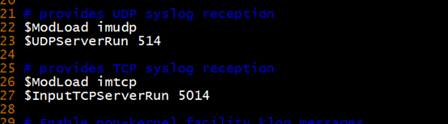
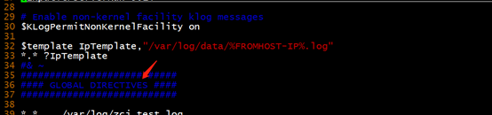
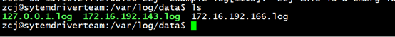
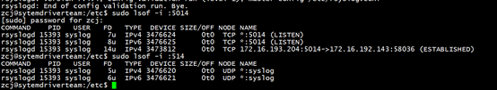
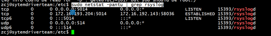
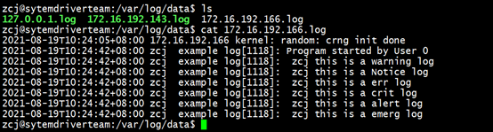
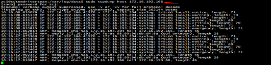
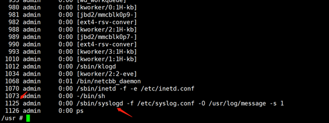
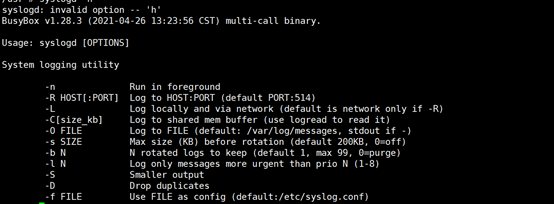
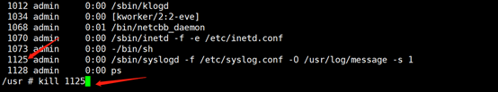

## 服务器配置(服务器平台：x86)
### Rsyslog简介
* Rsyslog是一个 syslogd 的多线程增强版，在syslog的基础上扩展了很多其他功能，如数据库支持(MySQL, PostgreSQL、Oracle等)、日志内容筛选、定义日志格式模板等。除了默认的udp协议外，rsyslog还支持tcp协议来接收日志。
* 目前的linux的发行版都切换为rsyslog
### 安装Rsyslog
*  Linux的发行版中预先安装了Rsyslog,无需安装，rsyslogd –v 查看版本
*  若未安装，以下是安装步骤：
  1.ubuntu：sudo apt install rsyslog
  2.CentOS：yum install rsyslog
### Rsyslog.conf配置文件详解
```
配置文件位置：/etc/rsyslog.conf
#### MODULES ####               #定义日志的模块。
$ModLoad imuxsock             #imuxsock为模块名，支持本地系统日志的模块。
$ModLoad imjournal            #imjournal为模块名，支持对系统日志的访问。
#$ModLoad imklog               #imklog为模块名，支持内核日志的模块。
#$ModLoad immark               #immark为模块名，支持日志标记。
# Provides UDP syslog reception   #提供udp syslog的接收。
#$ModLoad imudp               #imudp为模块名，支持udp协议。
#$UDPServerRun 514               #允许514端口接收使用udp和tcp转发来的日志。
# Provides TCP syslog reception       #提供tcp syslog的接收。
#$ModLoad imtcp              #imtcp为模块名，支持tcp协议。
#$InputTCPServerRun 514

#### GLOBAL DIRECTIVES ####    #定义全局日志格式的指令。
# Where to place auxiliary files
$WorkDirectory /var/lib/rsyslog       #工作目录。
# Use default timestamp format
$ActionFileDefaultTemplate RSYSLOG_TraditionalFileFormat  #定义日志格式默认模板。
$IncludeConfig /etc/rsyslog.d/*.conf                     #所有配置文件路径。
$OmitLocalLogging on                                      #省略本地登录。
# File to store the position in the journal
$IMJournalStateFile imjournal.state

#### RULES ####
#kern.*                                  /dev/console
#记录所有日志类型的info级别以及大于info级别的信息到messages文件，但是mail邮件信息，authpriv验证方面的信息和corn时间和任务相关信息除外。
*.info;mail.none;authpriv.none;cron.none      /var/log/messages

# authpriv验证相关的所有信息存放在/var/log/secure。
authpriv.*                                /var/log/secure

#邮件的所有信息存在/var/log/maillog；这里有一个“-”符号表示是使用异步的方式记录
mail.*                                   -/var/log/maillog

#任务计划有关的信息存放在/var/log/cron。
cron.*                                   /var/log/cron

#记录所有的≥emerg级别信息，发送给每个登录到系统的日志。
*.emerg                                 :omusrmsg:*

#记录uucp，news.crit等存放在/var/log/spooler
uucp,news.crit                            /var/log/spooler

#本地服务器的启动的所有日志存放在/var/log/boot.log
local7.*                                  /var/log/boot.log

以下为：rsyslog 客服端的配置
#发送日志，@表示传输协议（@表示udp，@@表示tcp），后面是ip和端口。
#*.* @@remote-host:514
```
### 配置服务器
* 使用sudo vi /etc/rsyslog.conf 打开配置文件
#### 选择传输的协议
  1.使用udp传输日志，配置时将前面的#去掉即可  
  $ModLoad imudp   
  $UDPServerRun 514   
  2.使用tcp传输协议, 将#去点即可  
  $ModLoad imtcp   
  $InputTCPServerRun 514  
配置如图：
* 注明：  
514/5014端口号可以自己配置，默认为514.   
rsyslog后台进程是可以同时监听TCP/UDP连接的  
#### 配置接收日志模板
* 在GLOBAL DIRECTIVES内容块的前面增加接收日志模板
模板如下：  
$template RemoteLogs,"/var/log/%HOSTNAME%/%PROGRAMNAME%.log"  
\*.* ?RemoteLogs  
& ~
* 注明：  
1、$template RemoteLogs指令（“RemoteLogs” 可以为其它的描述的名字）迫使rsyslog后台进程隔开本地/var/log/下文件去写日志信息。而日志文件名则依据发送远程日志的机器名及应用程序名来定义。  
2、\*.*  ?RemoteLogs）暗含运行用模板RemoteLogs于所有的接收日志。  
3、& ~则告诉rsyslog后台进程停止进一步的去处理日志信息,即不对它们进行本地化写入，它是代表一个重定向规则。如果没有这一行，则意味着接收到的日志会写入两次，一次如前两行写的方式写，第二次则以本地日志记录的方式写入。运行这个规则的另一个结论则是日志服务器自己的日志信息只会写入到依照机器主机名命名的文件中。
  
* 设置后，会按照模板格式保存日志

#### 设置完成，保存
### 检查Rsyslog配置
* 使用命令：rsyslogd -f /etc/rsyslog.conf -N1
* 配置信息正确有如下提示: 

* 若配置信息有误，则需要在更改配置文件

### 重启RSyslog服务
* Debian,Ubuntu或CentOS/RHEL 6使用:sudo service rsyslog restart
* Fedora 或 CentOS/RHEL 7使用：sudo systemctl restart rsyslog  
* 使用：sudo lsof -i :[端口号]，查看服务是否开启和tcp/udp连接情况
  
* 或使用sudo netstat -pantu | grep rsyslog
  
### 查看日志
* 启动客户端，进入配置文件模板中日志保存的位置：  
  
  
* 若没有生成日志文件，需要使用：sudo tcpdump host 客户端ip 查看是否转发日志，有则是保存模板出问题，没有可能的服务端配置或者客户端配置出问题  

## 客户端配置
###  平台：x86
* 平台是使用的rsyslog 
* 使用sudo vi /etc/rsyslog.conf 打开配置文件
* 配置：  
发送日志，@表示传输协议（@表示udp，@@表示tcp），后面是ip和端口。  
     \*.\* @@remote-host:514

  
* 检查与重启服务和x86服务器平台一样
### 平台开发板
* 板子是使用的syslog 使用命令：ps进行查看进程  
  
* 找到syslogd服务，若未找到，可能不支持syslog服务
  使用命令：syslogd –h 查看syslogd支持的服务  

### 配置客户端
1.结束之前的syslogd服务，通过使用kill 进程号 结束进程  
 
2.通过syslogd提供的服务是通过 -L  –R 服务器的ip:port   
注明：默认端口为：514,端口号应该与服务器配置的端口号一致  
3.启动syslogd服务：/sbin/syslogd -f /etc/syslog.conf -L -R 172.16.193.204:514 
4.通过tcpdump host 172.16.193.204 查看日志是否被转发到服务器  
 
* 注明：开发板的syslog支持UDP传输，需要开发板的日志文件需要在服务器打开UDP